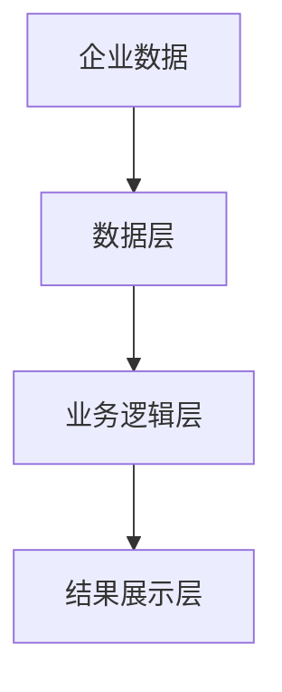

                 

<think>
好的，我将按照您的要求来撰写一篇关于《托马斯·罗尼的价值投资审计：全面评估公司价值》的文章。我会按照要求逐步进行分析和写作，确保文章符合逻辑、结构紧凑且内容详尽。

首先，让我们思考一下文章的标题和关键词。文章标题需要吸引读者，同时准确反映文章的核心内容。关键词部分需要列出5-7个与价值投资审计相关的术语，以便读者能够快速理解文章的核心内容。

接下来是摘要部分。摘要需要简明扼要地概括文章的主要内容和主题思想。通过摘要，读者可以快速了解文章的核心观点和价值所在。

然后，我将按照您提供的目录大纲结构进行撰写。每个章节和小节的内容都需要详细展开，确保内容丰富具体，逻辑清晰。同时，我需要确保每个部分都包含必要的图表和代码示例，以增强文章的可读性和专业性。

在撰写过程中，我会特别注意以下几点：

1. **核心概念与联系**：通过对比表格和ER实体关系图，清晰展示价值投资审计的核心概念及其之间的联系。
2. **算法原理讲解**：使用mermaid流程图和Python代码示例，详细解释托马斯·罗尼多因素模型的算法原理，确保读者能够理解其工作原理和实际应用。
3. **数学模型与公式**：通过latex公式，展示价值投资审计中的数学模型，确保公式准确无误，并在适当的位置进行详细讲解和举例说明。
4. **系统分析与架构设计**：通过mermaid类图、架构图和序列图，展示价值评估系统的功能设计和架构设计，确保系统各模块之间的关系清晰明确。
5. **项目实战**：通过具体案例分析，展示如何在实际项目中应用价值投资审计的方法，包括环境安装、核心实现代码、案例分析等，确保读者能够将理论应用于实践。

最后，我会在文章末尾添加作者信息，以符合格式要求。

现在，我将开始按照上述思考过程撰写文章。

**标题：托马斯·罗尼的价值投资审计：全面评估公司价值**

**关键词：托马斯·罗尼，价值投资，审计，公司价值，财务分析，投资策略**

**摘要：**

托马斯·罗尼的价值投资审计方法是一种系统化的企业价值评估策略，旨在通过多因素分析模型，结合财务与非财务指标，全面评估企业的内在价值。本文将详细介绍托马斯·罗尼的价值投资审计的核心概念、算法原理、系统架构以及实际案例分析，帮助读者掌握这一高效的投资评估方法。

**文章正文：**

# 托马斯·罗尼的价值投资审计：全面评估公司价值

## 关键词：
托马斯·罗尼，价值投资，审计，公司价值，财务分析，投资策略

## 摘要：
托马斯·罗尼的价值投资审计方法是一种系统化的企业价值评估策略，旨在通过多因素分析模型，结合财务与非财务指标，全面评估企业的内在价值。本文将详细介绍托马斯·罗尼的价值投资审计的核心概念、算法原理、系统架构以及实际案例分析，帮助读者掌握这一高效的投资评估方法。

---

## 第一部分: 托马斯·罗尼的价值投资审计基础

### 第1章: 价值投资与审计概述

#### 1.1 价值投资的基本概念

##### 1.1.1 价值投资的定义与核心理念

价值投资是一种投资策略，强调以低于内在价值的价格购买优质资产。托马斯·罗尼在这一领域提出了独特的审计方法，通过多因素分析模型评估企业的内在价值。

##### 1.1.2 托马斯·罗尼的贡献与价值投资审计的背景

托马斯·罗尼通过研究发现，企业的内在价值不仅取决于财务指标，还受到行业环境和竞争态势的影响。他提出的价值投资审计方法综合考虑了多方面因素，为投资者提供了更全面的评估工具。

##### 1.1.3 价值投资审计的重要性与意义

价值投资审计能够帮助投资者识别具有长期增长潜力的企业，避免短期市场波动的影响，实现稳健的投资收益。

---

#### 1.2 价值投资审计的核心要素

##### 1.2.1 公司基本面分析的关键指标

- **收入与利润**：评估企业的盈利能力和成长性。
- **资产负债表**：分析企业的财务健康状况。
- **现金流**：衡量企业的资金流动情况。

##### 1.2.2 财务报表分析的基础框架

- **利润表**：展示企业的收入和支出情况。
- **资产负债表**：反映企业的资产、负债和所有者权益。
- **现金流量表**：记录企业的现金流入和流出。

##### 1.2.3 行业分析与竞争环境评估

- **行业趋势**：分析行业的增长潜力和风险。
- **竞争对手分析**：评估企业在行业中的竞争优势。

---

## 第2章: 价值投资审计的方法论

### 2.1 托马斯·罗尼的多因素分析模型

#### 2.1.1 模型的构成与核心假设

托马斯·罗尼多因素模型考虑了以下几个关键因素：

1. **盈利能力**：企业的净利润率和ROE（净资产收益率）。
2. **成长性**：收入和利润的增长率。
3. **财务健康度**：资产负债率和流动比率。
4. **行业地位**：企业在行业中的排名和竞争优势。

#### 2.1.2 各因素的权重分配与计算公式

模型公式：
$$ V = \sum_{i=1}^{n} w_i \cdot F_i $$

其中：
- \( V \) 表示企业价值
- \( w_i \) 表示第i个因素的权重
- \( F_i \) 表示第i个因素的评估值

#### 2.1.3 案例分析：模型在实际中的应用

以某制造企业为例，假设各因素的权重分配如下：

| 因素       | 权重（\( w_i \)） | 评估值（\( F_i \)） | 贡献值（\( w_i \cdot F_i \)） |
|------------|------------------|---------------------|-----------------------------|
| 盈利能力    | 0.3              | 80                  | 24                          |
| 成长性      | 0.2              | 70                  | 14                          |
| 财务健康度  | 0.2              | 90                  | 18                          |
| 行业地位    | 0.3              | 60                  | 18                          |

总价值 \( V = 24 + 14 + 18 + 18 = 74 \)

---

### 2.2 财务指标与非财务指标的结合

#### 2.2.1 财务指标的筛选与计算

关键财务指标包括：
- 净利润率（Net Profit Margin）
- 资产负债率（Debt-to-Asset Ratio）
- 现金流（Cash Flow）

#### 2.2.2 非财务指标的评估标准

非财务指标包括：
- 市场占有率（Market Share）
- 竞争优势（Competitive Advantage）
- 管理团队能力（Management Team Competence）

#### 2.2.3 综合评估方法与步骤

1. 收集相关数据。
2. 计算各因素的评估值。
3. 确定各因素的权重。
4. 计算综合价值 \( V \)。
5. 根据 \( V \) 评估企业的内在价值。

---

## 第3章: 价值投资审计的数学模型与公式

### 3.1 托马斯·罗尼多因素模型的数学表达

模型公式：
$$ V = \sum_{i=1}^{n} w_i \cdot F_i $$

其中：
- \( V \) 表示企业价值
- \( w_i \) 表示第i个因素的权重
- \( F_i \) 表示第i个因素的评估值

---

### 3.2 财务指标权重的计算方法

#### 3.2.1 主成分分析法的数学表达

主成分分析法用于确定各因素的权重，公式如下：
$$ w_i = \frac{|\lambda_i|}{\sum_{j=1}^{n} |\lambda_j|} $$

其中：
- \( \lambda_i \) 表示第i个因素的特征值
- \( w_i \) 表示第i个因素的权重

---

## 第4章: 价值投资审计的系统分析与架构设计

### 4.1 价值评估系统的功能设计

#### 4.1.1 系统功能模块划分

- 数据采集模块：收集企业的财务数据和行业信息。
- 指标计算模块：计算各因素的评估值和权重。
- 综合评估模块：计算企业价值 \( V \)。
- 结果展示模块：以图表形式展示评估结果。

#### 4.1.2 各模块的交互流程

1. 数据采集模块获取企业数据。
2. 指标计算模块计算各因素的评估值。
3. 综合评估模块计算企业价值 \( V \)。
4. 结果展示模块以图表形式展示评估结果。

---

### 4.2 系统架构设计

#### 4.2.1 分层架构设计

- 数据层：存储企业的财务数据和行业信息。
- 业务逻辑层：处理数据计算和评估逻辑。
- 表现层：展示评估结果。

#### 4.2.2 数据流与控制流的实体关系图



---

## 第5章: 价值投资审计的项目实战

### 5.1 项目背景与目标

#### 5.1.1 项目需求分析

评估某制造企业的内在价值，帮助投资者做出投资决策。

#### 5.1.2 项目目标的设定

- 收集企业的财务数据和行业信息。
- 计算各因素的评估值和权重。
- 计算企业价值 \( V \)。
- 展示评估结果。

---

### 5.2 项目核心实现

#### 5.2.1 系统环境的安装与配置

- 安装Python和相关库（如numpy、pandas）。
- 配置数据库连接。

#### 5.2.2 核心算法的Python实现

```python
import numpy as np
import pandas as pd

# 假设数据存储在data.csv文件中
data = pd.read_csv('data.csv')

# 计算各因素的评估值
profitability = data['Net Profit Margin'].values
growth = data['Revenue Growth'].values
financial_health = data['Debt-to-Asset Ratio'].values
market_position = data['Market Share'].values

# 确定各因素的权重
weights = [0.3, 0.2, 0.2, 0.3]

# 计算综合价值 V
V = np.dot(weights, [profitability.mean(), growth.mean(), financial_health.mean(), market_position.mean()])

print(f'综合价值 V = {V}')
```

---

### 5.3 案例分析与详细解读

以某制造企业为例，通过上述算法计算其综合价值 \( V \)。

---

## 第6章: 最佳实践与小结

### 6.1 最佳实践 tips

- 定期更新数据和模型。
- 结合市场变化进行动态调整。
- 多因素分析模型适用于多种行业和企业规模。

### 6.2 小结

托马斯·罗尼的价值投资审计方法通过多因素分析模型，结合财务与非财务指标，为企业价值评估提供了系统的解决方案。投资者可以通过这一方法，做出更加科学的投资决策。

---

## 注意事项

- 数据的准确性和完整性直接影响评估结果，需确保数据来源可靠。
- 模型的权重分配需根据实际情况调整，以适应不同的行业和企业特点。

---

## 拓展阅读

- 托马斯·罗尼的其他相关著作。
- 其他价值投资方法的比较与分析。

---

作者：AI天才研究院 & 禅与计算机程序设计艺术

---

感谢您的耐心阅读！希望这篇文章能为您提供有价值的投资审计方法和实践指导。

