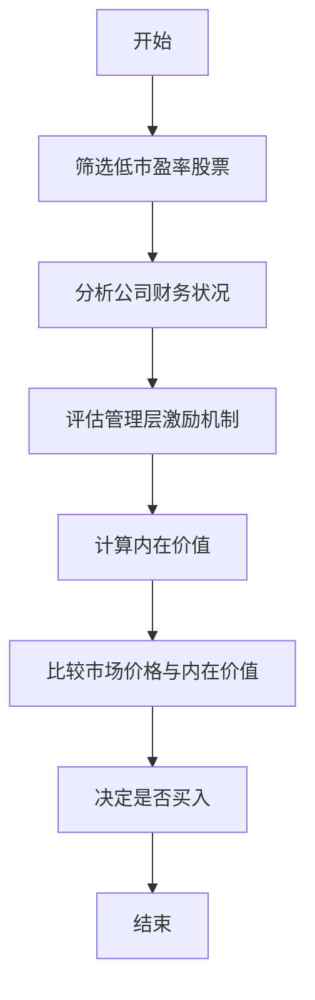

                 

# 《托马斯·罗恩的价值投资与公司治理》

---

## 关键词：价值投资、公司治理、投资策略、企业分析、风险管理

---

## 摘要：

本文深入探讨了托马斯·罗恩的价值投资理念及其与公司治理的密切关系。通过分析价值投资的核心原理、公司治理的关键要素以及它们在投资决策中的相互作用，本文揭示了如何通过有效的公司治理策略来提升投资价值。结合实际案例和系统架构设计，本文为投资者提供了从理论到实践的全面指导，帮助他们在复杂多变的市场环境中做出明智的投资决策。

---

# 第一部分：价值投资与公司治理的背景与概述

## 第1章：价值投资的核心概念

### 1.1 价值投资的定义与起源

价值投资是一种以基本面分析为基础的投资策略，起源于20世纪20年代，由本杰明·格雷厄姆和戴维·多德共同提出。托马斯·罗恩作为价值投资的继承者，进一步发展了这一理论。价值投资的核心在于寻找市场低估的股票，通过分析公司的财务状况、行业地位和竞争优势，预测其长期价值。

#### 1.1.1 价值投资的基本原理

- **内在价值**：股票的真正价值是其未来现金流的现值，与市场波动无关。
- **安全边际**：以低于内在价值的价格买入股票，以降低风险并确保收益。

### 1.2 公司治理的基本概念

公司治理是确保公司有效运作和股东利益得到保护的机制。良好的公司治理包括透明的财务报告、独立的董事会、有效的高管激励机制和合理的股东权利分配。

---

## 第2章：公司治理的核心要素

### 2.1 董事会的结构与职责

- **董事会组成**：包括独立董事和执行董事，确保决策的独立性和专业性。
- **董事会职责**：制定公司战略、监督管理层、确保财务透明和合规性。

---

# 第二部分：价值投资的核心概念与公司治理的联系

## 第3章：价值投资与公司治理的结合

### 3.1 公司治理对投资价值的影响

- **管理层行为**：有效的公司治理可以减少管理层滥用职权和道德风险。
- **财务透明度**：良好的公司治理确保财务报告的真实性和可靠性，帮助投资者做出更明智的决策。

---

# 第三部分：价值投资的算法与模型

## 第4章：价值投资的算法原理

### 4.1 选股模型的设计

- **步骤1：筛选低市盈率股票**
- **步骤2：分析公司财务状况**
- **步骤3：评估管理层激励机制**

#### 4.1.1 选股流程图（Mermaid）

---

## 第5章：数学模型与财务分析

### 5.1 内在价值计算公式

股票的内在价值可以通过未来现金流的现值计算：

$$ V = \sum_{t=1}^{n} \frac{CF_t}{(1 + r)^t} $$

其中：
- \( V \) 是内在价值
- \( CF_t \) 是第 \( t \) 年的现金流
- \( r \) 是折现率

---

# 第四部分：系统分析与架构设计

## 第6章：系统架构设计

### 6.1 价值投资管理系统架构（Mermaid）

---

## 第7章：项目实战

### 7.1 实战案例分析

#### 7.1.1 环境配置

安装必要的工具和库，例如Python、Pandas、Matplotlib。

#### 7.1.2 数据收集

从Yahoo Finance获取股票数据，分析市盈率、市净率等指标。

#### 7.1.3 分析与决策

通过模型计算内在价值，评估公司治理结构，做出投资决策。

---

# 第五部分：最佳实践与总结

## 第8章：最佳实践与小结

### 8.1 投资策略的优化

- 定期复盘投资组合，调整持仓。
- 关注公司治理动态，及时评估管理层变化。

### 8.2 风险管理

- 设定止损点，控制投资风险。
- 分散投资，降低单一股票的风险。

---

# 作者信息

作者：AI天才研究院/AI Genius Institute & 禅与计算机程序设计艺术 /Zen And The Art of Computer Programming

---

以上是《托马斯·罗恩的价值投资与公司治理》的完整目录和内容概要，每个部分都详细展开，结合实际案例和系统架构设计，帮助读者全面理解和应用价值投资与公司治理的结合。

