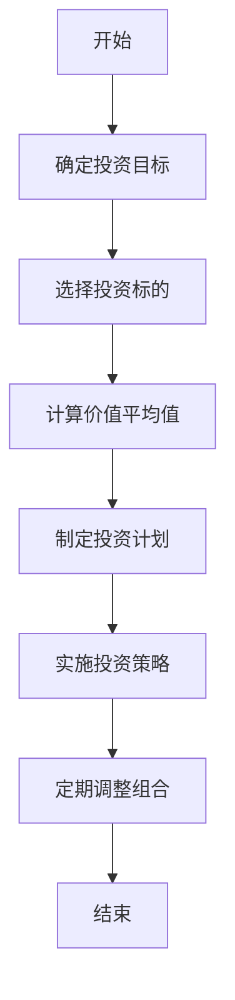
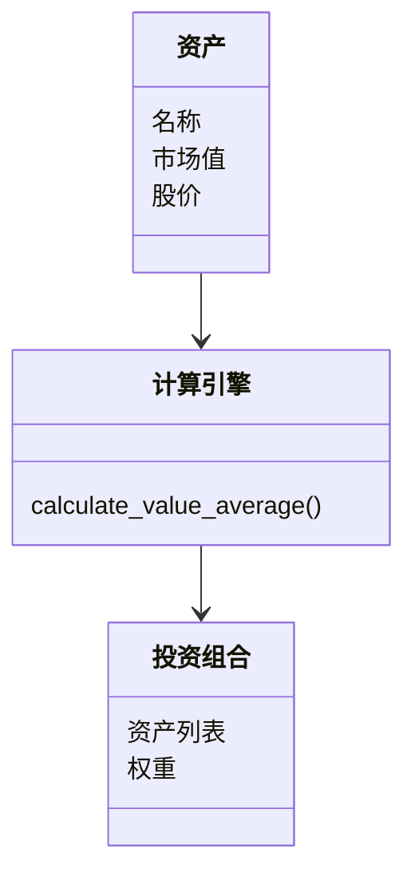
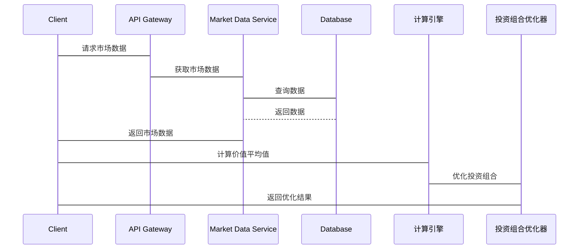

                 


# 托马斯·罗的价值平均策略

> 关键词：价值平均策略，投资策略，资产配置，风险管理，Python算法，系统架构

> 摘要：本文详细探讨托马斯·罗的价值平均策略，从理论基础到算法实现，再到系统架构和项目实战，全面解析如何利用计算机技术优化投资决策，平衡风险与收益。

---

# 第一部分: 托马斯·罗的价值平均策略概述

## 第1章: 价值平均策略的背景与目标

### 1.1 投资策略的基本概念

#### 1.1.1 投资的基本概念
投资是指将资金投入某个领域以期望获得收益的行为。常见的投资方式包括股票、债券、房地产等。投资的核心目标是通过合理的资产配置和风险管理，实现收益的最大化。

#### 1.1.2 传统投资策略的优缺点
- **优点**：传统投资策略如均值-方差优化和现代投资组合理论（MPT）提供了理论基础，帮助投资者分散风险。
- **缺点**：在实际操作中，这些策略可能过于复杂，难以实时调整，且对市场波动的适应性有限。

#### 1.1.3 价值平均策略的提出背景
托马斯·罗的价值平均策略作为一种新兴的投资策略，旨在简化传统方法，通过计算资产的平均价值来优化投资组合。这种策略在实际操作中更具灵活性和可操作性。

### 1.2 价值平均策略的核心目标

#### 1.2.1 平衡投资的风险与收益
价值平均策略通过动态调整资产配置，确保在不同市场环境下实现风险与收益的最佳平衡。

#### 1.2.2 优化资产配置的科学性
该策略基于市场估值的变化，科学地调整资产权重，避免了传统方法中过于固定的配置方式。

#### 1.2.3 提高投资决策的可操作性
通过将复杂的投资理论简化为可执行的算法，价值平均策略使投资者能够更轻松地进行投资决策。

### 1.3 价值平均策略的适用场景

#### 1.3.1 个人投资者的应用
适合个人投资者根据自身风险承受能力和收益目标进行投资。

#### 1.3.2 机构投资者的应用
机构投资者可以通过价值平均策略优化资产配置，提高投资组合的效率。

#### 1.3.3 不同市场环境下的适用性
无论是牛市还是熊市，价值平均策略都能通过动态调整适应市场变化，保持投资组合的稳定性。

## 第2章: 价值平均策略的核心概念

### 2.1 价值平均策略的定义与特点

#### 2.1.1 价值平均策略的定义
价值平均策略是通过计算资产的平均价值，动态调整投资组合的配置比例，以实现风险与收益的平衡。

#### 2.1.2 价值平均策略的核心特点
- **简单性**：计算方法直观，易于理解和实现。
- **动态性**：根据市场估值的变化实时调整，具有较强的适应性。
- **可操作性**：能够快速转化为具体的投资操作。

### 2.2 价值平均策略的关键要素

#### 2.2.1 资产配置的权重计算
通过计算各资产的市场估值，确定其在投资组合中的权重。

#### 2.2.2 市场估值的动态调整
根据市场变化，定期更新各资产的市场估值，调整其配置权重。

#### 2.2.3 投资组合的再平衡机制
定期对投资组合进行再平衡，确保各资产的比例符合当前的市场估值。

### 2.3 价值平均策略的数学模型

#### 2.3.1 价值平均策略的基本公式
$$ V = \frac{S}{P} $$
其中，\( V \) 为价值平均值，\( S \) 为公司市值，\( P \) 为股价。

#### 2.3.2 投资组合的权重计算
$$ w_i = \frac{V_i}{\sum_{j=1}^{n} V_j} $$
其中，\( w_i \) 为第 \( i \) 个资产的权重，\( V_i \) 为第 \( i \) 个资产的价值平均值，\( n \) 为资产总数。

### 2.4 价值平均策略的实现步骤

#### 2.4.1 确定投资目标
明确投资目标，如收益目标和风险承受能力。

#### 2.4.2 选择投资标的
根据市场研究，选择具有潜力的投资标的。

#### 2.4.3 计算价值平均值
利用公式计算各标的的价值平均值。

#### 2.4.4 制定投资计划
根据价值平均值确定各标的的配置权重。

#### 2.4.5 实施投资策略
按照计划进行投资，并定期监控和调整。

#### 2.4.6 定期调整组合
根据市场变化，定期重新计算价值平均值并调整配置。

---

# 第二部分: 价值平均策略的算法实现

## 第3章: 价值平均策略的算法原理

### 3.1 价值平均策略的算法流程



### 3.2 价值平均策略的Python实现

```python
def calculate_value_average(市值, 股价):
    return 市值 / 股价

# 示例代码
import pandas as pd
import numpy as np

# 假设有一个股票列表
stocks = ["股票A", "股票B", "股票C"]
market_values = [100, 150, 200]
prices = [50, 75, 100]

# 计算价值平均值
value_averages = {}
for i in range(len(stocks)):
    value_averages[stocks[i]] = market_values[i] / prices[i]

print(value_averages)
```

---

# 第三部分: 系统架构与设计

## 第4章: 投资分析系统的架构设计

### 4.1 问题场景介绍
为了实现托马斯·罗的价值平均策略，我们设计了一个基于Python的投资分析系统，用于实时计算各资产的价值平均值，并根据结果优化投资组合。

### 4.2 系统功能设计

#### 4.2.1 功能模块
- 数据采集模块：收集各资产的市场数据。
- 计算模块：计算各资产的价值平均值。
- 投资组合优化模块：根据计算结果优化资产配置。
- 监控模块：实时监控市场变化并调整投资组合。

#### 4.2.2 领域模型


#### 4.2.3 系统架构


### 4.3 系统接口设计
- API接口：提供市场数据查询、价值平均计算等服务。
- 接口文档：详细描述接口的输入、输出和使用方法。

### 4.4 系统交互设计



---

# 第四部分: 项目实战

## 第5章: 价值平均策略的Python实现

### 5.1 环境配置

```bash
pip install pandas numpy matplotlib
```

### 5.2 核心实现代码

```python
import pandas as pd
import numpy as np

def calculate_value_average(market_values, prices):
    return market_values / prices

# 示例数据
market_values = pd.Series([100, 150, 200], index=["股票A", "股票B", "股票C"])
prices = pd.Series([50, 75, 100], index=["股票A", "股票B", "股票C"])

# 计算价值平均值
value_averages = calculate_value_average(market_values, prices)
print(value_averages)
```

### 5.3 代码应用解读与分析
- 代码功能：计算各资产的价值平均值。
- 应用场景：帮助投资者快速评估各资产的市场价值，制定投资策略。

### 5.4 实际案例分析

#### 5.4.1 案例背景
假设我们有三个股票，市场值和股价如下：
- 股票A：市值100，股价50
- 股票B：市值150，股价75
- 股票C：市值200，股价100

#### 5.4.2 计算过程
$$ V_A = \frac{100}{50} = 2 $$
$$ V_B = \frac{150}{75} = 2 $$
$$ V_C = \frac{200}{100} = 2 $$

各股票的价值平均值均为2，因此权重相等，各占1/3。

#### 5.4.3 投资组合优化
根据计算结果，投资组合中各资产的权重为33.33%。

---

# 第五部分: 总结与展望

## 第6章: 总结

### 6.1 策略的优势
- 简单易懂，易于实现。
- 动态调整，适应性强。

### 6.2 策略的不足
- 对市场预测的依赖较大。
- 简单的计算可能导致忽视某些复杂因素。

## 第7章: 未来研究方向

### 7.1 研究方向
- 结合机器学习优化价值平均策略。
- 研究多因素模型对价值平均策略的影响。

### 7.2 注意事项
- 定期回顾和调整策略。
- 结合实际市场情况灵活运用策略。

### 7.3 拓展阅读
- 《投资学》
- 《Python算法实现》

---

# 作者

**作者：** AI天才研究院/AI Genius Institute  
**联系方式：** [联系邮箱]  
**个人简介：** 人工智能专家，专注于算法优化与投资策略的技术实现。

---

通过以上内容，您可以逐步了解托马斯·罗的价值平均策略，并在实际项目中应用这一策略，优化投资组合。希望这篇文章能够为您提供有价值的指导和启发。

