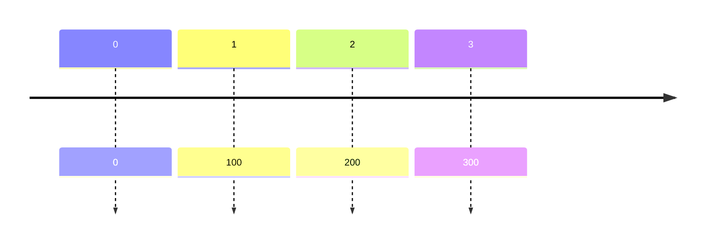
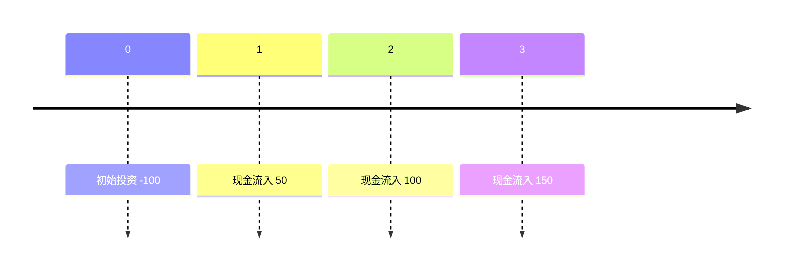
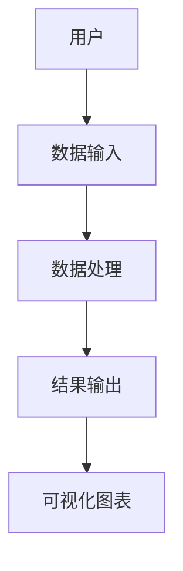

                 


# 托马斯罗的现金流投资法

> 关键词：现金流、投资法、托马斯罗、财务分析、投资策略、风险管理、价值评估

> 摘要：托马斯罗的现金流投资法是一种通过分析企业的现金流来评估其投资价值的方法。本文详细介绍了现金流的基本概念、计算方法、分析流程、数学模型以及在投资中的应用。通过系统化的分析和实战案例，帮助投资者掌握如何利用现金流进行有效的投资决策。

---

## 第1章 现金流投资法的背景与核心概念

### 1.1 现金流的基本概念

#### 1.1.1 什么是现金流
现金流是指企业在一定时期内通过经营活动、投资活动和融资活动所产生的现金流入和流出。它是企业财务健康状况的重要指标，也是投资决策的核心依据。

- **现金流入**：包括营业收入、投资收益、筹资活动的现金流入等。
- **现金流出**：包括购买原材料、支付工资、偿还债务等。

现金流与利润不同，利润是会计上的盈亏结果，而现金流关注的是实际的现金运动情况。

#### 1.1.2 现金流的类型
现金流主要分为三类：
1. **经营活动现金流**：企业日常经营活动中产生的现金流，如销售商品、提供服务等。
2. **投资活动现金流**：企业投资于长期资产或处置长期资产所产生的现金流。
3. **融资活动现金流**：企业通过筹资活动（如发行债券、贷款）或偿还债务所形成的现金流。

#### 1.1.3 现金流在投资中的重要性
现金流是评估企业价值的关键指标，因为它直接反映了企业的偿债能力和盈利能力。一个企业可能有较高的利润，但如果现金流为负，其经营可能难以持续。

---

### 1.2 现金流投资法的定义与特点

#### 1.2.1 现金流投资法的定义
现金流投资法是一种基于对企业未来现金流预测和现值评估的投资分析方法。这种方法的核心在于通过计算现金流的净现值（NPV）来判断投资项目或企业的价值。

#### 1.2.2 现金流投资法的核心特点
- **注重实际现金流**：现金流投资法关注企业的实际现金流入和流出，而不是会计利润。
- **现值评估**：通过将未来现金流折现为现值，评估其当前价值。
- **风险敏感性**：考虑到现金流的时间价值和风险因素，调整贴现率以反映项目的不确定性。

#### 1.2.3 现金流投资法与其他投资方法的区别
与传统的市盈率或市净率估值方法不同，现金流投资法更注重企业的盈利能力和现金流生成能力，而非仅仅关注价格和比率。

---

### 1.3 现金流投资法的核心要素

#### 1.3.1 现金流的净现值（NPV）计算
净现值是将未来现金流按预定的贴现率折现到当前时点的现值，再减去初始投资金额。

$$ NPV = \sum_{t=1}^{n} \frac{CF_t}{(1 + r)^t} - I $$

其中：
- \( CF_t \)：第 \( t \) 期的现金流
- \( r \)：贴现率
- \( I \)：初始投资金额

#### 1.3.2 现金流的时间价值与风险评估
现金流的时间价值是指资金随着时间的推移而产生的价值变化。风险评估则通过调整贴现率来反映未来现金流的不确定性。

#### 1.3.3 现金流的可持续性与增长性
现金流的可持续性和增长性是评估企业长期价值的重要因素。稳定的现金流表明企业具有较强的盈利能力和发展潜力。

---

## 第2章 现金流的计算与分析方法

### 2.1 现金流的计算公式

#### 2.1.1 现金流的净现值公式
$$ NPV = \sum_{t=1}^{n} \frac{CF_t}{(1 + r)^t} - I $$

#### 2.1.2 现金流的内部收益率公式
内部收益率（IRR）是使得净现值为零的贴现率。

$$ IRR = r \text{ 使得 } \sum_{t=1}^{n} \frac{CF_t}{(1 + r)^t} - I = 0 $$

---

### 2.2 现金流的分析步骤

#### 2.2.1 确定现金流的时间序列
绘制现金流的时间线图，明确每期的现金流金额。



#### 2.2.2 计算现金流的现值
使用净现值公式计算未来现金流的现值。

#### 2.2.3 评估现金流的风险与回报
通过内部收益率和净现值等指标，评估项目的可行性和回报潜力。

---

### 2.3 现金流的可视化与图表分析

#### 2.3.1 现金流的时间线图


#### 2.3.2 现金流的柱状图
```mermaid
 barChart
   "2020": 100
   "2021": 150
   "2022": 200
   "2023": 250
```

#### 2.3.3 现金流的折线图
```mermaid
 lineChart
   "2020": 100
   "2021": 120
   "2022": 150
   "2023": 180
```

---

## 第3章 现金流投资法的数学模型与公式

### 3.1 现金流的现值计算

#### 3.1.1 现值公式
$$ PV = \frac{CF}{(1 + r)^t} $$

其中：
- \( CF \)：未来现金流
- \( r \)：贴现率
- \( t \)：时间（年）

#### 3.1.2 举例计算
假设某项目未来3年的现金流分别为100、150、200，贴现率为10%。

$$ PV = \frac{100}{1.1^1} + \frac{150}{1.1^2} + \frac{200}{1.1^3} $$

计算结果为：
$$ PV = 90.91 + 113.64 + 136.68 = 341.23 $$

---

## 第4章 现金流投资法的系统分析与架构设计

### 4.1 系统功能设计

#### 4.1.1 数据输入模块
用户输入现金流数据和贴现率。

#### 4.1.2 数据处理模块
计算现金流的现值和净现值。

#### 4.1.3 结果输出模块
展示计算结果和可视化图表。

### 4.2 系统架构设计


---

## 第5章 现金流投资法的项目实战

### 5.1 环境安装
安装Python和相关库（如numpy、pandas、matplotlib）。

### 5.2 核心实现代码

```python
import numpy as np
import matplotlib.pyplot as plt

def calculate_npv(cash_flows, discount_rate):
    return np.npv(discount_rate, *cash_flows)

def plot_cash_flow(cash_flows, title):
    plt.figure(figsize=(10, 6))
    plt.bar(range(len(cash_flows)), cash_flows)
    plt.title(title)
    plt.xlabel('Time (years)')
    plt.ylabel('Cash Flow')
    plt.show()

# 示例数据
cash_flows = [-100, 50, 100, 150]
discount_rate = 0.1

# 计算净现值
npv = calculate_npv(cash_flows, discount_rate)
print(f"净现值为：{npv}")

# 绘制现金流柱状图
plot_cash_flow(cash_flows, "Cash Flow Timeline")
```

---

## 第6章 最佳实践与小结

### 6.1 最佳实践
- **选择合适的贴现率**：贴现率应反映项目的风险。
- **长期视角**：关注企业的长期现金流情况。
- **动态调整**：定期更新现金流预测。

### 6.2 小结
托马斯罗的现金流投资法是一种科学的投资分析方法，通过计算现金流的现值和净现值，能够有效评估企业的投资价值。投资者应结合实际数据和市场环境，灵活运用这一方法。

### 6.3 注意事项
- 现金流分析依赖于未来的假设，存在不确定性。
- 贴现率的选择对结果影响较大，需谨慎处理。

### 6.4 拓展阅读
建议阅读《财务报表分析》和《价值评估：_halves_investor's guide to stock valuation》深入了解现金流分析的更多细节。

---

## 作者：AI天才研究院/AI Genius Institute & 禅与计算机程序设计艺术 /Zen And The Art of Computer Programming

