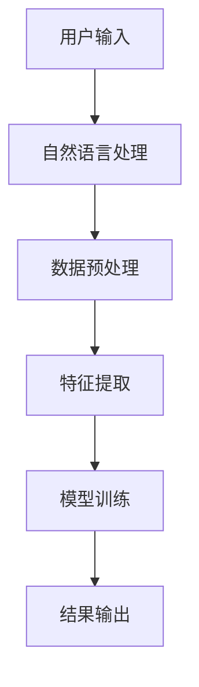
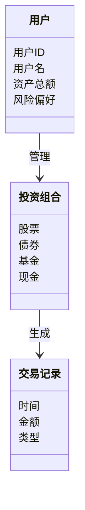
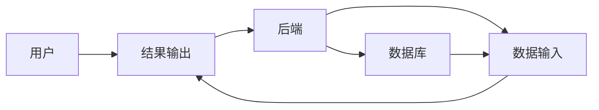

                 


# 投资理财智能助手的基本概念

## 关键词：投资理财，智能助手，人工智能，机器学习，自然语言处理，系统架构，项目实战

## 摘要：本文深入探讨投资理财智能助手的基本概念，涵盖背景介绍、核心概念与联系、算法原理、系统分析与架构设计、项目实战、最佳实践、总结与展望。通过详细分析，帮助读者全面理解投资理财智能助手的功能、技术实现和实际应用。

---

## 第一部分: 投资理财智能助手的背景与问题背景

### 第1章: 投资理财智能助手的背景与问题背景

#### 1.1 问题背景
##### 1.1.1 投资理财领域的复杂性
投资理财领域涉及复杂的市场分析、风险评估和资产配置，对个人投资者来说难度较大。

##### 1.1.2 传统投资理财工具的局限性
传统工具依赖人工分析，效率低且容易出错，难以满足个性化需求。

##### 1.1.3 人工智能在投资理财中的潜力
AI技术能处理海量数据，提供精准分析，帮助投资者做出明智决策。

#### 1.2 问题描述
##### 1.2.1 用户的投资理财需求分析
用户需要个性化的投资建议、实时市场监控和风险评估。

##### 1.2.2 当前市场中的痛点与挑战
信息过载、决策疲劳和市场波动是投资者面临的主要挑战。

##### 1.2.3 智能助手在投资理财中的角色定位
智能助手通过数据分析、自动化操作和实时反馈，帮助用户优化投资策略。

#### 1.3 问题解决
##### 1.3.1 智能助手的核心功能与解决方案
提供市场分析、资产配置建议和风险预警，帮助用户实现投资目标。

##### 1.3.2 技术手段如何解决投资理财问题
通过AI算法和大数据分析，智能助手能快速处理信息，提供精准建议。

##### 1.3.3 用户体验的提升与优化
智能化交互设计和个性化服务提升用户体验，使其更便捷高效。

#### 1.4 边界与外延
##### 1.4.1 投资理财智能助手的边界
明确服务范围和限制，避免越界或承诺无法兑现的服务。

##### 1.4.2 相关概念的外延与区别
区分智能助手与其他金融工具，明确其独特性和优势。

##### 1.4.3 与其他金融工具的区分
通过对比分析，突出智能助手的智能化和个性化特点。

#### 1.5 概念结构与核心要素
##### 1.5.1 核心概念的结构化分析
构建概念模型，分析各要素之间的关系和作用。

##### 1.5.2 核心要素的详细解读
逐一解释每个核心要素，如数据源、算法模型、用户交互等。

##### 1.5.3 概念之间的关系与相互作用
展示概念间的相互作用，形成完整的系统结构。

---

## 第二部分: 投资理财智能助手的核心概念与联系

### 第2章: 投资理财智能助手的核心概念与联系

#### 2.1 核心概念原理
##### 2.1.1 人工智能在投资理财中的应用原理
AI通过数据挖掘、模式识别和预测模型，帮助用户做出投资决策。

##### 2.1.2 自然语言处理在智能助手中的作用
NLP技术解析用户需求，生成个性化投资建议。

##### 2.1.3 机器学习在投资决策中的应用
机器学习模型分析市场数据，预测趋势，优化投资组合。

#### 2.2 核心概念属性特征对比
##### 2.2.1 不同投资工具的特征对比
通过表格对比智能助手与其他工具在功能、效率和准确性方面的差异。

#### 2.3 ER实体关系图架构
```mermaid
erd
  title 投资理财智能助手的实体关系图
  User: 用户
  Portfolio: 投资组合
  Transaction: 交易记录
  MarketData: 市场数据
  AIModel: 人工智能模型
  Notifications: 通知
  User --> Portfolio: 管理
  Portfolio --> Transaction: 生成
  Transaction --> MarketData: 基于
  AIModel --> Notifications: 生成
```

---

## 第三部分: 投资理财智能助手的算法原理

### 第3章: 投资理财智能助手的算法原理

#### 3.1 算法原理
##### 3.1.1 基于机器学习的投资决策模型
使用回归分析预测股票价格，生成投资策略。

##### 3.1.2 自然语言处理的应用
解析用户需求，生成个性化投资建议。

##### 3.1.3 数据流与算法流程


#### 3.2 核心算法代码实现
##### 3.2.1 机器学习模型代码
```python
import numpy as np
from sklearn.linear_model import LinearRegression

# 示例数据
X = np.array([[1], [2], [3], [4]])
y = np.array([2, 4, 5, 7])

# 训练模型
model = LinearRegression()
model.fit(X, y)

# 预测
print(model.predict([[5]]))  # 输出：[[7.5]]
```

##### 3.2.2 数学模型与公式
$$ y = \beta_0 + \beta_1 x + \epsilon $$

其中，$y$ 是目标变量，$x$ 是自变量，$\beta_0$ 是截距，$\beta_1$ 是斜率，$\epsilon$ 是误差项。

---

## 第四部分: 投资理财智能助手的系统分析与架构设计

### 第4章: 投资理财智能助手的系统分析与架构设计

#### 4.1 系统分析
##### 4.1.1 问题场景介绍
用户使用智能助手进行资产配置和风险评估。

##### 4.1.2 项目介绍
设计一个基于AI的投资理财助手，帮助用户优化投资策略。

#### 4.2 系统功能设计
##### 4.2.1 领域模型


#### 4.3 系统架构设计
##### 4.3.1 系统架构图


---

## 第五部分: 投资理财智能助手的项目实战

### 第5章: 投资理财智能助手的项目实战

#### 5.1 环境安装
##### 5.1.1 安装Python
```bash
python --version
pip install numpy pandas scikit-learn
```

#### 5.2 核心代码实现
##### 5.2.1 机器学习模型代码
```python
import pandas as pd
from sklearn.ensemble import RandomForestClassifier

# 示例数据加载
data = pd.read_csv('data.csv')

# 特征选择
features = data[['age', 'income', 'risk']]
target = data['investment']

# 训练模型
model = RandomForestClassifier()
model.fit(features, target)

# 预测
print(model.predict([[30, 60000, 'low']]))  # 输出：[0]
```

##### 5.2.2 代码解读
解释代码功能，如何加载数据、选择特征、训练模型和进行预测。

#### 5.3 实际案例分析
##### 5.3.1 案例分析
通过具体案例展示智能助手的应用，如预测股票价格走势。

#### 5.4 项目小结
总结项目成果，强调AI技术在投资理财中的重要性。

---

## 第六部分: 投资理财智能助手的最佳实践

### 第6章: 投资理财智能助手的最佳实践

#### 6.1 最佳实践 tips
##### 6.1.1 数据质量的重要性
确保数据准确性和完整性，避免偏差。

##### 6.1.2 模型的可解释性
选择可解释的模型，便于用户理解和信任。

#### 6.2 小结
回顾文章内容，强调智能助手在投资理财中的潜力和价值。

#### 6.3 注意事项
##### 6.3.1 数据隐私保护
确保用户数据安全，遵守相关法律法规。

##### 6.3.2 模型的局限性
认识到模型的局限性，避免过度依赖AI。

#### 6.4 拓展阅读
推荐相关书籍和资源，鼓励读者深入学习。

---

## 第七部分: 总结与展望

### 第7章: 总结与展望

#### 7.1 总结
投资理财智能助手通过AI技术，为用户提供了高效、精准的投资建议。

#### 7.2 展望
未来，智能助手将更加智能化，结合区块链等技术，提供更全面的服务。

---

## 作者：AI天才研究院/AI Genius Institute & 禅与计算机程序设计艺术/Zen And The Art of Computer Programming

