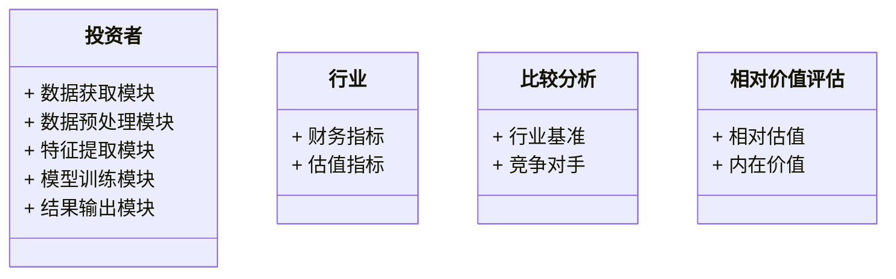
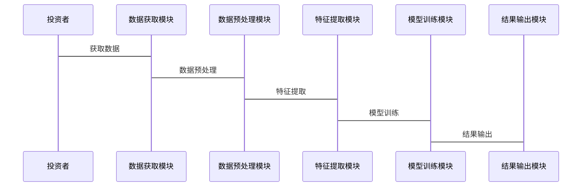

                 


# 拉尔夫·旺格的相对价值投资：行业内部的比较分析

## 关键词：相对价值投资、行业比较、投资策略、量化分析、金融模型

## 摘要：相对价值投资是一种通过在同行业内比较不同公司的价值，以寻找被市场低估的投资机会的投资策略。本文详细分析了相对价值投资的核心概念、算法原理、系统架构、项目实战及案例分析，旨在为投资者提供一套科学的分析框架和实战指南。

---

## 第一部分：相对价值投资的背景与核心概念

### 第1章：相对价值投资的背景与定义

#### 1.1 相对价值投资的背景

- 1.1.1 投资学的演进与相对价值投资的兴起  
  近年来，随着金融市场的发展，投资者逐渐从单一的“绝对价值投资”转向更加灵活和动态的“相对价值投资”。相对价值投资强调在同一行业或相似资产中进行比较分析，以发现价格差异和投资机会。

- 1.1.2 相对价值投资的核心概念与问题背景  
  相对价值投资的核心在于通过比较同一行业内的公司，找出那些相对于行业平均水平被低估的企业。这种方法特别适用于市场波动较大或信息不对称较严重的环境。

- 1.1.3 相对价值投资与绝对价值投资的对比  
  与绝对价值投资不同，相对价值投资并不依赖于对单个资产的绝对估值，而是通过横向比较来寻找相对优势。

#### 1.2 相对价值投资的定义与特点

- 1.2.1 相对价值投资的定义  
  相对价值投资是一种基于相对估值的方法，通过比较同一行业内的公司，发现那些相对于行业基准或竞争对手被低估的投资标的。

- 1.2.2 相对价值投资的核心特点  
  - 相对性：基于行业内的相对估值，而非绝对估值。  
  - 比较性：通过横向比较发现价格差异和投资机会。  
  - 动态性：需要持续跟踪和调整，以应对市场变化。

- 1.2.3 相对价值投资与其它投资策略的区别  
  相对价值投资不同于趋势投资或技术分析，它更注重基本面分析和行业比较。

#### 1.3 相对价值投资的边界与外延

- 1.3.1 相对价值投资的适用范围  
  适用于行业内部比较，尤其适合那些市场参与者较多、竞争充分的行业。

- 1.3.2 相对价值投资的局限性  
  - 可能忽略宏观经济因素的影响。  
  - 仅适用于同一行业内的比较，跨行业分析可能不准确。  
  - 依赖于数据的完整性和准确性。

- 1.3.3 相对价值投资与宏观经济环境的关系  
  宏观经济环境会影响行业的整体估值水平，但相对价值投资更关注行业内差异。

### 第2章：相对价值投资的核心概念原理

#### 2.1 相对价值投资的比较分析方法

- 2.1.1 行业内部比较分析的基本原理  
  通过比较同一行业内的公司，分析其财务指标、估值指标等，找出相对低估的公司。

- 2.1.2 相对价值投资的核心要素与属性特征  
  核心要素包括：  
  - 财务指标：如市盈率（P/E）、市净率（P/B）、股息率等。  
  - 估值模型：如DCF模型、相对估值模型。  
  - 行业基准：如行业平均值、竞争对手的估值水平。

#### 2.2 相对价值投资的ER实体关系图


---

## 第二部分：相对价值投资的算法原理与数学模型

### 第3章：相对价值投资的算法原理

#### 3.1 相对价值评估的算法流程


#### 3.2 相对价值评估的数学模型

- **相对估值模型**：  
  使用行业平均市盈率（P/E）与目标公司市盈率进行比较，判断其是否被低估。  
  公式：  
  $$ \text{相对市盈率} = \frac{\text{目标公司P/E}}{\text{行业平均P/E}} $$  
  如果相对市盈率 < 1，则目标公司可能被低估。

- **DCF模型**：  
  通过现金流折现计算目标公司的内在价值，并与市场估值进行比较。  
  公式：  
  $$ V = \sum_{t=1}^{n} \frac{CF_t}{(1 + r)^t} $$  
  其中，\( CF_t \) 是第t年的现金流，\( r \) 是折现率。

#### 3.3 相对价值评估的算法实现

- **步骤1：数据获取**  
  收集目标公司和行业内的相关数据，包括财务指标、估值指标等。

- **步骤2：数据预处理**  
  清洗数据，处理缺失值和异常值。

- **步骤3：特征提取**  
  提取关键财务指标和估值指标，如P/E、P/B、ROE等。

- **步骤4：模型训练**  
  使用相对估值模型或DCF模型计算目标公司的内在价值。

- **步骤5：结果输出**  
  比较目标公司与行业平均的估值，判断是否被低估。

---

## 第三部分：相对价值投资的系统分析与架构设计

### 第4章：相对价值投资的系统分析

#### 4.1 系统功能设计



#### 4.2 系统架构设计


#### 4.3 系统接口设计

- 数据接口：与数据源（如数据库、API）连接，获取实时数据。
- 模型接口：与估值模型（如DCF模型、相对估值模型）连接，进行计算。
- 输出接口：将结果输出到终端或存储到数据库。

#### 4.4 系统交互设计



---

## 第四部分：相对价值投资的项目实战

### 第5章：相对价值投资的项目实战

#### 5.1 项目介绍

- 项目目标：通过相对价值投资的方法，寻找同一行业内的被低估公司。
- 项目范围：选择一个具体行业（如科技行业），分析其内的几家公司。

#### 5.2 核心实现

- **数据处理**  
  使用Python的Pandas库进行数据清洗和处理。  
  代码示例：  
  ```python
  import pandas as pd
  df = pd.read_csv('data.csv')
  df = df.dropna()
  ```

- **模型实现**  
  使用相对估值模型计算目标公司的内在价值。  
  代码示例：  
  ```python
  def relative_valuation(target_pe, industry_pe):
      return target_pe / industry_pe
  ```

- **结果分析**  
  比较目标公司与行业平均的相对估值，判断是否被低估。

#### 5.3 案例分析

- 以科技行业为例，分析苹果、谷歌、微软的相对估值情况。  
  - 苹果的市盈率：15，行业平均市盈率：20。  
  - 相对市盈率 = 15 / 20 = 0.75，表明苹果可能被低估。

---

## 第五部分：总结与展望

### 第6章：总结与展望

#### 6.1 总结

- 相对价值投资是一种有效的投资策略，通过行业内部比较分析，可以帮助投资者发现被低估的投资机会。
- 本文详细介绍了相对价值投资的核心概念、算法原理、系统架构和项目实战，为投资者提供了理论和实践的指导。

#### 6.2 展望

- 随着技术的发展，相对价值投资可以通过大数据和人工智能进一步优化。
- 未来的研究可以结合机器学习模型，提高相对估值的准确性和效率。

---

## 作者：AI天才研究院/AI Genius Institute & 禅与计算机程序设计艺术 /Zen And The Art of Computer Programming

---

### 注意事项：
1. 请确保您在实际应用中结合具体数据和市场情况，本文仅为理论指导。
2. 本文中的代码示例仅供参考，实际应用中需根据具体情况调整。
3. 如需进一步探讨或交流，请联系作者。

---

**结束**

