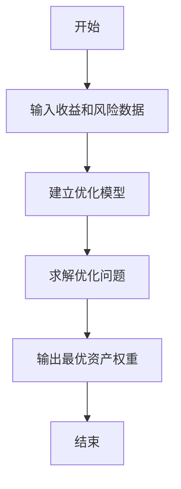
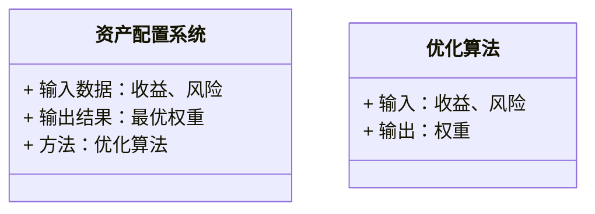

                 


# 《拉尔夫·旺格的资产配置革命》

## 关键词：资产配置革命、拉尔夫·旺格、投资组合理论、风险管理、配置模型、动态调整

## 摘要：  
《拉尔夫·旺格的资产配置革命》一书深入探讨了传统资产配置方法的局限性，并提出了一套创新的资产配置理论。作者拉尔夫·旺格通过结合现代投资组合理论与风险管理，提出了动态、灵活的资产配置策略，旨在应对复杂多变的市场环境。文章详细分析了这一革命性理论的核心概念、算法原理、系统架构及实际应用，为投资者提供了全新的视角和实用的工具。

---

## 第一章：资产配置革命的背景

### 1.1 资产配置的基本概念  
资产配置是投资过程中至关重要的一环，它决定了资金在不同资产类别（如股票、债券、房地产等）之间的分配比例。合理的资产配置能够平衡风险与收益，帮助投资者在不同市场环境下实现最优的投资回报。  

### 1.2 传统资产配置的局限性  
传统资产配置方法通常基于固定的资产比例，难以适应市场环境的变化。例如，在市场波动加剧时，固定比例的配置可能导致投资组合的风险超出预期。此外，传统方法往往忽略了投资者的动态需求和市场条件的变化。  

### 1.3 拉尔夫·旺格的资产配置革命  
拉尔夫·旺格提出了一种动态资产配置方法，通过实时调整资产比例来应对市场变化。这种方法不仅考虑了资产的收益和风险，还引入了风险管理的机制，确保投资组合在不同市场环境下的稳定性。

---

## 第二章：拉尔夫·旺格的资产配置理论

### 2.1 拉尔夫·旺格的配置模型  
拉尔夫·旺格的配置模型以现代投资组合理论为基础，结合了风险管理的最新研究成果。模型的核心在于通过优化算法确定最优的资产分配比例，从而在风险可控的前提下最大化收益。  

#### 2.1.1 模型的结构  
模型由以下几个核心部分组成：  
1. **资产池**：包括股票、债券、商品等多种资产类别。  
2. **风险评估**：通过历史数据和市场预测评估各类资产的风险。  
3. **收益预测**：基于市场分析预测各类资产的预期收益。  
4. **优化算法**：利用数学优化方法确定最优资产分配比例。  

#### 2.1.2 模型的假设  
- 市场是有效且可预测的。  
- 投资者的目标是最大化收益并控制风险。  
- 市场数据可以用于预测资产的收益和风险。  

### 2.2 资产配置的优化方法  
优化方法是拉尔夫·旺格理论的核心。以下是优化过程的详细步骤：  

#### 2.2.1 输入数据  
- 资产的预期收益和风险（方差）。  
- 投资者的风险承受能力。  

#### 2.2.2 建立优化模型  
目标函数：最大化投资组合的预期收益，同时最小化风险。  
$$ \text{Minimize } \sigma^2 \text{ subject to } \mu \cdot w = \mu_p $$  
其中，\( w \) 是资产权重向量，\( \mu \) 是资产收益向量，\( \mu_p \) 是目标收益。  

#### 2.2.3 解决优化问题  
通过求解上述优化问题，得到最优的资产权重。  

### 2.3 风险管理与配置策略  
拉尔夫·旺格的理论强调风险管理的重要性。通过动态调整资产配置比例，投资者可以在市场波动时降低风险，同时抓住潜在的收益机会。  

---

## 第三章：资产配置的数学模型

### 3.1 现代投资组合理论  
现代投资组合理论（MPT）由哈里·马科维茨提出，是资产配置的基础。MPT认为，最优资产配置是那些能够提供在给定风险水平下最高收益的投资组合。  

#### 3.1.1 均值-方差模型  
目标函数：  
$$ \text{Minimize } w^T \Sigma w \text{ subject to } w^T \mu = \mu_p $$  
其中，\( \Sigma \) 是资产的协方差矩阵，\( \mu \) 是收益向量，\( w \) 是权重向量，\( \mu_p \) 是目标收益。  

#### 3.1.2 有效前沿  
有效前沿是所有最优投资组合的集合，代表在给定风险水平下最高的收益。  

### 3.2 拉尔夫·旺格的优化算法  
拉尔夫·旺格在MPT的基础上，引入了动态调整机制。以下是优化算法的流程图：  



### 3.3 算法实现  
以下是Python代码实现拉尔夫·旺格优化算法的示例：  

```python
import numpy as np
from scipy.optimize import minimize

# 输入数据
mu = np.array([0.1, 0.08, 0.15])  # 各资产的预期收益
Sigma = np.array([
    [0.04, 0.02, 0.01],
    [0.02, 0.03, 0.01],
    [0.01, 0.01, 0.06]
])  # 协方差矩阵

# 目标函数
def objective(w):
    return np.dot(w.T, np.dot(Sigma, w))

# 约束条件
def constraint(w):
    return np.dot(w.T, mu) - 0.12 == 0

# 初始化权重
w0 = np.array([1/3, 1/3, 1/3])

# 求解优化问题
result = minimize(objective, w0, constraints={'type': 'eq', 'fun': constraint})

# 输出结果
print("最优权重：", result.x)
print("最小方差：", result.fun)
```

---

## 第四章：系统架构与交互设计

### 4.1 系统功能设计  
以下是系统功能的类图：  



### 4.2 系统交互设计  
以下是系统交互的序列图：  

```mermaid
sequenceDiagram
    用户 -> 系统：输入收益和风险数据
    系统 -> 优化算法：求解最优权重
    优化算法 --> 系统：返回最优权重
    系统 -> 用户：输出结果
```

---

## 第五章：项目实战

### 5.1 环境安装  
需要安装Python和相关库（如NumPy、SciPy）。  

### 5.2 核心代码实现  
以下是实现拉尔夫·旺格优化算法的代码：  

```python
import numpy as np
from scipy.optimize import minimize

def optimize_portfolio(mu, Sigma, target_return):
    n = len(mu)
    # 定义目标函数
    def objective(w):
        return np.dot(w.T, np.dot(Sigma, w))
    
    # 约束条件：收益等于目标
    def constraint(w):
        return np.dot(w.T, mu) - target_return
    
    # 初始权重
    w0 = np.array([1.0/n]*n)
    
    # 求解优化问题
    result = minimize(objective, w0, constraints={'type': 'eq', 'fun': constraint})
    return result.x

# 示例
mu = np.array([0.1, 0.08, 0.15])
Sigma = np.array([
    [0.04, 0.02, 0.01],
    [0.02, 0.03, 0.01],
    [0.01, 0.01, 0.06]
])
target_return = 0.12

weights = optimize_portfolio(mu, Sigma, target_return)
print("最优权重：", weights)
```

### 5.3 案例分析  
假设我们有三个资产，预期收益分别为10%、8%和15%，协方差矩阵如上。目标是实现12%的收益，求最优权重。运行代码后，输出最优权重和最小方差。

---

## 第六章：总结与展望

### 6.1 小结  
拉尔夫·旺格的资产配置革命通过动态调整资产比例，解决了传统方法的局限性。通过优化算法和风险管理，投资者可以在复杂市场中实现稳健收益。

### 6.2 注意事项  
- 资产配置需要结合市场环境和投资者需求。  
- 模型的有效性依赖于数据的准确性和市场的可预测性。  

### 6.3 拓展阅读  
- 《投资学》（教材）  
- 现代投资组合理论的相关论文  

---

## 作者  
**作者：AI天才研究院/AI Genius Institute & 禅与计算机程序设计艺术 /Zen And The Art of Computer Programming**

---

通过以上章节，我们详细探讨了拉尔夫·旺格的资产配置革命，从理论到实践，为读者提供了全面的视角和实用的工具。

