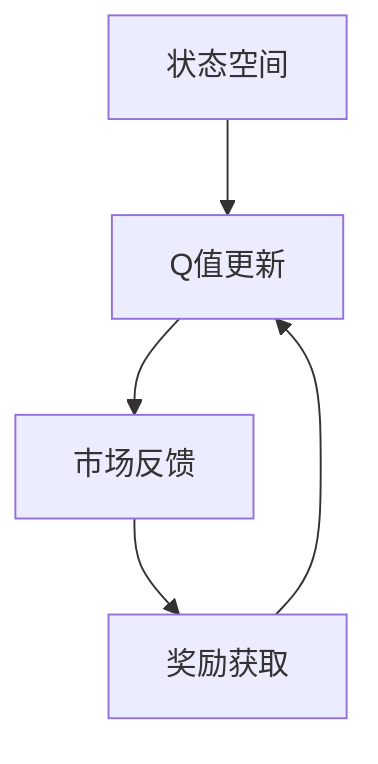
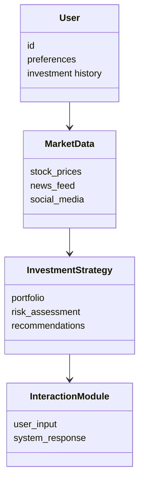
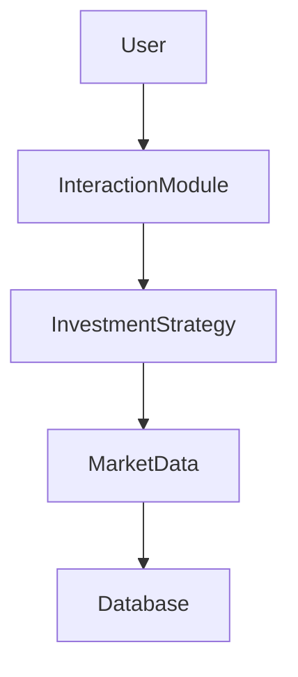
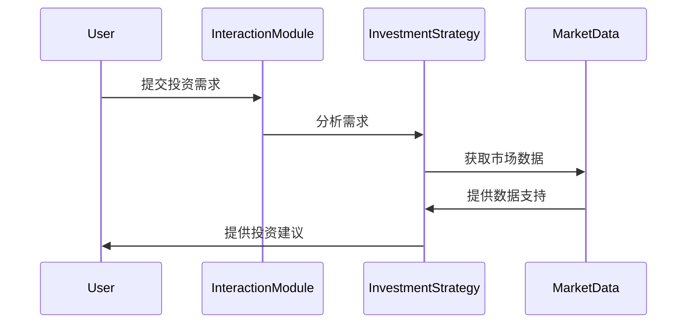

                 


# 探索下一代投资理财智能助手的发展方向

## 关键词：投资理财、智能助手、人工智能、机器学习、量化投资、金融数据分析

## 摘要：  
随着人工智能和大数据技术的快速发展，投资理财领域正经历着前所未有的变革。传统的投资理财工具逐渐被智能化、个性化的助手所取代，这些智能助手通过深度学习、自然语言处理和强化学习等技术，能够为投资者提供精准的市场分析、风险评估和投资建议。本文将从技术驱动、系统架构、算法原理等多个角度，详细探讨下一代投资理财智能助手的发展方向，分析其在金融领域的应用潜力和未来趋势。

---

# 第一部分：背景与现状

## 第1章：下一代投资理财智能助手的背景与现状

### 1.1 问题背景：传统投资理财工具的局限性

#### 1.1.1 投资者的需求痛点
- **信息过载**：金融市场数据繁多，投资者难以快速获取关键信息。
- **决策滞后**：传统工具依赖历史数据，难以实时捕捉市场动态。
- **个性化不足**：现有工具往往采用通用策略，难以满足个性化需求。
- **风险控制**：传统工具难以实时量化投资风险。

#### 1.1.2 问题描述：现有工具的局限性
- **数据处理能力有限**：传统工具难以处理非结构化数据。
- **交互体验单一**：用户界面复杂，操作门槛高。
- **策略更新缓慢**：传统量化模型难以快速适应市场变化。

#### 1.1.3 问题解决：智能助手的核心价值
- 提供实时、个性化的投资建议。
- 通过自然语言处理简化用户操作。
- 利用强化学习快速调整投资策略。

#### 1.1.4 边界与外延：智能助手的功能范围
- **核心功能**：市场分析、风险评估、投资建议。
- **附加功能**：用户行为分析、社交网络集成。

#### 1.1.5 核心要素：智能助手的关键组成部分
- 数据采集模块。
- 模型训练模块。
- 用户交互模块。

### 1.2 当前投资理财领域的技术驱动

#### 1.2.1 AI技术在金融领域的应用现状
- **自然语言处理（NLP）**：用于分析新闻和社交媒体数据。
- **强化学习（RL）**：用于动态调整投资策略。
- **时间序列分析**：用于预测市场走势。

#### 1.2.2 大数据与云计算对投资理财的影响
- 数据处理能力的提升。
- 实时数据分析的支持。
- 高可用性系统的构建。

#### 1.2.3 量化投资与智能投顾的发展趋势
- 量化投资的普及。
- 智能投顾的个性化发展。

### 1.3 投资者需求与智能助手的结合

#### 1.3.1 用户画像：不同类型投资者的需求分析
- **个人投资者**：追求高收益，风险承受能力有限。
- **机构投资者**：注重策略稳定性和可扩展性。

#### 1.3.2 场景分析：智能助手在投资决策中的应用场景
- **市场预测**：基于历史数据和新闻分析，预测市场走势。
- **风险评估**：量化投资组合的风险。
- **策略优化**：动态调整投资策略以适应市场变化。

#### 1.3.3 体验优化：智能助手如何提升用户投资体验
- **实时反馈**：用户操作后立即获得反馈。
- **个性化推荐**：基于用户行为推荐投资策略。
- **可视化界面**：通过图表和仪表盘直观展示数据。

### 1.4 本章小结
本章从背景、现状和技术驱动三个方面，分析了下一代投资理财智能助手的发展背景和核心价值。通过用户需求分析，明确了智能助手在投资理财领域的应用场景和潜力。

---

# 第二部分：核心概念与技术架构

## 第2章：投资理财智能助手的核心概念

### 2.1 智能助手的功能模块

#### 2.1.1 数据采集与处理模块
- **数据来源**：金融市场数据、新闻、社交媒体、用户行为数据。
- **处理流程**：数据清洗、特征提取、数据增强。

#### 2.1.2 模型训练与优化模块
- **模型类型**：强化学习模型、时间序列模型、NLP模型。
- **训练方法**：监督学习、无监督学习、强化学习。

#### 2.1.3 用户交互与反馈模块
- **交互方式**：文本输入、语音交互、图形界面。
- **反馈机制**：实时反馈、延迟反馈。

### 2.2 技术架构分析

#### 2.2.1 基于AI的决策引擎
- **决策流程**：数据输入、特征提取、策略生成、风险评估。
- **引擎特点**：实时性、动态性、个性化。

#### 2.2.2 数据驱动的投资策略生成
- **策略生成**：基于历史数据和实时数据，生成投资策略。
- **策略优化**：通过强化学习动态优化策略。

#### 2.2.3 用户行为分析与个性化推荐
- **分析方法**：聚类分析、关联规则挖掘。
- **推荐机制**：基于用户行为和市场数据推荐策略。

### 2.3 核心算法与模型

#### 2.3.1 基于强化学习的投资决策模型
- **算法选择**：Q-learning。
- **模型结构**：状态空间、动作空间、奖励函数。
- **应用场景**：动态市场环境下的投资决策。

#### 2.3.2 基于自然语言处理的金融信息提取
- **技术应用**：文本挖掘、情感分析。
- **应用场景**：分析新闻和社交媒体数据。

#### 2.3.3 基于时间序列分析的市场预测模型
- **模型选择**：ARIMA、LSTM。
- **应用场景**：预测市场走势。

### 2.4 本章小结
本章详细介绍了投资理财智能助手的核心功能模块和技术架构，分析了其在AI和大数据技术驱动下的实现方式。

---

# 第三部分：算法原理与数学模型

## 第3章：智能助手的核心算法原理

### 3.1 强化学习在投资决策中的应用

#### 3.1.1 强化学习的基本原理
- **基本概念**：状态、动作、奖励。
- **算法流程**：环境-代理-交互-反馈。

#### 3.1.2 Q-learning算法在投资决策中的实现
- **算法流程**：
  1. 状态识别：识别当前市场状态。
  2. 动作选择：基于Q值选择动作。
  3. 奖励获取：根据结果更新奖励。
  4. Q值更新：基于奖励更新Q值。

#### 3.1.3 算法流程图：基于Mermaid的强化学习流程



#### 3.1.4 算法实现代码示例
```python
import numpy as np
import gym

# 初始化环境和Q表
env = gym.make('StockTrading-v0')
Q = np.zeros((env.observation_space.shape[0], env.action_space.n))

# 参数设置
learning_rate = 0.01
gamma = 0.99

# Q-learning算法实现
for episode in range(1000):
    state = env.reset()
    done = False
    while not done:
        # 选择动作
        action = np.argmax(Q[state])
        # 执行动作并获取反馈
        next_state, reward, done, info = env.step(action)
        # 更新Q值
        Q[state][action] += learning_rate * (reward + gamma * np.max(Q[next_state]))
```

#### 3.1.5 算法数学模型
- **Q值更新公式**：
  $$ Q(s, a) = Q(s, a) + \alpha (r + \gamma \max Q(s', a')) $$
- **状态转移方程**：
  $$ P(s' | s, a) = \text{基于环境的状态转移概率} $$

---

## 本章小结
本章详细讲解了强化学习在投资决策中的应用，通过Q-learning算法和Python代码示例，展示了智能助手如何通过强化学习优化投资策略。

---

# 第四部分：系统分析与架构设计

## 第4章：系统分析与架构设计

### 4.1 问题场景介绍

#### 4.1.1 系统目标
- 实现投资理财智能助手的核心功能。
- 提供实时市场分析和个性化投资建议。

#### 4.1.2 项目介绍
- **项目名称**：下一代投资理财智能助手。
- **项目目标**：开发一个基于AI的智能投资辅助系统。

### 4.2 系统功能设计

#### 4.2.1 领域模型类图



#### 4.2.2 系统架构图



### 4.3 系统接口设计

#### 4.3.1 API接口设计
- **输入接口**：用户输入、市场数据。
- **输出接口**：投资建议、市场预测。

#### 4.3.2 交互流程图



### 4.4 本章小结
本章通过系统分析和架构设计，展示了智能助手的实现方式和系统交互流程。

---

# 第五部分：项目实战

## 第5章：项目实战

### 5.1 环境安装与配置

#### 5.1.1 Python环境安装
- 安装Python 3.8及以上版本。
- 安装必要的库：numpy、pandas、scikit-learn、gym、tensorflow。

#### 5.1.2 数据集获取
- 从金融数据源获取历史数据。
- 从社交媒体获取文本数据。

### 5.2 系统核心实现源代码

#### 5.2.1 强化学习模型实现
```python
import gym
import numpy as np

# 定义环境
env = gym.make('StockTrading-v0')

# 初始化Q表
Q = np.zeros((env.observation_space.shape[0], env.action_space.n))

# 训练参数
learning_rate = 0.01
gamma = 0.99
episodes = 1000

# Q-learning算法实现
for _ in range(episodes):
    state = env.reset()
    done = False
    while not done:
        # 选择动作
        action = np.argmax(Q[state])
        # 执行动作
        next_state, reward, done, info = env.step(action)
        # 更新Q值
        Q[state][action] += learning_rate * (reward + gamma * np.max(Q[next_state]))
```

#### 5.2.2 数据处理模块实现
```python
import pandas as pd
from sklearn.preprocessing import MinMaxScaler

# 加载数据
data = pd.read_csv('stock_data.csv')

# 数据预处理
scaler = MinMaxScaler()
data_scaled = scaler.fit_transform(data)

# 划分训练集和测试集
train_data = data_scaled[:int(len(data_scaled)*0.8)]
test_data = data_scaled[int(len(data_scaled)*0.8):]
```

### 5.3 代码应用解读与分析

#### 5.3.1 强化学习模型分析
- **模型表现**：通过训练 episodes，模型逐渐掌握投资策略。
- **收敛性分析**：Q值的变化反映了模型的学习过程。

#### 5.3.2 数据处理模块分析
- **数据预处理**：归一化处理确保模型输入一致性。
- **数据分割**：训练集和测试集的比例为8:2。

### 5.4 实际案例分析与详细讲解

#### 5.4.1 案例背景
- **市场环境**：模拟股票交易环境。
- **用户需求**：寻找高收益低风险的投资策略。

#### 5.4.2 模型训练与优化
- **训练过程**：通过强化学习不断优化投资策略。
- **策略评估**：通过回测验证模型的有效性。

### 5.5 项目小结
本章通过实际案例展示了智能助手的实现过程，包括环境配置、代码实现和模型优化。

---

# 第六部分：最佳实践

## 第6章：最佳实践

### 6.1 小结
- **核心内容回顾**：智能助手的功能模块和技术架构。
- **算法原理总结**：强化学习在投资决策中的应用。
- **项目实现经验**：系统设计和代码实现的关键点。

### 6.2 注意事项
- **数据质量**：确保数据的准确性和完整性。
- **模型泛化能力**：避免过拟合，确保模型的泛化能力。
- **用户隐私保护**：保护用户数据安全。

### 6.3 未来趋势
- **技术融合**：AI与区块链技术的结合。
- **场景扩展**：智能助手在更多金融场景中的应用。
- **用户体验优化**：更加个性化的投资建议。

### 6.4 拓展阅读
- **推荐书籍**：《算法交易：在金融市场的定量方法》。
- **推荐论文**：强化学习在金融中的应用研究。

---

# 作者

作者：AI天才研究院/AI Genius Institute & 禅与计算机程序设计艺术/Zen And The Art of Computer Programming

---

通过以上内容，我们详细探讨了下一代投资理财智能助手的发展方向，从背景分析到技术实现，再到实际应用，全面解析了其在金融领域的潜力和挑战。

