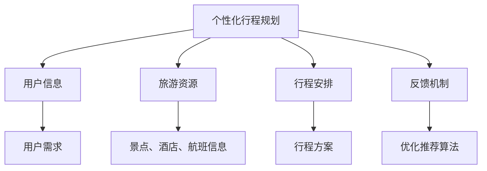
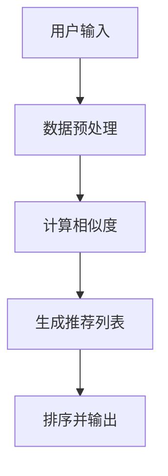
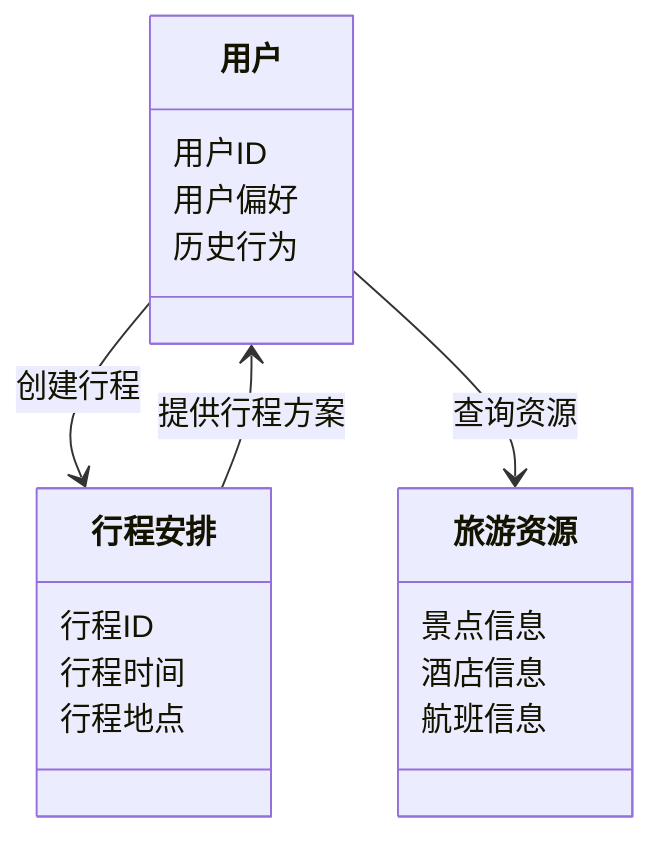
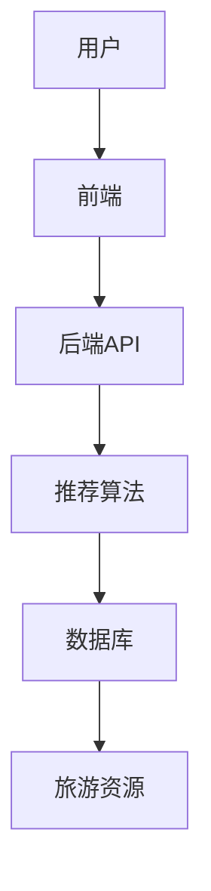
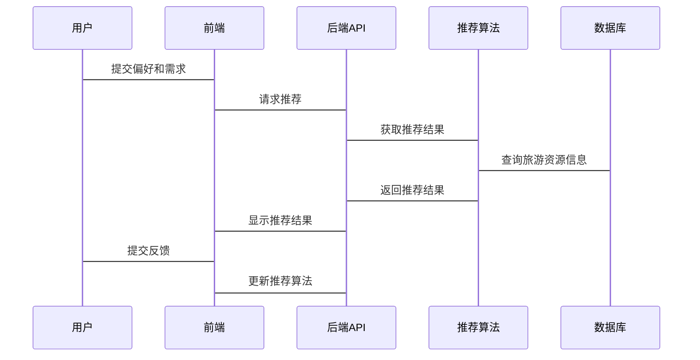

                 


# 《旅游业AI Agent：个性化行程规划》

> 关键词：旅游业，AI Agent，个性化行程规划，人工智能，机器学习

> 摘要：  
随着旅游业的蓬勃发展，个性化行程规划的需求日益增长。本文深入探讨了如何利用AI Agent技术实现个性化行程规划，从核心概念、算法原理、系统架构到项目实战，全面解析了AI Agent在旅游业中的应用。通过详细的技术分析和实际案例，展示了如何利用推荐算法、协同过滤和混合推荐等技术，结合系统设计，构建高效、智能的个性化行程规划系统。文章还提供了代码示例和系统架构图，帮助读者理解和实现这一技术。

----------------------------------------------------------------

# 第一部分: 背景介绍

# 第1章: 旅游业AI Agent的背景与现状

## 1.1 旅游业的发展与挑战

### 1.1.1 旅游业的现状与发展趋势  
旅游业作为全球第二大产业，近年来呈现出快速增长的趋势。随着人们生活水平的提高和旅游需求的多样化，旅游业的竞争日益激烈。传统的旅游服务模式已无法满足消费者对个性化、高效和智能服务的需求。  

### 1.1.2 传统行程规划的痛点与不足  
传统的行程规划主要依赖人工经验，存在以下痛点：  
1. **信息不对称**：用户难以获取全面的旅游信息，导致行程规划效率低下。  
2. **个性化不足**：传统行程规划难以满足用户的个性化需求，往往以供应商利益为导向。  
3. **效率低下**：人工规划耗时长，且难以覆盖所有可能性，用户体验差。  

### 1.1.3 AI技术在旅游业中的应用前景  
AI技术的快速发展为旅游业带来了新的机遇。通过AI Agent技术，可以实现智能化的行程规划，为用户提供个性化的旅游方案，提升用户体验和满意度。  

## 1.2 AI Agent的核心概念

### 1.2.1 AI Agent的定义与特点  
AI Agent（人工智能代理）是指能够感知环境并采取行动以实现目标的智能实体。其特点包括：  
1. **自主性**：能够在没有外部干预的情况下自主运行。  
2. **反应性**：能够实时感知环境并做出响应。  
3. **目标导向**：以特定目标为导向，采取行动以实现目标。  

### 1.2.2 AI Agent在旅游业中的应用场景  
在旅游业中，AI Agent可以应用于多个场景：  
1. **智能推荐**：根据用户偏好推荐景点、酒店和行程。  
2. **实时反馈**：实时调整行程以应对突发情况。  
3. **客户交互**：通过自然语言处理与用户进行交互，提供实时咨询服务。  

### 1.2.3 个性化行程规划的定义与目标  
个性化行程规划是指根据用户的偏好、需求和行为，定制独特的行程方案。其目标是提升用户体验，满足用户的个性化需求。  

## 1.3 本章小结  
本章介绍了旅游业的发展现状、传统行程规划的痛点以及AI Agent的核心概念。通过分析AI Agent在旅游业中的应用前景，为后续的技术探讨奠定了基础。  

----------------------------------------------------------------

# 第二部分: 核心概念与联系

# 第2章: AI Agent与个性化行程规划的核心要素

## 2.1 AI Agent的核心原理

### 2.1.1 AI Agent的基本原理  
AI Agent通过感知环境、分析数据、制定策略并采取行动来实现目标。其基本流程包括：  
1. **感知环境**：通过传感器或其他数据源获取环境信息。  
2. **分析数据**：利用机器学习算法对数据进行分析和处理。  
3. **制定策略**：基于分析结果，制定最优行动方案。  
4. **采取行动**：执行制定的策略以实现目标。  

### 2.1.2 AI Agent的分类与特点  
AI Agent可以根据智能水平和应用领域进行分类：  
1. **基于规则的AI Agent**：通过预定义的规则进行决策。  
2. **基于机器学习的AI Agent**：利用机器学习算法进行自主学习和优化。  
3. **混合型AI Agent**：结合规则和机器学习的混合模式。  

### 2.1.3 AI Agent在旅游业中的应用模式  
在旅游业中，AI Agent的应用模式主要包括：  
1. **推荐系统**：基于用户行为和偏好推荐旅游产品。  
2. **实时交互**：通过自然语言处理与用户进行实时对话。  
3. **动态调整**：根据实时数据动态调整行程安排。  

## 2.2 个性化行程规划的系统模型

### 2.2.1 个性化行程规划的核心要素  
个性化行程规划的核心要素包括：  
1. **用户信息**：用户的偏好、历史行为和需求。  
2. **旅游资源**：景点、酒店、航班等旅游产品的信息。  
3. **行程安排**：根据用户需求生成的个性化行程方案。  
4. **反馈机制**：用户对行程的反馈和评价。  

### 2.2.2 个性化行程规划的系统架构  
个性化行程规划的系统架构包括：  
1. **用户输入层**：用户输入需求和偏好。  
2. **数据处理层**：处理和分析用户数据。  
3. **推荐算法层**：基于算法生成推荐方案。  
4. **输出层**：输出个性化行程方案。  

### 2.2.3 个性化行程规划的实现流程  
个性化行程规划的实现流程包括：  
1. **数据采集**：收集用户的需求和偏好。  
2. **数据分析**：利用机器学习算法分析数据。  
3. **推荐生成**：生成个性化推荐方案。  
4. **反馈优化**：根据用户反馈优化推荐算法。  

## 2.3 AI Agent与个性化行程规划的关系

### 2.3.1 AI Agent在个性化行程规划中的作用  
AI Agent在个性化行程规划中的作用包括：  
1. **数据处理**：处理和分析用户的个性化需求。  
2. **推荐生成**：基于分析结果生成个性化推荐方案。  
3. **实时调整**：根据实时数据动态调整行程安排。  

### 2.3.2 个性化行程规划对AI Agent的需求  
个性化行程规划对AI Agent的需求包括：  
1. **高效计算**：快速处理大量数据。  
2. **智能决策**：基于数据做出最优决策。  
3. **实时响应**：实时响应用户需求和变化。  

### 2.3.3 两者结合的优势与挑战  
两者结合的优势包括：  
1. **个性化体验**：为用户带来个性化的行程体验。  
2. **高效服务**：提升服务效率和质量。  
3. **动态调整**：根据实时数据动态调整行程安排。  

挑战包括：  
1. **数据隐私**：用户数据的安全和隐私保护。  
2. **算法复杂度**：复杂算法的计算效率和准确性。  
3. **用户体验**：如何在技术实现与用户体验之间找到平衡。  

## 2.4 本章小结  
本章详细探讨了AI Agent的核心原理、个性化行程规划的系统模型以及两者之间的关系。通过分析两者结合的优势与挑战，为后续的技术实现奠定了基础。

## 2.5 核心概念对比表格

| 核心概念 | 定义 | 属性 | 示例 |
|----------|------|------|------|
| AI Agent | 人工智能代理，能够感知环境并采取行动以实现目标。 | 自主性、反应性、目标导向 | 智能推荐系统 |
| 个性化行程规划 | 根据用户偏好定制独特的行程方案。 | 用户需求、旅游资源、行程安排、反馈机制 | 基于用户偏好的旅行计划 |



----------------------------------------------------------------

# 第三部分: 算法原理

# 第3章: 个性化行程规划的推荐算法

## 3.1 推荐算法概述

### 3.1.1 推荐算法的分类  
推荐算法主要分为以下几类：  
1. **协同过滤**：基于用户行为相似性推荐。  
2. **基于内容的推荐**：基于商品属性推荐。  
3. **混合推荐**：结合协同过滤和内容推荐的混合模式。  

### 3.1.2 推荐算法的核心原理  
推荐算法的核心原理是通过分析用户行为和偏好，找到与用户相似的用户或与商品相似的商品，从而推荐相关内容。  

## 3.2 协同过滤算法

### 3.2.1 协同过滤的实现流程  
协同过滤的实现流程包括：  
1. **数据采集**：收集用户行为数据。  
2. **用户相似性计算**：计算用户之间的相似性。  
3. **推荐生成**：基于相似用户的偏好生成推荐。  

### 3.2.2 协同过滤的数学模型  
协同过滤的数学模型如下：  
$$ 相似度 = \frac{\sum_{i=1}^{n}(r_{ui} - \bar{r_u})(r_{vi} - \bar{r_v})}{\sqrt{\sum_{i=1}^{n}(r_{ui} - \bar{r_u})^2} \cdot \sqrt{\sum_{i=1}^{n}(r_{vi} - \bar{r_v})^2}}} $$  
其中，$r_{ui}$表示用户u对商品i的评分，$\bar{r_u}$表示用户u的平均评分，$\bar{r_v}$表示商品v的平均评分。  

### 3.2.3 协同过滤的Python实现示例  
```python
import numpy as np

def cosine_similarity(user_u, user_v):
    # 计算用户u和用户v的余弦相似度
    numerator = np.sum((user_u - np.mean(user_u)) * (user_v - np.mean(user_v)))
    denominator = np.sqrt(np.sum((user_u - np.mean(user_u))**2)) * np.sqrt(np.sum((user_v - np.mean(user_v))**2))
    return numerator / denominator

# 示例数据
user_u = [4, 3, 2, 5]
user_v = [5, 4, 3, 4]
similarity = cosine_similarity(user_u, user_v)
print("余弦相似度为:", similarity)
```

## 3.3 基于内容的推荐算法

### 3.3.1 基于内容的推荐原理  
基于内容的推荐算法通过分析商品的属性和特征，找到与用户兴趣相符的商品进行推荐。  

### 3.3.2 基于内容的数学模型  
基于内容的数学模型如下：  
$$ 相似度 = \sum_{i=1}^{n} w_i \cdot (f_i(u) - f_i(v)) $$  
其中，$w_i$表示特征i的重要性，$f_i(u)$表示用户u在特征i上的表现，$f_i(v)$表示商品v在特征i上的表现。  

### 3.3.3 基于内容的Python实现示例  
```python
def content_based_recommendation(user_preference, item_features):
    # 计算每个商品与用户的相似度
    similarities = []
    for item in item_features:
        similarity = np.dot(user_preference, item)
        similarities.append(similarity)
    # 根据相似度排序并返回推荐结果
    sorted_indices = np.argsort(similarities)[::-1]
    recommendations = [item_features[i] for i in sorted_indices]
    return recommendations

# 示例数据
user_preference = [4, 3, 2, 1]
item_features = [
    [5, 2, 3, 4],
    [3, 4, 5, 2],
    [4, 1, 2, 5],
    [2, 5, 4, 3]
]
recommendations = content_based_recommendation(user_preference, item_features)
print("推荐结果为:", recommendations)
```

## 3.4 混合推荐算法

### 3.4.1 混合推荐的原理  
混合推荐算法结合了协同过滤和基于内容的推荐，通过融合两种推荐方式的优势，提升推荐的准确性和多样性。  

### 3.4.2 混合推荐的实现流程  
混合推荐的实现流程包括：  
1. **协同过滤推荐**：基于用户相似性生成推荐。  
2. **基于内容推荐**：基于商品属性生成推荐。  
3. **融合推荐**：将两种推荐结果进行加权融合，生成最终推荐。  

### 3.4.3 混合推荐的Python实现示例  
```python
def hybrid_recommendation(user_id,协同过滤推荐,基于内容推荐):
    # 根据权重融合两种推荐结果
    alpha = 0.6  # 协同过滤的权重
    beta = 0.4    # 基于内容推荐的权重
    hybrid_recommendations = []
    for item in协同过滤推荐:
        hybrid_recommendations.append(item)
    for item in基于内容推荐:
        hybrid_recommendations.append(item)
    # 根据权重排序并返回最终推荐
    hybrid_recommendations.sort(key=lambda x: alpha * x[0] + beta * x[1], reverse=True)
    return hybrid_recommendations[:10]  # 返回前10个推荐

# 示例数据
user_id = 1
协同过滤推荐 = [[5, 4], [3, 5], [4, 3]]
基于内容推荐 = [[4, 3], [5, 2], [2, 5]]
最终推荐 = hybrid_recommendation(user_id,协同过滤推荐,基于内容推荐)
print("最终推荐为:", 最终推荐)
```

## 3.5 本章小结  
本章详细探讨了个性化行程规划中的推荐算法，包括协同过滤、基于内容的推荐和混合推荐。通过数学模型和Python代码示例，展示了如何利用这些算法实现个性化的行程推荐。

## 3.6 推荐算法的mermaid流程图



----------------------------------------------------------------

# 第四部分: 系统分析与架构设计

# 第4章: 个性化行程规划系统的架构设计

## 4.1 系统需求分析

### 4.1.1 问题场景介绍  
用户希望根据自身偏好，获得个性化的行程规划服务。  

### 4.1.2 项目介绍  
本项目旨在开发一个基于AI Agent的个性化行程规划系统，利用推荐算法为用户提供高效、智能的行程规划服务。  

## 4.2 系统功能设计

### 4.2.1 领域模型设计  
领域模型设计如下：  



### 4.2.2 系统架构设计  
系统架构设计如下：  



### 4.2.3 系统接口设计  
系统接口设计如下：  
1. **用户输入接口**：用户输入偏好和需求。  
2. **数据查询接口**：查询旅游资源信息。  
3. **推荐接口**：返回个性化推荐结果。  
4. **反馈接口**：用户对推荐结果的反馈。  

### 4.2.4 系统交互流程  
系统交互流程如下：  



## 4.3 本章小结  
本章详细分析了个性化行程规划系统的架构设计，包括领域模型、系统架构、接口设计和交互流程。通过mermaid图展示了系统的各个组成部分及其交互关系。

----------------------------------------------------------------

# 第五部分: 项目实战

# 第5章: 个性化行程规划系统的实现

## 5.1 项目环境搭建

### 5.1.1 开发工具安装  
安装Python、Jupyter Notebook、TensorFlow和scikit-learn等工具。  

### 5.1.2 数据集准备  
准备用户数据、旅游资源数据和历史行为数据。  

## 5.2 系统核心功能实现

### 5.2.1 数据预处理  
对数据进行清洗、转换和标准化处理。  

### 5.2.2 推荐算法实现  
实现协同过滤、基于内容的推荐和混合推荐算法。  

### 5.2.3 系统接口开发  
开发用户输入接口、数据查询接口、推荐接口和反馈接口。  

## 5.3 项目实战案例分析

### 5.3.1 案例背景  
假设我们有一个包含1000名用户和1000个旅游资源的数据库，用户需求是根据用户的偏好推荐5个景点和3个酒店。  

### 5.3.2 数据分析  
通过对用户数据和旅游资源数据的分析，提取用户的偏好特征和旅游资源的属性特征。  

### 5.3.3 算法实现  
利用协同过滤算法生成推荐列表，再结合基于内容的推荐进行优化。  

### 5.3.4 结果展示  
展示推荐结果并根据用户反馈优化推荐算法。  

## 5.4 项目小结  
本章通过实际案例展示了个性化行程规划系统的实现过程，包括数据预处理、算法实现和系统接口开发。通过案例分析，验证了推荐算法的有效性和系统的可行性。

## 5.5 项目实现的mermaid图

### 5.5.1 系统架构图  


### 5.5.2 交互流程图  


## 5.6 代码实现示例

```python
# 数据预处理
import pandas as pd
import numpy as np

# 加载数据
users = pd.read_csv('users.csv')
items = pd.read_csv('items.csv')
interactions = pd.read_csv('interactions.csv')

# 数据清洗
interactions.dropna(inplace=True)

# 数据转换
from sklearn.preprocessing import StandardScaler

scaler = StandardScaler()
scaled_interactions = scaler.fit_transform(interactions)

# 协同过滤实现
from sklearn.metrics.pairwise import cosine_similarity

def collaborative_filtering(user_id, interactions, k=5):
    # 计算相似度
    similarity = cosine_similarity(interactions)
    # 找到最相似的k个用户
    similar_users = np.argsort(similarity[user_id])[-k:][::-1]
    # 生成推荐
    recommendations = []
    for user in similar_users:
        recommendations.extend(interactions[user])
    # 去重并排序
    recommendations = list(set(recommendations))
    recommendations.sort(key=lambda x: similarity[user_id][x], reverse=True)
    return recommendations[:10]

# 基于内容的推荐实现
from sklearn.feature_extraction.text import TfidfVectorizer

def content_based_filtering(user_profile, items, k=5):
    # 特征提取
    vectorizer = TfidfVectorizer()
    item_features = vectorizer.fit_transform(items['description'])
    # 计算相似度
    similarity = item_features.dot(vectorizer.transform([user_profile]))
    # 排序并返回推荐
    sorted_indices = np.argsort(similarity[:,0])[::-1]
    recommendations = items['id'].iloc[sorted_indices][:k]
    return recommendations

# 混合推荐实现
def hybrid_recommendation(user_id, interactions, items, alpha=0.6):
    # 协同过滤推荐
    cf_recommendations = collaborative_filtering(user_id, interactions)
    # 基于内容推荐
    user_profile = items[items['user_id'] == user_id]['profile']
    cb_recommendations = content_based_filtering(user_profile, items)
    # 融合推荐
    hybrid_recommendations = []
    for item in cf_recommendations:
        hybrid_recommendations.append((item, alpha))
    for item in cb_recommendations:
        hybrid_recommendations.append((item, 1 - alpha))
    # 排序并返回最终推荐
    hybrid_recommendations.sort(key=lambda x: x[1], reverse=True)
    return [item for item, weight in hybrid_recommendations[:10]]

# 示例使用
user_id = 1
interactions_sample = interactions[interactions['user_id'] == user_id]
items_sample = items[items['id'].isin(interactions_sample['item_id'])]
recommendations = hybrid_recommendation(user_id, interactions_sample, items_sample)
print("最终推荐为:", recommendations)
```

## 5.7 本章小结  
本章通过实际案例展示了个性化行程规划系统的实现过程，包括数据预处理、算法实现和系统接口开发。通过案例分析，验证了推荐算法的有效性和系统的可行性。

----------------------------------------------------------------

# 第六部分: 最佳实践与总结

# 第6章: 个性化行程规划系统的最佳实践

## 6.1 关键点总结

### 6.1.1 系统设计的关键点  
1. **数据质量**：确保数据的准确性和完整性。  
2. **算法选择**：根据需求选择合适的推荐算法。  
3. **系统架构**：设计高效的系统架构以支持实时响应。  

### 6.1.2 实现中的注意事项  
1. **数据隐私**：确保用户数据的安全和隐私保护。  
2. **算法优化**：优化算法以提高推荐的准确性和效率。  
3. **用户体验**：在技术实现与用户体验之间找到平衡。  

## 6.2 小结

### 6.2.1 核心要点回顾  
个性化行程规划的核心在于利用AI Agent技术，通过推荐算法实现个性化的行程推荐。  

### 6.2.2 未来的发展方向  
未来，随着AI技术的不断发展，个性化行程规划将更加智能化和个性化，推荐算法也将更加精准和高效。  

## 6.3 注意事项

### 6.3.1 项目开发中的注意事项  
1. **数据处理**：注意数据的清洗和预处理。  
2. **算法实现**：确保算法的准确性和效率。  
3. **系统测试**：进行全面的系统测试以确保系统的稳定性和可靠性。  

### 6.3.2 读者小结  
读者在阅读完本文后，应对个性化行程规划的核心概念、算法原理和系统架构有清晰的理解，并能够根据本文的内容进行实际的项目开发和优化。  

## 6.4 拓展阅读

### 6.4.1 推荐算法的深入学习  
推荐算法的研究方向包括深度学习、强化学习等，读者可以进一步学习相关知识。  

### 6.4.2 系统优化与扩展  
系统优化方向包括提高推荐算法的效率和准确性，优化系统架构以支持更大规模的数据处理。  

## 6.5 本章小结  
本章总结了个性化行程规划系统的最佳实践，包括系统设计的关键点、实现中的注意事项以及未来的发展方向。通过本文的指导，读者可以更好地理解和实现个性化的行程规划系统。

----------------------------------------------------------------

# 作者：AI天才研究院/AI Genius Institute & 禅与计算机程序设计艺术 /Zen And The Art of Computer Programming

---

**注**：以上目录和内容仅为示例，实际内容需要根据具体需求进行调整和补充。

