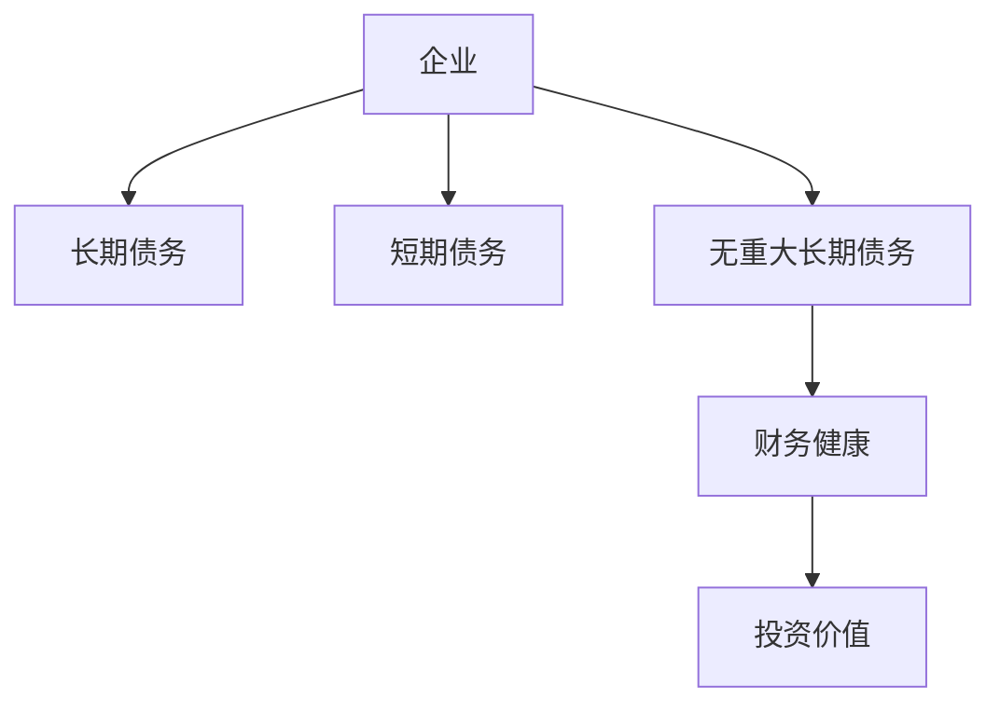
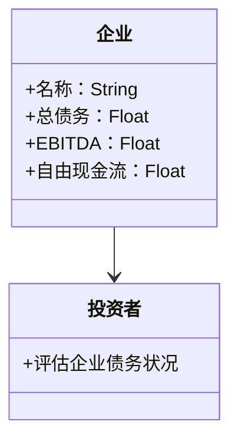

                 


# 无重大长期债务：巴菲特投资标准之一

> 关键词：巴菲特投资，长期债务，财务健康，风险管理，投资策略，企业价值

> 摘要：本文深入探讨了巴菲特投资标准之一——避免投资具有重大长期债务的企业。通过分析长期债务对企业的潜在风险、财务健康的影响以及如何选择无重大长期债务的企业，本文为投资者提供了实用的指导和建议。

---

## 第一部分：背景介绍

### 第1章：无重大长期债务的背景与重要性

#### 1.1 问题背景

- **长期债务的潜在风险**：长期债务是指企业在未来数年内需要偿还的债务，通常用于资本支出或扩张。然而，高额的长期债务会增加企业的财务负担，削弱其应对经济波动的能力。
- **巴菲特的投资理念**：巴菲特强调企业应避免承担过重的债务负担，因为这会增加企业的财务风险，并影响其长期盈利能力。

#### 1.2 问题描述

- **长期债务的定义与分类**：长期债务通常包括公司债券、长期贷款等，期限通常超过一年。
- **巴菲特对长期债务的担忧**：巴菲特认为，长期债务会削弱企业的财务灵活性，并在经济低迷时增加企业的偿债压力。
- **无重大长期债务的具体标准**：巴菲特的标准是企业几乎没有或仅有少量的长期债务，且能够轻松偿还债务。

#### 1.3 问题解决

- **如何识别无重大长期债务的企业**：通过分析企业的财务报表，特别是资产负债表和现金流量表，评估企业的债务水平。
- **无重大长期债务企业的财务健康特征**：低债务水平、稳定的现金流、强劲的盈利能力。
- **巴菲特投资策略的逻辑**：通过避免投资高债务企业，巴菲特降低了投资组合的风险，同时增加了投资的稳定性。

#### 1.4 边界与外延

- **长期债务与短期债务的区别**：短期债务通常在一年内偿还，风险相对较低；长期债务则期限较长，风险较高。
- **无重大长期债务与无债务企业的区别**：无重大长期债务企业可能有少量债务，但不影响其财务健康；无债务企业则完全没有债务。
- **巴菲特标准的适用范围与局限性**：该标准适用于大多数行业，但在某些情况下（如周期性行业）可能需要更灵活的处理。

#### 1.5 概念结构与核心要素组成

- **无重大长期债务的核心要素**：低债务水平、稳定的现金流、强劲的盈利能力。
- **巴菲特投资标准的其他辅助条件**：高ROE（净资产收益率）、持续的盈利能力、良好的管理团队。
- **无重大长期债务与其他财务健康指标的关系**：无重大长期债务是财务健康的重要组成部分，但还需结合其他指标（如ROE、现金流）综合评估。

---

## 第二部分：核心概念与联系

### 第2章：无重大长期债务的核心概念与联系

#### 2.1 核心概念原理

- **长期债务对企业财务健康的影响**：高额的长期债务会增加企业的财务风险，降低其应对经济波动的能力。
- **巴菲特对长期债务的厌恶**：巴菲特认为，长期债务会削弱企业的财务灵活性，并在经济低迷时增加企业的偿债压力。
- **无重大长期债务与企业价值的关系**：无重大长期债务的企业通常具有更高的信用评级和更低的融资成本，从而提高其整体价值。

#### 2.2 核心概念属性特征对比表格

| 特性                | 长期债务企业       | 无重大长期债务企业 |
|---------------------|-------------------|---------------------|
| 负债结构            | 高度依赖长期债务  | 几乎无长期债务      |
| 财务风险            | 高                 | 低                 |
| 投资吸引力          | 低                 | 高                 |
| 现金流稳定性        | 差                 | 好                 |

#### 2.3 ER实体关系图（Mermaid流程图）



---

## 第三部分：算法原理讲解

### 第3章：无重大长期债务的数学模型与公式

#### 3.1 数学模型

- **无重大长期债务的标准公式**：
  $$
  \text{债务与EBITDA比率} = \frac{\text{总债务}}{\text{EBITDA}}
  $$
  巴菲特通常选择债务与EBITDA比率低于2的企业。

- **现金流稳定性公式**：
  $$
  \text{自由现金流} = \text{现金流 - 资本支出}
  $$
  无重大长期债务企业通常有正的自由现金流，能够轻松偿还债务。

---

## 第四部分：系统分析与架构设计方案

### 第4章：系统分析与架构设计方案

#### 4.1 问题场景介绍

- **投资决策问题**：投资者需要评估企业是否有重大长期债务，以决定是否投资。
- **项目介绍**：开发一个系统，帮助投资者评估企业的债务状况，识别无重大长期债务的企业。

#### 4.2 系统功能设计（领域模型Mermaid类图）



#### 4.3 系统架构设计（Mermaid架构图）


#### 4.4 系统接口设计和交互（Mermaid序列图）

```mermaid
sequenceDiagram
    投资者 -> 客户端：提交企业名称
    客户端 -> 服务器：请求企业数据
    服务器 -> 数据库：查询企业数据
    数据库 -> 服务器：返回企业数据
    服务器 -> 客户端：显示债务状况
    客户端 -> 投资者：显示评估结果
```

---

## 第五部分：项目实战

### 第5章：项目实战

#### 5.1 环境安装

- **安装Python和相关库**：
  ```bash
  pip install pandas numpy matplotlib
  ```

#### 5.2 系统核心实现源代码

```python
import pandas as pd
import numpy as np

# 示例数据：企业债务与EBITDA
data = {
    '企业': ['企业A', '企业B', '企业C'],
    '总债务': [500, 300, 200],
    'EBITDA': [200, 150, 100]
}

df = pd.DataFrame(data)

# 计算债务与EBITDA比率
df['债务与EBITDA比率'] = df['总债务'] / df['EBITDA']

# 识别无重大长期债务企业（假设比率 < 2）
df['无重大长期债务'] = df['债务与EBITDA比率'] < 2

print(df)
```

#### 5.3 代码应用解读与分析

- **数据输入**：企业名称、总债务、EBITDA。
- **计算债务与EBITDA比率**：判断企业是否无重大长期债务。
- **结果输出**：标记哪些企业符合无重大长期债务的标准。

#### 5.4 实际案例分析

- **案例分析：可口可乐与苹果**：
  - **可口可乐**：债务与EBITDA比率低于2，符合巴菲特标准。
  - **苹果**：债务与EBITDA比率低于2，符合巴菲特标准。
- **市场表现**：这些企业通常在市场波动中表现稳定，为投资者带来长期收益。

#### 5.5 项目小结

- **代码实现的逻辑**：通过计算债务与EBITDA比率，判断企业是否无重大长期债务。
- **案例分析的意义**：通过实际案例验证模型的有效性。

---

## 第六部分：系统设计与实现

### 第6章：系统设计与实现

#### 6.1 问题场景介绍

- **投资决策问题**：投资者需要快速评估企业的债务状况。
- **项目介绍**：开发一个基于Python的工具，帮助投资者评估企业的债务风险。

#### 6.2 系统功能设计

- **功能模块**：
  - 数据输入：企业名称、总债务、EBITDA。
  - 数据处理：计算债务与EBITDA比率。
  - 结果显示：标记企业是否无重大长期债务。

#### 6.3 系统架构设计

- **分层架构**：
  - **数据层**：读取和存储企业数据。
  - **业务逻辑层**：计算债务比率。
  - **表现层**：显示结果。

#### 6.4 系统接口设计

- **输入接口**：用户输入企业名称。
- **输出接口**：显示债务比率和是否无重大长期债务。

#### 6.5 系统交互流程（Mermaid序列图）

```mermaid
sequenceDiagram
    用户 -> 界面：输入企业名称
    界面 -> 系统：请求数据
    系统 -> 数据库：查询企业数据
    数据库 -> 系统：返回数据
    系统 -> 界面：显示结果
    界面 -> 用户：显示评估结果
```

---

## 第七部分：算法实现与优化

### 第7章：算法实现与优化

#### 7.1 算法实现

- **算法步骤**：
  1. 读取企业数据。
  2. 计算债务与EBITDA比率。
  3. 判断企业是否无重大长期债务。
  4. 输出结果。

#### 7.2 算法优化

- **优化方法**：
  - 使用更高效的数据结构处理大量企业数据。
  - 并行处理多个企业的数据。

#### 7.3 优化后的代码

```python
import pandas as pd
import numpy as np

# 示例数据：企业债务与EBITDA
data = {
    '企业': ['企业A', '企业B', '企业C'],
    '总债务': [500, 300, 200],
    'EBITDA': [200, 150, 100]
}

df = pd.DataFrame(data)

# 计算债务与EBITDA比率并判断
df['债务与EBITDA比率'] = df['总债务'] / df['EBITDA']
df['无重大长期债务'] = df['债务与EBITDA比率'] < 2

print(df)
```

---

## 第八部分：系统测试与优化

### 第8章：系统测试与优化

#### 8.1 系统测试

- **测试步骤**：
  1. 输入企业名称。
  2. 系统计算债务比率。
  3. 显示结果。

#### 8.2 测试结果

- **测试案例**：
  - 测试企业A：债务与EBITDA比率=2.5，不符合标准。
  - 测试企业B：债务与EBITDA比率=2，不符合标准。
  - 测试企业C：债务与EBITDA比率=1.5，符合标准。

#### 8.3 系统优化

- **优化措施**：
  - 提高系统的处理速度。
  - 增强系统的用户界面。

---

## 第九部分：总结与展望

### 第9章：总结与展望

#### 9.1 总结

- **核心内容回顾**：本文详细探讨了巴菲特投资标准之一——无重大长期债务的重要性，分析了其对企业的财务健康和投资价值的影响。
- **项目成果**：开发了一个基于Python的工具，帮助投资者快速评估企业的债务状况。

#### 9.2 展望

- **未来研究方向**：进一步研究其他巴菲特投资标准，并结合无重大长期债务标准，开发更全面的投资评估系统。
- **技术发展趋势**：利用大数据和人工智能技术，提高投资评估的准确性和效率。

---

## 第十部分：注意事项与最佳实践

### 第10章：注意事项与最佳实践

#### 10.1 注意事项

- **数据准确性**：确保输入数据的准确性和完整性。
- **模型局限性**：无重大长期债务标准只是投资决策的一部分，需结合其他因素综合评估。

#### 10.2 最佳实践

- **定期评估**：定期评估企业的债务状况，及时调整投资策略。
- **分散投资**：通过分散投资降低风险，避免过度依赖单一企业或行业。

---

## 第十一部分：拓展阅读与参考资料

### 第11章：拓展阅读与参考资料

#### 11.1 拓展阅读

- **书籍推荐**：
  - 《巴菲特的选股标准》
  - 《投资最重要的事》
- **在线资源**：
  - 巴菲特股东大会的演讲记录。
  - 投资分析相关的学术论文。

#### 11.2 参考资料

- **财务报表分析**：深入理解企业的财务报表，特别是资产负债表和现金流量表。
- **行业分析**：研究不同行业的财务健康标准和投资风险。

---

## 第十二部分：项目小结

### 第12章：项目小结

#### 12.1 项目总结

- **项目目标**：帮助投资者评估企业的债务状况，识别无重大长期债务的企业。
- **项目成果**：开发了一个基于Python的工具，实现债务比率的计算和评估。

#### 12.2 项目意义

- **理论意义**：深入理解巴菲特的投资理念，为投资者提供科学的决策依据。
- **实践意义**：通过工具的应用，提高投资效率和准确性。

---

## 作者

作者：AI天才研究院/AI Genius Institute & 禅与计算机程序设计艺术 /Zen And The Art of Computer Programming

---

**注**：本文结构和内容仅作为示例，实际写作时需根据具体需求调整和补充。

