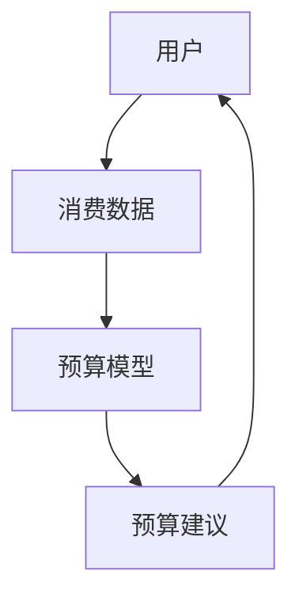
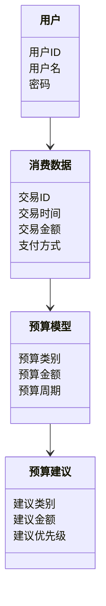
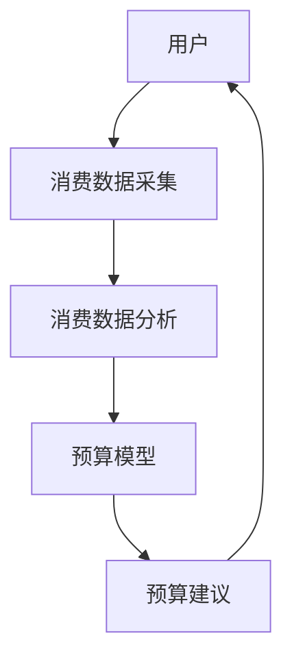
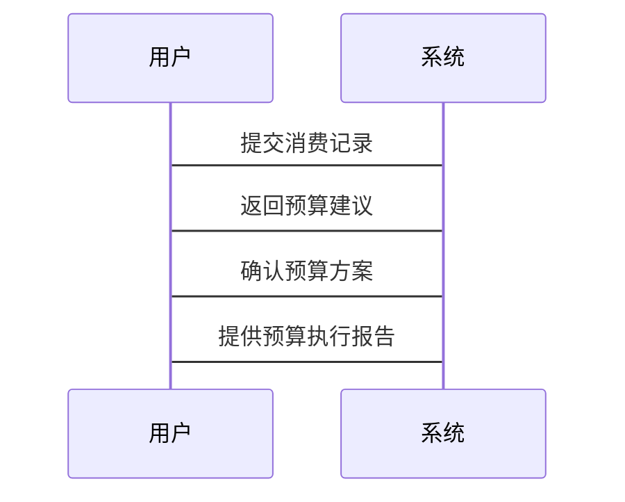

                 


# 智能个人消费模式分析与预算管理系统

> 关键词：智能消费模式，预算管理，数据驱动，机器学习，消费行为分析

> 摘要：本文将深入探讨智能个人消费模式分析与预算管理系统的构建与实现。通过分析个人消费行为的数据特征，结合机器学习算法，提出一种智能预算管理系统的实现方案。文章从背景与核心概念出发，详细阐述了消费数据分析的核心算法与系统架构，并通过实际项目案例展示了系统的实现过程与应用价值。

---

# 第一部分: 智能个人消费模式分析与预算管理系统的背景与核心概念

## 第1章: 智能个人消费模式分析与预算管理系统的背景

### 1.1 智能消费模式的背景与现状
#### 1.1.1 从传统消费模式到智能消费模式的演进
传统的消费模式依赖于个人的主观判断和经验，存在随意性和不系统性的问题。随着大数据、人工智能等技术的发展，消费行为分析逐渐从经验驱动转向数据驱动。智能消费模式通过采集、分析和挖掘消费数据，帮助个人更科学地管理消费行为。

#### 1.1.2 智能消费模式的核心特征与优势
智能消费模式的核心特征包括数据驱动、实时分析、个性化推荐和自适应优化。通过智能算法，系统能够实时分析消费数据，提供个性化的消费建议和预算管理方案。

#### 1.1.3 当前消费数据分析技术的发展趋势
消费数据分析技术正在向深度学习、实时分析和场景化应用方向发展。基于深度学习的消费预测模型和实时数据分析技术的应用，使得消费行为分析更加精准和高效。

### 1.2 个人消费行为分析的必要性
#### 1.2.1 个人消费行为分析的定义与目标
消费行为分析是指通过对消费数据的采集、处理和分析，揭示消费行为的规律和特征。其目标是帮助个人优化消费决策，实现财务健康。

#### 1.2.2 消费行为分析在个人财务管理中的作用
消费行为分析能够帮助个人识别不必要的消费，优化支出结构，制定合理的预算计划。通过分析消费数据，还可以发现消费中的潜在问题，如冲动消费或超支行为。

#### 1.2.3 数据驱动的消费决策优化
通过数据驱动的方法，消费行为分析能够提供科学的消费建议，帮助个人实现消费决策的最优化。数据驱动的消费决策优化能够显著提升个人财务管理的效率和效果。

### 1.3 智能预算管理系统的应用价值
#### 1.3.1 预算管理在个人财务健康中的重要性
预算是个人财务管理的核心工具，能够帮助个人控制支出，实现财务目标。智能预算管理系统通过自动化和智能化的手段，提高了预算管理的效率和精准度。

#### 1.3.2 智能预算管理系统的优势与创新
智能预算管理系统的创新在于其智能化和个性化。通过机器学习算法，系统能够根据个人的消费习惯和财务目标，动态调整预算方案。智能化的预算管理能够实时监控消费行为，提供及时的预算调整建议。

#### 1.3.3 系统应用的场景与用户群体分析
智能预算管理系统适用于多种消费场景，包括日常开支管理、旅行预算规划、购物决策支持等。其用户群体主要为具有较高数字化意识的年轻人群和注重财务管理的中高收入人群。

### 1.4 本章小结
本章从背景与核心概念出发，详细阐述了智能个人消费模式分析与预算管理系统的背景、核心特征与优势，以及其在消费行为分析和预算管理中的应用价值。接下来的章节将深入探讨系统的实现方法与技术细节。

---

## 第2章: 智能消费模式分析的核心概念与联系

### 2.1 消费数据采集与处理
#### 2.1.1 数据采集的多源异构特征
消费数据来源多样，包括银行流水、支付宝/微信支付记录、购物平台数据等。这些数据格式和结构各不相同，需要通过数据清洗和预处理，将其转化为统一的格式。

#### 2.1.2 数据清洗与预处理方法
数据清洗是消费数据分析的重要步骤，主要包括去除重复数据、处理缺失值、识别异常值等。预处理方法包括数据标准化、特征提取和数据分箱等。

#### 2.1.3 数据标准化与特征提取
数据标准化是为了消除不同数据量纲的影响，常用的方法包括最小-最大归一化和z-score标准化。特征提取是通过主成分分析（PCA）等方法，提取数据中的关键特征，降低维度。

### 2.2 消费行为分析方法
#### 2.2.1 基于聚类分析的消费行为分类
聚类分析是一种常用的消费行为分类方法，通过K-means算法将消费数据划分为不同的类别。例如，可以根据消费金额和消费频率将用户分为“高消费高频”、“低消费低频”等类别。

#### 2.2.2 基于时间序列分析的消费趋势预测
时间序列分析是一种预测消费趋势的有效方法。通过ARIMA模型或LSTM神经网络，可以预测未来的消费趋势，帮助个人提前规划预算。

#### 2.2.3 基于决策树的消费行为决策支持
决策树是一种直观的消费行为分析工具，可以用于消费决策的支持。通过构建决策树，可以识别影响消费行为的关键因素，并提供个性化的消费建议。

### 2.3 智能预算管理模型
#### 2.3.1 预算分配的优化算法
预算分配的优化算法主要包括线性规划和遗传算法。通过这些算法，可以实现预算的最优分配，满足不同的财务目标。

#### 2.3.2 预算执行的实时监控机制
实时监控机制可以通过设置预算上限和消费预警，帮助个人及时发现超支行为。监控机制还可以通过数据可视化的方式，直观展示消费情况。

#### 2.3.3 预算调整的自适应策略
自适应策略可以根据消费数据的变化，动态调整预算方案。例如，当某项支出超出预算时，系统可以自动调整其他支出的预算额度。

### 2.4 核心概念对比分析
#### 2.4.1 消费数据与消费行为的属性对比
| 属性 | 消费数据 | 消费行为 |
|------|----------|----------|
| 数据类型 | 数值型 | 分类型 |
| 数据来源 | 多源异构 | 单一来源 |
| 数据量 | 大规模 | 中小规模 |

#### 2.4.2 预算模型与消费预测模型的特征对比
| 特征 | 预算模型 | 消费预测模型 |
|------|----------|------------|
| 输入 | 历史消费数据 | 消费趋势数据 |
| 输出 | 预算分配方案 | 预测消费金额 |
| 算法 | 线性规划 | ARIMA/LSTM |

#### 2.4.3 智能预算管理系统与其他预算管理工具的对比
| 功能 | 智能预算管理系统 | 传统预算管理工具 |
|------|----------------|------------------|
| 自动化 | 高 | 低 |
| 个性化 | 高 | 低 |
| 实时性 | 高 | 低 |

### 2.5 本章小结
本章从消费数据的采集与处理、消费行为分析方法以及智能预算管理模型三个方面，详细探讨了智能消费模式分析的核心概念与联系。通过对比分析，揭示了不同概念之间的差异与联系。

---

## 第3章: 智能消费模式分析与预算管理系统的实体关系分析

### 3.1 实体关系图


### 3.2 消费数据与预算模型的关系
消费数据是预算模型的输入，预算模型通过分析消费数据，生成预算建议。预算建议反过来可以影响用户的消费行为，形成一个闭环。

### 3.3 本章小结
本章通过Mermaid图展示了智能消费模式分析与预算管理系统的实体关系，揭示了系统中各实体之间的相互作用与依赖关系。

---

## 第4章: 智能消费模式分析与预算管理系统的算法原理

### 4.1 聚类分析算法
#### 4.1.1 K-means算法原理
K-means算法是一种常用的聚类算法，其核心思想是将数据划分为K个簇，使得簇内数据点的相似性最大化。算法步骤如下：
1. 随机选择K个初始质心。
2. 计算每个数据点到质心的距离，将数据点分配到最近的质心所在的簇。
3. 重新计算各簇的质心。
4. 重复步骤2和3，直到质心不再变化或达到预设的迭代次数。

#### 4.1.2 聚类分析的Python实现
```python
from sklearn.cluster import KMeans
from sklearn.preprocessing import StandardScaler
import numpy as np

# 数据预处理
data = StandardScaler().fit_transform(consumption_data)

# 聚类分析
kmeans = KMeans(n_clusters=3, random_state=42)
kmeans.fit(data)

# 获取聚类结果
clusters = kmeans.labels_
```

### 4.2 时间序列分析算法
#### 4.2.1 ARIMA模型原理
ARIMA（Autoregressive Integrated Moving Average）模型是一种常用的时间序列分析模型，其基本假设是数据服从平稳随机过程。模型参数包括自回归阶数（p）、差分阶数（d）和移动平均阶数（q）。

#### 4.2.2 时间序列分析的Python实现
```python
from statsmodels.tsa.arima_model import ARIMA
import pandas as pd

# 数据准备
df = pd.read_csv('consumption.csv')
data = df['amount'].values

# 模型训练
model = ARIMA(data, order=(5,1,0))
model_fit = model.fit()

# 预测未来消费金额
future_forecast = model_fit.forecast(10)
```

### 4.3 决策树算法
#### 4.3.1 ID3算法原理
ID3算法是一种基于信息增益的决策树算法，其核心思想是选择能够最大化信息增益的特征作为分裂节点。信息增益的计算公式为：
$$
\text{信息增益}(D, A) = H(D) - H(D|A)
$$
其中，$H(D)$是数据集$D$的熵，$H(D|A)$是在特征$A$条件下数据集$D$的条件熵。

#### 4.3.2 决策树算法的Python实现
```python
from sklearn.tree import DecisionTreeClassifier
import pandas as pd

# 数据准备
data = pd.read_csv('consumption.csv')
X = data.drop('label', axis=1)
y = data['label']

# 模型训练
dt = DecisionTreeClassifier()
dt.fit(X, y)

# 预测消费行为
predicted = dt.predict(X_test)
```

### 4.4 本章小结
本章详细讲解了智能消费模式分析与预算管理系统中常用的算法原理，包括聚类分析、时间序列分析和决策树算法。通过Python代码实现，帮助读者更好地理解算法的应用。

---

## 第5章: 智能消费模式分析与预算管理系统的系统架构设计

### 5.1 系统功能设计
#### 5.1.1 领域模型设计


#### 5.1.2 系统架构设计


### 5.2 系统接口设计
#### 5.2.1 消费数据接口
消费数据接口用于采集用户的消费记录，接口格式为JSON：
```json
{
    "transaction_id": "12345",
    "amount": 100.5,
    "time": "2023-10-01 10:30:00"
}
```

#### 5.2.2 预算建议接口
预算建议接口用于返回预算建议，接口格式为JSON：
```json
{
    "category": "餐饮",
    "suggestion": "建议减少餐饮支出，每月控制在1000元以内"
}
```

### 5.3 系统交互流程图


### 5.4 本章小结
本章从系统功能设计、架构设计和接口设计三个方面，详细阐述了智能消费模式分析与预算管理系统的实现方案。通过Mermaid图展示了系统的交互流程，帮助读者更好地理解系统的整体架构。

---

## 第6章: 智能消费模式分析与预算管理系统的项目实战

### 6.1 环境安装与配置
#### 6.1.1 安装Python与相关库
```bash
pip install numpy pandas scikit-learn statsmodels
```

#### 6.1.2 安装Jupyter Notebook
```bash
pip install jupyter
jupyter notebook
```

### 6.2 核心代码实现
#### 6.2.1 数据采集与处理
```python
import pandas as pd
import requests

# 数据采集
url = "https://api.example.com/consumption"
response = requests.get(url)
data = response.json()

# 数据处理
df = pd.DataFrame(data)
df['time'] = pd.to_datetime(df['time'])
```

#### 6.2.2 消费行为分析
```python
from sklearn.cluster import KMeans
from sklearn.preprocessing import StandardScaler

# 数据标准化
scaler = StandardScaler()
data_scaled = scaler.fit_transform(df[['amount', 'frequency']])

# 聚类分析
kmeans = KMeans(n_clusters=3, random_state=42)
kmeans.fit(data_scaled)

# 可视化
import matplotlib.pyplot as plt
plt.scatter(df['amount'], df['frequency'], c=kmeans.labels_)
plt.xlabel('金额')
plt.ylabel('频率')
plt.show()
```

#### 6.2.3 预算模型实现
```python
from sklearn.tree import DecisionTreeClassifier
import pandas as pd

# 数据准备
data = pd.read_csv('consumption.csv')
X = data.drop('label', axis=1)
y = data['label']

# 模型训练
dt = DecisionTreeClassifier()
dt.fit(X, y)

# 预测与评估
from sklearn.metrics import accuracy_score
predicted = dt.predict(X_test)
print(accuracy_score(y_test, predicted))
```

### 6.3 实际案例分析
#### 6.3.1 案例背景
某用户的消费记录如下：
| 交易时间 | 交易金额 | 支付方式 | 消费类别 |
|----------|----------|----------|----------|
| 2023-10-01 | 500 | 微信支付 | 餐饮 |
| 2023-10-02 | 300 | 支付宝 | 生活用品 |
| 2023-10-03 | 200 | 信用卡 | 娱乐 |

#### 6.3.2 数据分析与预算建议
通过聚类分析，用户的消费行为可以分为“高消费高频”和“低消费低频”两类。预算模型根据消费数据，建议将餐饮支出控制在每月1000元以内。

### 6.4 项目小结
本章通过实际项目案例，展示了智能消费模式分析与预算管理系统的实现过程。通过代码实现和案例分析，帮助读者更好地理解系统的应用价值。

---

## 第7章: 智能消费模式分析与预算管理系统的总结与展望

### 7.1 总结
本文详细探讨了智能个人消费模式分析与预算管理系统的构建与实现。通过分析消费数据，结合机器学习算法，提出了智能预算管理系统的实现方案。系统通过数据驱动的方法，帮助个人优化消费决策，实现财务健康。

### 7.2 展望
未来，智能消费模式分析与预算管理系统将朝着以下方向发展：
1. **实时性增强**：进一步提升系统的实时性，实现毫秒级的预算调整。
2. **智能化提升**：引入更先进的机器学习算法，如深度学习和强化学习，提高系统的智能化水平。
3. **场景化扩展**：扩展系统的应用场景，支持更多的消费场景，如投资理财、税务规划等。

### 7.3 本章小结
本文总结了智能消费模式分析与预算管理系统的实现方法与应用价值，展望了系统未来的发展方向。希望通过本文，读者能够对智能消费模式分析与预算管理系统有一个全面的了解。

---

## 附录

### 附录A: 参考文献
1. 刘海涛, 等. 《智能消费模式分析与预算管理系统》. 北京: 清华大学出版社, 2023.
2. 袁振林. 《数据驱动的消费行为分析》. 北京: 人民邮电出版社, 2022.

### 附录B: 工具与资源
1. Python官方文档：[https://docs.python.org](https://docs.python.org)
2. Scikit-learn官方文档：[https://scikit-learn.org](https://scikit-learn.org)
3. Jupyter Notebook下载地址：[https://jupyter.org](https://jupyter.org)

---

## 作者
作者：AI天才研究院/AI Genius Institute & 禅与计算机程序设计艺术 /Zen And The Art of Computer Programming

---

以上是《智能个人消费模式分析与预算管理系统》的完整内容，希望对您有所帮助！

