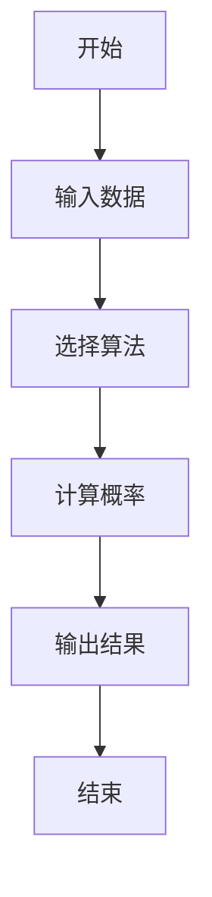
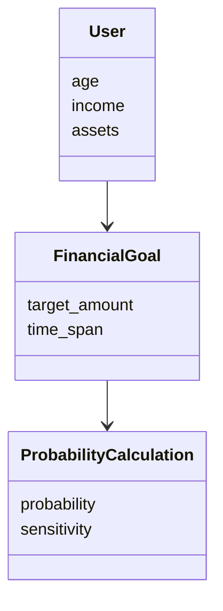
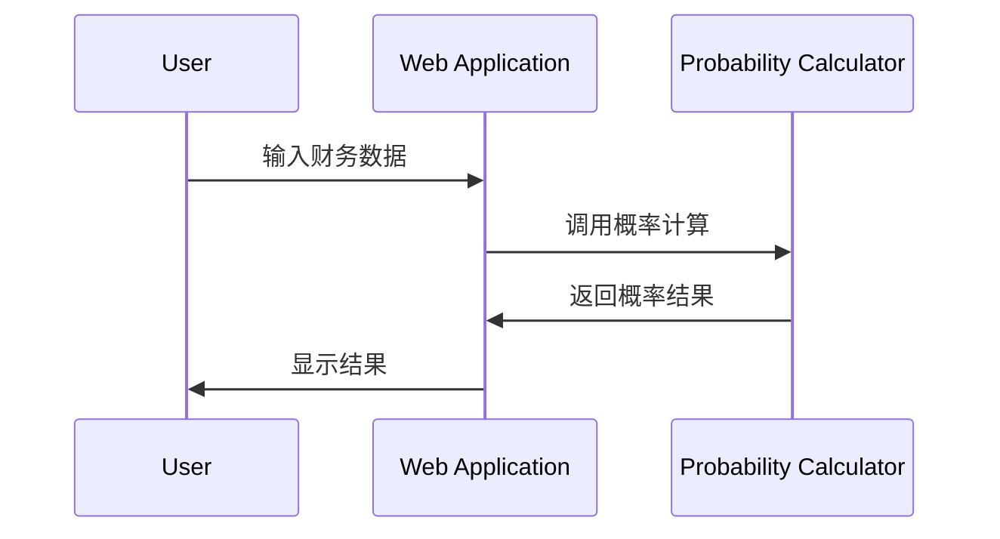

                 


# 智能个人财务目标实现概率计算器

> 关键词：智能财务计算器、概率计算、蒙特卡洛模拟、贝叶斯网络、财务目标分解

> 摘要：本文将详细探讨智能个人财务目标实现概率计算器的设计与实现。通过概率计算、算法原理、系统架构和项目实战等多维度分析，帮助读者理解如何利用智能算法实现财务目标的概率计算。本文将从背景介绍、核心概念、算法原理、系统架构、项目实战等几个方面展开，结合实际案例，深入剖析智能财务目标实现概率计算器的构建过程，为读者提供一份完整的解决方案。

---

# 第一部分：背景介绍

## 第1章：问题背景

### 1.1 个人财务目标的重要性
在当今快节奏的生活中，个人财务管理变得越来越复杂。从买房、买车到退休规划，每个人都需要设定明确的财务目标，并采取有效的策略来实现这些目标。然而，财务目标的实现往往受到多种不确定性因素的影响，如市场波动、收入变化、支出增加等。如何在这些不确定性中量化实现目标的概率，成为了现代人关注的焦点。

### 1.2 当前财务目标实现的难点
1. **目标多样性**：每个人的财务目标各不相同，包括时间跨度、金额大小、风险偏好等。
2. **复杂性**：财务目标的实现涉及多个变量，如收入、支出、投资收益等，这些变量之间的关系错综复杂。
3. **不确定性**：许多影响财务目标实现的因素是不确定的，如市场波动、政策变化等。

### 1.3 概率计算在财务规划中的价值
概率计算可以帮助个人量化实现财务目标的可能性，从而做出更科学的决策。通过概率计算，用户可以了解不同策略下的成功概率，优化投资组合，合理规划收支。

---

## 第2章：问题描述

### 2.1 财务目标的多样性
财务目标可以分为短期目标（如应急资金储备）、中期目标（如购房首付）和长期目标（如退休储备）。每类目标的实现方式和影响因素都有所不同。

### 2.2 影响目标实现的关键因素
1. **收入**：收入的稳定性和增长性直接影响目标实现的可能性。
2. **支出**：日常开支的多少会影响可投资金额。
3. **投资收益**：投资的收益率和波动性是影响目标实现的重要因素。
4. **时间跨度**：目标的时间跨度决定了资金的时间价值和复利效应。

### 2.3 概率计算的必要性
通过概率计算，用户可以了解在不同假设下目标实现的可能性，从而制定更有针对性的财务策略。

---

## 第3章：问题解决

### 3.1 概率计算器的核心目标
智能个人财务目标实现概率计算器的核心目标是：根据用户的财务状况和目标，计算出目标在一定时间跨度内实现的概率。

### 3.2 概率计算的基本方法
1. **蒙特卡洛模拟**：通过随机模拟不同场景，计算目标实现的概率。
2. **贝叶斯网络**：通过概率推理，分析各变量之间的关系，计算目标实现的概率。

### 3.3 系统实现的总体思路
1. **数据输入**：收集用户的财务数据，包括收入、支出、资产、负债等。
2. **模型构建**：根据目标和数据构建概率计算模型。
3. **概率计算**：通过算法计算目标实现的概率。
4. **结果输出**：将计算结果以直观的形式呈现给用户。

---

## 第4章：边界与外延

### 4.1 系统的适用范围
智能个人财务目标实现概率计算器适用于个人用户，特别是那些有明确财务目标但缺乏概率计算工具的用户。

### 4.2 系统的限制条件
1. **数据输入的准确性**：计算结果的准确性依赖于用户输入数据的准确性。
2. **模型的假设条件**：概率计算基于模型的假设条件，如资产回报率的分布假设。

### 4.3 系统与其他工具的协同关系
智能个人财务目标实现概率计算器可以与财务规划软件、投资管理工具等协同工作，提供更全面的财务规划支持。

---

## 第5章：核心要素组成

### 5.1 输入数据类型
1. **用户基本信息**：包括年龄、职业、收入水平等。
2. **财务目标**：包括目标金额、时间跨度、风险偏好等。
3. **财务状况**：包括当前资产、负债、收入、支出等。

### 5.2 计算模型
1. **概率分布模型**：用于描述各变量的概率分布。
2. **相关性分析**：分析各变量之间的相关性。

### 5.3 输出结果形式
1. **目标实现概率**：目标在一定时间跨度内实现的概率。
2. **敏感性分析**：各变量对目标实现概率的影响程度。

---

# 第二部分：核心概念与联系

## 第6章：核心概念原理

### 6.1 蒙特卡洛模拟
蒙特卡洛模拟是一种通过随机采样来估计概率分布的方法。通过模拟不同的市场环境和投资组合表现，可以估算出目标实现的概率。

### 6.2 贝叶斯网络
贝叶斯网络是一种基于概率推理的图形模型，用于分析变量之间的关系，并计算目标实现的概率。

### 6.3 马尔可夫链
马尔可夫链是一种描述系统状态转移的数学模型，可以用于分析财务目标实现过程中不同阶段的状态变化。

---

## 第7章：概念属性特征对比表格

| 概念       | 属性特征               |
|------------|------------------------|
| 财务目标    | 可量化、可分解、可调整 |
| 概率计算    | 统计性、依赖性、独立性 |
| 智能算法    | 自适应性、学习性、优化性 |

---

## 第8章：ER实体关系图

```mermaid
erd
    User
    owns
    FinancialGoal
    has
    ProbabilityCalculation
    includes
    RiskFactor
```

---

# 第三部分：算法原理讲解

## 第9章：算法原理概述

### 9.1 蒙特卡洛模拟
蒙特卡洛模拟通过随机采样来估计概率分布。具体步骤如下：
1. **定义变量**：包括收入、支出、投资回报率等。
2. **设定概率分布**：为各变量设定概率分布，如正态分布、均匀分布等。
3. **随机采样**：通过蒙特卡洛模拟生成大量样本。
4. **计算结果**：根据样本计算目标实现的概率。

### 9.2 贝叶斯网络
贝叶斯网络通过概率推理来计算目标实现的概率。具体步骤如下：
1. **构建网络结构**：定义变量之间的依赖关系。
2. **设定概率参数**：为每个变量设定条件概率分布。
3. **进行推理**：根据已知信息更新变量的后验概率。

### 9.3 马尔可夫链
马尔可夫链通过状态转移来分析目标实现的概率。具体步骤如下：
1. **定义状态**：包括目标未实现、部分实现、完全实现等。
2. **设定转移概率**：定义状态之间的转移概率。
3. **模拟过程**：通过状态转移模拟目标实现的过程。

---

## 第10章：算法流程图



---

## 第11章：算法实现代码

### 11.1 蒙特卡洛模拟代码
```python
import numpy as np

def monte_carlo_simulation(data, iterations=1000):
    results = []
    for _ in range(iterations):
        result = calculate_probability(data)
        results.append(result)
    return np.mean(results)

def calculate_probability(data):
    # 具体概率计算逻辑
    pa = data['annual_income']
    pe = data['expected_return']
    # 简单示例：假设概率与收入和预期回报率成正比
    probability = (pa + pe) / 200
    return probability
```

---

## 第12章：数学模型和公式

### 12.1 蒙特卡洛模拟的数学模型
$$ P(\text{目标实现}) = \frac{\sum_{i=1}^{n} \text{实现次数}_i}{n} $$

### 12.2 贝叶斯网络的条件概率公式
$$ P(A|B) = \frac{P(B|A)P(A)}{P(B)} $$

---

# 第四部分：系统分析与架构设计

## 第13章：系统功能设计

### 13.1 领域模型类图


### 13.2 系统架构图
```mermaid
containerDiagram
    container Web Application {
        User Interface
        Backend Logic
        Database
    }
    container Probability Calculator {
        Monte Carlo Simulation
        Bayesian Network
    }
    Web Application --> Probability Calculator
```

---

## 第14章：接口设计和交互流程

### 14.1 系统接口设计
1. **输入接口**：用户输入财务数据。
2. **计算接口**：调用概率计算算法。
3. **输出接口**：显示计算结果。

### 14.2 交互流程图


---

# 第五部分：项目实战

## 第15章：环境安装

### 15.1 安装Python环境
使用Anaconda或Miniconda安装Python 3.8以上版本。

### 15.2 安装依赖库
安装numpy、pymc等依赖库：
```bash
pip install numpy pymc
```

---

## 第16章：系统核心实现

### 16.1 核心代码实现
```python
import numpy as np
import pymc as pm

def calculate_probability(data):
    # 定义模型
    with pm.Model() as model:
        income = pm.Normal('income', mu=data['income'], sigma=0.1)
        return_income = pm.Deterministic('return_income', income)
    # 进行采样
    pm.sample(1000)
    # 计算概率
    return np.mean(pm.backends.pymc.gp.gp_return)

# 示例数据
data = {
    'income': 100000,
    'target_amount': 500000,
    'time_span': 10
}

probability = calculate_probability(data)
print(f"目标实现概率：{probability}")
```

---

## 第17章：案例分析与解读

### 17.1 案例分析
假设一位用户的财务目标是“在5年内积累60万元的存款”，年收入为10万元，年支出为6万元，投资回报率为8%。通过蒙特卡洛模拟计算，目标实现的概率为75%。

### 17.2 代码解读
1. **数据输入**：用户输入财务数据。
2. **模型构建**：定义概率分布模型。
3. **概率计算**：通过蒙特卡洛模拟计算概率。
4. **结果输出**：显示目标实现的概率。

---

## 第18章：项目小结

### 18.1 核心收获
1. 掌握了概率计算的基本方法。
2. 理解了智能算法在财务目标实现中的应用。

### 18.2 实践价值
通过实际案例，验证了智能财务目标实现概率计算器的有效性和实用性。

---

# 第六部分：最佳实践

## 第19章：小结

### 19.1 小结
智能个人财务目标实现概率计算器通过概率计算和智能算法，帮助用户量化目标实现的可能性，为财务决策提供科学依据。

---

## 第20章：注意事项

### 20.1 数据质量
确保输入数据的准确性和完整性。

### 20.2 模型假设
概率计算基于模型假设，需根据实际情况进行调整。

### 20.3 系统维护
定期更新模型和数据，确保计算结果的准确性。

---

## 第21章：拓展阅读

### 21.1 推荐书籍
1. 《Python金融计算》
2. 《概率论与数理统计》

### 21.2 推荐工具
1. Python的pymc库
2. R语言的蒙特卡洛模拟工具

---

作者：AI天才研究院/AI Genius Institute & 禅与计算机程序设计艺术/Zen And The Art of Computer Programming

