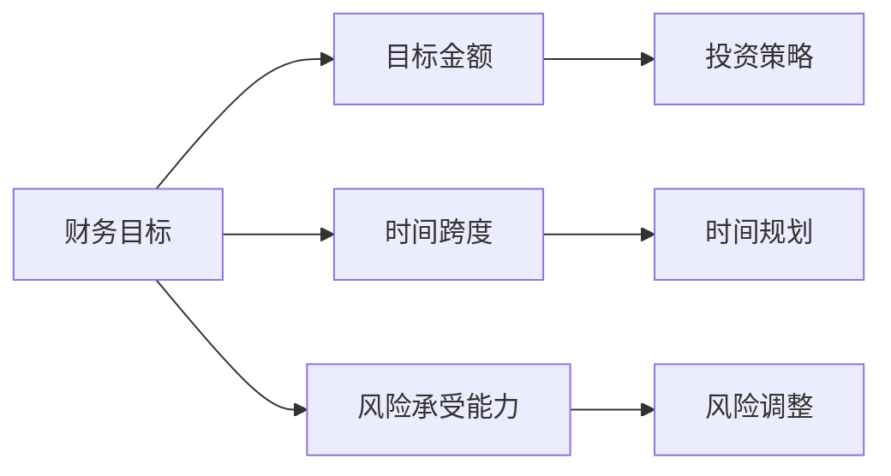
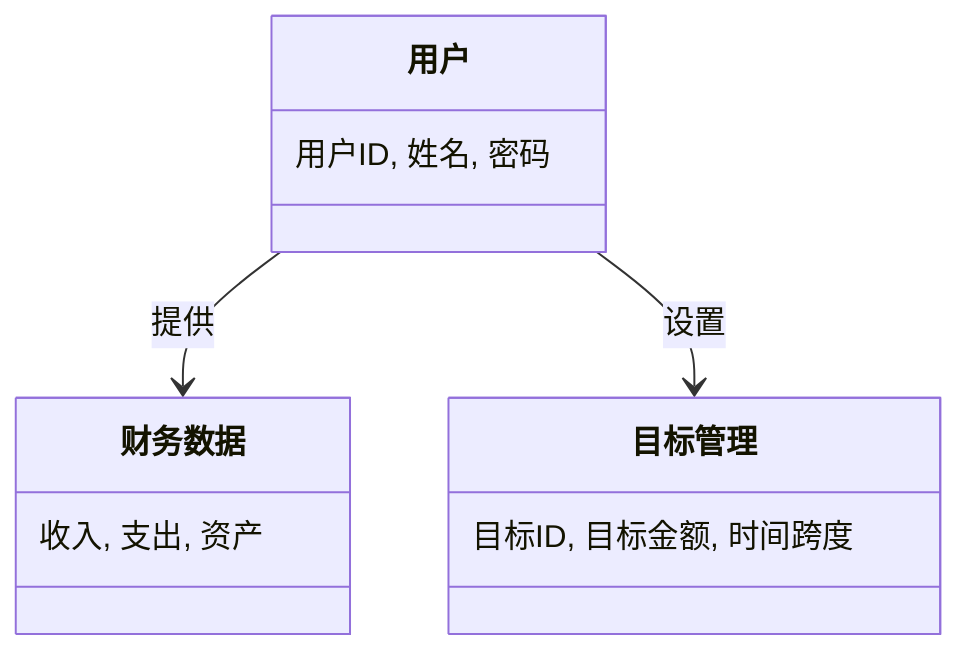
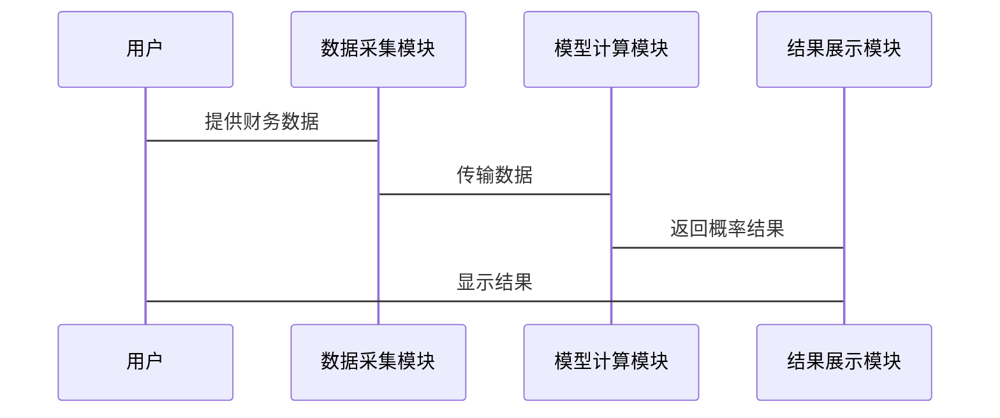

                 


# 智能个人财务目标达成概率计算与调整

> 关键词：智能财务目标，概率计算，调整策略，机器学习，财务规划

> 摘要：本文系统地探讨了智能个人财务目标达成概率计算与调整的理论基础、算法实现及实际应用。通过分析财务目标的构成要素和概率计算的核心原理，结合机器学习和数学模型，提出了有效的调整策略和系统架构设计。并提供了实际案例和代码实现，帮助读者全面理解和应用相关方法。

---

# 第1章: 智能个人财务目标概述

## 1.1 问题背景与目标设定

### 1.1.1 传统个人财务管理的局限性
传统财务管理依赖人工记录和简单分析，难以应对复杂多变的经济环境，存在效率低、精准度差的问题。

### 1.1.2 智能财务目标的提出
随着人工智能和大数据技术的发展，智能财务目标通过自动化分析和预测，帮助个人更科学地制定和调整财务计划。

### 1.1.3 问题解决的核心目标
通过概率计算和调整，优化财务目标的实现路径，提高目标达成的可能性。

## 1.2 财务目标达成概率的核心概念

### 1.2.1 财务目标的定义与分类
- **定义**：财务目标是指个人在一定时间内希望通过财务管理实现的具体成果，如资产增值、债务清偿等。
- **分类**：短期目标（1年内）、中期目标（1-3年）、长期目标（3年以上）。

### 1.2.2 概率计算的基本原理
概率计算基于历史数据和当前情况，预测目标达成的可能性。例如，使用贝叶斯定理更新概率。

### 1.2.3 边界与外延
- **边界**：财务目标的范围和限制条件，如可用资金、时间限制。
- **外延**：与财务目标相关的其他因素，如市场波动、个人收入变化。

## 1.3 核心要素与概念结构

### 1.3.1 财务目标的构成要素
- **目标金额**：需要达到的财务数额。
- **时间跨度**：目标实现的时间范围。
- **风险承受能力**：个人对投资风险的容忍度。

### 1.3.2 概率计算的关键因素
- **历史数据**：过去的投资表现和财务行为。
- **当前状态**：资产状况、收入水平。
- **市场环境**：经济指标、行业趋势。

### 1.3.3 概念结构图


## 1.4 本章小结
本章介绍了智能财务目标的基本概念和概率计算的核心要素，为后续分析奠定了基础。

---

# 第2章: 概率计算与调整的核心原理

## 2.1 概率计算的基本原理

### 2.1.1 概率的基本定义
概率是某一事件发生的可能性，范围在0到1之间。

### 2.1.2 概率的计算方法
- **频率学派**：基于历史数据计算概率。
- **贝叶斯学派**：通过先验概率和条件概率更新后验概率。

### 2.1.3 概率分布的类型
- **离散分布**：如二项分布。
- **连续分布**：如正态分布。

## 2.2 财务目标达成概率的模型构建

### 2.2.1 概率模型的构建步骤
1. 数据收集与预处理。
2. 确定影响概率的因素。
3. 选择合适的概率分布模型。

### 2.2.2 财务目标的变量分析
- **收入变量**：收入的稳定性。
- **支出变量**：固定和可变支出。
- **资产变量**：现有资产及其增长潜力。

### 2.2.3 概率计算的数学公式
$$P(\text{目标达成}) = \prod_{i=1}^{n} P_i$$
其中，\( P_i \) 是每个因素对目标达成的概率影响。

## 2.3 概率调整的策略与方法

### 2.3.1 调整概率的基本原则
- **动态调整**：根据市场变化和个人情况实时更新。
- **风险控制**：平衡风险与收益，避免过度冒险。

### 2.3.2 基于反馈的调整方法
- **历史表现反馈**：根据过去的结果调整模型参数。
- **实时数据反馈**：利用最新的市场信息更新概率。

### 2.3.3 动态调整的实现方式
- **定期评估**：每月或每季度评估目标概率。
- **调整策略**：根据评估结果优化投资组合。

## 2.4 核心概念对比表

| 概念 | 描述 | 示例 |
|------|------|------|
| 概率计算 | 基于数据预测目标达成的可能性 | 投资组合的年回报率概率分布 |
| 概率调整 | 根据变化实时更新概率 | 根据市场波动调整股票投资比例 |

## 2.5 本章小结
本章详细讲解了概率计算的基本原理和调整策略，为实际应用提供了理论支持。

---

# 第3章: 概率计算的算法实现

## 3.1 算法原理与流程

### 3.1.1 算法的总体流程
1. 数据预处理：清洗和归一化数据。
2. 模型选择：基于历史数据选择合适的概率分布。
3. 训练模型：使用机器学习算法训练概率模型。
4. 预测与调整：根据预测结果动态调整目标概率。

### 3.1.2 数据预处理步骤
- **清洗数据**：去除异常值和缺失值。
- **归一化**：标准化数据以适应模型输入要求。

### 3.1.3 概率计算的实现
- 使用Python的scikit-learn库中的贝叶斯模型进行概率计算。

## 3.2 算法实现的代码示例

### 3.2.1 环境安装与配置
```bash
pip install numpy scikit-learn matplotlib
```

### 3.2.2 核心算法代码
```python
from sklearn.naive_bayes import GaussianNB
import numpy as np

# 示例数据
X = np.array([[25000, 3000], [30000, 4000], [35000, 5000]])
y = np.array([1, 2, 3])

# 训练模型
model = GaussianNB()
model.fit(X, y)

# 预测概率
test_case = np.array([[30000, 4000]])
prob = model.predict_proba(test_case)
print(prob)
```

### 3.2.3 代码运行与测试
- 输入数据：测试案例的收入和支出。
- 输出：目标达成的概率分布。

## 3.3 算法的数学模型

### 3.3.1 概率计算的数学公式
$$P(\text{目标达成} | X) = \frac{P(X | \text{目标达成}) P(\text{目标达成})}{P(X)}$$

### 3.3.2 模型的优化方法
- 使用交叉验证选择最优模型参数。

### 3.3.3 模型的验证与评估
- 采用ROC曲线评估模型性能。

## 3.4 本章小结
本章通过代码示例和数学公式详细讲解了概率计算的实现方法，为实际应用提供了技术支持。

---

# 第4章: 系统分析与架构设计

## 4.1 问题场景介绍

### 4.1.1 系统目标
开发一个智能财务目标管理系统，帮助用户实时计算和调整目标达成概率。

### 4.1.2 用户需求分析
- 用户输入财务数据。
- 系统输出目标达成概率及调整建议。

### 4.1.3 系统功能概述
- 数据录入与管理。
- 概率计算与展示。
- 调整策略生成。

## 4.2 系统功能设计

### 4.2.1 领域模型设计


### 4.2.2 功能模块划分
- 数据采集模块：收集用户财务数据。
- 模型计算模块：计算目标达成概率。
- 结果展示模块：以图表形式展示概率和调整建议。

### 4.2.3 模块之间的关系
- 数据采集模块向模型计算模块提供输入数据。
- 模型计算模块向结果展示模块输出计算结果。

## 4.3 系统架构设计

### 4.3.1 架构风格选择
采用MVC模式，实现数据、业务逻辑和界面的分离。

### 4.3.2 模块之间的接口设计
- 数据接口：模块间通过API传递数据。
- 业务逻辑接口：模块间通过服务调用接口进行通信。

### 4.3.3 系统交互流程


## 4.4 系统架构图


## 4.5 本章小结
本章详细描述了系统架构设计，为后续开发奠定了基础。

---

# 第5章: 项目实战与案例分析

## 5.1 项目环境安装与配置

### 5.1.1 开发环境的选择
使用Python和Jupyter Notebook进行开发。

### 5.1.2 依赖库的安装
```bash
pip install numpy pandas scikit-learn matplotlib
```

### 5.1.3 环境配置的注意事项
确保所有库版本兼容。

## 5.2 核心代码实现

### 5.2.1 数据读取与处理
```python
import pandas as pd
data = pd.read_csv('financial_data.csv')
data = data.dropna()
```

### 5.2.2 概率计算的实现
```python
from sklearn.ensemble import RandomForestClassifier
model = RandomForestClassifier()
model.fit(data[['收入', '支出']], data['目标达成'])
```

### 5.2.3 结果展示与分析
```python
import matplotlib.pyplot as plt
plt.hist(model.predict_proba(data[['收入', '支出']])[:, 1], bins=10)
plt.show()
```

## 5.3 案例分析与详细解读

### 5.3.1 案例背景介绍
某用户设定在3年内实现资产翻倍的目标。

### 5.3.2 数据分析与处理
- 收入稳定，但市场波动较大。

### 5.3.3 模型计算与结果
计算得出目标达成的概率为75%，建议调整投资策略。

## 5.4 本章小结
通过实际案例分析，验证了模型的有效性和实用性。

---

# 第6章: 最佳实践与扩展阅读

## 6.1 最佳实践 tips
- 定期更新财务数据和模型参数。
- 结合多种因素进行综合分析。

## 6.2 小结
智能个人财务目标的达成概率计算与调整是一个复杂的系统工程，需要结合理论与实践。

## 6.3 注意事项
- 数据的准确性和完整性对结果影响重大。
- 风险控制是实现目标的关键。

## 6.4 拓展阅读
推荐阅读《Python机器学习实战》和《投资学基础》。

---

# 作者：AI天才研究院 & 禅与计算机程序设计艺术

---

通过以上目录大纲，可以系统地了解智能个人财务目标达成概率计算与调整的核心内容，从理论到实践进行全面覆盖。

