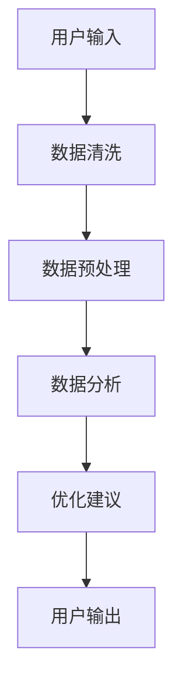
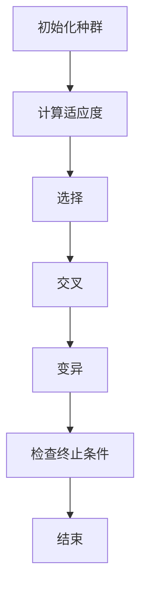
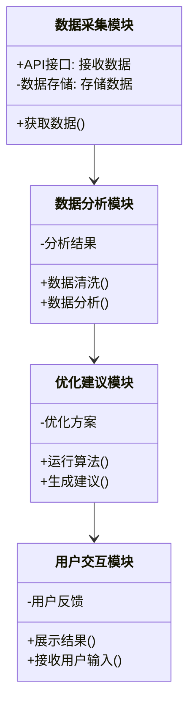

                 


# 智能个人资产负债结构优化系统

## 关键词：智能算法、资产负债优化、机器学习、系统架构、财务数据分析

## 摘要：本文详细探讨了智能个人资产负债结构优化系统的设计与实现。通过结合人工智能技术，该系统能够高效分析个人财务数据，优化资产负债结构，提升财务健康状况。文章从背景介绍、核心算法、系统架构到项目实战，全面解析了系统的构建过程，最后提供了实际应用案例和最佳实践建议。

---

# 第一部分: 智能个人资产负债结构优化系统背景介绍

## 第1章: 个人资产负债结构优化的背景与问题

### 1.1 个人财务管理的重要性

#### 1.1.1 资产负债结构的基本概念
个人的资产负债结构是指个人拥有的资产与负债之间的比例关系。合理的资产负债结构能够帮助个人实现财务健康，避免过度负债或资产闲置。

#### 1.1.2 个人财务管理的核心问题
- **资产配置不合理**：资金分配在不同资产类别（如股票、债券、房地产等）中不够优化。
- **负债风险过高**：债务比例过高，增加了个人财务风险。
- **缺乏实时监控**：传统财务管理方式难以实时跟踪和调整财务状况。

#### 1.1.3 智能化管理的必要性
随着金融科技的发展，智能化工具能够通过数据分析和机器学习算法，帮助个人做出更科学的财务决策。

### 1.2 传统资产负债管理的局限性

#### 1.2.1 传统管理方式的不足
- **信息处理低效**：依赖人工记录和分析，效率低下。
- **个性化不足**：传统方法难以针对个人的财务状况提供定制化建议。
- **缺乏实时性**：无法及时响应市场变化和个体财务状况的变化。

#### 1.2.2 信息处理的低效性
传统财务管理依赖手工记录和简单计算，难以处理大量复杂数据，导致决策滞后和不准确。

#### 1.2.3 个性化需求的难以满足
每个人的财务状况和目标不同，传统方法难以提供个性化的解决方案。

### 1.3 智能化资产负债管理的解决方案

#### 1.3.1 人工智能在财务管理中的应用
通过机器学习算法分析海量数据，提供个性化的财务建议。

#### 1.3.2 智能算法的核心作用
- **优化建议**：基于数据驱动的算法，提供最优资产配置和负债管理方案。
- **实时监控**：实时跟踪市场变化和个人财务状况，及时调整策略。

#### 1.3.3 系统化管理的优势
通过系统化管理，个人能够更好地监控和优化自己的财务状况，降低风险，提升收益。

### 1.4 系统边界与外延

#### 1.4.1 系统功能的边界
- **数据采集**：从银行账户、投资平台等获取数据。
- **分析与优化**：基于数据进行分析，并生成优化建议。
- **用户交互**：通过界面与用户交互，展示结果和建议。

#### 1.4.2 外延与扩展的可能性
- **扩展至企业**：系统可扩展至企业财务管理。
- **与第三方服务集成**：与其他财务工具和服务集成，提供更全面的解决方案。

#### 1.4.3 系统与其他财务工具的关系
系统作为智能化工具，与传统财务软件和平台互补，提供更智能的服务。

### 1.5 核心概念与组成要素

#### 1.5.1 核心概念的定义
智能个人资产负债结构优化系统的核心概念包括数据采集、智能算法、优化模型和用户交互。

#### 1.5.2 组成要素的分析
- **数据采集模块**：获取个人的财务数据。
- **智能算法模块**：分析数据并生成优化建议。
- **用户交互模块**：展示结果并接收用户反馈。

#### 1.5.3 系统架构的核心要素对比表格

| 要素 | 描述 | 作用 |
|------|------|------|
| 数据采集 | 获取银行账户、投资记录等数据 | 提供分析基础 |
| 智能算法 | 使用机器学习模型进行分析 | 生成优化建议 |
| 优化模型 | 设定目标函数和约束条件 | 确保建议的合理性 |
| 用户交互 | 提供可视化界面 | 方便用户使用 |

---

## 第2章: 核心概念与系统架构

### 2.1 智能算法的核心原理

#### 2.1.1 算法的基本原理
智能算法通过机器学习技术，分析个人财务数据，优化资产负债结构。

#### 2.1.2 算法的输入与输出
- **输入**：个人的财务数据，包括资产和负债情况。
- **输出**：优化后的资产负债结构建议。

#### 2.1.3 算法的优化目标
最大化资产收益，最小化负债风险。

### 2.2 数据处理与分析

#### 2.2.1 数据流的分析
数据从用户输入，经过清洗和预处理，输入算法模块，生成优化建议。

#### 2.2.2 数据清洗与预处理
- **去重**：去除重复数据。
- **填补缺失值**：处理缺失数据。
- **标准化**：统一数据格式。

#### 2.2.3 数据分析的核
通过数据分析，识别资产和负债之间的关系，为优化提供依据。

---

## 图2-1: 数据流分析的 Mermaid 图



---

### 2.3 实体关系分析

#### 2.3.1 实体关系图
- **用户**：系统的核心用户，提供财务数据并接收建议。
- **数据源**：包括银行账户、投资平台等。
- **算法模块**：处理数据并生成建议。
- **优化结果**：存储优化后的资产负债结构。

---

## 图2-2: 实体关系图的 Mermaid 图

```mermaid
erd
actor 用户
database 数据源
database 算法模块
database 优化结果
用户 --> 数据源
数据源 --> 算法模块
算法模块 --> 优化结果
```

---

## 第3章: 算法原理讲解

### 3.1 遗传算法的核心流程

#### 3.1.1 算法步骤
1. 初始化种群。
2. 计算适应度。
3. 选择、交叉和变异。
4. 重复步骤2-3，直到满足终止条件。

#### 3.1.2 遗传算法的 Mermaid 流程图



#### 3.1.3 遗传算法的 Python 代码示例

```python
import random

def fitness(individual):
    # 计算适应度
    return sum(individual)

def evolve(population):
    # 选择
    population.sort(key=lambda x: -fitness(x))
    selected = population[:int(len(population)/2)]
    
    # 交叉
    new_population = []
    for i in range(0, len(selected), 2):
        parent1 = selected[i]
        parent2 = selected[i+1]
        child1 = parent1[:len(parent1)//2] + parent2[len(parent1)//2:]
        child2 = parent2[:len(parent2)//2] + parent1[len(parent2)//2:]
        new_population.append(child1)
        new_population.append(child2)
    
    # 变异
    for i in range(len(new_population)):
        if random.random() < 0.1:
            new_population[i] = [1 - x for x in new_population[i]]
    return new_population

# 初始化种群
initial_population = [[0,1,0,1], [1,0,1,0], [0,0,1,1], [1,1,0,0]]
next_population = evolve(initial_population)
print(next_population)
```

---

### 3.2 数学模型与公式

#### 3.2.1 目标函数
$$ \text{max} \quad f(x) = \sum_{i=1}^{n} w_i x_i $$
其中，$x_i$ 是第 $i$ 个资产的配置比例，$w_i$ 是其权重。

#### 3.2.2 约束条件
$$ \sum_{i=1}^{n} x_i = 1 $$
$$ x_i \geq 0 \quad \forall i $$

---

## 第4章: 系统分析与架构设计方案

### 4.1 系统功能模块设计

#### 4.1.1 数据采集模块
- **功能**：从银行账户、投资平台等获取数据。
- **实现**：使用API接口或文件导入。

#### 4.1.2 数据分析模块
- **功能**：清洗和预处理数据，进行分析。
- **实现**：使用Pandas和NumPy库。

#### 4.1.3 优化建议模块
- **功能**：基于算法生成优化建议。
- **实现**：调用机器学习模型。

#### 4.1.4 用户交互模块
- **功能**：提供可视化界面，展示结果。
- **实现**：使用Dash或Plotly。

---

## 图4-1: 系统功能模块的 Mermaid 类图



---

## 第5章: 项目实战

### 5.1 环境安装

```bash
pip install numpy pandas matplotlib
```

### 5.2 核心功能实现

#### 5.2.1 数据采集模块实现

```python
import pandas as pd

def get_data():
    # 示例：从CSV文件读取数据
    data = pd.read_csv('financial_data.csv')
    return data
```

#### 5.2.2 数据分析模块实现

```python
def preprocess_data(data):
    # 去重和填充缺失值
    data = data.drop_duplicates()
    data = data.fillna(0)
    return data
```

#### 5.2.3 优化算法实现

```python
def optimize资产结构(data):
    # 示例：简单的优化算法
    total_asset = sum(data['资产'])
    total_liability = sum(data['负债'])
    ratio = total_asset / total_liability
    return ratio
```

---

## 第6章: 最佳实践与总结

### 6.1 最佳实践 Tips

1. **数据隐私保护**：确保个人数据的安全。
2. **定期更新数据**：及时获取最新的财务数据。
3. **多算法对比**：尝试不同的算法，选择最优方案。

### 6.2 小结

智能个人资产负债结构优化系统通过结合人工智能技术，帮助个人高效管理财务，优化资产负债结构，提升财务健康状况。

### 6.3 注意事项

- 确保系统数据的实时性和准确性。
- 定期审查和调整优化策略。

### 6.4 拓展阅读

- 推荐阅读《机器学习实战》和《财务报表分析》。

---

# 作者：AI天才研究院 & 禅与计算机程序设计艺术

---

希望这篇文章能够为您提供有价值的见解和实践指导，帮助您更好地理解和应用智能个人资产负债结构优化系统。

