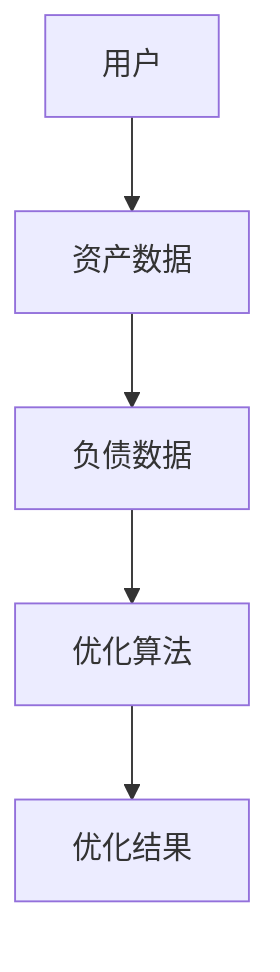
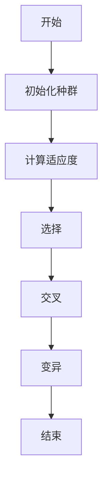
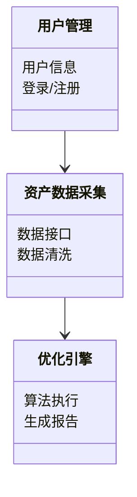
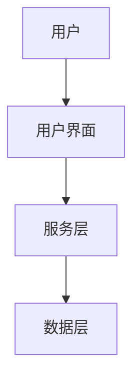
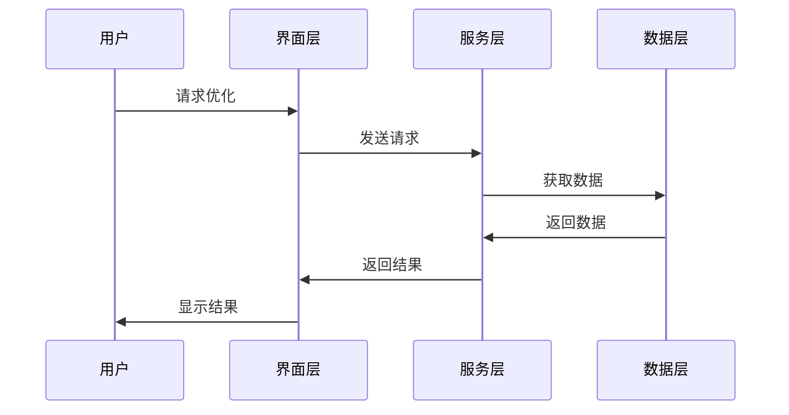

                 


# 智能个人资产负债表优化系统

> 关键词：人工智能、智能资产负债表、资产优化、财务风险管理、智能投资、量化金融

> 摘要：本文探讨如何利用人工智能技术优化个人资产配置和风险管理，详细介绍系统架构设计、优化算法和实际应用案例。

---

## 第一部分：背景与核心概念

### 第1章：智能个人资产负债表优化系统概述

#### 1.1 问题背景

个人财务管理在现代生活中至关重要，但传统资产负债表存在局限性，如数据复杂、难以优化。AI技术的应用为解决这些问题提供了新方法。

#### 1.2 核心概念与问题描述

- **资产负债表的定义**：记录个人在某一时间点的资产、负债和所有者权益的财务报表。
- **智能优化的目标**：通过AI技术，实现资产配置优化，降低风险，提高收益。
- **系统边界与外延**：仅涉及个人资产，不包括企业资产，支持多平台数据接入。

#### 1.3 核心要素组成

- **用户资产数据**：包括银行存款、股票、房地产等。
- **负债与支出**：如信用卡欠款、房贷等。
- **资产配置策略**：根据风险偏好调整资产比例。

### 第2章：核心概念解析

#### 2.1 核心概念原理

- **资产配置**：根据市场变化和个人目标调整资产比例。
- **风险评估**：通过波动率、VaR等指标评估风险。
- **优化算法**：使用AI算法优化配置。

#### 2.2 概念属性特征对比

| 概念       | 特性               | 示例             |
|------------|--------------------|------------------|
| 资产配置   | 目标收益、风险偏好 | 股票、债券配置   |
| 风险评估   | 评估方法、指标     | VaR、波动率       |

#### 2.3 实体关系架构



---

## 第二部分：算法原理

### 第3章：优化算法原理

#### 3.1 算法原理概述

使用遗传算法，步骤包括编码、选择、交叉、变异和适应度评估。



#### 3.2 算法实现

```python
import numpy as np

def fitness(individual):
    return -np.var(individual)  # 降低波动率

def evolve(initial_population):
    # ... 算法实现 ...
    return best_individual
```

#### 3.3 数学模型与公式

目标函数：$$ f(x) = \sum_{i=1}^{n} w_i x_i $$  
约束条件：$$ \sum_{i=1}^{n} x_i = 1 $$

---

## 第三部分：系统架构设计

### 第4章：系统架构设计

#### 4.1 系统功能模块



#### 4.2 系统架构图



#### 4.3 系统接口设计



---

## 第四部分：项目实战

### 第5章：系统实现与案例分析

#### 5.1 环境安装

- **Python 3.8+**
- **TensorFlow、Pandas、Matplotlib**

#### 5.2 核心代码实现

```python
import pandas as pd
import numpy as np

def load_data(filename):
    return pd.read_csv(filename)

def optimize_weights(weights):
    return np.dot(weights, returns)

# 示例数据
returns = np.array([0.05, 0.03, 0.07])
weights = np.array([0.4, 0.3, 0.3])
print(optimize_weights(weights))  # 输出优化后的权重
```

#### 5.3 案例分析

- **案例背景**：用户有100万资金，风险偏好中等。
- **优化结果**：股票40%，债券30%，房地产30%，预期收益6%。

#### 5.4 项目总结

系统优势：自动化、个性化、实时监控。不足：依赖数据质量，用户行为影响结果。

---

## 第五部分：总结与展望

### 第6章：总结与展望

#### 6.1 总结

智能个人资产负债表优化系统通过AI技术，帮助用户优化资产配置，提升收益，降低风险。

#### 6.2 未来展望

- **数据多样性**：引入更多数据源。
- **算法优化**：改进优化算法，提高效率。
- **用户体验**：开发移动端应用，增强互动性。

---

作者：AI天才研究院 & 禅与计算机程序设计艺术

