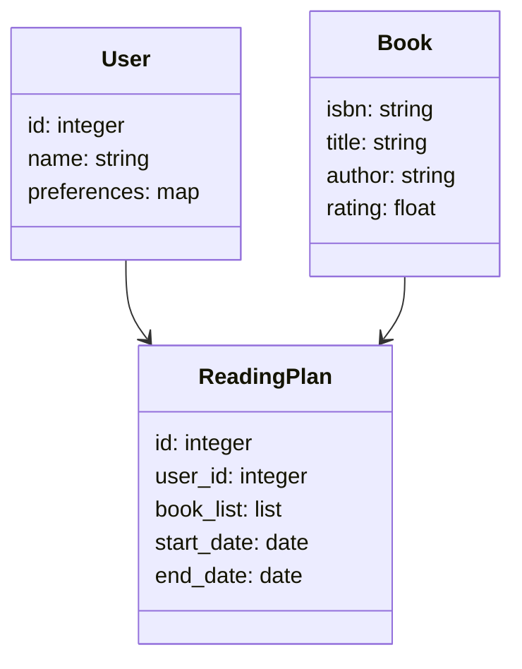
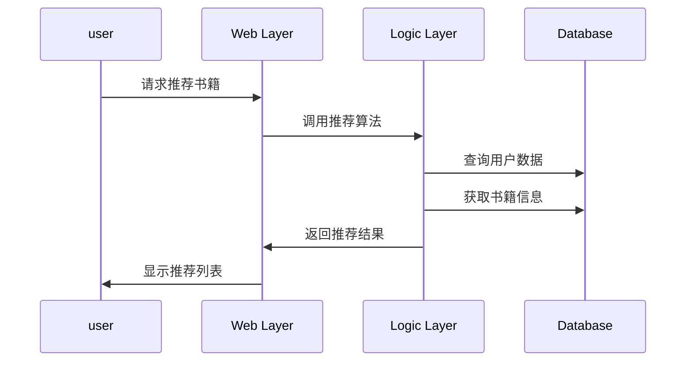

                 


# 智能书架：AI Agent的阅读计划制定助手

> 关键词：AI Agent, 智能书架, 阅读计划, 推荐算法, 系统架构, 项目实战

> 摘要：本文介绍了一种基于AI Agent的智能书架系统，详细探讨了其核心原理、推荐算法、系统架构设计及项目实现。通过本文，读者可以深入了解如何利用AI技术优化阅读计划的制定过程。

---

## 第一部分：引言

### 第1章：智能书架与AI Agent概述

#### 1.1 AI Agent的基本概念
AI Agent（人工智能代理）是一种能够感知环境并采取行动以实现目标的智能实体。它可以自主决策，无需人工干预，广泛应用于推荐系统、自动化控制等领域。AI Agent的核心特征包括自主性、反应性、目标导向性和社会性。

#### 1.2 智能书架的定义与功能
智能书架是一种结合AI技术的数字化书架，能够根据用户需求推荐书籍并制定阅读计划。其主要功能包括：
- 用户偏好分析：通过收集用户的阅读历史、兴趣偏好，生成个性化的阅读推荐。
- 书籍推荐：基于协同过滤、深度学习等算法，为用户提供高质量的书籍推荐。
- 阅读计划制定：根据用户的阅读习惯和时间安排，生成合理的阅读计划。

#### 1.3 阅读计划的重要性
阅读计划是帮助用户高效利用时间、系统性学习的重要工具。它不仅帮助用户选择适合的书籍，还能优化阅读顺序，提高学习效果。AI Agent通过分析用户需求和行为，可以自动生成科学的阅读计划。

---

## 第二部分：AI Agent的核心原理

### 第2章：AI Agent的基本原理

#### 2.1 任务分解与优先级排序
AI Agent通过任务分解将复杂问题拆解为多个子任务，并根据优先级排序决定执行顺序。例如，智能书架可能首先分析用户的阅读历史，然后推荐相关书籍。

#### 2.2 知识表示与推理
知识表示是将知识以计算机可处理的形式存储的过程。常用的表示方法包括语义网络和本体论。推理则是基于知识库进行逻辑推断，以生成新的信息。

#### 2.3 学习与自适应
AI Agent通过机器学习算法不断优化自身模型。例如，使用监督学习训练推荐模型，使其能够根据用户反馈调整推荐策略。

---

## 第三部分：推荐算法

### 第3章：协同过滤算法

#### 3.1 协同过滤的基本原理
协同过滤是一种基于用户相似性推荐物品的算法。分为基于用户的协同过滤和基于物品的协同过滤。

#### 3.2 协同过滤的数学模型
基于用户的协同过滤公式：
$$
r_{u,i} = \frac{\sum_{k} w_{u,k} \cdot r_{k,i}}{\sum_{k} w_{u,k}}
$$
其中，$r_{u,i}$表示用户u对物品i的评分，$w_{u,k}$表示用户u和用户k的相似度。

#### 3.3 协同过滤的实现步骤
1. 数据预处理：处理缺失值、标准化数据。
2. 计算相似度：使用余弦相似度或皮尔逊相关系数。
3. 生成推荐：根据相似用户的评分加权平均。

---

## 第四部分：系统设计

### 第4章：智能书架的系统架构

#### 4.1 系统需求分析
- 功能需求：用户注册、登录，书籍推荐，阅读计划生成。
- 性能需求：高响应速度，支持大规模数据处理。

#### 4.2 系统功能设计
领域模型类图（Mermaid）：


#### 4.3 系统架构设计
分层架构（Mermaid）：


#### 4.4 系统接口设计
接口设计包括用户登录、书籍推荐、计划生成等RESTful API。

#### 4.5 系统交互流程
序列图（Mermaid）：


---

## 第五部分：项目实战

### 第5章：环境安装与核心实现

#### 5.1 环境安装
安装Python、Pandas、Scikit-learn等库：
```bash
pip install numpy pandas scikit-learn
```

#### 5.2 核心实现代码
协同过滤算法实现：
```python
from sklearn.metrics.pairwise import cosine_similarity

def collaborative_filtering(user_item_matrix):
    user_similarity = cosine_similarity(user_item_matrix.T)
    user_similarity[user_similarity < 0.5] = 0
    return user_item_matrix.values.dot(user_similarity).astype(float)
```

#### 5.3 案例分析
以用户数据为例，计算推荐结果，并生成阅读计划。

---

## 第六部分：最佳实践

### 第6章：总结与注意事项

#### 6.1 总结
智能书架通过AI Agent和推荐算法，显著提升了阅读计划的制定效率。其核心优势在于个性化推荐和自动化计划生成。

#### 6.2 注意事项
- 数据隐私保护：确保用户数据的安全性。
- 算法优化：不断改进推荐算法，提高推荐准确性。
- 系统性能：优化系统架构，提升响应速度。

#### 6.3 拓展阅读
推荐阅读《集体智慧编程》和《机器学习实战》以深入理解推荐系统和AI Agent。

---

## 作者

作者：AI天才研究院 & 禅与计算机程序设计艺术

---

通过以上目录，您可以系统地了解智能书架的构建过程，从理论到实践，全面掌握其技术细节和实现方法。

