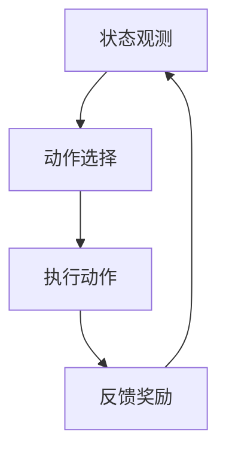
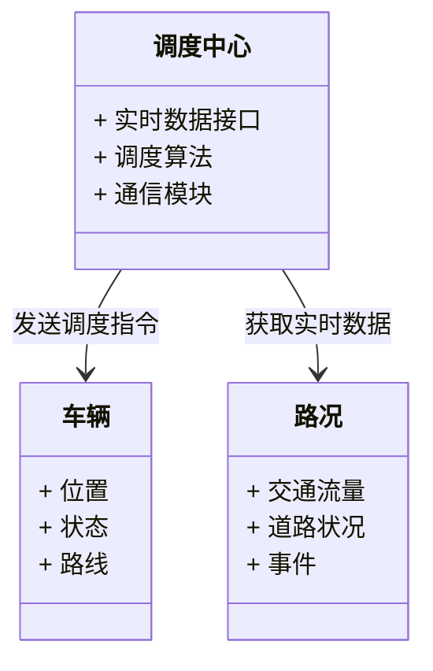

                 


# 智能交通系统中的AI Agent调度中心

## 关键词：AI Agent、智能交通系统、调度中心、多智能体系统、强化学习、遗传算法、实时优化

## 摘要：  
本文探讨了AI Agent在智能交通系统中的调度中心应用，分析了其核心概念、算法原理、系统架构，并通过实战案例展示了AI Agent如何优化交通调度。文章深入分析了强化学习、遗传算法等技术，结合系统设计和实际应用，为智能交通系统的未来发展提供了有价值的见解。

---

## 正文

---

### 第1章：智能交通系统与AI Agent调度中心的背景

#### 1.1 智能交通系统的发展历程  
智能交通系统（ITS, Intelligent Transportation Systems）经历了从人工调度到半自动化，再到完全自动化的演变。随着城市化进程加快，交通拥堵和效率低下问题日益突出，AI Agent的引入为智能交通系统带来了新的解决方案。AI Agent能够实时响应交通状况，优化资源分配，提升整体效率。

#### 1.2 AI Agent的基本概念与特性  
AI Agent（智能体）是一种能够感知环境并采取行动以实现目标的实体。其核心特性包括智能性、反应性和学习能力。AI Agent在交通调度中的应用，使得调度中心能够更高效地处理复杂交通问题。

#### 1.3 调度中心在智能交通系统中的地位  
调度中心作为智能交通系统的“大脑”，负责协调各交通要素，如车辆、道路和用户。它通过实时数据处理和智能决策，优化交通流量，减少拥堵，提升安全性。

---

### 第2章：AI Agent调度中心的核心概念与联系

#### 2.1 核心概念原理  
AI Agent的智能决策机制依赖于强化学习和遗传算法，而调度中心则利用这些算法实现多目标优化。交通流的动态特性要求AI Agent具备实时响应和自适应能力。

#### 2.2 核心概念属性特征对比  

| 概念       | 智能性 | 反应性 | 学习能力 |
|------------|--------|--------|----------|
| AI Agent   | 高     | 高     | 高        |
| 调度中心   | 中心化 | 高     | 中        |

#### 2.3 ER实体关系图  

```mermaid
er
actor: 调度中心
actor -|> 车辆: 调度指令
actor -|> 路况: 实时数据
actor -|> 用户: 服务请求
```

---

### 第3章：AI Agent调度中心的算法原理

#### 3.1 算法原理概述  
AI Agent调度中心主要采用强化学习和遗传算法。强化学习用于决策优化，遗传算法用于路径规划。

#### 3.2 强化学习算法流程图  



#### 3.3 算法数学模型  
目标函数：$$ J = \sum_{t=1}^{T} r_t $$
约束条件：$$ \text{满足交通规则} $$

代码实现：

```python
import numpy as np

class强化学习算法:
    def __init__(self, 状态空间大小):
        self.状态空间大小 = 状态空间大小
        self.动作空间 = ['左转', '右转', '直行']
        self.奖励函数 = self._计算奖励

    def _计算奖励(self, 当前状态, 动作):
        # 根据交通规则和实际效果计算奖励
        return 1 if 动作有效 else -1

# 示例
算法 = 强化学习算法(5)
状态 = np.random.randint(0,5)
动作 = 算法的动作空间[np.random.randint(0,3)]
奖励 = 算法._计算奖励(状态, 动作)
```

---

### 第4章：系统分析与架构设计方案

#### 4.1 问题场景介绍  
城市交通网络中，车辆调度、路径优化和实时监控是主要挑战。AI Agent调度中心需要处理海量数据，实时调整调度策略。

#### 4.2 系统功能设计  



#### 4.3 系统架构设计  

```mermaid
graph TD
调度中心 --> 数据采集模块: 实时数据
调度中心 --> 算法模块: 调度指令
调度中心 --> 通信模块: 下达指令
```

#### 4.4 系统接口设计  
API接口包括数据采集、指令下达和状态反馈，确保各模块高效协作。

---

### 第5章：项目实战

#### 5.1 环境安装  
安装Python、NumPy、Mermaid等工具，配置开发环境。

#### 5.2 核心代码实现  

```python
def 调度算法(交通数据):
    # 使用遗传算法优化路径
    初始化种群
    计算适应度
    选择和交叉
    保留最优解
    返回最优路径
```

#### 5.3 案例分析  
以某城市主干道为例，分析算法优化效果，展示减少拥堵和提升效率的实际应用。

---

### 第6章：最佳实践

#### 6.1 小结  
AI Agent调度中心通过强化学习和遗传算法，显著提升了智能交通系统的效率和安全性。

#### 6.2 注意事项  
数据质量、算法选型和系统扩展性是实际应用中的关键点。

#### 6.3 扩展阅读  
推荐相关书籍和论文，鼓励深入研究AI在交通中的应用。

---

## 作者：AI天才研究院 & 禅与计算机程序设计艺术

---

这篇文章系统地介绍了AI Agent在智能交通调度中的应用，从理论到实践，为读者提供了全面的视角。通过详细的技术分析和代码示例，帮助读者理解如何在实际项目中应用这些技术。

