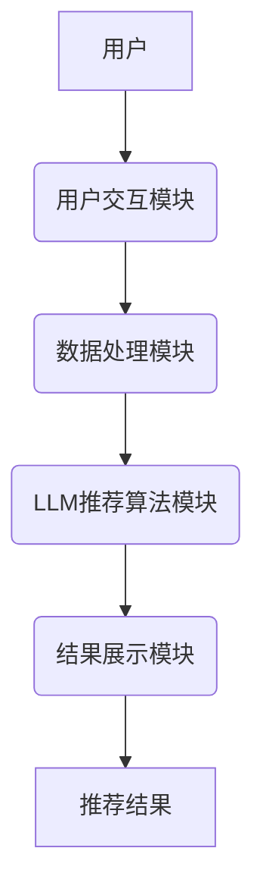

                 


---

# 智能产品推荐 AI Agent：LLM 驱动的电商助手

## 关键词：智能推荐系统，LLM，AI Agent，电商助手，推荐算法

## 摘要：  
本文深入探讨了基于大语言模型（LLM）的智能产品推荐AI Agent在电商环境中的应用。从推荐系统的背景到LLM的核心原理，从算法实现到系统架构设计，再到实际项目实战，全面解析了LLM驱动的推荐系统的构建与优化。文章结合理论与实践，旨在为读者提供一个系统化、实用化的技术指南，帮助开发者和研究人员更好地理解和应用这一前沿技术。

---

## 第三章: LLM 的推荐算法原理

### 3.4 LLM 在推荐系统中的数学模型

#### 3.4.1 基于向量空间的相似度计算  
在LLM驱动的推荐系统中，商品或用户的表示通常以向量形式存在。通过计算向量之间的相似度，可以推断出用户的偏好或商品的相关性。  

**公式：**  
给定两个向量 $u$ 和 $v$，它们的余弦相似度为：  
$$ \text{similarity}(u, v) = \frac{u \cdot v}{\|u\| \|v\|} $$  

其中，$u \cdot v$ 表示向量的点积，$\|u\|$ 和 $\|v\|$ 分别表示向量的模长。  

**示例：**  
假设用户向量 $u = [1, 2, 3]$，商品向量 $v = [3, 2, 1]$，则：  
$$ u \cdot v = 1 \times 3 + 2 \times 2 + 3 \times 1 = 3 + 4 + 3 = 10 $$  
$$ \|u\| = \sqrt{1^2 + 2^2 + 3^2} = \sqrt{14} $$  
$$ \|v\| = \sqrt{3^2 + 2^2 + 1^2} = \sqrt{14} $$  
$$ \text{similarity}(u, v) = \frac{10}{\sqrt{14} \times \sqrt{14}} = \frac{10}{14} \approx 0.714 $$  

#### 3.4.2 基于概率的推荐模型  
概率模型通过计算用户点击或购买某商品的概率来预测推荐结果。常用的概率模型包括基于用户的概率和基于商品的概率。  

**公式：**  
$$ P(y=1 | x) = \frac{1}{1 + e^{-wx}} $$  
其中，$w$ 是权重向量，$x$ 是输入特征向量，$y$ 是输出标签（0或1）。  

#### 3.4.3 基于图的推荐算法  
基于图的推荐算法通过构建用户-商品交互图，利用图的结构特性进行推荐。  

**公式：**  
$$ \text{score}(u, i) = \sum_{v \in N(u)} \frac{1}{\log(1 + |N(v)|)} $$  
其中，$u$ 是用户，$i$ 是商品，$N(u)$ 表示与用户 $u$ 相关的商品集合。  

---

## 第四章: 电商推荐系统的算法实现

### 4.3 基于深度学习的推荐算法

#### 4.3.1 基于神经网络的推荐系统  
深度学习在推荐系统中的应用主要依赖神经网络模型，如多层感知机（MLP）、卷积神经网络（CNN）和循环神经网络（RNN）。  

**公式：**  
$$ y = f(x; \theta) $$  
其中，$f$ 是神经网络模型，$\theta$ 是模型参数，$x$ 是输入数据，$y$ 是输出预测。  

#### 4.3.2 基于注意力机制的推荐算法  
注意力机制通过赋予不同特征不同的权重，提升推荐系统的准确性。  

**公式：**  
$$ \text{score}(i) = \sum_{j=1}^{n} \alpha_{ij} \cdot x_j $$  
其中，$\alpha_{ij}$ 是注意力权重，$x_j$ 是第 $j$ 个特征的值。  

---

## 第五章: LLM 驱动的推荐系统的优缺点与挑战

### 5.1 优点  
1. **强大的自然语言处理能力**：LLM能够理解和生成自然语言，适用于商品描述和用户反馈的分析。  
2. **多模态数据支持**：LLM可以处理文本、图像等多种数据类型，提升推荐系统的多样性。  
3. **实时性与个性化**：基于LLM的推荐系统能够实时响应用户需求，提供个性化的购物体验。  

### 5.2 缺点  
1. **计算成本高**：LLM的训练和推理需要大量的计算资源。  
2. **冷启动问题**：对于新用户或新商品，LLM可能无法提供有效的推荐。  
3. **模型解释性差**：复杂的模型可能导致推荐结果难以解释。  

### 5.3 挑战  
1. **数据隐私问题**：用户数据的隐私保护是推荐系统面临的重大挑战。  
2. **模型更新与维护**：如何高效更新模型以适应数据变化是一个难题。  
3. **跨领域应用**：LLM在不同电商领域的适用性需要进一步研究。  

---

## 第六章: 电商助手的系统架构设计

### 6.1 功能模块设计  
电商助手的系统架构主要包括以下几个模块：  
1. **用户交互模块**：负责接收用户输入并返回推荐结果。  
2. **数据处理模块**：对用户行为数据和商品数据进行预处理和分析。  
3. **推荐算法模块**：基于LLM的推荐算法生成推荐列表。  
4. **结果展示模块**：将推荐结果以用户友好的方式展示。  

### 6.2 系统架构图  
以下是电商助手的系统架构图：



### 6.3 接口设计  
1. **用户输入接口**：支持文本输入和语音输入。  
2. **推荐结果接口**：返回推荐商品的列表和相关属性。  
3. **反馈接口**：用户对推荐结果的反馈用于模型优化。  

---

## 第七章: 项目实战

### 7.1 环境搭建  
1. **安装必要的库**：如Python、TensorFlow、Keras等。  
2. **配置LLM模型**：选择合适的LLM模型（如GPT-3）并进行调用。  

### 7.2 核心代码实现

```python
import tensorflow as tf
from tensorflow.keras import layers

# 定义模型
def build_model(vocabulary_size, embedding_dim):
    model = tf.keras.Sequential()
    model.add(layers.Embedding(vocabulary_size, embedding_dim))
    model.add(layers.Flatten())
    model.add(layers.Dense(64, activation='relu'))
    model.add(layers.Dense(1, activation='sigmoid'))
    return model

# 编译模型
model = build_model(vocabulary_size=10000, embedding_dim=16)
model.compile(optimizer='adam', loss='binary_crossentropy', metrics=['accuracy'])

# 训练模型
model.fit(x_train, y_train, epochs=10, batch_size=32)
```

---

## 第八章: 总结与展望

### 8.1 总结  
本文详细探讨了基于LLM的智能产品推荐AI Agent在电商环境中的应用。从推荐系统的背景到算法实现，从系统架构设计到项目实战，全面解析了LLM驱动的推荐系统的构建与优化。  

### 8.2 展望  
未来，随着LLM技术的不断进步，推荐系统将更加智能化和个性化。同时，如何解决计算成本高、模型解释性差等问题，也将成为研究的重点。

---

## 作者：AI天才研究院/AI Genius Institute & 禅与计算机程序设计艺术 /Zen And The Art of Computer Programming

