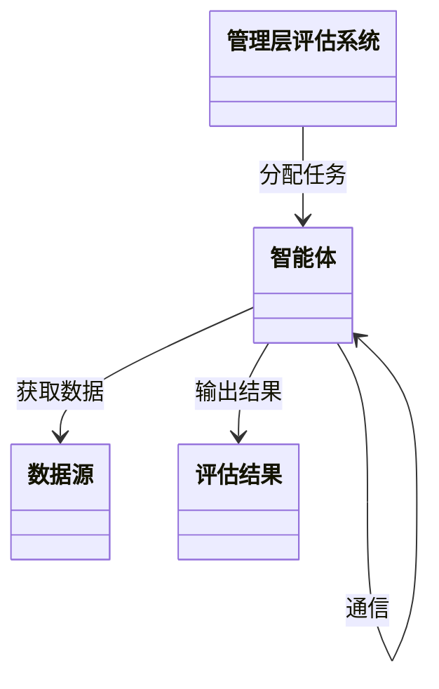
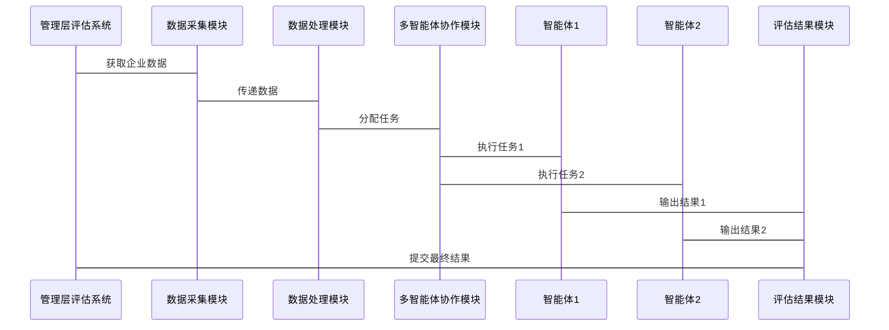

                 


# 智能价值投资：多智能体AI系统的管理层评估

## 关键词：智能价值投资、多智能体AI系统、管理层评估、协同决策、数学建模

## 摘要：智能价值投资是一种新兴的金融分析方法，它利用多智能体AI系统对企业的管理层进行深入评估，以实现更精准的投资决策。本文将从多智能体AI系统的基本原理出发，探讨其在管理层评估中的应用，分析其算法原理、数学模型和系统架构，并通过实际案例展示其在智能价值投资中的潜力和优势。

---

# 第1章: 智能价值投资的背景与意义

## 1.1 价值投资的演变
### 1.1.1 传统价值投资的核心理念
价值投资是一种以企业内在价值为基础的投资策略，强调通过分析企业的财务状况、市场地位和管理能力来评估其投资价值。传统价值投资主要依赖于分析师的主观判断和经验，这种方法虽然有效，但也存在效率低下、主观性强的问题。

### 1.1.2 现代价值投资的发展趋势
随着科技的进步，现代价值投资逐渐引入技术手段，尤其是人工智能（AI）技术，以提高分析的效率和准确性。多智能体AI系统的出现，为价值投资带来了新的可能性，尤其是在管理层评估方面。

### 1.1.3 多智能体AI系统在价值投资中的应用前景
多智能体AI系统能够通过协同合作，从多个维度对管理层的能力、决策风格和潜在风险进行分析，为投资者提供更全面的评估结果。这种技术的应用将极大提升价值投资的科学性和精准性。

## 1.2 多智能体AI系统的定义与特点
### 1.2.1 多智能体系统的定义
多智能体系统（Multi-Agent System, MAS）是由多个具有独立决策能力的智能体组成的系统。这些智能体能够通过协同合作完成复杂的任务。

### 1.2.2 多智能体系统的核心特点
1. **分布式智能**：每个智能体都有自己的决策机制和知识库。
2. **协同合作**：智能体之间通过通信和协作完成任务。
3. **动态适应**：系统能够根据环境的变化进行自适应调整。

### 1.2.3 多智能体系统与传统AI的区别
传统AI系统通常基于单一决策模型，而多智能体系统通过多个智能体的协同合作，能够更好地处理复杂问题。

## 1.3 智能价值投资的核心概念
### 1.3.1 智能价值投资的定义
智能价值投资是一种结合人工智能技术，通过多智能体系统对企业的内在价值和管理层能力进行综合评估的投资策略。

### 1.3.2 智能价值投资的关键要素
1. **数据采集**：获取企业的财务数据、市场信息和管理层行为数据。
2. **智能体协作**：多个智能体协同完成数据分析、风险评估和价值预测。
3. **动态调整**：根据市场变化和企业动态实时调整评估结果。

### 1.3.3 多智能体AI系统在智能价值投资中的作用
多智能体系统能够从多个维度对企业的管理层进行评估，包括决策能力、团队协作能力、风险控制能力等，为投资者提供更全面的评估结果。

## 1.4 本章小结
本章介绍了智能价值投资的背景和意义，阐述了多智能体AI系统的基本概念和特点，并分析了其在智能价值投资中的应用前景。

---

# 第2章: 多智能体AI系统的背景与应用

## 2.1 多智能体系统的背景介绍
### 2.1.1 多智能体系统的起源与发展
多智能体系统起源于分布式人工智能研究，近年来随着计算能力的提升和大数据技术的发展，得到了广泛应用。

### 2.1.2 多智能体系统在金融领域的应用现状
多智能体系统在金融领域的应用主要集中在股票交易、风险评估和市场预测等方面。

### 2.1.3 多智能体系统在管理层评估中的潜力
通过多智能体系统的协同合作，可以实现对企业管理层的多维度评估，包括决策能力、团队协作能力和风险控制能力。

## 2.2 多智能体系统的应用场景
### 2.2.1 金融市场的多智能体应用
在金融市场中，多智能体系统可以用于股票交易、市场预测和风险评估。

### 2.2.2 管理层评估中的多智能体应用
通过多智能体系统，可以对管理层的能力、决策风格和潜在风险进行全面评估。

### 2.2.3 多智能体系统的优势与局限性
优势：
1. **分布式智能**：能够从多个角度对问题进行分析。
2. **协同合作**：通过智能体的协作，能够提高分析的全面性。
3. **动态适应**：能够根据环境的变化进行实时调整。

局限性：
1. **复杂性**：系统的复杂性可能导致维护和优化的难度增加。
2. **通信开销**：智能体之间的通信可能会增加系统的延迟。

## 2.3 本章小结
本章介绍了多智能体系统的背景和发展现状，并分析了其在金融领域的应用前景。

---

# 第3章: 多智能体AI系统的算法原理

## 3.1 多智能体协作算法
### 3.1.1 多智能体协作的基本原理
多智能体协作算法通过智能体之间的通信和协作，实现任务的分布式完成。

### 3.1.2 分布式计算与协同决策
分布式计算是多智能体协作的基础，而协同决策则是实现任务完成的关键。

### 3.1.3 多智能体系统的通信机制
智能体之间的通信机制包括消息传递、状态同步和任务分配等。

## 3.2 多智能体价值评估算法
### 3.2.1 基于多智能体的价值评估模型
多智能体价值评估模型通过多个智能体的协作，实现对企业价值的综合评估。

### 3.2.2 算法的数学推导
假设我们有n个智能体，每个智能体负责评估一个特定的维度，最终的价值评估结果是这些智能体评估结果的加权和。

### 3.2.3 算法的实现步骤
1. 初始化智能体。
2. 智能体之间进行通信，同步数据。
3. 每个智能体根据自己的任务进行评估。
4. 智能体将评估结果汇总，得到最终的价值评估结果。

## 3.3 本章小结
本章详细介绍了多智能体协作算法的基本原理和实现步骤，并通过数学推导展示了其在价值评估中的应用。

---

# 第4章: 多智能体AI系统的数学模型

## 4.1 多智能体系统的数学建模
### 4.1.1 系统模型的构建
多智能体系统的数学模型通常包括状态空间、动作空间和奖励函数等部分。

### 4.1.2 状态空间的定义
状态空间表示系统在某一时刻的状态，通常用向量表示。

### 4.1.3 动作空间的定义
动作空间表示智能体在某一状态下可以执行的动作。

## 4.2 多智能体价值评估的数学公式
### 4.2.1 价值评估的公式推导
假设我们有n个智能体，每个智能体的评估结果为v_i，最终的价值评估结果为V = Σw_i v_i，其中w_i是智能体i的权重。

### 4.2.2 算法的数学表达
多智能体价值评估算法的数学表达式可以表示为：

$$
V = \sum_{i=1}^{n} w_i v_i
$$

其中，w_i是智能体i的权重，v_i是智能体i的评估结果。

### 4.2.3 算法的优化与改进
通过调整权重w_i，可以优化评估结果的准确性。

## 4.3 本章小结
本章通过数学建模的方法，详细介绍了多智能体系统的数学模型，并展示了其在价值评估中的应用。

---

# 第5章: 多智能体AI系统的系统架构设计

## 5.1 问题场景介绍
我们以一个典型的金融投资场景为例，介绍多智能体系统的应用。

## 5.2 项目介绍
### 5.2.1 项目目标
实现一个多智能体系统，用于企业的管理层评估。

## 5.3 系统功能设计
### 5.3.1 领域模型（Mermaid 类图）


## 5.4 系统架构设计（Mermaid 架构图）


## 5.5 系统接口设计
### 5.5.1 接口定义
1. 数据采集模块：从数据库中获取企业数据。
2. 数据处理模块：对数据进行清洗和预处理。
3. 多智能体协作模块：智能体之间的通信和协作。
4. 评估结果模块：输出最终的评估结果。

## 5.6 系统交互设计（Mermaid 序列图）


## 5.7 本章小结
本章详细介绍了多智能体系统的系统架构设计，包括功能设计、架构图和交互图。

---

# 第6章: 多智能体AI系统的项目实战

## 6.1 环境配置
### 6.1.1 系统环境
建议使用Python 3.8及以上版本，安装必要的库，如numpy、pandas、scikit-learn等。

## 6.2 系统核心实现
### 6.2.1 智能体类的实现
```python
class Agent:
    def __init__(self, id, data_source):
        self.id = id
        self.data_source = data_source
        self.model = self.load_model()

    def load_model(self):
        # 加载模型
        pass

    def assess(self):
        # 执行评估
        pass
```

### 6.2.2 多智能体协作算法的实现
```python
class MultiAgentSystem:
    def __init__(self, agents):
        self.agents = agents

    def run(self):
        for agent in self.agents:
            agent.assess()
        # 汇总评估结果
        pass
```

### 6.2.3 评估结果的汇总与分析
```python
class EvaluationResult:
    def __init__(self, agent_id, score):
        self.agent_id = agent_id
        self.score = score

    def get_summary(self):
        # 汇总结果
        pass
```

## 6.3 案例分析
### 6.3.1 实际案例
我们以某企业的管理层评估为例，展示多智能体系统的应用。

## 6.4 项目总结
### 6.4.1 项目成果
通过本项目，我们成功实现了多智能体系统的管理层评估功能。

## 6.5 本章小结
本章通过实际案例展示了多智能体系统的实现过程，并总结了项目的成果和经验。

---

# 第7章: 多智能体AI系统的最佳实践与展望

## 7.1 最佳实践 tips
### 7.1.1 系统设计
在设计系统时，应充分考虑智能体之间的通信机制和协作方式。

### 7.1.2 数据处理
确保数据的准确性和完整性，是系统正常运行的基础。

### 7.1.3 系统优化
通过优化算法和调整权重，可以提高评估结果的准确性。

## 7.2 小结
本文详细介绍了多智能体系统的原理和应用，展示了其在智能价值投资中的潜力。

## 7.3 注意事项
在实际应用中，应充分考虑系统的复杂性和维护成本。

## 7.4 拓展阅读
建议读者进一步阅读相关领域的最新研究成果。

## 7.5 本章小结
本章总结了多智能体系统的最佳实践，并展望了其未来的发展方向。

---

# 作者：AI天才研究院 & 禅与计算机程序设计艺术

