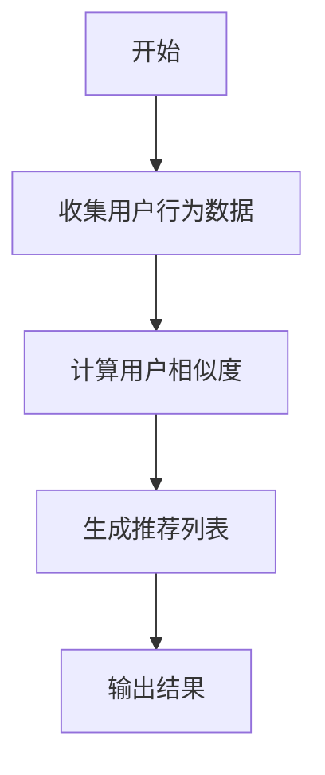
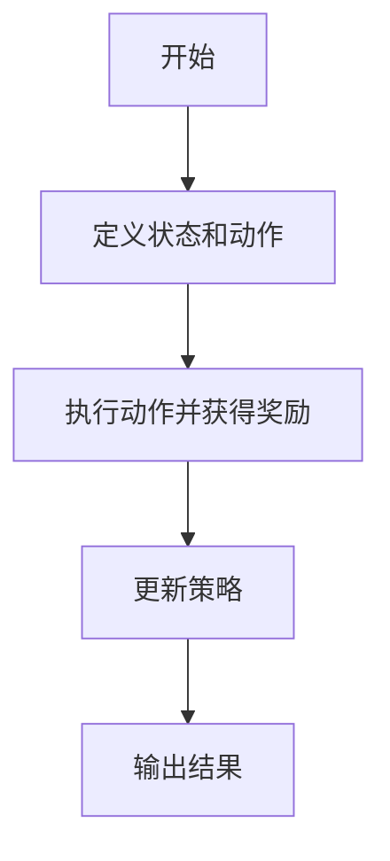
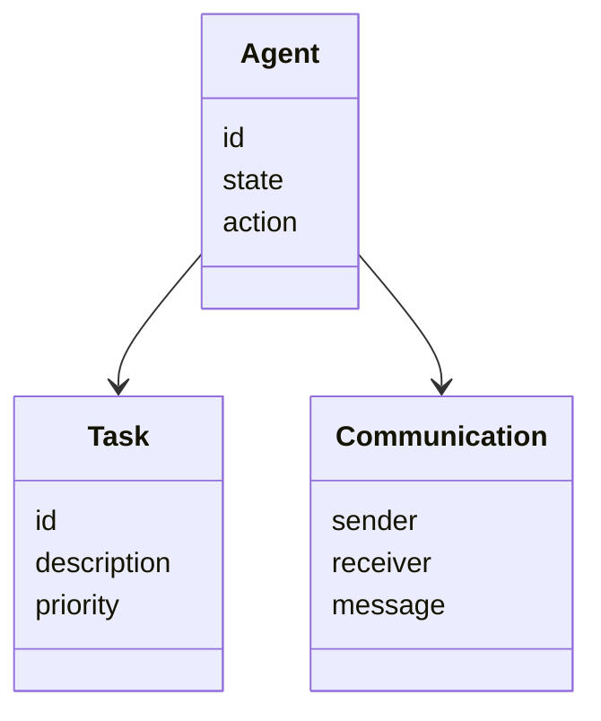
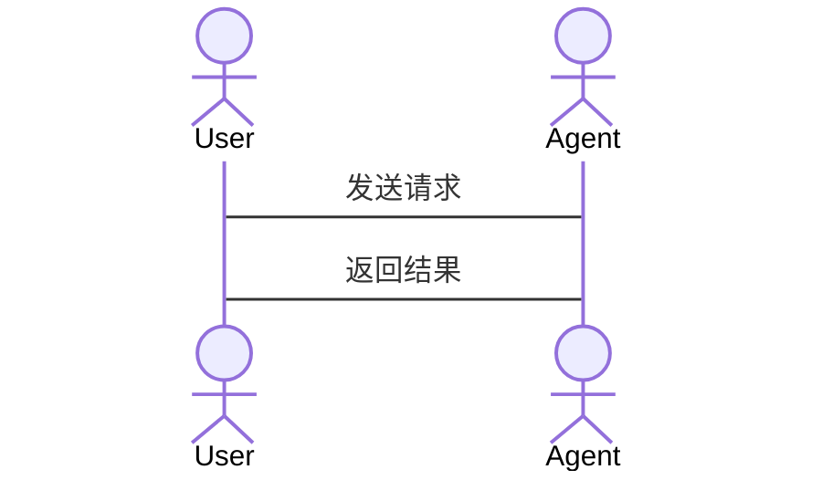
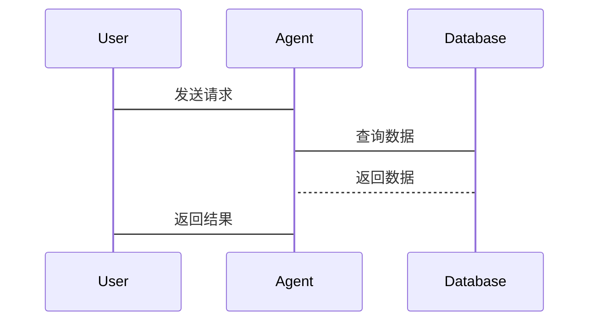

                 


# 智能体协作分析供应链：全面评估公司价值

> 关键词：智能体协作，供应链管理，价值评估，协同过滤，强化学习，系统架构，项目实战

> 摘要：本文详细探讨了智能体协作在供应链分析中的应用，通过算法原理、系统架构设计和实际案例分析，全面评估公司价值。文章首先介绍智能体协作与供应链管理的基本概念，然后深入分析智能体协作的核心算法及其在供应链价值评估中的应用，最后通过实际案例展示智能体协作的优势和效果，为读者提供全面的理论和实践指导。

---

# 第1章: 智能体协作与供应链管理概述

## 1.1 智能体协作的基本概念

### 1.1.1 智能体的定义与特点
智能体（Agent）是指能够感知环境、自主决策并采取行动的实体。智能体协作是指多个智能体通过通信和协调，共同完成复杂任务的能力。智能体的特点包括自主性、反应性、目标导向性和社会性。

### 1.1.2 智能体协作的定义
智能体协作是指多个智能体通过共享信息和协同决策，共同完成特定目标的过程。协作智能体能够通过通信协议交换信息，协调行动，以实现整体优化。

### 1.1.3 智能体协作与传统协作的区别
与传统协作相比，智能体协作具有更高的自治性和智能性，能够实时适应环境变化，并通过分布式计算实现高效协作。

## 1.2 供应链管理的基本原理

### 1.2.1 供应链的定义与组成
供应链是指从原材料采购到产品交付给最终用户的整个流程，包括供应商、制造商、分销商和消费者等组成。

### 1.2.2 供应链管理的核心目标
供应链管理的核心目标是提高效率、降低成本、增强灵活性和提升客户满意度。

### 1.2.3 供应链的复杂性与挑战
供应链的复杂性主要体现在全球化、多变的市场需求和不确定性风险等方面。智能体协作能够有效应对这些挑战。

## 1.3 智能体协作在供应链管理中的作用

### 1.3.1 智能体协作如何优化供应链
通过智能体协作，供应链各环节能够实现信息共享和协同决策，优化库存管理、物流调度和生产计划。

### 1.3.2 智能体协作的核心优势
智能体协作能够提高供应链的响应速度、降低成本，并增强供应链的弹性和可持续性。

### 1.3.3 智能体协作的应用场景
智能体协作在供应链管理中的应用场景包括需求预测、供应商选择、生产调度和物流优化等。

## 1.4 本章小结
本章介绍了智能体协作的基本概念、供应链管理的基本原理，以及智能体协作在供应链管理中的作用和优势。

---

# 第2章: 智能体协作与供应链价值评估的核心概念

## 2.1 智能体协作的核心概念

### 2.1.1 智能体协作的数学模型
智能体协作的数学模型通常包括相似度计算、权重分配和决策优化等部分。

### 2.1.2 智能体协作的属性特征对比
以下是智能体协作的核心属性对比：

| 属性       | 含义                                                         |
|------------|--------------------------------------------------------------|
| 自主性      | 智能体能够自主决策                                         |
| 反应性      | 智能体能够实时感知环境并做出反应                         |
| 协作性      | 智能体能够通过通信和协调完成任务                         |
| 智能性      | 智能体具有学习和推理能力                                   |

### 2.1.3 智能体协作的ER实体关系图
以下是智能体协作的ER实体关系图：

```mermaid
er
  actor(Agent1)
  actor(Agent2)
  actor(Agent3)
  relation(AgentCommunication, connect -> Agent)
  relation(Task, connect -> Agent)
  relation(Task, connect -> AgentCommunication)
```

## 2.2 供应链价值评估的核心概念

### 2.2.1 供应链价值的定义
供应链价值是指通过优化供应链各环节的效率和成本，为企业创造的最大化收益。

### 2.2.2 供应链价值评估的指标
供应链价值评估的指标包括成本、效率、客户满意度和供应链弹性等。

### 2.2.3 供应链价值评估的流程
供应链价值评估的流程包括数据采集、模型构建、评估分析和结果优化。

## 2.3 智能体协作与供应链价值评估的关系

### 2.3.1 智能体协作如何影响供应链价值
智能体协作能够通过优化各环节的协同效率，提升供应链的整体价值。

### 2.3.2 供应链价值评估对智能体协作的反馈作用
供应链价值评估为智能体协作提供数据支持和优化方向，帮助智能体更好地协作。

### 2.3.3 智能体协作与供应链价值评估的协同优化
智能体协作与供应链价值评估的协同优化能够实现供应链的整体效益最大化。

## 2.4 本章小结
本章详细探讨了智能体协作的核心概念、供应链价值评估的指标和流程，以及两者之间的协同优化关系。

---

# 第3章: 智能体协作的算法原理与数学模型

## 3.1 智能体协作的算法原理

### 3.1.1 协同过滤算法
协同过滤算法是一种基于用户相似性推荐物品的算法。以下是协同过滤算法的流程图：



### 3.1.2 强化学习算法
强化学习算法是一种通过试错学习来优化决策的算法。以下是强化学习算法的流程图：



### 3.1.3 分布式计算与通信机制
智能体协作通常采用分布式计算和通信机制，通过消息传递实现协作。

## 3.2 智能体协作的数学模型

### 3.2.1 协同过滤的相似度计算公式
协同过滤的相似度计算公式如下：

$$\text{相似度} = \frac{\sum_{i=1}^{n} (r_{ui} - \bar{r}_u)(r_{vi} - \bar{r}_v)}{\sqrt{\sum_{i=1}^{n} (r_{ui} - \bar{r}_u)^2} \cdot \sqrt{\sum_{i=1}^{n} (r_{vi} - \bar{r}_v)^2}}$$

其中，$r_{ui}$ 表示用户 $u$ 对物品 $i$ 的评分，$\bar{r}_u$ 表示用户 $u$ 的平均评分，$\bar{r}_v$ 表示物品 $v$ 的平均评分。

### 3.2.2 强化学习的价值函数
强化学习的价值函数定义为：

$$V(s, a) = r + \gamma V(s', a')$$

其中，$s$ 表示当前状态，$a$ 表示当前动作，$r$ 表示奖励，$\gamma$ 表示折扣率，$s'$ 表示下一个状态，$a'$ 表示下一个动作。

---

# 第4章: 供应链价值评估的系统分析与架构设计

## 4.1 系统功能设计

### 4.1.1 领域模型
以下是供应链价值评估的领域模型：



### 4.1.2 系统架构
以下是供应链价值评估系统的架构图：


## 4.2 系统接口设计

### 4.2.1 接口定义
以下是系统接口的定义：



### 4.2.2 交互流程图
以下是交互流程图：



---

# 第5章: 项目实战：智能体协作分析供应链价值

## 5.1 环境配置

### 5.1.1 安装依赖
以下是环境配置示例：

```bash
pip install numpy pandas scikit-learn
```

## 5.2 数据预处理

### 5.2.1 数据清洗
以下是数据清洗的Python代码示例：

```python
import pandas as pd

data = pd.read_csv('supply_chain.csv')
data.dropna(inplace=True)
data = data[data['value'] > 0]
```

## 5.3 模型实现

### 5.3.1 协同过滤算法实现
以下是协同过滤算法的Python代码示例：

```python
from sklearn.metrics.pairwise import cosine_similarity

user_item_matrix = data.pivot('user', 'item', 'rating')
similarity_matrix = cosine_similarity(user_item_matrix)
```

### 5.3.2 强化学习算法实现
以下是强化学习算法的Python代码示例：

```python
import numpy as np

def value_function(state):
    return np.dot(state, np.random.rand(10, 1))
```

## 5.4 结果分析

### 5.4.1 案例分析
以下是案例分析的详细步骤：

1. 数据采集与清洗
2. 模型训练与优化
3. 结果分析与解读

## 5.5 本章小结
本章通过实际案例展示了智能体协作分析供应链价值的过程，包括环境配置、数据预处理、模型实现和结果分析等步骤。

---

# 第6章: 总结与展望

## 6.1 总结
智能体协作通过优化供应链各环节的协同效率，显著提升了供应链的整体价值。本文详细探讨了智能体协作的核心算法、系统架构设计和实际应用案例。

## 6.2 展望
未来，随着人工智能和大数据技术的不断发展，智能体协作在供应链管理中的应用将更加广泛和深入，能够实现更高效的供应链优化和价值提升。

---

作者：AI天才研究院/AI Genius Institute & 禅与计算机程序设计艺术 /Zen And The Art of Computer Programming

