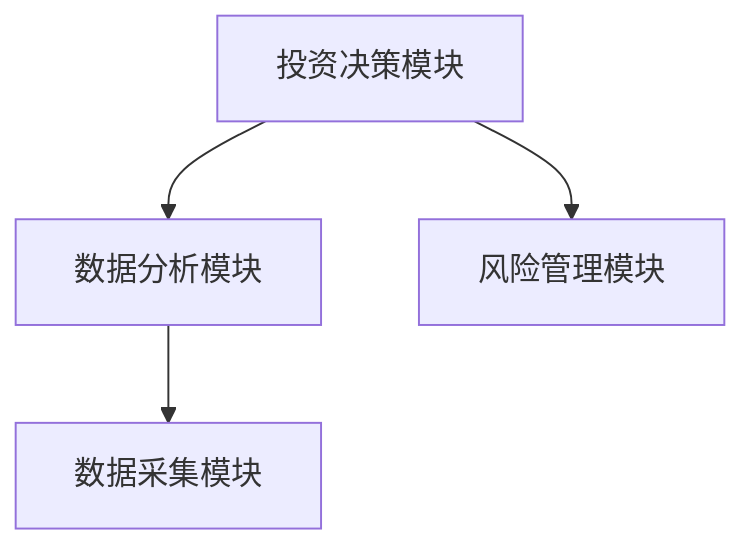
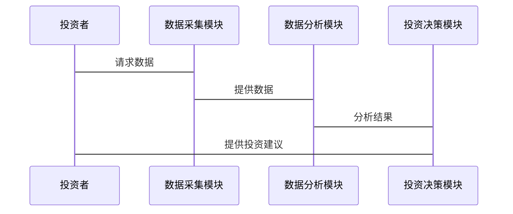

                 


# 智能体协作增强价值投资的产业链分析

> 关键词：智能体协作，价值投资，产业链分析，人工智能，多智能体系统

> 摘要：本文探讨了智能体协作在价值投资中的应用，结合产业链分析，详细介绍了智能体协作的理论基础、算法实现、系统架构以及实际案例。通过分析智能体协作如何优化产业链结构，提升投资决策的准确性和效率，为读者提供了一个全新的视角来理解智能体协作在金融领域的潜力。

---

## 第一部分：智能体协作与价值投资的背景

### 第1章：智能体协作与价值投资概述

#### 1.1 智能体协作的基本概念

##### 1.1.1 智能体的定义与特征
智能体（Intelligent Agent）是指能够感知环境、自主决策并执行任务的实体。智能体具有以下特征：
- **自主性**：能够独立决策和行动。
- **反应性**：能够感知环境并实时响应。
- **协作性**：能够与其他智能体协同工作，实现共同目标。

##### 1.1.2 协作智能体的内涵与外延
协作智能体是指多个智能体为了实现共同目标而协同工作。其内涵包括：
- **目标一致性**：所有智能体都为同一个目标服务。
- **任务分配**：智能体之间根据自身能力分配任务。
- **信息共享**：智能体之间共享信息以提高整体效率。

##### 1.1.3 智能体协作与价值投资的关系
智能体协作能够通过信息共享和任务分配，帮助投资者更高效地进行价值评估和投资决策。

#### 1.2 价值投资的基本原理

##### 1.2.1 价值投资的定义与核心理念
价值投资是一种投资策略，通过分析企业的基本面，寻找市场价格低于内在价值的投资标的。

##### 1.2.2 产业链分析在价值投资中的作用
产业链分析帮助投资者了解企业所处的行业环境，评估其竞争优势和风险。

##### 1.2.3 智能体协作如何增强价值投资
智能体协作可以通过自动化数据处理和信息共享，提高产业链分析的效率和准确性。

### 第2章：智能体协作与价值投资的背景分析

#### 2.1 当前智能体技术的发展现状

##### 2.1.1 人工智能技术的演进
人工智能技术的快速发展为智能体协作提供了坚实的技术基础。

##### 2.1.2 多智能体协作系统的应用领域
多智能体协作系统已在金融、物流、制造等领域得到广泛应用。

##### 2.1.3 智能体协作在金融领域的潜力
智能体协作在金融领域的应用前景广阔，尤其是在投资决策和风险管理方面。

#### 2.2 价值投资与产业链分析的结合

##### 2.2.1 传统价值投资的局限性
传统价值投资依赖人工分析，效率低且易受主观因素影响。

##### 2.2.2 产业链分析的重要性
产业链分析能够帮助投资者全面了解企业的上下游关系，评估其竞争力和风险。

##### 2.2.3 智能体协作如何优化产业链分析
智能体协作通过自动化数据处理和信息共享，优化产业链分析的效率和准确性。

### 第3章：智能体协作与价值投资的核心概念

#### 3.1 智能体协作的数学模型

##### 3.1.1 协作智能体的数学表示
使用博弈论模型描述协作智能体的行为和决策过程。

##### 3.1.2 多智能体协作的博弈论模型
纳什均衡是描述协作智能体博弈关系的重要概念。

##### 3.1.3 价值投资的数学框架
价值投资的数学框架包括企业估值模型和风险评估模型。

#### 3.2 产业链分析的系统模型

##### 3.2.1 产业链的结构化分析
产业链分析需要考虑企业的上下游关系和市场环境。

##### 3.2.2 产业链节点的协同关系
产业链节点之间的协同关系是智能体协作的重要研究内容。

##### 3.2.3 智能体协作在产业链中的具体应用
智能体协作可以通过优化信息共享和任务分配，提高产业链的整体效率。

---

## 第二部分：智能体协作与价值投资的理论基础

### 第4章：智能体协作的算法原理

#### 4.1 多智能体协作的基本算法

##### 4.1.1 分布式协作算法
分布式协作算法通过局部信息交换实现全局优化。

##### 4.1.2 基于博弈论的协作算法
博弈论模型为协作智能体的决策提供了理论基础。

##### 4.1.3 基于强化学习的协作算法
强化学习通过奖励机制优化协作智能体的决策策略。

#### 4.2 价值投资的算法实现

##### 4.2.1 价值评估的数学模型
企业估值模型是价值投资的核心工具之一。

##### 4.2.2 产业链分析的算法流程
产业链分析的算法流程包括数据采集、特征提取和模型训练。

##### 4.2.3 智能体协作在价值投资中的具体实现
通过智能体协作优化投资组合的构建和风险管理。

### 第5章：智能体协作与价值投资的数学模型与公式

#### 5.1 协作智能体的数学表示

##### 5.1.1 协作智能体的博弈论模型
$$ \text{纳什均衡：} \forall i, u_i(a_i, a_{-i}) \geq u_i(a'_i, a_{-i}) $$

##### 5.1.2 协作智能体的优化模型
$$ \min_{x_i} \sum_{i=1}^n f_i(x_i, x_{-i}) $$

##### 5.1.3 协作智能体的动态模型
$$ x_{t+1} = f(x_t, u_t) $$

#### 5.2 价值投资的数学公式

##### 5.2.1 价值评估公式
$$ V = \frac{E}{k} $$

##### 5.2.2 产业链分析的数学模型
$$ C = \sum_{i=1}^n c_i \cdot x_i $$

##### 5.2.3 智能体协作的数学表达式
$$ P(x) = \prod_{i=1}^n p_i(x) $$

### 第6章：智能体协作与价值投资的系统架构

#### 6.1 系统架构设计

##### 6.1.1 问题场景介绍
智能体协作系统用于支持投资决策，包括数据采集、分析和决策生成。

##### 6.1.2 项目介绍
本项目旨在通过智能体协作优化价值投资的产业链分析。

##### 6.1.3 系统功能设计
- 数据采集模块
- 数据分析模块
- 投资决策模块
- 风险管理模块

##### 6.1.4 系统架构图


##### 6.1.5 系统接口设计
- 数据接口：数据采集模块与数据分析模块之间的接口
- 决策接口：投资决策模块与风险管理模块之间的接口

##### 6.1.6 系统交互序列图


---

## 第三部分：智能体协作与价值投资的项目实战

### 第7章：智能体协作的项目实战

#### 7.1 环境安装

##### 7.1.1 系统环境
- 操作系统：Linux/Windows/macOS
- 语言：Python 3.8+
- 开发工具：PyCharm/VS Code

##### 7.1.2 库的安装
```bash
pip install numpy pandas matplotlib
```

#### 7.2 核心实现

##### 7.2.1 数据采集模块
```python
import requests

def fetch_data(url):
    response = requests.get(url)
    return response.json()
```

##### 7.2.2 数据分析模块
```python
import pandas as pd

def analyze_data(data):
    df = pd.DataFrame(data)
    return df.describe()
```

##### 7.2.3 投资决策模块
```python
def make_decision(data):
    if data['valuation'] > data['price']:
        return '买入'
    else:
        return '卖出'
```

#### 7.3 案例分析

##### 7.3.1 案例背景
假设我们分析某行业的产业链，目标是优化投资组合。

##### 7.3.2 数据分析
使用数据分析模块对产业链数据进行分析，生成描述性统计。

##### 7.3.3 投资决策
根据分析结果，投资决策模块给出买入或卖出的建议。

#### 7.4 项目小结
通过实际案例，展示了智能体协作在价值投资中的具体应用。

---

## 第四部分：智能体协作与价值投资的未来趋势

### 第8章：智能体协作与价值投资的未来展望

#### 8.1 技术发展
人工智能技术的进一步发展将推动智能体协作在金融领域的广泛应用。

#### 8.2 应用场景
智能体协作将在更多的金融场景中得到应用，如风险管理、投资组合优化等。

#### 8.3 挑战与机遇
智能体协作在金融领域的应用面临数据隐私和技术风险等挑战，同时也带来了巨大的机遇。

---

## 作者

作者：AI天才研究院/AI Genius Institute & 禅与计算机程序设计艺术 /Zen And The Art of Computer Programming

---

通过以上结构，文章详细介绍了智能体协作在价值投资中的应用，结合理论和实践，为读者提供了一个全面的视角来理解智能体协作在金融领域的潜力。

