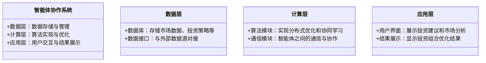
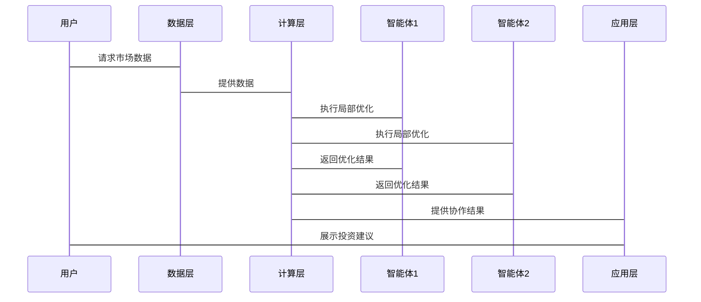

                 


# 《智能体协作增强价值投资的产品生命周期分析》

## 关键词：智能体协作、价值投资、产品生命周期、算法原理、系统架构、项目实战

## 摘要：  
本文将深入探讨智能体协作如何增强价值投资，并在产品生命周期中进行系统的分析。通过结合智能体协作的核心原理、价值投资的关键要素以及产品生命周期的管理策略，本文旨在为读者提供一种全新的视角，理解智能体协作在价值投资中的应用及其在产品生命周期中的具体表现。文章内容涵盖了智能体协作的基本概念、价值投资的分析框架、智能体协作在价值投资中的算法实现、系统架构设计以及实际案例分析，为读者提供全面而深入的理论支持和实践指导。

---

# 第一部分: 智能体协作与价值投资的背景与概念

## 第1章: 智能体协作概述

### 1.1 智能体协作的定义与特点  
#### 1.1.1 智能体的基本概念  
智能体（Agent）是指能够感知环境、自主决策并采取行动的实体。智能体可以是软件程序、机器人或其他具备智能行为的系统。智能体的核心特征包括自主性、反应性、目标导向性和学习能力。  

#### 1.1.2 智能体协作的核心特点  
智能体协作是指多个智能体在共同目标下协同工作的过程。其核心特点包括：  
- **目标一致性**：协作各方的目标必须一致或互补。  
- **信息共享**：智能体之间需要共享信息以实现协同。  
- **动态适应性**：协作过程需要根据环境变化实时调整策略。  

#### 1.1.3 智能体协作的优势与挑战  
**优势**：  
- 提高决策的准确性和效率。  
- 能够处理复杂任务，超越单一智能体的能力。  
- 通过分布式计算降低单点故障风险。  

**挑战**：  
- 智能体之间的通信和协调成本较高。  
- 存在“搭便车”问题，即部分智能体可能不积极参与协作。  
- 复杂环境下的协作策略设计难度较大。  

---

### 1.2 智能体协作的实现机制  
#### 1.2.1 智能体之间的通信与协调  
智能体协作的关键在于高效的通信机制。常见的通信方式包括：  
- **直接通信**：智能体之间通过共享内存或消息传递进行实时通信。  
- **间接通信**：通过中间媒介（如数据库或消息队列）进行信息传递。  

#### 1.2.2 协作任务的分配与调度  
协作任务的分配需要考虑以下因素：  
- **任务分解**：将复杂任务分解为多个子任务，分配给不同的智能体。  
- **资源约束**：根据智能体的资源能力进行任务分配。  
- **动态调整**：根据环境变化实时调整任务分配策略。  

#### 1.2.3 智能体协作的协议与标准  
为了确保智能体协作的规范性和兼容性，需要制定统一的协议和标准。常见的协议包括：  
- **FIPA（Foundation for Intelligent Physical Agents）**：定义了智能体协作的通信协议和交互模型。  
- **CORBA（Common Object Request Broker Architecture）**：支持分布式系统的对象请求代理机制。  

---

## 第2章: 价值投资的核心概念  

### 2.1 价值投资的定义与特点  
#### 2.1.1 价值投资的基本概念  
价值投资是一种以企业基本面分析为基础的投资策略，旨在通过识别被市场低估的优质企业实现长期收益。其核心理念是“买入低于内在价值的资产”。  

#### 2.1.2 价值投资的核心特点  
- **长期导向**：注重企业的长期盈利能力，而非短期价格波动。  
- **基本面分析**：基于财务报表、行业地位等因素评估企业价值。  
- **逆向思维**：在市场恐慌时寻找低估机会，在市场狂热时保持冷静。  

---

### 2.2 价值投资的关键要素  
#### 2.2.1 财务指标分析  
关键的财务指标包括：  
- **市盈率（P/E）**：衡量股票价格与每股收益的比率。  
- **市净率（P/B）**：衡量股票价格与每股净资产的比率。  
- **股息率**：衡量股票的分红能力。  

#### 2.2.2 行业分析与市场趋势  
行业分析是价值投资的重要组成部分，包括：  
- **行业生命周期分析**：判断行业所处的发展阶段（幼稚期、成长期、成熟期、衰退期）。  
- **行业竞争结构分析**：评估行业内竞争格局和市场进入壁垒。  

#### 2.2.3 公司基本面评估  
公司基本面评估包括：  
- **盈利能力**：如净利润率、ROE（净资产收益率）等。  
- **财务健康状况**：如资产负债率、现金流状况等。  
- **管理团队**：包括管理者的经验和战略能力。  

---

### 2.3 价值投资的决策过程  
#### 2.3.1 数据收集与分析  
投资者需要收集大量的数据，包括财务数据、行业数据、市场数据等，并进行清洗和预处理。  

#### 2.3.2 投资策略的制定  
根据数据分析结果，制定具体的投资策略，包括：  
- **资产配置**：确定不同资产的权重。  
- **买入时机**：选择合适的价位建仓。  
- **风险控制**：设定止损点和止盈点。  

#### 2.3.3 投资组合的优化  
通过智能优化算法（如现代投资组合理论）对投资组合进行优化，以最大化收益并最小化风险。  

---

## 第3章: 产品生命周期的分析框架  

### 3.1 产品生命周期的定义与阶段划分  
#### 3.1.1 产品生命周期的基本概念  
产品生命周期是指产品从进入市场到退出市场的整个过程，通常分为四个阶段：  
1. **导入期**：产品刚进入市场，需求较低，成本较高。  
2. **成长期**：产品需求快速增长，市场份额扩大。  
3. **成熟期**：市场趋于饱和，竞争加剧。  
4. **衰退期**：产品需求下降，市场份额逐渐被替代。  

#### 3.1.2 产品生命周期的四个阶段  
- **导入期**：企业需要加大推广力度，快速建立品牌形象。  
- **成长期**：企业应通过技术创新和成本控制扩大市场份额。  
- **成熟期**：企业需要通过差异化策略保持竞争优势。  
- **衰退期**：企业需要逐步退出市场，回收资源。  

---

### 3.2 产品生命周期中的关键指标  
#### 3.2.1 销量与市场占有率  
- **销量**：衡量产品在市场上的受欢迎程度。  
- **市场占有率**：衡量企业在市场中的竞争地位。  

#### 3.2.2 成本与收益分析  
- **单位成本**：衡量产品的生产效率。  
- **边际收益**：衡量每增加一单位产量带来的收益增量。  

#### 3.2.3 用户反馈与产品改进  
通过收集用户反馈，企业可以不断优化产品设计和功能，延长产品生命周期。  

---

## 第4章: 智能体协作在价值投资中的应用  

### 4.1 智能体协作与价值投资的结合  
#### 4.1.1 智能体协作如何增强价值投资  
智能体协作可以通过以下方式增强价值投资：  
- **数据收集与分析**：智能体可以实时收集和分析大量的市场数据，帮助投资者发现被低估的资产。  
- **决策支持**：智能体可以通过协作提供多维度的决策支持，提高投资决策的准确性和效率。  
- **风险管理**：智能体可以实时监控市场风险，并根据协作结果动态调整投资策略。  

#### 4.1.2 智能体协作在价值投资中的具体表现  
- **数据共享与协同分析**：多个智能体可以协同分析市场数据，提供更全面的评估结果。  
- **动态调整投资组合**：智能体可以根据市场变化实时调整投资组合，降低风险。  
- **智能预警机制**：智能体可以通过协作发现市场风险，提前预警并采取应对措施。  

---

### 4.2 智能体协作在产品生命周期中的应用  
#### 4.2.1 智能体协作如何优化产品生命周期管理  
智能体协作可以通过以下方式优化产品生命周期管理：  
- **精准市场定位**：智能体可以通过协作分析市场数据，帮助企业准确定位目标市场。  
- **动态调整产品策略**：智能体可以根据市场反馈实时调整产品策略，延长产品生命周期。  
- **高效资源配置**：智能体可以通过协作优化资源配置，降低成本，提高效率。  

#### 4.2.2 智能体协作在产品生命周期中的具体表现  
- **导入期**：智能体可以帮助企业快速推广产品，建立品牌形象。  
- **成长期**：智能体可以通过协作分析市场需求，帮助企业制定有效的市场扩展策略。  
- **成熟期**：智能体可以帮助企业通过差异化策略保持竞争优势。  
- **衰退期**：智能体可以通过协作帮助企业逐步退出市场，回收资源。  

---

## 第5章: 智能体协作增强价值投资的算法原理  

### 5.1 智能体协作算法的基本原理  
智能体协作算法的核心在于通过分布式计算和协同学习实现智能体之间的高效协作。常见的协作算法包括：  
- **分布式优化算法**：如分布式梯度下降。  
- **协同学习算法**：如联邦学习（Federated Learning）。  

#### 5.1.1 分布式优化算法  
分布式优化算法通过将优化任务分发给多个智能体，利用局部优化结果实现全局最优。其核心步骤包括：  
1. **初始化**：将任务分解为多个子任务，分配给不同的智能体。  
2. **局部优化**：每个智能体独立优化自己的子任务。  
3. **通信与同步**：智能体之间共享优化结果，更新全局模型。  
4. **迭代优化**：重复局部优化和全局同步，直至收敛。  

#### 5.1.2 协同学习算法  
协同学习算法通过多个智能体协作学习，共享知识和经验，提高学习效率。其核心步骤包括：  
1. **知识共享**：智能体之间共享学习数据和模型参数。  
2. **协同推理**：基于共享知识进行联合推理和决策。  
3. **动态调整**：根据环境变化动态调整学习策略。  

---

### 5.2 智能体协作算法的数学模型  
#### 5.2.1 分布式优化算法的数学模型  
分布式优化算法的目标是最小化以下损失函数：  
$$ L = \sum_{i=1}^{n} L_i $$  
其中，$L_i$ 是第 $i$ 个智能体的局部损失函数。  

#### 5.2.2 协同学习算法的数学模型  
协同学习算法的目标是通过多个智能体的协作，优化以下目标函数：  
$$ f(\theta) = \frac{1}{n} \sum_{i=1}^{n} f_i(\theta) $$  
其中，$\theta$ 是模型参数，$f_i(\theta)$ 是第 $i$ 个智能体的目标函数。  

---

## 第6章: 智能体协作增强价值投资的系统架构设计  

### 6.1 系统架构设计的总体思路  
智能体协作增强价值投资的系统架构设计需要考虑以下方面：  
- **系统功能设计**：包括数据采集、分析、决策支持等功能。  
- **系统架构设计**：采用分层架构，包括数据层、计算层和应用层。  
- **系统接口设计**：定义智能体之间的通信接口和数据格式。  

#### 6.1.1 领域模型类图  
以下是系统领域模型的类图：  


---

### 6.2 系统架构设计的详细说明  
#### 6.2.1 系统功能设计  
系统功能包括：  
- **数据采集**：从多个数据源获取市场数据。  
- **数据预处理**：清洗和转换数据，确保数据质量。  
- **智能体协作**：通过算法实现智能体协作，提供投资建议。  
- **结果展示**：将协作结果以可视化方式呈现给用户。  

#### 6.2.2 系统架构图  
以下是系统架构的mermaid图：  


---

### 6.3 系统交互设计  
#### 6.3.1 系统交互序列图  
以下是系统交互的mermaid序列图：  


---

## 第7章: 项目实战与案例分析  

### 7.1 项目实战  
#### 7.1.1 环境安装与配置  
- **工具安装**：安装Python、TensorFlow、Kafka等工具。  
- **数据源对接**：配置数据接口，对接金融数据源。  

#### 7.1.2 核心代码实现  
以下是核心代码示例：  
```python
import tensorflow as tf
from tensorflow.keras import layers

# 定义智能体协作模型
class Agent(tf.keras.Model):
    def __init__(self):
        super(Agent, self).__init__()
        self.dense1 = layers.Dense(64, activation='relu')
        self.dense2 = layers.Dense(1, activation='linear')

    def call(self, inputs):
        x = self.dense1(inputs)
        return self.dense2(x)

# 初始化智能体
agent = Agent()

# 定义损失函数
loss_fn = tf.keras.losses.MeanSquaredError()

# 定义优化器
optimizer = tf.keras.optimizers.Adam(learning_rate=0.001)

# 训练过程
def train_step(x, y):
    with tf.GradientTape() as tape:
        y_pred = agent(x)
        loss = loss_fn(y, y_pred)
    gradients = tape.gradient(loss, agent.trainable_weights)
    optimizer.apply_gradients(zip(gradients, agent.trainable_weights))
    return loss

# 开始训练
for epoch in range(100):
    for x_train, y_train in dataset:
        loss = train_step(x_train, y_train)
        print(f"Epoch {epoch}, Loss: {loss}")
```

---

### 7.2 案例分析  
#### 7.2.1 数据分析与建模  
以某股票为例，分析其历史数据，构建智能体协作模型，预测其未来走势。  

#### 7.2.2 模型训练与优化  
通过历史数据训练模型，调整超参数，优化模型性能。  

#### 7.2.3 结果分析与策略制定  
根据模型预测结果，制定投资策略，优化投资组合。  

---

## 第8章: 最佳实践与总结  

### 8.1 最佳实践  
#### 8.1.1 小结  
智能体协作通过分布式计算和协同学习，能够显著提升价值投资的效率和准确性。  

#### 8.1.2 注意事项  
- **数据质量**：确保数据的准确性和完整性。  
- **算法选择**：根据具体场景选择合适的协作算法。  
- **风险管理**：建立有效的风险管理机制，防范市场波动带来的风险。  

#### 8.1.3 拓展阅读  
建议进一步阅读以下内容：  
- 《The Intelligent Investor》——本杰明·格雷厄姆  
- 《分布式系统：概念与设计》——加里·纳什  

---

## 作者：AI天才研究院/AI Genius Institute & 禅与计算机程序设计艺术 /Zen And The Art of Computer Programming

