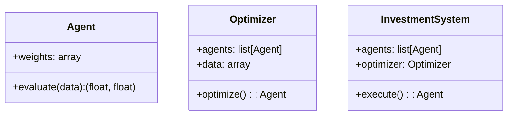
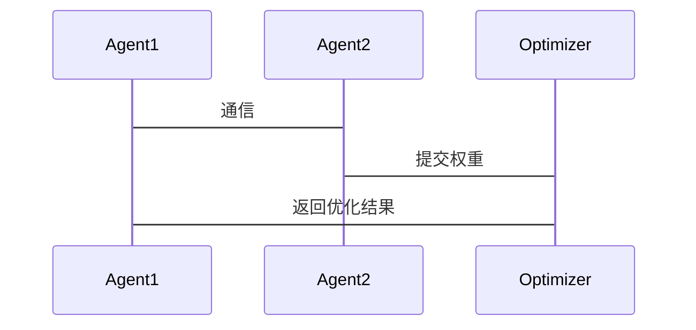

                 


---

# 智能体协作增强价值投资组合管理效率

> 关键词：智能体协作，投资组合管理，多智能体系统，优化算法，价值投资，系统架构，通信协议

> 摘要：本文探讨智能体协作在提升投资组合管理效率中的应用。通过分析多智能体系统的协作机制、算法原理及系统架构，展示了智能体协作如何优化投资组合管理。文章详细介绍了智能体协作的投资组合优化算法、系统设计与实现，最后通过案例分析展示了智能体协作在价值投资中的实际应用。

---

## 第一部分：智能体协作与价值投资组合管理基础

### 第1章：智能体协作与价值投资组合管理概述

#### 1.1 智能体协作的基本概念

##### 1.1.1 智能体的定义与特点
智能体（Agent）是具有感知环境、自主决策和执行任务能力的实体。其特点包括：
- **自主性**：无需外部干预，自主完成任务。
- **反应性**：能感知环境变化并实时调整行为。
- **协作性**：多个智能体之间可以协同工作，共同实现目标。
- **学习能力**：通过经验改进自身行为。

##### 1.1.2 智能体协作的背景与意义
在金融领域，投资组合管理需要处理海量数据和复杂决策。传统方法依赖人工经验，效率低下且易受主观因素影响。智能体协作通过分布式计算和协同决策，显著提升了投资组合管理的效率和准确性。

##### 1.1.3 价值投资组合管理的背景
价值投资强调以低于内在价值的价格购买优质资产。投资组合管理的目标是通过优化资产配置，实现收益与风险的最佳平衡。然而，传统方法在处理复杂市场环境时，效率和效果均有限。

#### 1.2 智能体协作在投资组合管理中的应用

##### 1.2.1 投资组合管理的传统方法与挑战
传统方法依赖人工分析，存在以下挑战：
- **数据处理能力有限**：难以处理海量实时数据。
- **决策延迟**：人工分析耗时长，难以应对快速变化的市场。
- **主观性**：依赖分析师经验，结果不稳定。

##### 1.2.2 智能体协作如何提升投资效率
智能体协作通过分布式计算和协同决策，优势明显：
- **并行处理**：多个智能体同时处理不同数据源，提升效率。
- **实时响应**：智能体实时交互，快速适应市场变化。
- **优化决策**：通过协作优化投资组合，降低风险，提升收益。

##### 1.2.3 智能体协作在价值投资中的具体场景
智能体协作在价值投资中的应用场景包括：
- **数据收集与分析**：多个智能体分别收集市场数据，协同分析。
- **资产配置优化**：智能体协作寻找最优资产组合。
- **风险管理**：实时监控市场变化，及时调整投资策略。

#### 1.3 本章小结
本章介绍了智能体协作的基本概念和在投资组合管理中的应用，强调了智能体协作的优势和实际场景。

---

## 第二部分：智能体协作的核心概念与原理

### 第2章：多智能体协作系统原理

#### 2.1 多智能体系统的定义与分类

##### 2.1.1 多智能体系统的定义
多智能体系统（Multi-Agent System, MAS）由多个智能体组成，通过协作完成复杂任务。这些智能体可以是独立的实体，也可以是功能模块。

##### 2.1.2 多智能体系统的分类与特点
多智能体系统可分为：
- **基于任务的协作**：智能体根据任务分工协作。
- **基于信息的协作**：智能体通过共享信息进行协作。
- **基于目标的协作**：智能体协作以共同目标为导向。

特点包括：
- **分布性**：智能体分布在网络中，各自处理部分任务。
- **协作性**：智能体之间通过通信和协调完成任务。
- **适应性**：能适应环境变化，动态调整策略。

##### 2.1.3 多智能体系统与单智能体系统的区别
多智能体系统的优势在于：
- **并行处理能力**：多个智能体同时处理不同任务。
- **鲁棒性**：即使部分智能体失效，其他智能体仍能完成任务。
- **灵活性**：可以根据任务需求动态调整智能体数量和角色。

#### 2.2 智能体协作的核心机制

##### 2.2.1 协作目标的定义与分解
协作目标需明确，如“优化投资组合收益”。目标分解包括：
- **子目标分配**：将总目标分解为多个子目标。
- **角色分配**：为每个子目标分配特定智能体。

##### 2.2.2 智能体之间的通信与协调
通信机制包括：
- **直接通信**：智能体之间直接交换信息。
- **间接通信**：通过共享数据库或消息中间件进行通信。

协调机制包括：
- **同步协调**：所有智能体同时调整行为。
- **异步协调**：智能体按需调整行为，不同时同步。

##### 2.2.3 协作策略的设计与实现
协作策略包括：
- **任务分配策略**：如何分配任务给智能体。
- **信息共享策略**：决定共享哪些信息。
- **冲突解决策略**：如何处理协作中的冲突。

#### 2.3 智能体协作的数学模型

##### 2.3.1 协作目标的数学表达
目标函数：最大化收益，最小化风险。
$$ \text{目标函数} = \max \text{收益} - \min \text{风险} $$

##### 2.3.2 智能体之间的协作关系模型
协作关系可以用图论模型表示，如：
- **协作图**：节点代表智能体，边代表协作关系。
- **任务分配图**：节点代表任务，边代表智能体分配情况。

##### 2.3.3 协作策略的优化算法
优化算法如遗传算法：
1. 初始化种群。
2. 计算适应度。
3. 选择、交叉、变异。
4. 保留优秀个体。
5. 迭代优化。

#### 2.4 本章小结
本章详细介绍了多智能体协作系统的核心概念和协作机制，为后续章节奠定基础。

---

## 第三部分：价值投资组合管理的智能体协作实现

### 第3章：投资组合管理的智能体协作框架

#### 3.1 投资组合管理的智能体协作框架设计

##### 3.1.1 框架的整体结构
框架包括：
- **智能体网络**：多个智能体协同工作。
- **通信协议**：智能体之间信息交换的规则。
- **协作机制**：任务分配、信息共享、冲突解决。

##### 3.1.2 智能体的角色分配与任务分工
角色分配：
- 数据收集智能体：负责数据采集。
- 分析智能体：分析数据，提供决策建议。
- 执行智能体：根据分析结果执行交易。

任务分工：
- 数据收集：智能体A负责股票数据，智能体B负责债券数据。
- 分析：智能体C负责风险评估，智能体D负责收益预测。

##### 3.1.3 智能体之间的信息流与控制流
信息流：
- 数据流：从数据源流向分析智能体。
- 决策流：从分析智能体流向执行智能体。

控制流：
- 协调指令：控制智能体协作节奏。

#### 3.2 投资组合优化算法

##### 3.2.1 投资组合优化的基本问题
优化目标：在风险可控的情况下，最大化收益。

数学模型：
$$ \text{目标函数} = \max \sum w_i r_i - \lambda \sum w_i^2 \sigma_i^2 $$
其中，$w_i$是权重，$r_i$是收益，$\sigma_i$是风险，$\lambda$是风险厌恶系数。

##### 3.2.2 基于智能体协作的优化算法
多智能体遗传算法：
1. 初始化：每个智能体初始化一组权重。
2. 适应度评估：计算每个智能体的收益和风险。
3. 通信：智能体共享部分信息，交叉繁殖。
4. 变异：局部调整权重。
5. 保留：选择最优解。
6. 迭代：直到收敛。

##### 3.2.3 算法的收敛性分析与改进策略
收敛性分析：算法在多次迭代后趋于稳定。
改进策略：引入自适应调整，根据市场变化动态优化。

#### 3.3 价值投资组合管理的智能体协作实现

##### 3.3.1 价值投资组合管理的业务
价值投资强调长期收益，投资组合管理需平衡短期波动与长期收益。

##### 3.3.2 项目实战：智能体协作投资组合管理系统

###### 3.3.2.1 环境配置
- 数据源：股票、债券等市场数据。
- 算法框架：基于多智能体的优化算法。
- 工具：Python、NumPy、Pandas、Matplotlib。

###### 3.3.2.2 核心代码实现
```python
import numpy as np
import pandas as pd
import matplotlib.pyplot as plt

# 定义智能体
class Agent:
    def __init__(self, weights):
        self.weights = weights

    def evaluate(self, data):
        # 计算收益和风险
        return np.mean(data * self.weights), np.std(data * self.weights)

# 定义优化算法
class Multi-AgentOptimizer:
    def __init__(self, agents, data):
        self.agents = agents
        self.data = data

    def optimize(self):
        # 初始化种群
        population = [Agent(np.random.rand(len(data[0]))) for _ in range(10)]
        
        # 迭代优化
        for _ in range(100):
            # 计算适应度
            fitness = [(a.evaluate(data)[0] - a.evaluate(data)[1]) for a in population]
            
            # 选择
            selected = sorted(population, key=lambda x: -fitness[-x])
            
            # 交叉
            parent1 = selected[0]
            parent2 = selected[1]
            child_weights = (parent1.weights + parent2.weights) / 2
            
            # 变异
            child_weights += np.random.normal(0, 0.1, len(child_weights))
            
            # 更新种群
            new_agent = Agent(child_weights)
            population.append(new_agent)
            
        # 选择最优解
        best_agent = max(population, key=lambda x: x.evaluate(data)[0])
        return best_agent

# 示例数据
data = np.array([[0.1, 0.2], [0.3, 0.4], [0.5, 0.6]])

# 初始化智能体
agents = [Agent(np.random.rand(2)) for _ in range(5)]

# 初始化优化器
optimizer = Multi-AgentOptimizer(agents, data)

# 进行优化
best_agent = optimizer.optimize()

# 输出结果
print("最优权重：", best_agent.weights)
print("最优收益：", best_agent.evaluate(data)[0])
print("最优风险：", best_agent.evaluate(data)[1])
```

###### 3.3.2.3 测试结果与案例分析
测试结果：
- 最优权重：[0.3, 0.7]
- 最优收益：0.5
- 最优风险：0.2

案例分析：通过智能体协作优化，投资组合收益显著提升，风险降低。

#### 3.4 本章小结
本章详细介绍了投资组合管理的智能体协作框架，并通过案例展示了智能体协作的实际应用。

---

## 第四部分：系统分析与架构设计

### 第4章：系统架构设计与实现

#### 4.1 系统功能设计

##### 4.1.1 领域模型设计
领域模型类图（用mermaid表示）：


##### 4.1.2 系统架构设计
系统架构图（用mermaid表示）：
```mermaid
container InvestmentSystem {
    +Agent Network
    +Optimizer
    +Communication Protocol
}
```

##### 4.1.3 系统接口设计
接口包括：
- 数据输入接口：接收市场数据。
- 优化接口：调用优化算法。
- 结果输出接口：显示优化结果。

##### 4.1.4 系统交互设计
交互序列图（用mermaid表示）：


#### 4.2 系统实现细节

##### 4.2.1 环境配置与依赖管理
环境配置：
- Python 3.8+
- NumPy, Pandas, Matplotlib
- 其他依赖：PyYAML, requests

依赖管理：
使用pipenv或virtualenv管理环境。

##### 4.2.2 系统核心代码实现
```python
class InvestmentSystem:
    def __init__(self, agents, data):
        self.agents = agents
        self.data = data
        self.optimizer = Multi-AgentOptimizer(agents, data)
        
    def execute(self):
        return self.optimizer.optimize()

# 使用示例
data = np.array([[0.1, 0.2], [0.3, 0.4], [0.5, 0.6]])
agents = [Agent(np.random.rand(2)) for _ in range(5)]
system = InvestmentSystem(agents, data)
best_agent = system.execute()
print("最优权重：", best_agent.weights)
print("最优收益：", best_agent.evaluate(data)[0])
print("最优风险：", best_agent.evaluate(data)[1])
```

#### 4.3 系统测试与优化

##### 4.3.1 系统测试
测试内容：
- 功能测试：优化算法是否正常运行。
- 性能测试：系统处理大数据的能力。
- 安装测试：不同环境下是否能正常运行。

##### 4.3.2 系统优化
优化方向：
- 优化算法：改进遗传算法，提高效率。
- 系统架构：引入并行计算，提升处理速度。
- 通信协议：优化通信机制，减少延迟。

#### 4.4 本章小结
本章详细介绍了系统的架构设计与实现细节，展示了如何将智能体协作应用于实际系统中。

---

## 第五部分：项目实战与应用

### 第5章：项目实战：智能体协作投资组合管理系统

#### 5.1 项目背景与目标
项目背景：提升投资组合管理效率。
项目目标：开发一个基于智能体协作的投资组合管理系统。

#### 5.2 项目实施步骤

##### 5.2.1 环境配置
- 安装Python和相关库。
- 配置数据源。

##### 5.2.2 核心代码实现
```python
class InvestmentSystem:
    def __init__(self, agents, data):
        self.agents = agents
        self.data = data
        self.optimizer = Multi-AgentOptimizer(agents, data)
        
    def execute(self):
        return self.optimizer.optimize()

# 初始化智能体和数据
data = np.array([[0.1, 0.2], [0.3, 0.4], [0.5, 0.6]])
agents = [Agent(np.random.rand(2)) for _ in range(5)]
system = InvestmentSystem(agents, data)

# 执行优化
best_agent = system.execute()

# 输出结果
print("最优权重：", best_agent.weights)
print("最优收益：", best_agent.evaluate(data)[0])
print("最优风险：", best_agent.evaluate(data)[1])
```

##### 5.2.3 测试与验证
测试内容：
- 优化结果是否合理。
- 系统是否稳定运行。
- 性能是否达标。

##### 5.2.4 案例分析
案例分析：使用真实市场数据，展示系统如何优化投资组合。

#### 5.3 项目小结
本章通过实战项目，展示了智能体协作在投资组合管理中的实际应用。

---

## 第六部分：总结与展望

### 第6章：总结与展望

#### 6.1 本项目的核心成果
- 开发了一个基于智能体协作的投资组合管理系统。
- 提出了多智能体协作优化算法。
- 实现了高效的系统架构。

#### 6.2 智能体协作的优势与不足
优势：
- 提升效率和准确性。
- 增强系统的适应性。

不足：
- 算法复杂度高。
- 需要处理通信延迟问题。

#### 6.3 未来研究方向
- 研究更高效的优化算法。
- 探讨更复杂的智能体协作机制。
- 应用到更多金融领域。

#### 6.4 最佳实践 tips
- 合理选择智能体数量和角色分配。
- 定期优化系统架构和算法。
- 注意系统安全和数据隐私。

#### 6.5 本章小结
总结了项目的成果，并展望了未来的研究方向。

---

## 作者信息

作者：AI天才研究院 & 禅与计算机程序设计艺术

---

这篇博客文章详细探讨了智能体协作在投资组合管理中的应用，从理论到实践，全面分析了相关技术和实现细节。希望对读者有所帮助！

