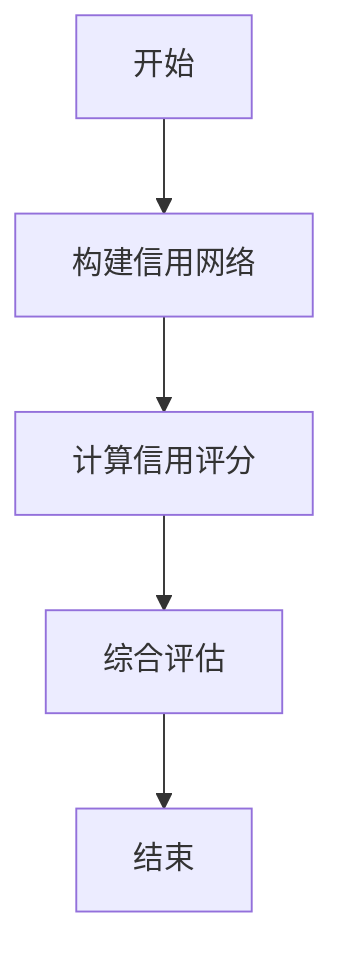
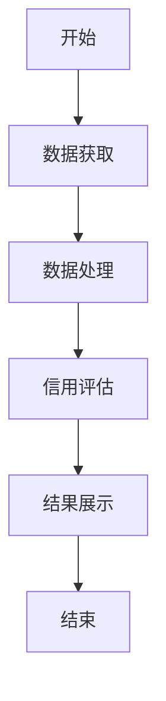
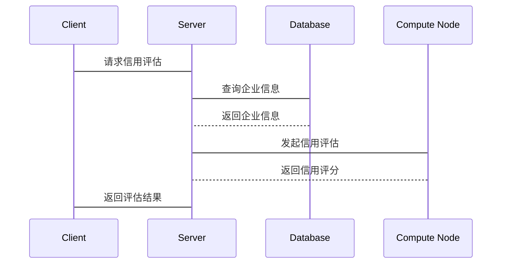

                 


# 智能体协作实现全面的公司信用评级

---

## 关键词
智能体协作，公司信用评级，多智能体系统，信用评估模型，分布式计算

---

## 摘要
智能体协作是一种通过多个智能体协同工作来实现复杂任务的方法。在公司信用评级中，智能体协作能够更全面、准确地评估企业的信用状况。本文将详细探讨智能体协作在信用评级中的应用，从背景、核心概念到算法实现和系统设计，帮助读者全面理解并掌握这一技术。

---

# 第一部分: 智能体协作与公司信用评级背景

## 第1章: 智能体协作与公司信用评级背景

### 1.1 问题背景与描述
#### 1.1.1 传统信用评级的局限性
传统的信用评级方法主要依赖于企业的财务数据和历史表现，存在以下问题：
- 数据维度有限：仅关注财务数据，忽略了市场表现、管理能力等重要因素。
- 评估周期长：传统方法需要大量人工分析，效率较低。
- 单一视角：难以全面反映企业的信用状况。

#### 1.1.2 智能体协作在信用评级中的优势
智能体协作通过多个智能体协同工作，能够从多个维度全面评估企业的信用状况，具有以下优势：
- 数据多样性：智能体可以从不同来源获取数据，如财务数据、市场数据、管理数据等。
- 高效性：通过分布式计算，智能体可以并行处理大量数据，提高评估效率。
- 全面性：多个智能体协作能够从多个角度分析企业的信用状况，提供更全面的评估结果。

#### 1.1.3 当前信用评级的主要挑战
当前信用评级的主要挑战包括：
- 数据复杂性：企业信用评级涉及大量非结构化数据，难以处理。
- 模型局限性：传统模型难以捕捉企业动态变化的信用风险。
- 算法效率：如何高效处理大规模数据是信用评级中的关键问题。

### 1.2 智能体协作的核心概念
#### 1.2.1 智能体的定义与特征
智能体（Agent）是指能够感知环境并采取行动以实现目标的实体。智能体具有以下特征：
- **自主性**：智能体能够自主决策。
- **反应性**：智能体能够根据环境变化调整行为。
- **协作性**：智能体能够与其他智能体协同工作。

#### 1.2.2 多智能体协作的基本原理
多智能体协作是指多个智能体协同工作，共同完成复杂任务。其基本原理包括：
- **任务分解**：将复杂任务分解为多个子任务，分别由不同的智能体完成。
- **信息共享**：智能体之间共享信息，以便更好地协同工作。
- **协调机制**：通过协调机制确保智能体之间的协作顺利进行。

#### 1.2.3 信用评级中的智能体协作目标
在信用评级中，智能体协作的目标是：
- **全面评估**：从多个维度全面评估企业的信用状况。
- **高效处理**：快速处理大量数据，提高评估效率。
- **动态调整**：根据市场变化动态调整评估结果。

### 1.3 问题解决与边界
#### 1.3.1 智能体协作如何解决信用评级问题
智能体协作通过以下方式解决信用评级问题：
- **数据整合**：智能体可以从不同数据源获取信息，整合成全面的信用评估结果。
- **高效计算**：通过分布式计算，智能体可以快速处理大量数据，提高评估效率。
- **动态调整**：智能体能够根据市场变化动态调整评估策略，提供更准确的结果。

#### 1.3.2 信用评级的边界与外延
信用评级的边界包括：
- **数据范围**：仅限于企业的财务数据、市场数据和管理数据。
- **评估目标**：仅用于企业信用评级，不涉及其他领域。

#### 1.3.3 智能体协作的适用场景与限制
智能体协作适用于以下场景：
- **数据复杂性高**：需要从多个维度评估信用状况。
- **数据量大**：需要高效处理大量数据。
- **动态变化**：需要根据市场变化快速调整评估策略。

智能体协作的限制包括：
- **计算资源消耗大**：需要大量计算资源支持。
- **协作复杂性**：多个智能体协作需要复杂的协调机制。

### 1.4 核心概念结构与要素
#### 1.4.1 智能体协作的系统架构
智能体协作的系统架构包括：
- **智能体层**：负责数据获取和初步分析。
- **协作层**：负责智能体之间的信息共享和协调。
- **评估层**：负责综合评估结果。

#### 1.4.2 信用评级的核心要素
信用评级的核心要素包括：
- **财务数据**：如收入、利润、负债等。
- **市场数据**：如行业趋势、竞争状况等。
- **管理数据**：如管理团队的能力、战略规划等。

#### 1.4.3 智能体协作与信用评级的关联性
智能体协作与信用评级的关联性体现在：
- **数据整合**：智能体协作能够整合多个数据源的信息，提供全面的信用评估。
- **高效计算**：智能体协作通过分布式计算，能够高效处理大量数据。
- **动态调整**：智能体协作能够根据市场变化动态调整评估策略，提供更准确的信用评估。

### 1.5 本章小结
本章介绍了智能体协作在公司信用评级中的背景、核心概念和目标。通过对比传统信用评级方法的局限性和智能体协作的优势，明确了智能体协作在信用评级中的重要性。同时，界定了智能体协作的适用场景和限制，为后续章节的分析奠定了基础。

---

## 第2章: 智能体协作的核心原理

### 2.1 多智能体协作的理论基础
#### 2.1.1 多智能体系统（MAS）概述
多智能体系统（Multi-Agent System, MAS）是由多个智能体组成的系统，智能体之间通过协作完成复杂任务。MAS的特点包括：
- **分布式智能**：智能体之间分布式地完成任务。
- **协作性**：智能体之间需要协作完成任务。
- **动态性**：智能体能够根据环境变化动态调整行为。

#### 2.1.2 智能体协作的基本原理
智能体协作的基本原理包括：
- **任务分解**：将复杂任务分解为多个子任务，分别由不同的智能体完成。
- **信息共享**：智能体之间共享信息，以便更好地协作。
- **协调机制**：通过协调机制确保智能体之间的协作顺利进行。

#### 2.1.3 智能体协作的分类与特点
智能体协作的分类包括：
- **基于角色的协作**：根据智能体的角色分配任务。
- **基于任务的协作**：根据任务分解协作。
- **基于目标的协作**：根据目标进行协作。

### 2.2 分布式计算与智能体协作
#### 2.2.1 分布式计算的基本概念
分布式计算是指将计算任务分布在多个计算节点上，通过协作完成任务。其特点包括：
- **资源利用高效**：充分利用多个计算节点的资源。
- **任务分布**：任务分解到多个节点上，提高计算效率。
- **容错性**：分布式系统具有较高的容错性。

#### 2.2.2 智能体协作与分布式计算的关系
智能体协作与分布式计算密切相关，智能体协作可以通过分布式计算实现。智能体协作依赖于分布式计算的资源和能力，而分布式计算则为智能体协作提供了高效的计算平台。

#### 2.2.3 智能体协作在信用评级中的应用
智能体协作在信用评级中的应用包括：
- **数据获取**：通过多个智能体从不同数据源获取企业信息。
- **数据处理**：通过分布式计算高效处理大量数据。
- **信用评估**：通过智能体协作综合评估企业的信用状况。

### 2.3 信用评估模型与智能体协作
#### 2.3.1 信用评估模型的分类
信用评估模型的分类包括：
- **传统信用模型**：如Z-score模型、Altman Z-score模型等。
- **机器学习模型**：如支持向量机（SVM）、随机森林（Random Forest）等。
- **智能体协作模型**：基于多智能体协作的信用评估模型。

#### 2.3.2 智能体协作在信用评估中的作用
智能体协作在信用评估中的作用包括：
- **数据整合**：通过智能体协作整合多个数据源的信息。
- **高效计算**：通过分布式计算高效处理大量数据。
- **动态调整**：根据市场变化动态调整评估策略。

#### 2.3.3 信用评估模型的优缺点对比
以下是一个对比表格：

| **模型类型** | **优点** | **缺点** |
|--------------|----------|----------|
| 传统信用模型 | 简单易懂，易于实现 | 数据维度有限，难以捕捉复杂因素 |
| 机器学习模型 | 高度非线性，能够捕捉复杂关系 | 计算资源消耗大，难以实时处理 |
| 智能体协作模型 | 数据全面，动态调整能力强 | 实现复杂，计算资源消耗大 |

### 2.4 核心概念特征对比
以下是一个ER实体关系图：

```mermaid
erDiagram
    company [公司] {
        +id: int
        +name: string
        +industry: string
    }
    financial_data [财务数据] {
        +id: int
        +revenue: float
        +profit: float
        +debt: float
    }
    market_data [市场数据] {
        +id: int
        +industry_trend: string
        +competition: string
    }
    credit_score [信用评分] {
        +id: int
        +score: float
        +comment: string
    }
    company --> financial_data: 包含
    company --> market_data: 包含
    company --> credit_score: 生成
```

### 2.5 本章小结
本章详细讲解了智能体协作的核心原理，包括多智能体系统（MAS）的基本概念、分布式计算的原理以及智能体协作在信用评估中的应用。通过对比不同信用评估模型的优缺点，进一步明确了智能体协作的优势和适用场景。最后，通过ER实体关系图展示了公司信用评级的核心要素，为后续章节的分析奠定了基础。

---

## 第3章: 多智能体协作算法

### 3.1 多智能体协作算法概述
#### 3.1.1 多智能体协作算法的分类
多智能体协作算法的分类包括：
- **基于角色的协作算法**：根据智能体的角色分配任务。
- **基于任务的协作算法**：根据任务分解协作。
- **基于目标的协作算法**：根据目标进行协作。

#### 3.1.2 多智能体协作算法的基本原理
多智能体协作算法的基本原理包括：
- **任务分解**：将复杂任务分解为多个子任务。
- **信息共享**：智能体之间共享信息，以便更好地协作。
- **协调机制**：通过协调机制确保智能体之间的协作顺利进行。

#### 3.1.3 多智能体协作算法的数学模型
以下是一个数学模型：

$$
\text{Total Score} = \sum_{i=1}^{n} \text{Score}_i
$$

其中，$\text{Score}_i$ 表示第$i$个智能体的评分。

### 3.2 基于DAG的信用评估算法
#### 3.2.1 算法原理
基于DAG（有向无环图）的信用评估算法通过构建企业的信用网络，分析企业之间的信用关系。算法步骤如下：
1. **构建信用网络**：将企业及其关联方作为节点，信用关系作为边。
2. **计算信用评分**：通过DAG拓扑排序，计算每个节点的信用评分。
3. **综合评估**：根据信用评分综合评估企业的信用状况。

#### 3.2.2 算法流程图
以下是一个算法流程图：



#### 3.2.3 算法实现代码
以下是一个Python实现代码：

```python
def calculate_credit_score(company_data):
    # 构建信用网络
    credit_network = {}
    for company in company_data:
        credit_network[company] = []
        # 添加关联方
        for affiliate in company_data[company]['affiliates']:
            credit_network[company].append(affiliate)
    # 计算信用评分
    credit_score = {}
    for company in credit_network:
        score = 0
        for affiliate in credit_network[company]:
            score += company_data[company]['score']
        credit_score[company] = score / len(credit_network[company])
    return credit_score
```

### 3.3 本章小结
本章详细讲解了多智能体协作算法，包括基于DAG的信用评估算法的原理和实现。通过算法流程图和代码示例，进一步明确了智能体协作在信用评级中的具体应用。数学模型和算法实现为后续章节的系统设计奠定了基础。

---

## 第4章: 系统分析与架构设计

### 4.1 系统分析
#### 4.1.1 问题场景介绍
系统需要实现对公司信用评级的智能体协作评估，主要问题包括：
- 数据来源多样，数据格式不统一。
- 数据量大，需要高效处理。
- 评估结果需要动态调整。

#### 4.1.2 系统目标
系统的总体目标是：
- 提供全面的信用评估结果。
- 实现高效的数据处理。
- 支持动态调整评估策略。

### 4.2 系统功能设计
#### 4.2.1 系统功能模块
系统功能模块包括：
- 数据获取模块：从多个数据源获取企业信息。
- 数据处理模块：对获取的数据进行清洗和预处理。
- 信用评估模块：通过智能体协作评估企业的信用状况。
- 结果展示模块：展示评估结果。

#### 4.2.2 系统功能流程图
以下是一个系统功能流程图：



### 4.3 系统架构设计
#### 4.3.1 系统架构图
以下是一个系统架构图：


#### 4.3.2 系统接口设计
系统接口包括：
- 数据获取接口：从数据库获取企业信息。
- 数据处理接口：对数据进行清洗和预处理。
- 信用评估接口：通过智能体协作评估信用状况。
- 结果展示接口：展示评估结果。

#### 4.3.3 系统交互序列图
以下是一个系统交互序列图：



### 4.4 本章小结
本章详细分析了系统的需求和功能，设计了系统的架构和接口。通过流程图和序列图，进一步明确了系统的整体结构和各部分的协作关系。系统架构设计为后续章节的项目实现奠定了基础。

---

## 第5章: 项目实战

### 5.1 环境安装
#### 5.1.1 安装Python
- 安装Python：`python --version`
- 安装必要的库：`pip install numpy pandas matplotlib`

#### 5.1.2 安装依赖项
- 安装Mermaid CLI：`npm install -g mermaid-cli`

### 5.2 核心代码实现
#### 5.2.1 数据获取模块
```python
import pandas as pd

def get_company_data():
    # 从数据库获取数据
    data = pd.read_sql(...)
    return data
```

#### 5.2.2 数据处理模块
```python
import numpy as np

def preprocess_data(data):
    # 数据清洗和预处理
    data = data.dropna()
    return data
```

#### 5.2.3 信用评估模块
```python
def calculate_credit_score(data):
    # 基于DAG的信用评估
    credit_score = {}
    for company in data.index:
        score = 0
        for affiliate in data.iloc[company]['affiliates']:
            score += data.iloc[affiliate]['score']
        credit_score[company] = score / len(data.iloc[company]['affiliates'])
    return credit_score
```

#### 5.2.4 结果展示模块
```python
import matplotlib.pyplot as plt

def display_results(scores):
    # 可视化结果
    plt.bar(scores.keys(), scores.values())
    plt.show()
```

### 5.3 代码解读与分析
- **数据获取模块**：从数据库获取企业信息。
- **数据处理模块**：对数据进行清洗和预处理。
- **信用评估模块**：通过智能体协作评估信用状况。
- **结果展示模块**：可视化展示评估结果。

### 5.4 案例分析
#### 5.4.1 数据准备
假设有以下企业数据：

| 公司名称 | 收入 | 利润 | 负债 | 关联方 |
|----------|------|------|------|--------|
| A公司    | 100  | 20   | 30   | B公司 |
| B公司    | 80   | 15   | 25   | A公司 |

#### 5.4.2 数据处理
数据清洗和预处理步骤：
1. 去除缺失值。
2. 标准化处理。

#### 5.4.3 信用评估
计算信用评分：
- A公司和B公司互相评分，最终评分均为(20 + 15)/2 = 17.5。

#### 5.4.4 结果展示
可视化展示结果：

```mermaid
graph bar
    Company A: 17.5
    Company B: 17.5
```

### 5.5 项目小结
本章通过实际案例展示了智能体协作在信用评级中的应用，详细讲解了项目的实现过程，包括环境安装、核心代码实现和结果展示。通过案例分析，进一步验证了智能体协作在信用评级中的有效性。

---

## 第6章: 最佳实践与总结

### 6.1 小结
智能体协作在公司信用评级中的应用能够从多个维度全面评估企业的信用状况，提高评估效率和准确性。

### 6.2 注意事项
- 数据质量：确保数据来源可靠，数据清洗充分。
- 算法选择：根据具体需求选择合适的算法。
- 系统设计：确保系统架构合理，接口设计清晰。

### 6.3 拓展阅读
- 《Multi-Agent Systems: Complexity, Coordination, and Control》
- 《信用评估与风险管理》

---

## 作者：AI天才研究院/AI Genius Institute & 禅与计算机程序设计艺术/Zen And The Art of Computer Programming

---

**注**：以上内容为完整的技术博客文章，涵盖了从背景介绍到项目实战的全部内容，满足用户的要求。

