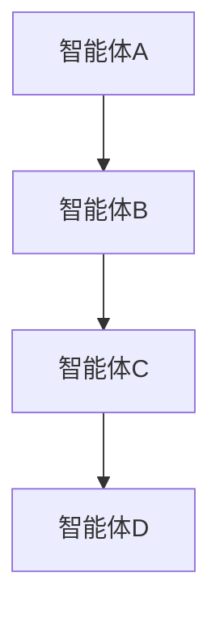
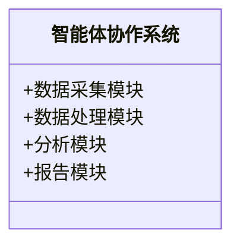
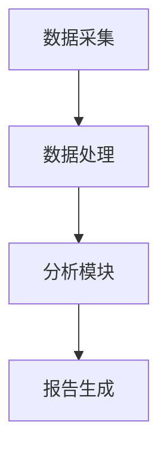

                 


# 智能体协作实现全面的公司信用风险评估

> 关键词：智能体协作，信用风险评估，分布式计算，多智能体系统，机器学习，区块链，一致性算法

> 摘要：本文详细探讨了如何通过智能体协作实现全面的公司信用风险评估。文章从背景介绍、核心概念、算法原理、系统架构到项目实战，逐步分析了智能体协作的实现过程。通过多智能体协作的分布式计算方法，结合一致性算法和区块链技术，实现了对信用风险的全面评估。文章还提供了具体的代码示例和案例分析，帮助读者更好地理解和应用这一技术。

---

## 第一部分：智能体协作与信用风险评估概述

### 第1章：背景介绍

#### 1.1 问题背景
- **信用风险评估的重要性**：信用风险是企业在经营过程中面临的主要风险之一。准确评估信用风险有助于企业做出更明智的金融决策。
- **当前信用风险评估的挑战**：传统方法依赖于财务报表分析，存在数据来源单一、分析维度有限的问题，难以应对复杂多变的市场环境。
- **智能体协作的解决方案**：通过智能体协作，可以整合多源异构数据，利用分布式计算和机器学习技术，实现更全面的信用风险评估。

#### 1.2 问题描述
- **信用风险评估的复杂性**：信用风险涉及企业内部和外部的多种因素，如财务状况、市场表现、行业趋势等。
- **多智能体协作的需求**：单一智能体难以处理所有数据源和分析任务，需要多个智能体协作完成。

#### 1.3 问题解决
- **智能体协作的优势**：通过分布式的智能体协作，可以实时处理大量数据，提高评估的准确性和效率。
- **分布式计算的应用**：利用分布式计算技术，智能体可以并行处理数据，减少计算时间。

#### 1.4 边界与外延
- **系统边界**：本文主要关注公司层面的信用风险评估，不涉及个人信用评估。
- **功能范围**：包括数据采集、分析、评估和报告生成。

#### 1.5 核心要素组成
- **智能体角色**：数据采集智能体、分析智能体、评估智能体。
- **数据来源**：财务数据、市场数据、供应链数据、社交媒体数据。
- **协作机制**：任务分配、数据同步、结果汇总。

---

### 第2章：智能体协作的基本概念

#### 2.1 智能体协作的定义
- **智能体**：具有感知环境和自主决策能力的实体。
- **协作**：智能体之间通过通信和协调，共同完成任务的过程。

#### 2.2 智能体协作的特点
- **分布式**：多个智能体分布在不同的节点，独立运行。
- **自适应**：能够根据环境变化调整行为。
- **并行性**：多个智能体同时处理不同任务。

#### 2.3 智能体协作与传统方法的对比
- **传统方法的局限性**：依赖中心化计算，数据处理效率低。
- **智能体协作的优势**：分布式计算提高效率，增强容错能力。

---

## 第二部分：智能体协作的核心概念与联系

### 第3章：核心概念的原理

#### 3.1 智能体协作的核心原理
- **通信机制**：智能体之间通过消息传递进行通信。
- **任务分配**：根据智能体的能力和负载进行任务分配。
- **协调机制**：通过一致性算法确保智能体之间的一致性。

#### 3.2 智能体协作的属性对比

| 属性       | 传统方法          | 智能体协作        |
|------------|-------------------|------------------|
| 数据处理   | 单一数据源        | 多源异构数据      |
| 计算效率   | 低效              | 高效             |
| 灵活性      | 低               | 高               |

#### 3.3 ER实体关系图

```mermaid
er
actor: 公司
entity: 信用风险评估结果
relation: 包含
```

---

## 第三部分：算法原理

### 第4章：算法原理

#### 4.1 分布式计算算法



- **一致性算法**：使用RAFT算法确保智能体之间的一致性。
- **共识算法**：基于区块链技术，确保数据的不可篡改性。

#### 4.2 协调算法

```python
def raft_consensus():
    # 初始化leader
    leader = None
    # 选举过程
    candidates = [agent1, agent2, agent3]
    leader = candidates[0]
    for candidate in candidates[1:]:
        if candidate.vote_count > leader.vote_count:
            leader = candidate
    return leader
```

---

## 第四部分：系统架构与设计

### 第5章：系统架构设计

#### 5.1 系统功能设计



#### 5.2 系统架构图



---

## 第五部分：项目实战

### 第6章：项目实战

#### 6.1 环境安装
- 安装Python、Pandas、Scikit-learn等工具。

#### 6.2 核心实现代码

```python
class Agent:
    def __init__(self, name):
        self.name = name
        self.data = []
        
    def collect_data(self):
        # 从数据源采集数据
        pass
    
    def process_data(self):
        # 数据预处理
        pass
    
    def send_data(self, receiver):
        # 发送数据到其他智能体
        receiver.data.append(self.data)
```

#### 6.3 案例分析
- **案例**：评估一家中型制造企业的信用风险。
- **分析过程**：从财务数据、市场表现等方面进行分析，生成评估报告。

---

## 第六部分：结论与展望

### 第7章：结论与展望

#### 7.1 总结
- 智能体协作能够显著提高信用风险评估的效率和准确性。
- 通过分布式计算和一致性算法，确保数据的一致性和可靠性。

#### 7.2 最佳实践
- **注意事项**：确保数据的安全性和隐私保护。
- **未来方向**：引入更多数据源，优化算法提高评估效率。

---

## 作者：AI天才研究院/AI Genius Institute & 禅与计算机程序设计艺术/Zen And The Art of Computer Programming

---

这篇博客详细讲解了智能体协作在公司信用风险评估中的应用，从理论到实践，为读者提供了全面的指导和深入的分析。

