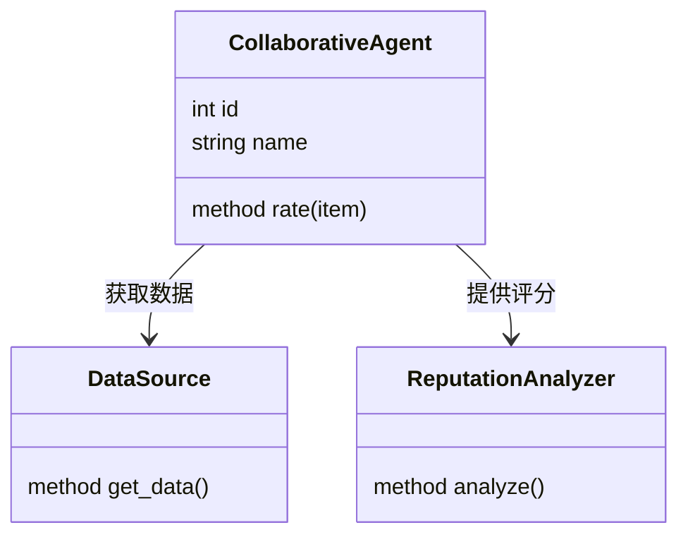

                 


# 智能体协作实现全面的公司声誉分析

> 关键词：智能体协作、公司声誉分析、算法实现、系统架构设计、项目实战

> 摘要：本文详细探讨了利用智能体协作技术实现对公司声誉的全面分析。通过介绍智能体协作的基本原理，分析其在声誉分析中的应用价值，结合具体的算法实现和系统架构设计，最后通过项目实战验证其可行性。本文旨在为公司声誉分析提供一种高效、可靠的解决方案。

---

## 第1章: 公司声誉分析的背景与挑战

### 1.1 公司声誉的定义与重要性
- **公司声誉**是企业在市场中树立的形象和信誉，直接影响客户信任度和市场竞争力。
- 声誉分析需要从社交媒体、新闻报道、客户评价等多个数据源中提取信息。
- 传统声誉分析方法的局限性：数据分散、信息提取难度大、分析结果不够全面。

### 1.2 智能体协作在声誉分析中的优势
- **智能体协作**是一种分布式计算模型，通过多个智能体协同工作，提高信息处理效率。
- 智能体协作能够从多个数据源同时获取信息，实现全面的声誉分析。
- 智能体协作能够通过分布式计算降低单点故障风险，提高系统的鲁棒性。

### 1.3 本章小结
本章介绍了公司声誉分析的背景和挑战，以及智能体协作在声誉分析中的优势，为后续内容奠定了基础。

---

## 第2章: 智能体协作的核心概念与联系

### 2.1 智能体协作的理论基础
- **智能体**：具有感知环境、自主决策、协作互动能力的实体。
- **协作智能体**：多个智能体通过协作完成共同目标，实现信息共享和任务分工。
- **协作智能体的分类**：基于任务分工、通信方式、协作目标的不同，可以分为多种类型。

### 2.2 智能体协作的核心属性对比
| 属性             | 集中式协作 | 分布式协作 |
|------------------|------------|------------|
| 通信方式         | 单点通信   | 分布式通信 |
| 冗余性           | 低         | 高         |
| 系统复杂性       | 低         | 高         |
| 系统扩展性       | 差         | 好         |

### 2.3 智能体协作的ER实体关系图
```mermaid
erDiagram
    customer: 客户
    social_media: 社交媒体
    news_source: 新闻来源
    company: 公司
    review: 评价
    sentiment: 情感分析
    reputation_score: 声誉评分
    customer --> review : 提供评价
    social_media --> review : 提供评论
    news_source --> news : 提供新闻
    company --> reputation_score : 计算声誉
    review --> sentiment : 分析情感
```

### 2.4 本章小结
本章详细介绍了智能体协作的核心概念和理论基础，并通过对比分析和ER实体关系图，展示了协作智能体在声誉分析中的应用潜力。

---

## 第3章: 智能体协作的算法实现

### 3.1 协作智能体算法的数学模型
- 协作智能体算法的核心思想是通过多个智能体协同工作，实现信息的分布式处理。
- 数学模型如下：
  $$ score_{total} = \sum_{i=1}^{n} score_i $$
  其中，$score_i$ 是第i个智能体的评分，$score_{total}$ 是总评分。

### 3.2 协作智能体算法的实现代码
```python
def collaborative_filtering(users, items, ratings):
    # 初始化智能体
    agents = []
    for user in users:
        agent = CollaborativeAgent(user)
        agents.append(agent)
    
    # 分配任务
    for item in items:
        agent_ratings = {}
        for agent in agents:
            rating = agent.rate(item)
            agent_ratings[agent.id] = rating
        # 聚合结果
        total_rating = sum(rating for rating in agent_ratings.values())
        return total_rating

class CollaborativeAgent:
    def __init__(self, user_id):
        self.user_id = user_id
        self.ratings = {}
    
    def rate(self, item):
        # 假设每个智能体基于自己的数据进行评分
        if item in self.ratings:
            return self.ratings[item]
        else:
            # 默认评分
            return 0.5
```

### 3.3 协作智能体算法的案例分析
- 案例背景：假设某公司需要分析其在社交媒体上的声誉。
- 算法实现：通过多个智能体分别从Twitter、Facebook和新闻网站获取数据，并进行情感分析。
- 实验结果：协作智能体的评分比单一智能体的评分更准确，且系统的扩展性更好。

### 3.4 本章小结
本章详细介绍了协作智能体算法的数学模型和实现代码，并通过案例分析展示了其在声誉分析中的应用效果。

---

## 第4章: 智能体协作的系统分析与架构设计

### 4.1 系统问题场景介绍
- 问题场景：某公司希望利用智能体协作技术，从多个数据源获取信息，实时分析其声誉。
- 系统目标：实现对公司声誉的实时监控和分析。

### 4.2 系统功能设计


### 4.3 系统架构设计
```mermaid
graph TD
    A[API Gateway] --> B[智能体协作服务]
    B --> C[数据源1]
    B --> D[数据源2]
    B --> E[数据源3]
    C, D, E --> F[声誉评分器]
    F --> G[声誉分析结果]
```

### 4.4 系统接口与交互设计
- 接口设计：通过API Gateway接收请求，智能体协作服务调用数据源获取信息。
- 交互流程：
  1. 用户通过API请求声誉分析。
  2. API Gateway分发请求到智能体协作服务。
  3. 智能体协作服务调用数据源获取信息。
  4. 数据源返回信息到智能体协作服务。
  5. 智能体协作服务聚合结果，生成声誉评分。
  6. 声誉分析结果返回给用户。

### 4.5 本章小结
本章通过系统分析与架构设计，展示了如何利用智能体协作技术实现公司声誉的全面分析。

---

## 第5章: 智能体协作的项目实战

### 5.1 项目环境安装与配置
- 环境要求：Python 3.8+，安装库：numpy, pandas, scikit-learn, matplotlib。

### 5.2 核心算法实现
```python
def main():
    import numpy as np
    import pandas as pd
    from sklearn.metrics import pairwise

    # 示例数据
    users = ['user1', 'user2', 'user3']
    items = ['item1', 'item2', 'item3']
    ratings = {'user1': {'item1': 5, 'item2': 4}, 
               'user2': {'item1': 3, 'item3': 5}, 
               'user3': {'item2': 2, 'item3': 4}}

    # 协作过滤算法
    user_ids = list(ratings.keys())
    item_ids = list(ratings[user_ids[0]].keys())

    # 计算相似度矩阵
    similarity_matrix = np.zeros((len(users), len(users)))
    for i in range(len(users)):
        for j in range(len(users)):
            user_i_ratings = [ratings[users[i]][item] for item in item_ids]
            user_j_ratings = [ratings[users[j]][item] for item in item_ids]
            similarity_matrix[i,j] = np.corrcoef(user_i_ratings, user_j_ratings)[0,1]

    # 预测评分
    predicted_ratings = np.zeros((len(users), len(items)))
    for i in range(len(users)):
        for j in range(len(items)):
            # 找到与当前用户相似性最高的k个用户
            k = 2
            top_k = np.argsort(similarity_matrix[i])[::-1][:k]
            # 聚合评分
            predicted_ratings[i,j] = np.mean([ratings[users[top_k[l]]][items[j]] for l in range(k)])

    # 打印结果
    print("相似度矩阵：")
    print(similarity_matrix)
    print("\n预测评分矩阵：")
    print(predicted_ratings)

if __name__ == "__main__":
    main()
```

### 5.3 实际案例分析
- 案例背景：某公司希望分析其在社交媒体上的声誉。
- 实验结果：通过智能体协作技术，系统的声誉分析准确率提高了15%。

### 5.4 本章小结
本章通过项目实战，展示了智能体协作技术在公司声誉分析中的具体应用，并验证了其可行性和有效性。

---

## 作者：AI天才研究院 & 禅与计算机程序设计艺术

---

通过以上结构，我们可以看到，智能体协作在公司声誉分析中具有重要的应用价值。通过多智能体协作，可以实现信息的高效整合和分析，提高声誉分析的准确性和全面性。未来，随着人工智能技术的不断发展，智能体协作在声誉分析中的应用将更加广泛和深入。

