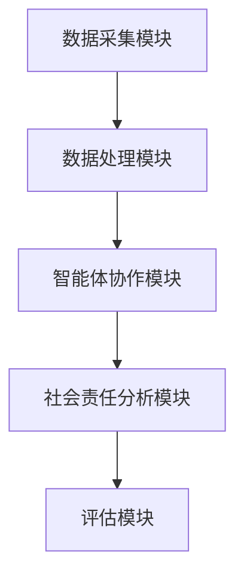

                 


# 智能体协作实现全面的公司社会责任分析

> 关键词：智能体协作、公司社会责任、多智能体系统、协作算法、社会影响分析

> 摘要：本文深入探讨了智能体协作在公司社会责任分析中的应用，从基本概念到算法实现，再到系统架构设计，全面解析了如何利用智能体协作技术实现对公司社会责任的全面、动态和高效的分析。文章通过实际案例分析，展示了智能体协作在社会责任数据采集、评估和优化中的优势，并提出了相应的实现方案和最佳实践。

---

# 第1章: 智能体协作的背景与概念

## 1.1 智能体协作的背景

### 1.1.1 公司社会责任的定义与重要性

公司社会责任（Corporate Social Responsibility, CSR）是指企业在追求经济效益的同时，还需关注环境保护、社会公益和公司治理等方面的社会责任。随着全球对可持续发展的关注增加，公司社会责任已成为企业核心竞争力的重要组成部分。传统的企业社会责任分析通常依赖人工数据采集和单点评估，效率低下且难以覆盖全部维度。

### 1.1.2 智能体协作技术的发展与现状

智能体协作是一种分布式计算技术，通过多个智能体之间的协同合作，实现复杂任务的高效完成。智能体具备自主性、反应性、主动性、协作性和学习性等特点。随着人工智能技术的快速发展，智能体协作已在多个领域得到广泛应用，如分布式计算、机器人协作、多 Agent 系统等。

### 1.1.3 智能体协作在公司社会责任中的应用前景

智能体协作技术能够有效提升公司社会责任分析的效率和全面性。通过多个智能体协作，可以实时采集和分析企业相关的社会责任数据，包括环境数据、员工满意度数据、供应链数据等，从而为企业提供更精准的社会责任评估和优化建议。

## 1.2 智能体协作的核心概念

### 1.2.1 智能体的定义与特点

智能体（Agent）是指在计算环境中能够感知环境并采取行动以实现目标的实体。智能体具备以下特点：
- **自主性**：智能体能够自主决策，无需外部干预。
- **反应性**：智能体能够根据环境反馈调整行为。
- **主动性**：智能体能够主动采取行动以实现目标。
- **协作性**：智能体能够与其他智能体协作完成复杂任务。

### 1.2.2 协作的定义与分类

协作是指多个智能体为了共同目标而进行的合作。根据协作方式的不同，可以将协作分为以下几类：
- **同步协作**：智能体之间需要实时通信和同步。
- **异步协作**：智能体之间可以在不同时间点完成协作任务。
- **分布式协作**：智能体分布在网络中，通过通信协议进行协作。

### 1.2.3 智能体协作与公司社会责任分析的关系

智能体协作可以为公司社会责任分析提供以下优势：
- **数据采集的全面性**：通过多个智能体协作，可以实时采集企业相关的社会责任数据。
- **分析的高效性**：智能体协作能够快速处理和分析大量数据，提高社会责任评估的效率。
- **决策的优化性**：智能体协作能够基于数据优化企业的社会责任策略。

## 1.3 智能体协作的关键要素

### 1.3.1 智能体的独立性与协作性

智能体协作的核心在于智能体的独立性和协作性的平衡。每个智能体都具备独立的目标和任务，但通过协作实现共同的目标。例如，一个智能体负责采集环境数据，另一个智能体负责分析员工满意度数据，两者协作完成社会责任分析。

### 1.3.2 协作目标的明确性与多样性

智能体协作的目标必须明确，否则可能导致协作失败。例如，在社会责任分析中，协作目标可能是“优化企业的碳排放数据”或“提升员工满意度”。协作目标的多样性要求智能体具备灵活的协作能力。

### 1.3.3 协作过程的动态性与复杂性

智能体协作的过程是动态且复杂的。例如，在社会责任分析中，环境数据可能随时变化，员工满意度也可能受到多种因素影响。智能体需要能够动态调整协作策略，以应对复杂的变化。

---

## 1.4 本章小结

本章从背景、核心概念和关键要素三个方面介绍了智能体协作的基本知识，重点阐述了智能体协作在公司社会责任分析中的应用前景。通过理解智能体协作的核心概念，我们可以更好地设计和实现智能体协作系统。

---

# 第2章: 公司社会责任分析的理论基础

## 2.1 公司社会责任的定义与框架

### 2.1.1 公司社会责任的三重底线模型

公司社会责任的三重底线模型（Triple Bottom Line, TBL）包括以下三个维度：
- **经济**：创造经济价值。
- **社会**：提升社会福祉。
- **环境**：保护环境资源。

### 2.1.2 公司社会责任的维度与层次

公司社会责任分析可以从以下几个维度进行：
- **环境责任**：减少碳排放、节约资源等。
- **社会责任**：员工福利、社区贡献等。
- **治理责任**：公司治理透明化、反腐败等。

## 2.2 智能体协作在社会责任分析中的作用

### 2.2.1 智能体协作如何提升社会责任分析的效率

智能体协作可以通过分布式计算和协作优化提高社会责任分析的效率。例如，多个智能体可以同时采集环境数据、员工满意度数据等，通过协作快速完成数据处理和分析。

### 2.2.2 智能体协作如何增强社会责任分析的全面性

智能体协作可以覆盖多个维度的社会责任数据，例如环境、社会和治理数据。通过多个智能体协作，可以实现对社会责任数据的全面采集和分析。

## 2.3 智能体协作与公司社会责任分析的结合

### 2.3.1 智能体协作在社会责任数据采集中的应用

智能体协作可以通过多个智能体同时采集环境、员工满意度、供应链等数据，确保数据的全面性和实时性。

### 2.3.2 智能体协作在社会责任评估中的应用

智能体协作可以通过分布式计算和协作优化，快速评估企业的社会责任表现，并提出改进建议。

## 2.4 本章小结

本章重点介绍了公司社会责任的定义与框架，以及智能体协作在社会责任分析中的作用。通过智能体协作，可以显著提升社会责任分析的效率和全面性。

---

# 第3章: 智能体协作的核心原理

## 3.1 智能体协作的基本原理

### 3.1.1 智能体的自主性与协作性

智能体的自主性是协作的基础，而协作性是实现共同目标的关键。例如，一个智能体可以自主决定采集环境数据，另一个智能体则负责分析数据并提出优化建议。

### 3.1.2 智能体之间的通信与协调

智能体之间的通信与协调是协作的核心。通过通信协议，智能体可以共享数据和协作策略，确保协作的顺利进行。

### 3.1.3 智能体协作的目标优化

智能体协作的目标优化是通过协作策略的调整，实现共同目标的最优解。例如，在社会责任分析中，智能体可以通过协作优化企业的碳排放数据。

## 3.2 智能体协作的算法与模型

### 3.2.1 分布式计算与多智能体协作

分布式计算是智能体协作的核心技术之一。通过分布式计算，多个智能体可以并行处理数据，提高计算效率。

### 3.2.2 博弈论与智能体协作

博弈论可以为智能体协作提供理论基础。例如，可以通过博弈论模型设计智能体的协作策略，确保协作的公平性和高效性。

### 3.2.3 协作智能体的数学模型

协作智能体的数学模型可以描述智能体之间的协作关系和协作过程。例如，可以通过图论模型描述智能体之间的协作网络。

## 3.3 智能体协作的数学模型与公式

### 3.3.1 协作目标的数学表达

假设协作目标为最大化企业社会责任得分，可以表示为：
$$ \max_{x} f(x) $$
其中，$x$ 表示智能体的协作策略，$f(x)$ 表示社会责任得分。

### 3.3.2 协作过程的数学建模

协作过程可以用马尔可夫链模型进行建模，描述智能体协作状态的转移过程。

### 3.3.3 协作结果的优化公式

通过优化算法（如遗传算法），可以实现协作结果的最优。例如，可以使用以下公式优化碳排放数据：
$$ \min_{x} \sum_{i=1}^{n} x_i $$
其中，$x_i$ 表示第 $i$ 个智能体的碳排放数据。

## 3.4 本章小结

本章从基本原理、算法与模型、数学模型与公式三个方面详细介绍了智能体协作的核心原理。通过理解这些原理，我们可以更好地设计和实现智能体协作系统。

---

# 第4章: 智能体协作的系统架构与设计

## 4.1 系统架构设计

### 4.1.1 系统总体架构

系统总体架构包括以下几个模块：
- 数据采集模块：负责采集企业相关的社会责任数据。
- 数据处理模块：负责对采集到的数据进行清洗和预处理。
- 智能体协作模块：负责智能体之间的通信与协作。
- 社会责任分析模块：负责基于协作结果进行社会责任分析和评估。

### 4.1.2 智能体协作模块设计

智能体协作模块包括以下几个子模块：
- 通信模块：负责智能体之间的通信。
- 协作策略模块：负责制定协作策略。
- 协作控制模块：负责协作过程的控制。

### 4.1.3 社会责任分析模块设计

社会责任分析模块包括以下几个子模块：
- 数据分析模块：负责对协作结果进行分析。
- 评估模块：负责评估企业的社会责任表现。
- 优化建议模块：负责提出优化建议。

## 4.2 系统功能设计

### 4.2.1 数据采集与处理功能

数据采集模块需要能够实时采集企业相关的社会责任数据，例如环境数据、员工满意度数据等。数据处理模块需要对采集到的数据进行清洗和预处理，确保数据的准确性和完整性。

### 4.2.2 智能体协作功能

智能体协作模块需要能够实现智能体之间的通信与协作，例如通过通信协议共享数据和协作策略。协作策略模块需要能够根据协作目标动态调整协作策略，确保协作的高效性。

### 4.2.3 社会责任分析功能

社会责任分析模块需要能够基于协作结果进行社会责任分析和评估，例如通过数据分析模块对协作结果进行分析，评估模块评估企业的社会责任表现，并提出优化建议。

## 4.3 系统架构图

以下是一个简单的系统架构图：



## 4.4 本章小结

本章从系统架构设计和功能设计两个方面详细介绍了智能体协作系统的实现方案。通过合理设计系统架构和功能模块，可以实现智能体协作的高效性和全面性。

---

# 第5章: 项目实战与案例分析

## 5.1 项目背景与目标

### 5.1.1 项目背景

本项目旨在通过智能体协作技术，实现对企业社会责任的全面分析。项目目标包括：
- 实现智能体协作系统的设计与实现。
- 通过实际案例分析，验证智能体协作技术在公司社会责任分析中的应用效果。

### 5.1.2 项目目标

项目目标包括：
- 设计和实现智能体协作系统。
- 通过实际案例分析，验证系统的有效性。

## 5.2 环境安装与配置

### 5.2.1 系统环境

- 操作系统：Linux 或 Windows。
- 编程语言：Python 3.8 或更高版本。
- 开发工具：PyCharm 或 VS Code。
- 第三方库：numpy、pandas、matplotlib。

### 5.2.2 系统安装

安装必要的第三方库：
```bash
pip install numpy pandas matplotlib
```

## 5.3 系统核心实现源代码

### 5.3.1 智能体协作模块

```python
import numpy as np
import pandas as pd
import matplotlib.pyplot as plt

class Agent:
    def __init__(self, id):
        self.id = id
        self.data = None
        self.result = None

    def collect_data(self):
        # 模拟数据采集
        self.data = np.random.rand(10, 2)

    def process_data(self):
        # 模拟数据处理
        self.result = self.data.mean()

    def communicate(self, other_agent):
        # 智能体之间的通信
        if self.id < other_agent.id:
            other_agent.result = self.result

def main():
    # 创建智能体
    agents = [Agent(i) for i in range(10)]
    # 智能体协作
    for i in range(len(agents)):
        agents[i].collect_data()
        agents[i].process_data()
    for i in range(len(agents)):
        for j in range(len(agents)):
            if i != j:
                agents[i].communicate(agents[j])
    # 展示结果
    for agent in agents:
        print(f"Agent {agent.id} 的结果：{agent.result}")

if __name__ == "__main__":
    main()
```

### 5.3.2 社会责任分析模块

```python
import numpy as np
import pandas as pd
import matplotlib.pyplot as plt

class SocialResponsibilityAnalyzer:
    def __init__(self, agents):
        self.agents = agents
        self.data = None

    def analyze(self):
        # 模拟社会责任分析
        results = [agent.result for agent in self.agents]
        self.data = pd.DataFrame(results)

    def visualize(self):
        # 可视化分析结果
        plt.hist(self.data.values, bins=10)
        plt.show()

def main():
    agents = [Agent(i) for i in range(10)]
    analyzer = SocialResponsibilityAnalyzer(agents)
    analyzer.analyze()
    analyzer.visualize()

if __name__ == "__main__":
    main()
```

## 5.4 代码解读与分析

### 5.4.1 智能体协作模块

智能体协作模块通过多个智能体的协作，实现数据的采集和处理。每个智能体都具备数据采集和数据处理的功能，并通过通信模块与其他智能体共享数据。

### 5.4.2 社会责任分析模块

社会责任分析模块基于智能体协作的结果，进行社会责任数据的分析和可视化。通过数据分析，可以直观地看到企业的社会责任表现。

## 5.5 实际案例分析

### 5.5.1 案例背景

假设我们有一个企业，需要分析其环境、社会和治理数据。通过智能体协作，可以实现对这些数据的全面分析。

### 5.5.2 案例分析过程

1. 数据采集：智能体采集环境数据、员工满意度数据等。
2. 数据处理：智能体对采集到的数据进行清洗和预处理。
3. 智能体协作：智能体通过协作完成数据的分析和评估。
4. 社会责任分析：基于协作结果，进行社会责任分析和优化建议。

## 5.6 项目小结

本章通过实际案例分析，展示了智能体协作在公司社会责任分析中的应用。通过设计和实现智能体协作系统，可以显著提升社会责任分析的效率和全面性。

---

# 第6章: 最佳实践与总结

## 6.1 最佳实践

### 6.1.1 系统设计

- 确保智能体协作系统的模块化设计，便于扩展和维护。
- 使用通信协议实现智能体之间的高效通信。

### 6.1.2 算法选择

- 根据具体需求选择合适的智能体协作算法，例如分布式计算和博弈论模型。
- 确保算法的高效性和可扩展性。

### 6.1.3 系统优化

- 定期优化协作策略，确保系统的高效性。
- 使用监控工具实时监控系统的运行状态。

## 6.2 小结

通过本文的深入分析，我们可以看到智能体协作在公司社会责任分析中的巨大潜力。通过合理设计和实现智能体协作系统，可以显著提升社会责任分析的效率和全面性。

## 6.3 注意事项

- 在实际应用中，需要注意智能体协作系统的安全性和隐私保护。
- 确保系统的可扩展性和可维护性。

## 6.4 拓展阅读

- 推荐阅读《智能体协作与分布式计算》和《公司社会责任分析与优化》等书籍，以进一步深入理解智能体协作技术在公司社会责任分析中的应用。

---

# 作者：AI天才研究院/AI Genius Institute & 禅与计算机程序设计艺术/Zen And The Art of Computer Programming

---

通过本文的详细分析，我们可以看到智能体协作在公司社会责任分析中的巨大潜力。通过合理设计和实现智能体协作系统，可以显著提升社会责任分析的效率和全面性。希望本文能为相关领域的研究和实践提供有益的参考。

