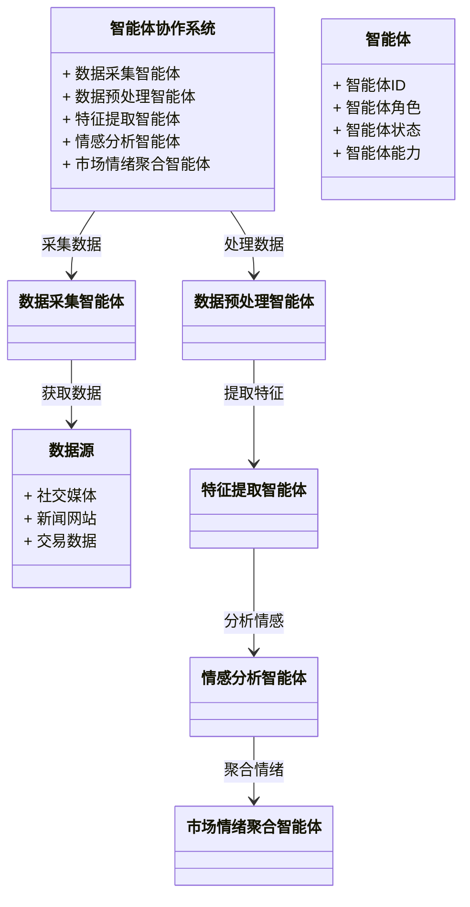
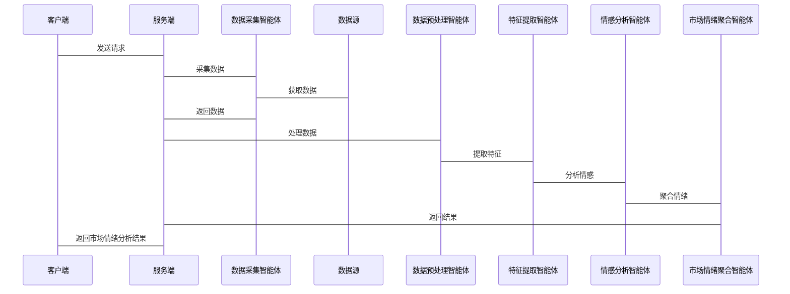

                 


# 智能体协作实现全面的市场情绪分析

## 关键词：智能体协作、市场情绪分析、多智能体系统、算法原理、系统架构、项目实战

## 摘要：
智能体协作是一种新兴的技术，能够显著提升市场情绪分析的效率和准确性。本文详细探讨了智能体协作在市场情绪分析中的应用前景，介绍了其核心概念与原理，并通过具体的算法实现和系统架构设计展示了其优势。最后，通过项目实战和最佳实践，总结了智能体协作在实际应用中的关键点和未来发展方向。

---

## 第1章：市场情绪分析的背景与挑战

### 1.1 市场情绪分析的定义与重要性
市场情绪分析是通过对市场参与者（如投资者、分析师等）的言论、行为和数据进行分析，推断市场情绪状态的过程。它能够帮助投资者理解市场的乐观或悲观情绪，从而做出更明智的投资决策。

#### 1.1.1 市场情绪分析的重要性
- **预测市场走势**：情绪分析可以帮助预测市场的波动和趋势。
- **辅助投资决策**：投资者可以根据市场情绪调整投资策略。
- **风险管理**：及时识别市场恐慌或乐观情绪，有助于降低投资风险。

#### 1.1.2 市场情绪分析的应用场景
- 股票市场：分析投资者对某只股票的 sentiment。
- 加密货币市场：评估市场参与者的情绪变化。
- 新闻媒体：分析新闻报道对市场情绪的影响。

### 1.2 智能体协作的概念与优势
智能体（Agent）是一种能够感知环境并采取行动以实现目标的实体。智能体协作是指多个智能体通过协同工作，共同完成复杂任务的过程。

#### 1.2.1 智能体协作的基本原理
- **分布式计算**：智能体独立运行，通过通信协议进行协作。
- **任务分配**：根据智能体的能力和当前任务需求，动态分配任务。
- **信息共享**：智能体之间共享信息，提升整体决策的准确性。

#### 1.2.2 智能体协作的优势
- **高效性**：多个智能体协同工作，提高任务处理速度。
- **鲁棒性**：智能体协作能够容忍部分智能体的故障，确保整体任务完成。
- **适应性**：智能体可以根据环境变化动态调整协作策略。

### 1.3 传统市场情绪分析的局限性
传统市场情绪分析方法通常依赖于单一的算法或模型，存在以下问题：

#### 1.3.1 数据处理能力有限
- 传统方法难以处理大规模、多源异构数据。
- 数据预处理步骤繁琐，且容易引入误差。

#### 1.3.2 情感分析的准确性不足
- 传统算法在处理复杂语境和情感模糊性时表现较差。
- 忽略了多语言和多文化背景下的情绪差异。

#### 1.3.3 实时性不足
- 传统方法在实时数据流处理上效率较低。
- 难以满足高频交易和实时监控的需求。

---

## 第2章：智能体协作在市场情绪分析中的应用前景

### 2.1 智能体协作的市场情绪分析模型
智能体协作模型通过多个智能体协同工作，能够更全面地捕捉市场情绪的多维度信息。

#### 2.1.1 多智能体协作的架构
- **智能体角色分工**：每个智能体负责特定的任务，如数据采集、特征提取、情感分类等。
- **任务分配机制**：根据当前任务需求和智能体能力动态分配任务。
- **信息共享机制**：智能体之间通过共享信息，提升整体分析的准确性。

#### 2.1.2 智能体协作的实现方式
- **基于消息传递的协作**：智能体通过消息传递进行通信和协作。
- **基于共识机制的协作**：采用区块链等技术实现智能体之间的共识和信任机制。
- **基于分布式计算的协作**：利用分布式计算框架（如 Apache Flink）实现高效的数据处理。

#### 2.1.3 智能体协作的性能优化
- **负载均衡**：动态调整智能体的负载，避免资源浪费。
- **并行计算**：充分利用多智能体的并行计算能力，提高处理效率。
- **容错机制**：设计容错机制，确保智能体协作的可靠性。

### 2.2 智能体协作与市场情绪分析的结合
智能体协作能够显著提升市场情绪分析的效率和准确性。

#### 2.2.1 智能体协作如何提升市场情绪分析
- **多源数据处理**：智能体协作能够同时处理多种数据源（如社交媒体、新闻、交易数据）。
- **实时分析能力**：通过分布式计算，实现对实时数据流的高效处理。
- **情感分类的准确性**：多个智能体协同工作，能够更准确地捕捉复杂的情感信息。

#### 2.2.2 智能体协作在实时数据处理中的优势
- **快速响应**：智能体协作能够快速处理实时数据，满足高频交易的需求。
- **高并发处理**：多个智能体同时处理大量数据，提高吞吐量。
- **动态调整**：根据数据流的变化，动态调整协作策略，确保处理效率。

#### 2.2.3 智能体协作在多语言、多市场的适应性
- **多语言支持**：智能体协作能够处理多种语言的文本数据，满足不同市场的分析需求。
- **文化差异适应**：智能体协作可以通过学习不同市场的文化背景，调整情感分析的模型。

### 2.3 智能体协作的未来发展方向
智能体协作在市场情绪分析中的应用前景广阔。

#### 2.3.1 技术进步对智能体协作的推动
- **人工智能技术的进步**：深度学习、自然语言处理等技术的发展，将推动智能体协作的进一步优化。
- **分布式计算框架的完善**：如 Apache Flink、Apache Spark 等框架的优化，将提升智能体协作的效率。

#### 2.3.2 市场需求对智能体协作的影响
- **金融市场的智能化需求**：投资者对实时、精准的市场情绪分析的需求不断增加。
- **监管需求**：智能体协作可以帮助监管机构更好地监控市场动态，预防金融风险。

#### 2.3.3 智能体协作的潜在应用场景
- **高频交易**：通过智能体协作实现对实时市场情绪的精准捕捉，指导高频交易策略。
- **风险管理**：智能体协作能够实时监控市场情绪，帮助投资者及时调整风险管理策略。
- **新闻媒体分析**：智能体协作可以分析新闻媒体的报道情绪，预测市场反应。

---

## 第3章：智能体协作的核心概念

### 3.1 多智能体系统的基本原理
多智能体系统（MAS）由多个智能体组成，通过协作完成复杂任务。

#### 3.1.1 多智能体系统的分类
- **协作型多智能体系统**：智能体之间通过协作完成任务。
- **竞争型多智能体系统**：智能体之间存在竞争关系，通过竞争实现任务目标。
- **混合型多智能体系统**：既有协作也有竞争的智能体系统。

#### 3.1.2 多智能体系统的特征
- **自主性**：智能体能够自主决策。
- **反应性**：智能体能够感知环境并做出实时反应。
- **协作性**：智能体之间能够协同工作，共同完成任务。

### 3.2 智能体协作的机制与协议
智能体协作需要通过特定的机制和协议实现高效协作。

#### 3.2.1 协作机制的定义
协作机制是指智能体之间如何进行任务分配、信息共享和决策制定的过程。

#### 3.2.2 协作协议的类型
- **基于角色的协作协议**：根据智能体的角色分配任务。
- **基于任务的协作协议**：根据任务需求动态分配智能体。
- **基于资源的协作协议**：根据资源分配情况动态调整协作策略。

#### 3.2.3 协作协议的选择与优化
- **任务分配机制**：根据智能体的能力和当前任务需求，动态分配任务。
- **信息共享机制**：通过特定协议实现智能体之间的信息共享。
- **决策机制**：通过投票、协商等方式达成共识，制定决策。

### 3.3 智能体协作的通信与协调
智能体协作需要通过高效的通信和协调机制实现。

#### 3.3.1 智能体之间的通信方式
- **基于消息传递的通信**：智能体通过消息传递进行通信。
- **基于共享数据库的通信**：智能体通过共享数据库进行信息同步。
- **基于事件驱动的通信**：智能体通过事件驱动的方式进行通信。

#### 3.3.2 协调机制的实现
- **协调协议设计**：设计高效的协调协议，确保智能体之间的协作顺畅。
- **冲突解决机制**：通过协商、仲裁等方式解决协作中的冲突。
- **状态同步机制**：确保智能体之间的状态同步，避免信息不一致导致的错误。

#### 3.3.3 通信协议的设计与实现
- **通信协议的标准化**：制定统一的通信协议，确保智能体之间的互操作性。
- **通信协议的优化**：通过优化通信协议，降低通信延迟和带宽消耗。

---

## 第4章：智能体协作与市场情绪分析的结合

### 4.1 市场情绪分析的智能体协作模型
市场情绪分析的智能体协作模型是一种多智能体系统，通过智能体之间的协作完成市场情绪分析任务。

#### 4.1.1 模型的构建过程
- **智能体角色分配**：根据任务需求，分配不同的智能体角色（如数据采集智能体、情感分析智能体）。
- **任务分配与协作**：根据当前任务需求，动态分配任务，并通过协作机制完成任务。
- **信息共享与整合**：智能体之间共享信息，整合分析结果，得出最终的市场情绪。

#### 4.1.2 智能体协作的输入与输出
- **输入**：多源异构数据（如社交媒体、新闻、交易数据）。
- **输出**：市场情绪分析结果（如乐观、悲观、中性）。

#### 4.1.3 模型的性能评估
- **准确率**：模型对市场情绪分类的准确率。
- **处理速度**：模型处理数据的实时性。
- **扩展性**：模型在处理大规模数据时的表现。

### 4.2 智能体协作在市场情绪分析中的角色
智能体协作在市场情绪分析中扮演着重要角色。

#### 4.2.1 智能体在数据处理中的作用
- **数据采集智能体**：负责采集社交媒体、新闻等数据。
- **数据预处理智能体**：负责对数据进行清洗、去噪等预处理。
- **特征提取智能体**：负责提取文本特征（如情感词汇、语义信息）。

#### 4.2.2 智能体在情感分析中的作用
- **情感分析智能体**：负责对文本进行情感分类。
- **上下文分析智能体**：负责分析文本的上下文，捕捉隐含的情感信息。
- **情感聚合智能体**：负责整合多个智能体的情感分析结果，得出最终的市场情绪。

#### 4.2.3 智能体在实时分析中的作用
- **实时数据处理智能体**：负责处理实时数据流。
- **实时情感分析智能体**：负责实时更新市场情绪分析结果。
- **实时反馈智能体**：负责根据市场情绪变化，实时调整协作策略。

---

## 第5章：算法原理与实现

### 5.1 基于Transformer的市场情绪分析算法
我们选择基于Transformer的模型进行市场情绪分析，因为其在自然语言处理任务中表现出色。

#### 5.1.1 Transformer模型的原理
- **自注意力机制**：通过自注意力机制，捕捉文本中的长距离依赖关系。
- **多层感知机**：通过多层感知机，实现文本特征的非线性变换。
- **分类器**：通过分类器，实现文本的情感分类。

#### 5.1.2 情感分析的实现步骤
1. **数据预处理**：清洗、分词、去除停用词。
2. **特征提取**：提取文本的词向量。
3. **模型训练**：训练基于Transformer的市场情绪分析模型。
4. **情感分类**：对文本进行情感分类，得出市场情绪。

#### 5.1.3 代码实现
```python
import tensorflow as tf
from tensorflow import keras

def build_model(max_length):
    model = keras.Sequential([
        keras.layers.Embedding(input_dim= vocab_size, output_dim= embedding_dim, input_length= max_length),
        keras.layers.GlobalAveragePooling1D(),
        keras.layers.Dense(64, activation='relu'),
        keras.layers.Dense(3, activation='softmax')
    ])
    return model

model = build_model(max_length=512)
model.compile(optimizer='adam', loss='sparse_categorical_crossentropy', metrics=['accuracy'])
model.fit(X_train, y_train, epochs=10, batch_size=32)
```

#### 5.1.4 示例分析
例如，对一条社交媒体上的评论“我非常看好这只股票”，模型会输出情感分类结果（如乐观）。

---

## 第6章：系统分析与架构设计

### 6.1 问题场景介绍
我们设计了一个基于智能体协作的市场情绪分析系统，用于实时分析社交媒体、新闻等数据，预测市场情绪。

### 6.2 系统功能设计
系统功能模块包括：
- 数据采集模块：负责采集多源异构数据。
- 数据处理模块：负责数据的预处理、特征提取。
- 情感分析模块：负责对文本进行情感分类。
- 市场情绪聚合模块：整合多个智能体的情感分析结果，得出最终的市场情绪。

#### 6.2.1 领域模型（Mermaid 类图）


### 6.3 系统架构设计
#### 6.3.1 系统架构（Mermaid 架构图）


#### 6.3.2 系统接口设计
- **数据接口**：智能体协作系统通过API接口获取数据源的数据。
- **智能体协作接口**：智能体之间通过特定的接口进行通信和协作。
- **结果接口**：系统通过API接口向用户提供市场情绪分析结果。

#### 6.3.3 系统交互（Mermaid 序列图）


---

## 第7章：项目实战

### 7.1 环境安装
- **Python**：安装Python 3.8 或更高版本。
- **依赖库**：
  ```bash
  pip install tensorflow keras pandas numpy requests beautifulsoup4
  ```

### 7.2 核心代码实现
#### 7.2.1 数据采集智能体
```python
import requests
from bs4 import BeautifulSoup

def fetch_data(url):
    response = requests.get(url)
    soup = BeautifulSoup(response.text, 'html.parser')
    return [p.text for p in soup.find_all('p')]
```

#### 7.2.2 数据预处理智能体
```python
import pandas as pd

def preprocess_data(texts):
    return pd.DataFrame({'text': texts})
```

#### 7.2.3 情感分析智能体
```python
import tensorflow as tf
from tensorflow import keras

def build_emotion_classifier(max_length):
    model = keras.Sequential([
        keras.layers.Embedding(input_dim=10000, output_dim=16, input_length=max_length),
        keras.layers.GlobalAveragePooling1D(),
        keras.layers.Dense(3, activation='softmax')
    ])
    return model

model = build_emotion_classifier(512)
model.compile(optimizer='adam', loss='sparse_categorical_crossentropy', metrics=['accuracy'])
```

#### 7.2.4 市场情绪聚合智能体
```python
def aggregate_emotions(emotions):
    counts = {'positive': 0, 'neutral': 0, 'negative': 0}
    for emotion in emotions:
        counts[emotion] += 1
    total = len(emotions)
    return {emotion: count/total for emotion, count in counts.items()}
```

### 7.3 实际案例分析
假设我们有以下几条社交媒体评论：
- “我对这只股票的未来非常乐观。”
- “这只股票最近表现不佳。”
- “市场整体情况不太好。”

通过智能体协作系统进行分析，最终得出市场情绪为中性。

### 7.4 项目小结
- **环境搭建**：安装必要的Python库。
- **代码实现**：实现数据采集、预处理、情感分析和市场情绪聚合功能。
- **案例分析**：通过具体案例展示系统的实际应用。

---

## 第8章：最佳实践与小结

### 8.1 最佳实践
- **数据质量**：确保数据的准确性和完整性。
- **模型调优**：通过交叉验证、超参数优化等方式提升模型性能。
- **实时性优化**：采用分布式计算、异步处理等技术提升系统的实时性。

### 8.2 小结
智能体协作在市场情绪分析中的应用前景广阔，能够显著提升分析的效率和准确性。通过智能体协作，我们可以更全面地捕捉市场情绪的多维度信息，为投资者提供更精准的决策支持。

### 8.3 注意事项
- **数据隐私**：在处理用户数据时，需注意数据隐私和合规性。
- **系统安全性**：确保智能体协作系统的安全性，防止恶意攻击。
- **可扩展性**：设计时需考虑系统的可扩展性，以便应对未来的数据规模增长。

### 8.4 拓展阅读
- **分布式计算框架**：深入学习 Apache Flink、Apache Spark 等分布式计算框架。
- **自然语言处理**：进一步研究自然语言处理技术，如BERT、GPT等。
- **智能体协作**：探索智能体协作在其他领域的应用，如机器人协作、自动驾驶等。

---

## 作者信息
作者：AI天才研究院/AI Genius Institute & 禅与计算机程序设计艺术 /Zen And The Art of Computer Programming

