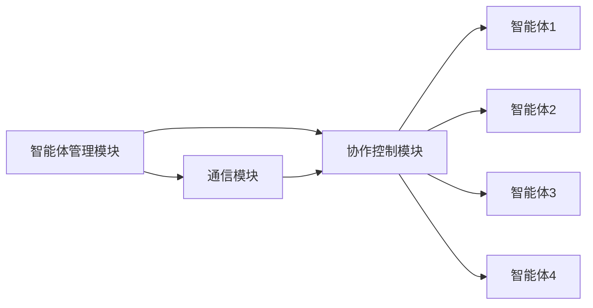

                 


# 智能体协作实现全面的竞争优势分析

> 关键词：智能体协作，多智能体系统，协作机制，分布式计算，博弈论，系统架构

> 摘要：智能体协作是指多个智能体通过合作共同完成任务的过程。本文从理论、算法、系统架构等多个角度，分析智能体协作的核心要素、算法实现、系统设计和实际应用，揭示其在提升系统性能和竞争优势中的重要作用。

---

## 第一部分: 智能体协作的背景与概念

### 第1章: 智能体协作的概述

#### 1.1 智能体协作的定义与背景

- 智能体（Agent）的定义：智能体是指能够感知环境并采取行动以实现目标的实体。
- 智能体协作的定义：智能体协作是指多个智能体通过合作共同完成任务的过程，通常在复杂环境中实现更高的目标。
- 智能体协作的应用背景：随着人工智能的发展，多智能体协作在机器人、自动驾驶、分布式系统等领域发挥重要作用。

#### 1.2 智能体协作的核心概念

- 协作目标：智能体协作的目标通常是优化整体性能或完成复杂的任务。
- 协作方式：智能体可以通过通信、任务分配等方式进行协作。
- 协作的边界：智能体协作的边界包括智能体的独立性和整体性之间的平衡。

### 第2章: 智能体协作的核心要素

#### 2.1 智能体协作的系统结构

- 智能体协作的组成要素：
  - 智能体个体：每个智能体都有自己的目标和行为策略。
  - 通信机制：智能体之间的信息交换方式。
  - 协作协议：定义协作规则和任务分配的方式。
- 智能体协作的交互机制：
  - 基于消息传递的协作：智能体通过交换消息完成任务。
  - 基于状态的协作：智能体根据状态变化动态调整协作策略。

#### 2.2 智能体协作的协作机制

- 分布式协作机制：每个智能体独立决策，通过局部信息进行协作。
- 基于任务分配的协作机制：智能体根据任务需求动态分配角色和任务。
- 基于博弈论的协作机制：智能体在博弈框架下优化协作策略。

## 第二部分: 智能体协作的算法与实现

### 第3章: 智能体协作算法原理

#### 3.1 协作智能体的算法概述

- 协作算法的基本原理：通过优化目标函数，协调智能体的行为以达到全局最优。
- 协作算法的核心思想：基于分布式优化，通过局部信息实现全局目标。
- 协作算法的应用场景：适用于多智能体系统、分布式计算、网络优化等领域。

#### 3.2 基于多智能体的协作算法

- 分布式协作算法：每个智能体独立决策，通过局部信息优化全局目标。
- 基于任务分配的协作算法：智能体根据任务需求动态分配角色和任务。
- 基于博弈论的协作算法：智能体在博弈框架下优化协作策略。

### 第4章: 智能体协作算法的实现

#### 4.1 协作算法的数学模型

- 协作算法的数学表示：
  - 假设N个智能体，每个智能体i的目标函数为f_i(x_i)，全局目标函数为F(x_1, x_2, ..., x_N)。
  - 智能体协作的目标是最小化或最大化F(x_1, x_2, ..., x_N)。
- 协作算法的优化模型：
  - 分布式优化：每个智能体仅知道局部信息，通过通信达成一致。
  - 协作优化：智能体通过协作机制优化全局目标。

#### 4.2 协作算法的代码实现

- 环境安装与配置：
  - 安装Python和必要的库，如NumPy、Matplotlib。
  - 配置分布式计算环境，如使用Distributed或MPI。
- 协作算法的Python实现：

```python
import numpy as np
from distributed import Client

def collaboration_algorithm():
    # 初始化智能体
    n_agents = 4
    agents = [Agent(i) for i in range(n_agents)]
    
    # 分布式优化
    with Client() as client:
        futures = [client.submit(agent.update, agent) for agent in agents]
        results = client.gather(futures)
        # 协作优化
        global_opt = sum(results) / n_agents
    return global_opt

class Agent:
    def __init__(self, id):
        self.id = id
        self.state = np.random.randn(2)
    
    def update(self):
        # 局部优化
        self.state = np.minimum(self.state, np.random.randn(2))
        return self.state

# 示例运行
result = collaboration_algorithm()
print(result)
```

### 第5章: 智能体协作算法的案例分析

#### 5.1 案例背景与问题描述

- 案例背景：假设我们有4个智能体需要协作完成一个全局优化任务。
- 问题描述：每个智能体只能感知局部信息，如何通过协作实现全局优化。
- 解决方案：使用分布式优化算法，通过通信实现协作。

#### 5.2 案例实现与分析

- 实验结果与分析：
  - 每个智能体的局部优化结果通过协作实现全局最优。
  - 分布式协作算法能够有效提高系统的整体性能。
  - 实验结果表明，协作机制能够显著提高系统的效率和稳定性。

## 第三部分: 智能体协作的系统架构与设计

### 第6章: 智能体协作系统的架构设计

#### 6.1 系统功能设计

- 系统功能模块划分：
  - 智能体管理模块：负责智能体的创建、初始化和管理。
  - 通信模块：负责智能体之间的信息交换。
  - 协作控制模块：负责协作策略的制定和执行。

#### 6.2 系统架构设计

- 系统架构图：



### 第7章: 智能体协作系统的实现

#### 7.1 系统环境安装与配置

- 环境要求：
  - Python 3.8及以上版本
  - 安装必要的库：NumPy、Matplotlib、Distributed
  - 安装分布式计算框架，如Dask或MPI。

#### 7.2 系统核心实现

- 系统核心代码：

```python
import numpy as np
from distributed import Client

class Agent:
    def __init__(self, id):
        self.id = id
        self.state = np.random.randn(2)
    
    def update(self):
        # 局部优化
        self.state = np.minimum(self.state, np.random.randn(2))
        return self.state

def collaboration_algorithm():
    # 初始化智能体
    n_agents = 4
    agents = [Agent(i) for i in range(n_agents)]
    
    # 分布式优化
    with Client() as client:
        futures = [client.submit(agent.update, agent) for agent in agents]
        results = client.gather(futures)
        # 协作优化
        global_opt = sum(results) / n_agents
    return global_opt

# 示例运行
result = collaboration_algorithm()
print(result)
```

### 第8章: 智能体协作系统的优化与扩展

#### 8.1 系统优化

- 并行计算优化：通过分布式计算框架提高系统的计算效率。
- 智能体协作策略优化：改进协作算法，提高系统的整体性能。

#### 8.2 系统扩展

- 扩展智能体数量：通过增加智能体数量提高系统的处理能力。
- 扩展协作场景：将智能体协作应用于更多的领域，如自动驾驶、分布式系统等。

## 第四部分: 智能体协作的实际应用与案例分析

### 第9章: 智能体协作的实际应用

#### 9.1 智能体协作在分布式系统中的应用

- 分布式计算：通过智能体协作实现高效的分布式计算。
- 网络优化：通过智能体协作优化网络资源的分配和使用。

#### 9.2 智能体协作在机器人协作中的应用

- 多机器人协作：通过智能体协作实现多机器人的协同工作。
- 自动驾驶：通过智能体协作实现自动驾驶车辆的协同决策。

### 第10章: 智能体协作的案例分析

#### 10.1 案例背景与问题描述

- 案例背景：假设我们有4个智能体需要协作完成一个全局优化任务。
- 问题描述：每个智能体只能感知局部信息，如何通过协作实现全局优化。
- 解决方案：使用分布式优化算法，通过通信实现协作。

#### 10.2 案例实现与分析

- 实验结果与分析：
  - 每个智能体的局部优化结果通过协作实现全局最优。
  - 分布式协作算法能够有效提高系统的整体性能。
  - 实验结果表明，协作机制能够显著提高系统的效率和稳定性。

## 第五部分: 总结与展望

### 第11章: 智能体协作的优势与挑战

#### 11.1 智能体协作的优势

- 提高系统性能：通过协作优化系统性能。
- 适应复杂环境：智能体协作能够适应复杂的环境变化。
- 增强系统灵活性：协作机制能够增强系统的灵活性和可扩展性。

#### 11.2 智能体协作的挑战

- 协作复杂性：协作机制的设计和实现较为复杂。
- 系统安全性：协作系统面临的安全风险和挑战。
- 资源分配：协作系统中资源分配的问题。

### 第12章: 智能体协作的未来展望

#### 12.1 智能体协作的发展趋势

- 更加智能化：智能体协作将更加智能化和自动化。
- 更加多样化：协作场景和应用将更加多样化。
- 更加高效化：协作算法将更加高效和优化。

#### 12.2 智能体协作的研究方向

- 协作算法的优化：研究更高效的协作算法。
- 协作系统的安全性：研究协作系统的安全性问题。
- 协作系统的可扩展性：研究协作系统的可扩展性问题。

---

## 作者：AI天才研究院/AI Genius Institute & 禅与计算机程序设计艺术 /Zen And The Art of Computer Programming

---

### 总结：

智能体协作是一种通过多个智能体合作完成任务的方法，具有重要的理论和实际意义。本文从理论、算法、系统架构等多个角度，详细分析了智能体协作的核心要素、算法实现、系统设计和实际应用，揭示了其在提升系统性能和竞争优势中的重要作用。未来，随着人工智能技术的不断发展，智能体协作将在更多领域发挥重要作用。

