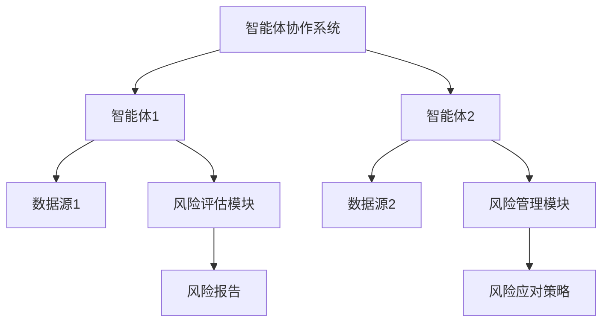
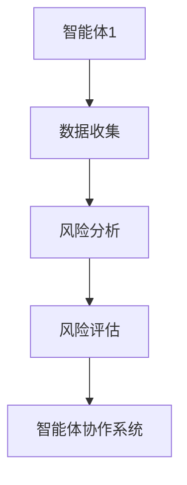
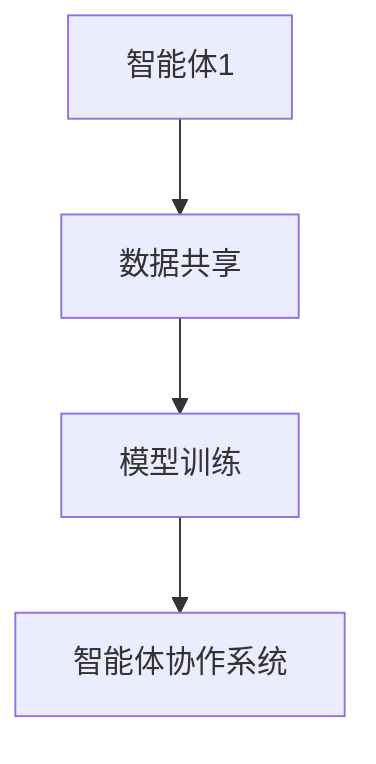
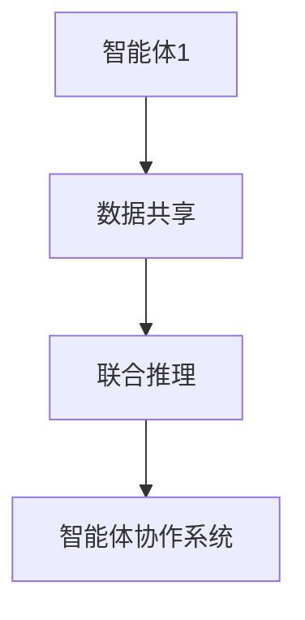
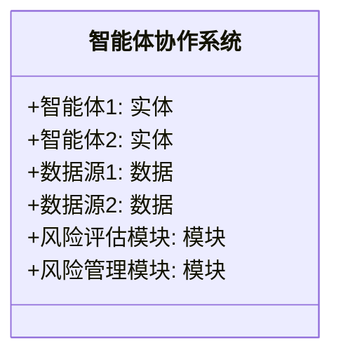

                 


# 智能体协作实现全面的风险评估与管理

## 关键词
智能体协作，风险管理，分布式系统，协同学习，风险评估

## 摘要
智能体协作在现代风险管理中扮演着越来越重要的角色。通过多个智能体的协同工作，组织能够更高效、更准确地识别和管理风险。本文详细探讨了智能体协作的核心概念、算法原理、系统架构设计以及实际应用案例，展示了如何利用智能体协作实现全面的风险评估与管理。

---

## 第1章：智能体协作与风险管理概述

### 1.1 智能体协作的背景与意义
随着企业规模的扩大和业务的复杂化，传统风险管理方法逐渐暴露出效率低下、信息孤岛等问题。智能体协作作为一种新兴的技术手段，通过多个智能体的协同工作，能够实时分析数据，快速识别潜在风险，并制定应对策略。这种协作方式不仅提高了风险管理的效率，还显著增强了决策的准确性。

#### 1.1.1 传统风险管理的局限性
- 数据分散，难以整合
- 响应速度慢，缺乏实时性
- 风险评估依赖单一视角

#### 1.1.2 智能体协作的优势与潜力
- 多源数据整合，提升分析精度
- 实时协作，快速响应风险
- 知识共享，避免信息孤岛

#### 1.1.3 智能体协作在现代风险管理中的应用前景
- 智能化、自动化风险管理
- 跨领域、跨部门协作
- 提高决策的科学性和及时性

### 1.2 问题背景与描述
风险管理的核心问题是如何在复杂多变的环境中，及时识别和应对潜在风险。智能体协作通过分布式计算和协同学习，能够有效地整合多方资源和信息，实现对风险的全面评估和管理。

#### 1.2.1 风险管理的核心问题
- 如何高效整合多源数据
- 如何快速响应潜在风险
- 如何制定最优风险应对策略

#### 1.2.2 智能体协作在风险管理中的应用场景
- 金融领域的信用风险评估
- 企业运营中的供应链风险
- 公共安全领域的突发事件应对

#### 1.2.3 问题的边界与外延
- 限定在特定业务领域内的风险管理
- 跨领域协作的风险管理
- 全球化背景下的风险管理

### 1.3 智能体协作的核心概念
智能体协作是多个智能体通过协同工作，共同完成特定任务的过程。在风险管理中，智能体协作的核心概念包括智能体的定义、协作机制以及风险评估模型。

#### 1.3.1 智能体的定义与特征
- **定义**：智能体是指能够感知环境、自主决策并采取行动的实体。
- **特征**：
  - 知识共享与协同推理
  - 分布式计算与数据整合
  - 自适应与动态调整能力

#### 1.3.2 智能体协作的基本原理
智能体协作通过分布式计算和协同学习，实现对风险的全面评估和管理。其基本原理包括数据共享、协同推理和联合决策。

#### 1.3.3 风险评估与管理的智能体协作模型
智能体协作模型包括数据收集、风险分析、评估和应对策略制定等环节，通过多智能体的协同工作，实现对风险的全面管理。

---

## 第2章：智能体协作的核心原理

### 2.1 智能体协作的基本原理
智能体协作的基本原理包括数据共享、协同推理和联合决策。通过这些原理，智能体能够实现对风险的全面评估和管理。

#### 数据共享
智能体协作的第一步是数据共享。多个智能体通过共享数据，能够整合多方信息，提升分析的全面性。

#### 协同推理
协同推理是智能体协作的核心过程。通过联合推理，智能体能够共同分析数据，识别潜在风险，并制定应对策略。

#### 联合决策
在协同推理的基础上，智能体协作能够制定联合决策，实现对风险的全面管理。

### 2.2 智能体协作的关键特征
智能体协作的关键特征包括分布式计算、知识共享和动态适应。这些特征使得智能体协作在风险管理中具有显著优势。

#### 分布式计算
智能体协作基于分布式计算，能够高效整合多源数据，提升计算效率。

#### 知识共享
知识共享是智能体协作的重要特征，通过共享知识，智能体能够提升分析的深度和广度。

#### 动态适应
智能体协作具有动态适应能力，能够根据环境变化及时调整策略。

### 2.3 智能体协作与其他协作方式的对比
智能体协作与其他协作方式相比，具有显著的优势。例如，与传统的集中式管理相比，智能体协作能够更好地应对复杂环境中的风险管理。

---

## 第3章：智能体协作的实体关系架构

### 3.1 实体关系架构概述
智能体协作的实体关系架构包括智能体、数据源、风险评估模块和风险管理模块。通过这些实体的协同工作，实现对风险的全面管理。

#### 智能体
智能体是智能体协作的核心实体，负责感知环境、自主决策并采取行动。

#### 数据源
数据源是智能体协作的重要数据来源，包括各种传感器、数据库和外部系统。

#### 风险评估模块
风险评估模块负责对收集的数据进行分析，识别潜在风险，并评估风险的严重性。

#### 风险管理模块
风险管理模块负责制定风险应对策略，指导智能体采取相应的行动。

### 3.2 实体关系架构的Mermaid图
以下是一个智能体协作的实体关系架构图：



### 3.3 实体关系架构的分析
通过上述Mermaid图可以看出，智能体协作系统由多个智能体组成，每个智能体都连接到不同的数据源。风险评估模块和风险管理模块分别负责风险的评估和管理，最终生成风险报告和应对策略。

---

## 第4章：智能体协作的风险评估与管理算法

### 4.1 分布式风险评估算法
分布式风险评估算法是智能体协作的核心算法之一。通过分布式计算，多个智能体能够高效地完成风险评估任务。

#### 算法流程


#### 算法实现
```python
def distributed_risk_assessment(sensors):
    data = collect_data(sensors)
    risk_factors = analyze_data(data)
    risk_score = assess_risk(risk_factors)
    return risk_score
```

### 4.2 协同学习算法
协同学习算法是智能体协作的另一种重要算法。通过协同学习，多个智能体能够共享知识，提升风险评估的准确性。

#### 算法流程


#### 算法实现
```python
def collaborative_learning(sensors, models):
    shared_data = share_data(sensors)
    updated_models = train_models(shared_data, models)
    return updated_models
```

### 4.3 联合推理算法
联合推理算法是智能体协作的第三种重要算法。通过联合推理，智能体能够共同分析数据，识别潜在风险，并制定应对策略。

#### 算法流程


#### 算法实现
```python
def joint_inference(sensors, models):
    shared_data = share_data(sensors)
    inference_result = infer(shared_data, models)
    return inference_result
```

---

## 第5章：智能体协作系统的架构设计

### 5.1 系统功能设计
智能体协作系统的核心功能包括数据收集、风险评估、风险管理以及策略制定。

#### 功能模块
- 数据收集模块：负责从各个数据源收集数据。
- 风险评估模块：对收集的数据进行分析，识别潜在风险。
- 风险管理模块：制定风险应对策略，指导智能体采取相应行动。

### 5.2 系统架构设计
智能体协作系统的架构设计包括多个智能体、数据源、功能模块以及交互接口。

#### 类图设计


#### 序列图设计


### 5.3 系统接口设计
智能体协作系统的接口设计包括数据接口、模型接口以及策略接口。

#### 接口描述
- 数据接口：用于智能体与数据源之间的数据交换。
- 模型接口：用于智能体之间的模型共享和协同学习。
- 策略接口：用于智能体与风险管理模块之间的策略制定和执行。

---

## 第6章：项目实战

### 6.1 环境安装
为了运行智能体协作系统，需要安装以下环境：
- Python编程语言
- 相关的库和框架（如TensorFlow、Kafka等）

### 6.2 核心功能实现
以下是智能体协作系统的核心功能实现代码：

#### 数据收集模块
```python
def collect_data(sensors):
    data = []
    for sensor in sensors:
        data.append(sensor.get_data())
    return data
```

#### 风险评估模块
```python
def assess_risk(data):
    risk_score = 0
    for d in data:
        if d > threshold:
            risk_score += 1
    return risk_score
```

#### 风险管理模块
```python
def manage_risk(score):
    if score > threshold:
        return "采取行动"
    else:
        return "无需行动"
```

### 6.3 案例分析
以下是一个智能体协作在风险管理中的实际案例：

#### 案例描述
某企业面临供应链中断的风险。通过智能体协作系统，多个智能体分别监测供应链的不同环节，实时收集数据，并通过协同学习和联合推理，识别潜在风险，并制定应对策略。

#### 分析结果
智能体协作系统成功识别了供应链中的潜在风险，并制定了相应的应对策略，有效降低了企业的损失。

---

## 第7章：总结与展望

### 7.1 总结
智能体协作在风险管理中的应用具有显著优势。通过分布式计算和协同学习，智能体协作能够高效整合多源数据，提升风险评估的准确性和实时性。

### 7.2 优势与挑战
- **优势**：
  - 提高风险管理的效率和准确性
  - 实现多领域、跨部门的协作
  - 增强企业的抗风险能力
- **挑战**：
  - 数据隐私和安全问题
  - 智能体协作的复杂性和成本
  - 系统的可扩展性和可维护性

### 7.3 最佳实践 tips
- 确保数据的安全性和隐私性
- 定期更新和优化协作模型
- 建立完善的监控和反馈机制

### 7.4 未来展望
随着人工智能和分布式系统的不断发展，智能体协作在风险管理中的应用前景广阔。未来的研究方向包括：
- 更高效的协作算法
- 更智能的系统架构
- 更广泛的应用场景

---

## 作者：AI天才研究院/AI Genius Institute & 禅与计算机程序设计艺术 /Zen And The Art of Computer Programming

---

本文通过详细探讨智能体协作的核心概念、算法原理、系统架构设计以及实际应用案例，展示了如何利用智能体协作实现全面的风险评估与管理。希望本文能够为相关领域的研究和实践提供有价值的参考。

