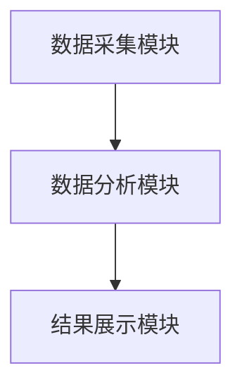

                 

# 智能体协作提升价值投资的供应商财务健康度分析

## 关键词：智能体协作，价值投资，供应商财务健康度，系统架构，算法优化

## 摘要：本文探讨如何利用智能体协作技术提升价值投资中的供应商财务健康度分析。通过详细分析智能体协作的基本原理、价值投资的分析方法以及系统的架构设计，展示了智能体协作在提升供应商财务健康度分析效率和准确性中的重要作用。

---

## 第一部分: 智能体协作与价值投资概述

### 第1章: 智能体协作的基本概念

#### 1.1 智能体协作的定义与背景

**1.1.1 智能体协作的定义**  
智能体协作是指多个智能体通过协同工作，共同完成复杂任务的过程。智能体可以是软件程序、算法或实体设备，具备感知环境、自主决策和执行任务的能力。通过协作，智能体能够优化资源分配，提高任务执行效率。

**1.1.2 智能体协作的历史发展**  
智能体协作的概念起源于分布式人工智能领域，20世纪90年代开始逐步发展。随着计算能力的提升和大数据技术的普及，智能体协作在多个领域得到了广泛应用。

**1.1.3 智能体协作的应用场景**  
智能体协作在金融、物流、医疗等领域有广泛应用。在金融领域，智能体协作常用于投资决策、风险评估和市场预测。

#### 1.2 价值投资的基本原理

**1.2.1 价值投资的定义**  
价值投资是一种投资策略，通过分析公司的基本面，寻找被市场低估的投资标的。其核心是找到具有长期稳定增长潜力的公司。

**1.2.2 价值投资的核心理念**  
价值投资强调安全边际、长期持有和内在价值。投资者应关注公司的财务状况、行业地位和竞争优势。

**1.2.3 价值投资与智能体协作的结合**  
智能体协作可以提升价值投资的效率，通过多个智能体分别分析不同的财务指标，协作完成综合评估。

---

### 第2章: 供应商财务健康度分析的重要性

#### 2.1 供应商财务健康度的定义

**2.1.1 供应商财务健康度的内涵**  
供应商的财务健康度是衡量其财务状况是否稳健的指标，包括盈利能力、偿债能力和运营效率等方面。

**2.1.2 供应商财务健康度的评估标准**  
常用的评估指标包括资产负债率、流动比率、净利润率等。

#### 2.2 价值投资与供应商财务健康度的关系

**2.2.1 价值投资中供应商选择的重要性**  
在供应链管理中，选择财务健康、稳定的供应商是降低风险的关键。价值投资通过分析供应商的财务状况，确保其具备长期合作能力。

**2.2.2 供应商财务健康度对投资决策的影响**  
财务健康度高的供应商通常能提供稳定的产品和服务，这对企业长期发展至关重要。

#### 2.3 智能体协作在供应商财务健康度分析中的作用

**2.3.1 智能体协作的优势**  
通过分布式的计算和分析，智能体协作能够高效处理大量数据，提供更精准的评估结果。

**2.3.2 智能体协作如何提升供应商财务健康度分析的效率**  
智能体协作可以并行处理多个财务指标，显著提高分析速度和准确性。

---

## 第二部分: 智能体协作的实现原理

### 第3章: 智能体协作的核心机制

#### 3.1 智能体协作的通信机制

**3.1.1 智能体之间的信息传递**  
智能体通过消息传递机制进行通信，确保信息同步和数据共享。

**3.1.2 信息传递的协议与标准**  
使用标准化协议如HTTP、WebSocket等，确保智能体之间高效通信。

#### 3.2 智能体协作的决策机制

**3.2.1 单智能体决策**  
单个智能体根据自身信息做出决策，适用于任务简单的情况。

**3.2.2 多智能体协作决策**  
多个智能体协同决策，综合考虑各智能体的分析结果，做出最优选择。

#### 3.3 智能体协作的协调机制

**3.3.1 协调策略的制定**  
通过制定明确的规则和优先级，确保各智能体协作顺利进行。

**3.3.2 协调机制的实现**  
使用仲裁机制或协商协议解决冲突，确保协作过程中的和谐统一。

---

### 第4章: 价值投资分析的算法原理

#### 4.1 价值投资分析的基本算法

**4.1.1 市盈率法**  
市盈率=股价/每股收益，用于评估股票是否被低估。

**4.1.2 市净率法**  
市净率=股价/每股净资产，用于评估股票相对于账面价值的高低。

**4.1.3 股息率法**  
股息率=每股股息/股价，用于评估股票的分红能力。

#### 4.2 智能体协作在价值投资分析中的算法优化

**4.2.1 分布式计算在价值投资分析中的应用**  
通过分布式计算，智能体可以并行处理大量数据，提高分析效率。

**4.2.2 并行计算在价值投资分析中的应用**  
并行计算可以同时分析多个指标，加快决策过程。

#### 4.3 价值投资分析的数学模型

**4.3.1 市盈率模型**  
$$市盈率 = \frac{股价}{每股收益}$$

**4.3.2 市净率模型**  
$$市净率 = \frac{股价}{每股净资产}$$

**4.3.3 股息率模型**  
$$股息率 = \frac{每股股息}{股价}$$

---

## 第三部分: 供应商财务健康度分析的系统架构

### 第5章: 供应商财务健康度分析系统的总体架构

#### 5.1 系统功能模块划分

**5.1.1 数据采集模块**  
负责收集供应商的财务数据，包括收入、利润、资产负债等。

**5.1.2 数据分析模块**  
对数据进行清洗、转换和分析，评估供应商的财务健康度。

**5.1.3 结果展示模块**  
将分析结果以可视化形式呈现，便于用户理解和决策。

#### 5.2 系统架构设计

**5.2.1 系统架构图**  

**5.2.2 数据流设计**  
供应商的财务数据通过数据采集模块进入系统，经分析模块处理后，结果展示模块生成报告。

---

## 结语

通过智能体协作技术，价值投资的供应商财务健康度分析变得更加高效和准确。本文详细介绍了智能体协作的基本原理、算法优化和系统架构设计，为实践提供了理论支持和指导。未来，随着技术的进步，智能体协作在价值投资中的应用将更加广泛和深入。

---

## 作者：AI天才研究院/AI Genius Institute & 禅与计算机程序设计艺术 /Zen And The Art of Computer Programming

