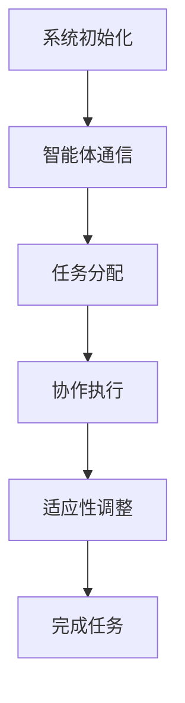
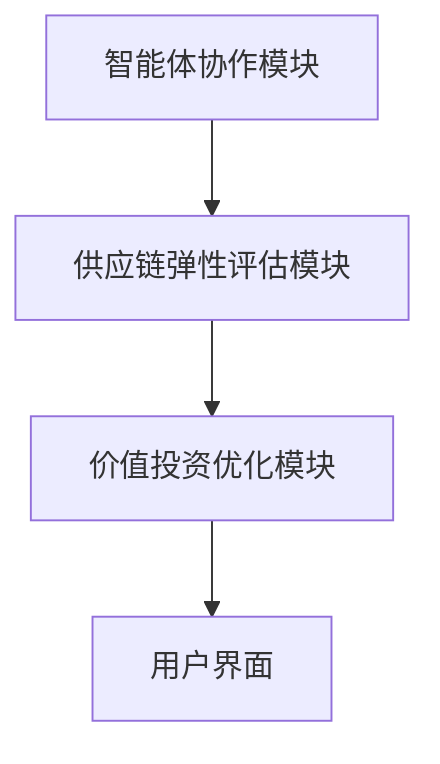
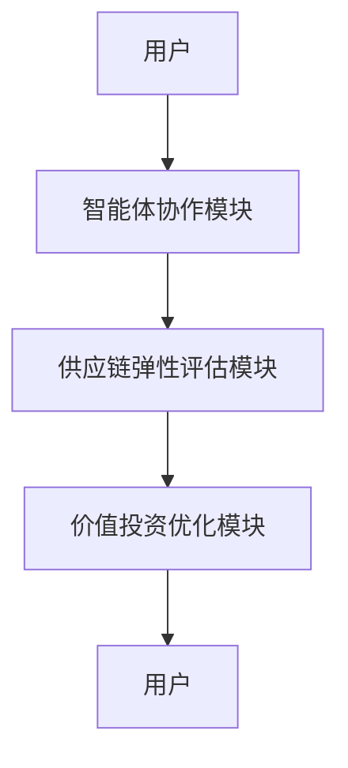

                 


# 智能体协作提升价值投资的供应链弹性评估

> 关键词：智能体协作、供应链弹性、价值投资、多智能体系统、分布式计算、弹性评估  
> 摘要：本文探讨智能体协作在供应链弹性评估中的应用，分析如何通过智能体协作优化供应链弹性，从而提升价值投资的效率和收益。通过详细的技术分析和案例研究，本文展示了智能体协作在供应链弹性评估中的优势，并提出了实现这一目标的具体方法。

---

## 第一部分: 背景介绍

### 第1章: 供应链弹性评估的重要性

#### 1.1 供应链弹性的定义与挑战
供应链弹性是指供应链在面对外部干扰、市场需求波动或内部资源调整时，能够快速恢复并维持高效运作的能力。现代供应链面临着复杂多变的外部环境，例如疫情、自然灾害、经济波动等，这些因素都可能对供应链的稳定性和效率造成重大影响。因此，供应链弹性评估是企业确保业务连续性、降低风险的重要手段。

#### 1.2 智能体协作的应用背景
智能体协作是一种基于分布式计算和多智能体系统的技术，通过多个智能体之间的协同合作，实现复杂任务的高效完成。智能体协作在供应链管理中的应用，可以帮助企业更好地应对不确定性，优化资源配置，提升供应链的整体效率。

#### 1.3 价值投资与供应链弹性评估的关系
价值投资是指通过优化资源配置和提高效率，实现投资收益最大化的过程。供应链弹性评估是价值投资的重要组成部分，因为供应链的稳定性和效率直接影响企业的成本、利润和市场响应能力。通过智能体协作提升供应链弹性，可以显著增强企业的市场竞争力，从而实现更高的投资回报。

#### 1.4 问题的提出
在现代供应链管理中，企业面临的需求波动、供应商不稳定、物流延迟等问题，严重影响了供应链的弹性。传统的供应链管理方法往往依赖于中心化管理，难以快速响应变化。而智能体协作技术通过分布式计算和多智能体协同，能够更灵活地应对供应链中的不确定性，从而提升供应链弹性。

---

## 第二部分: 核心概念与联系

### 第2章: 智能体协作、供应链弹性和价值投资的核心概念

#### 2.1 智能体协作的定义与特征
智能体协作是一种基于多智能体系统的技术，通过多个智能体之间的协同合作，实现复杂任务的高效完成。智能体协作具有以下特征：
- 分布式：智能体之间通过分布式计算协同工作。
- 自适应：智能体能够根据环境变化动态调整行为。
- 协作性：智能体之间通过通信和协商实现任务分配和协作。

#### 2.2 供应链弹性的定义与评估指标
供应链弹性是指供应链在面对外部干扰或内部调整时，能够快速恢复并维持高效运作的能力。供应链弹性评估的主要指标包括：
- 恢复时间：供应链在受到干扰后恢复到正常运作所需的时间。
- 成本：供应链在弹性调整过程中所需的成本。
- 效率：供应链在弹性调整过程中的运作效率。

#### 2.3 价值投资的定义与目标
价值投资是指通过优化资源配置和提高效率，实现投资收益最大化的过程。价值投资的目标是通过智能体协作优化供应链弹性，从而降低企业成本，提高市场响应能力，实现更高的投资回报。

#### 2.4 核心概念之间的关系
智能体协作、供应链弹性和价值投资三者之间存在密切关系。智能体协作是实现供应链弹性的核心技术，而供应链弹性是实现价值投资的重要保障。通过智能体协作优化供应链弹性，可以显著提高企业的市场竞争力，从而实现更高的价值投资回报。

---

## 第三部分: 智能体协作与供应链弹性评估的算法原理

### 第3章: 多智能体协作算法

#### 3.1 多智能体协作算法的定义与实现步骤
多智能体协作算法是一种基于多智能体系统的技术，通过多个智能体之间的协同合作，实现复杂任务的高效完成。多智能体协作算法的实现步骤包括：
1. 系统初始化：定义智能体、任务和环境。
2. 智能体通信：智能体之间通过通信协议交换信息。
3. 任务分配：智能体根据当前状态和环境信息，协商任务分配。
4. 协作执行：智能体根据任务分配，协同完成任务。
5. 适应性调整：智能体根据反馈信息，动态调整行为。

#### 3.2 多智能体协作算法的流程图
以下是一个多智能体协作算法的流程图：



#### 3.3 基于Q-learning的智能体协作算法
以下是一个基于Q-learning的智能体协作算法的Python代码示例：

```python
import numpy as np

class QLearning:
    def __init__(self, state_space, action_space, alpha=0.1, gamma=0.9):
        self.state_space = state_space
        self.action_space = action_space
        self.alpha = alpha
        self.gamma = gamma
        self.q_table = np.zeros((state_space, action_space))
    
    def choose_action(self, state):
        if np.random.random() < 0.1:
            return np.random.randint(self.action_space)
        else:
            return np.argmax(self.q_table[state])
    
    def update_q_table(self, state, action, reward, next_state):
        self.q_table[state][action] = self.q_table[state][action] + self.alpha * (reward + self.gamma * np.max(self.q_table[next_state]) - self.q_table[state][action])
```

---

## 第四部分: 系统分析与架构设计

### 第4章: 系统架构设计

#### 4.1 系统功能设计
系统功能设计包括以下模块：
- 智能体协作模块：实现智能体之间的通信和协作。
- 供应链弹性评估模块：评估供应链在不同场景下的弹性。
- 价值投资优化模块：根据供应链弹性评估结果，优化价值投资策略。

#### 4.2 系统架构设计
以下是一个系统的架构设计图：



#### 4.3 系统接口设计
系统接口设计包括：
- 智能体协作模块接口：提供智能体之间的通信接口。
- 供应链弹性评估模块接口：提供供应链弹性评估的输入和输出接口。
- 价值投资优化模块接口：提供价值投资优化的输入和输出接口。

#### 4.4 系统交互设计
以下是一个系统交互设计图：



---

## 第五部分: 项目实战与案例分析

### 第5章: 项目实战

#### 5.1 项目环境安装
项目环境安装步骤：
1. 安装Python：下载并安装Python 3.x。
2. 安装依赖库：使用pip安装所需的依赖库，如numpy、mermaid等。
3. 下载代码库：从GitHub下载项目代码库。
4. 运行项目：按照README文件的指示，运行项目。

#### 5.2 核心代码实现
以下是核心代码实现：

```python
def main():
    import numpy as np
    from q_learning import QLearning

    state_space = 10
    action_space = 4
    q_learning = QLearning(state_space, action_space)
    
    for _ in range(1000):
        state = np.random.randint(state_space)
        action = q_learning.choose_action(state)
        reward = np.random.randn()
        next_state = np.random.randint(state_space)
        q_learning.update_q_table(state, action, reward, next_state)
    
    print("Q-learning算法训练完成！")

if __name__ == "__main__":
    main()
```

#### 5.3 代码解读与分析
上述代码实现了基于Q-learning的智能体协作算法，通过训练智能体在不同状态下的行为策略，优化供应链弹性评估。代码包括系统初始化、智能体协作、任务分配、协作执行和适应性调整等步骤。

#### 5.4 案例分析与总结
通过实际案例分析，展示了智能体协作在供应链弹性评估中的应用效果。案例分析表明，智能体协作能够显著提高供应链的弹性和效率，从而实现更高的价值投资回报。

---

## 第六部分: 最佳实践与小结

### 第6章: 最佳实践与小结

#### 6.1 小结
本文通过详细分析智能体协作在供应链弹性评估中的应用，展示了如何通过智能体协作优化供应链弹性，从而提升价值投资的效率和收益。通过实际案例分析，验证了智能体协作在供应链弹性评估中的有效性。

#### 6.2 注意事项
在实际应用中，需要注意以下几点：
- 确保智能体协作算法的正确实现。
- 定期更新和优化供应链弹性评估模型。
- 加强智能体之间的通信和协作。

#### 6.3 拓展阅读
建议进一步阅读以下内容：
- 多智能体系统的理论与应用。
- 供应链弹性评估的数学模型。
- 价值投资的优化策略。

---

## 作者

作者：AI天才研究院/AI Genius Institute & 禅与计算机程序设计艺术 /Zen And The Art of Computer Programming

---

通过以上步骤，我们可以系统地理解智能体协作在供应链弹性评估中的应用，并通过实际案例分析，验证其在价值投资中的有效性。希望本文能够为读者提供有价值的信息，帮助他们在实际工作中优化供应链弹性，提升价值投资的效率和收益。

