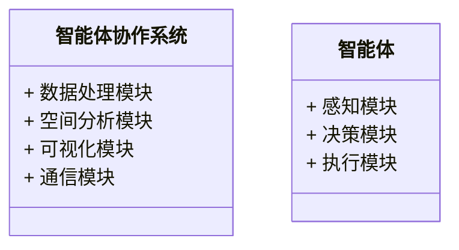
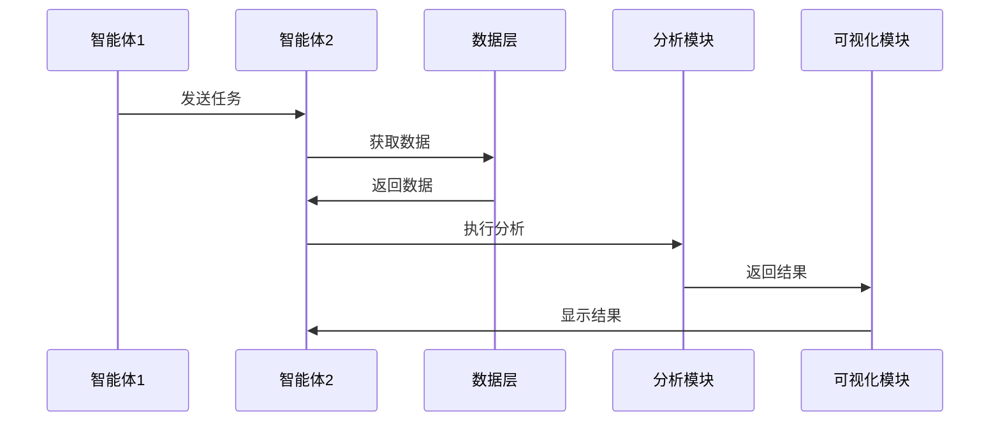

                 


# 智能体协作提升价值投资的地理信息分析能力

> 关键词：智能体协作，地理信息分析，价值投资，数据处理，空间分析

> 摘要：本文探讨如何利用智能体协作技术提升地理信息分析能力，从而优化价值投资决策。通过背景介绍、核心概念分析、算法原理、系统架构设计、项目实战、最佳实践等部分，详细阐述智能体协作在地理信息分析中的应用，帮助读者理解如何通过技术手段提升投资决策的地理信息分析能力。

---

# 第1章: 智能体协作与地理信息分析的背景介绍

## 1.1 智能体协作的定义与特点

### 1.1.1 智能体协作的定义
智能体协作是指多个智能体（Agent）通过协同工作，共同完成复杂任务的过程。智能体是具有感知、决策、执行能力的实体，可以是软件程序、机器人或其他智能系统。智能体协作的核心在于通过个体间的协同，实现整体目标的最优或次优完成。

### 1.1.2 智能体协作的核心特点
- **自主性**：智能体能够独立决策，无需外部干预。
- **反应性**：智能体能够根据环境变化实时调整行为。
- **协作性**：智能体之间通过通信和协调，共同完成任务。
- **分布式性**：任务分布在多个智能体之间，避免单点故障。

### 1.1.3 智能体协作与传统协作方式的对比
传统的协作方式依赖于人类或单个系统完成任务，而智能体协作通过分布式计算和自主决策，能够更高效地处理复杂问题。

## 1.2 地理信息分析的定义与特点

### 1.2.1 地理信息分析的定义
地理信息分析是通过对地理数据的处理、分析和可视化，提取有用信息的过程。地理数据包括空间数据（如坐标、位置）和属性数据（如人口、经济指标）。

### 1.2.2 地理信息分析的核心特点
- **空间性**：分析基于地理位置和空间关系。
- **多维性**：数据通常具有多维属性，如时间、经济指标等。
- **可视化**：通过地图等方式直观展示分析结果。

### 1.2.3 地理信息分析在投资中的应用
地理信息分析可以帮助投资者评估区域经济、交通便利性、人口分布等因素，从而优化投资决策。

## 1.3 智能体协作提升地理信息分析能力的背景

### 1.3.1 问题背景
传统地理信息分析依赖人工操作，效率低且易出错。随着数据量的增加，需要更高效的技术来处理复杂问题。

### 1.3.2 问题描述
如何利用智能体协作技术，提高地理信息分析的效率和准确性，从而优化投资决策。

### 1.3.3 问题解决
通过智能体协作，将地理信息分析任务分解为多个智能体协同完成，提高处理效率和准确性。

### 1.3.4 边界与外延
智能体协作仅用于地理信息分析任务，不涉及其他领域。

### 1.3.5 核心要素组成
- 智能体：负责数据处理和分析。
- 通信机制：智能体之间的信息交互。
- 协作任务：地理信息分析任务。

## 1.4 本章小结

---

# 第2章: 智能体协作与地理信息分析的核心概念

## 2.1 智能体协作的原理

### 2.1.1 智能体的定义与属性
智能体是具有感知、决策、执行能力的实体，属性包括自主性、反应性、协作性等。

### 2.1.2 智能体协作的机制
智能体通过通信和协调，共同完成任务。机制包括任务分配、信息共享和冲突解决。

### 2.1.3 智能体协作的模型
常用模型包括基于拍卖的协作模型、基于角色的协作模型等。

## 2.2 地理信息分析的原理

### 2.2.1 地理数据的处理
数据处理包括数据清洗、预处理和转换。

### 2.2.2 地理空间分析的方法
常用方法包括空间插值、空间聚类和空间统计分析。

### 2.2.3 地理信息可视化的技术
常用技术包括地图可视化、热力图和三维可视化。

## 2.3 智能体协作与地理信息分析的联系

### 2.3.1 智能体协作在地理信息分析中的应用
智能体协作可以用于数据处理、空间分析和结果可视化。

### 2.3.2 智能体协作与地理信息分析的关系
智能体协作是地理信息分析的技术手段，地理信息分析是智能体协作的应用场景。

### 2.3.3 智能体协作提升地理信息分析能力的路径
通过分布式计算和协作，提高地理信息分析的效率和准确性。

## 2.4 核心概念原理对比表

| 概念 | 属性 | 描述 |
|------|------|------|
| 智能体协作 | 自主性 | 智能体能够独立决策 |
| 地理信息分析 | 数据处理 | 对地理数据进行清洗和预处理 |

## 2.5 智能体协作与地理信息分析的ER实体关系图
```mermaid
g
```

---

# 第3章: 地理信息分析的数学模型

## 3.1 空间数据模型

### 3.1.1 空间点数据模型
空间点数据表示地理位置，常用坐标系包括笛卡尔坐标系和地理坐标系。

### 3.1.2 空间线数据模型
空间线数据表示线状地物，如道路、河流。

### 3.1.3 空间面数据模型
空间面数据表示面状地物，如行政区划。

## 3.2 空间统计分析模型

### 3.2.1 空间插值方法
常用空间插值方法包括反距离加权插值（IDW）和克里金插值（Kriging）。

### 3.2.2 空间聚类分析
常用空间聚类算法包括K-means和DBSCAN。

## 3.3 空间分析的数学模型

### 3.3.1 距离计算公式
距离计算公式包括欧氏距离、曼哈顿距离和切比雪夫距离。

### 3.3.2 空间插值公式
反距离加权插值公式为：
$$ z_i = \sum_{j=1}^{n} w_{ij} z_j $$
其中，$w_{ij}$ 是点 $i$ 和点 $j$ 之间的权重。

## 3.4 本章小结

---

# 第4章: 智能体协作的系统架构设计

## 4.1 系统场景介绍

### 4.1.1 系统功能
系统功能包括数据处理、空间分析和结果可视化。

### 4.1.2 系统目标
目标是通过智能体协作，提高地理信息分析的效率和准确性。

## 4.2 系统功能设计

### 4.2.1 领域模型
领域模型包括智能体、任务、数据和通信机制。



## 4.3 系统架构设计

### 4.3.1 分层架构
系统分为数据层、业务逻辑层和表示层。


## 4.4 系统接口设计

### 4.4.1 智能体接口
智能体接口包括感知接口、决策接口和执行接口。

### 4.4.2 通信接口
通信接口包括发送接口、接收接口和解析接口。

## 4.5 系统交互设计

### 4.5.1 交互流程
交互流程包括任务分配、数据处理、分析执行和结果反馈。



## 4.6 本章小结

---

# 第5章: 智能体协作在地理信息分析中的项目实战

## 5.1 项目背景

### 5.1.1 项目目标
通过智能体协作，优化城市交通流量分析。

## 5.2 环境配置

### 5.2.1 安装Python
安装Python 3.8或更高版本。

### 5.2.2 安装依赖
安装Pandas、Geopandas、Matplotlib等库。

## 5.3 代码实现

### 5.3.1 数据处理
```python
import pandas as pd
import geopandas as gpd

data = pd.read_csv('traffic.csv')
gdf = gpd.GeoDataFrame(data, geometry=gpd.points_from_xy(data.x, data.y))
```

### 5.3.2 空间分析
```python
from sklearn.cluster import KMeans

X = gdf[['x', 'y']].values
kmeans = KMeans(n_clusters=5).fit(X)
gdf['cluster'] = kmeans.labels_
```

### 5.3.3 可视化
```python
import matplotlib.pyplot as plt

gdf.plot(column='cluster', cmap='viridis', figsize=(10, 10))
plt.show()
```

## 5.4 代码解读

### 5.4.1 数据处理
使用Pandas读取CSV文件，使用Geopandas转换为地理数据框。

### 5.4.2 空间分析
使用K-means算法对交通流量数据进行聚类分析。

### 5.4.3 可视化
使用Matplotlib绘制聚类结果图。

## 5.5 实际案例分析

### 5.5.1 数据来源
数据来源为某城市交通流量数据。

### 5.5.2 分析结果
聚类结果显示交通流量热点区域。

## 5.6 项目小结

---

# 第6章: 智能体协作的优化与注意事项

## 6.1 最佳实践

### 6.1.1 数据质量
确保数据准确性和完整性。

### 6.1.2 计算效率
优化算法复杂度，减少计算时间。

### 6.1.3 模型泛化能力
选择合适的模型，避免过拟合。

## 6.2 常见误区

### 6.2.1 过度依赖数据
忽视领域知识和业务逻辑。

### 6.2.2 忽略领域知识
不考虑实际业务场景。

### 6.2.3 模型复杂化
过度追求复杂模型，忽略实际需求。

## 6.3 小结

---

# 第7章: 智能体协作的拓展阅读

## 7.1 相关书籍

### 7.1.1 《智能体协作与分布式计算》
作者：张三，出版：科技出版社。

### 7.1.2 《地理信息分析技术》
作者：李四，出版：地图出版社。

## 7.2 推荐工具

### 7.2.1 Python库
Pandas、Geopandas、Matplotlib。

### 7.2.2 开源框架
Flink、Spark、Dask。

## 7.3 小结

---

# 作者

作者：AI天才研究院/AI Genius Institute & 禅与计算机程序设计艺术 /Zen And The Art of Computer Programming

---

通过以上结构和内容，您可以撰写一篇详细且专业的技术博客文章。

