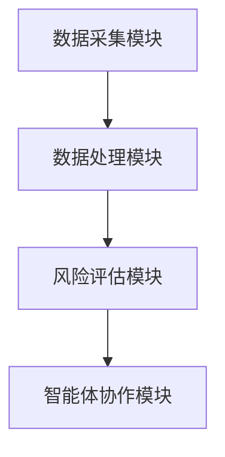
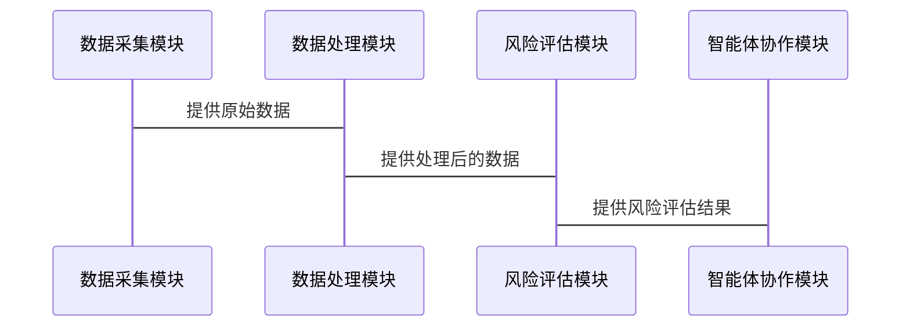

                 


# 智能体协作提升价值投资的地缘政治风险量化分析

---

## 关键词：
智能体协作，价值投资，地缘政治风险，量化分析，博弈论，系统架构

---

## 摘要：
本文探讨了智能体协作在价值投资中的应用，特别是如何通过智能体协作量化地缘政治风险。文章从智能体协作的基本概念、地缘政治风险的量化分析，到数学模型、系统架构设计，再到项目实战，系统地分析了智能体协作在价值投资中的作用。通过博弈论模型和复杂网络分析，本文提出了一种新的地缘政治风险量化方法，并展示了如何通过智能体协作优化投资决策。

---

## 第一部分：智能体协作与价值投资的背景介绍

### 第1章：智能体协作的核心概念

#### 1.1 问题背景与问题描述

##### 1.1.1 智能体协作的定义与外延
智能体协作是指多个智能体通过合作完成共同目标的过程。智能体可以是软件程序、算法或分布式系统中的组件。智能体协作的核心在于通过信息共享和决策协同，实现个体目标与集体目标的统一。

##### 1.1.2 价值投资与地缘政治风险的关系
价值投资是一种投资策略，强调通过分析资产的内在价值进行投资。地缘政治风险是影响资产价格波动的重要因素，尤其是在全球化背景下，政治事件、贸易摩擦等地缘政治因素对经济和市场的影响日益显著。智能体协作可以通过分析地缘政治风险，帮助投资者做出更明智的投资决策。

##### 1.1.3 智能体协作在价值投资中的应用边界
智能体协作在价值投资中的应用边界包括数据收集、风险评估、投资决策优化等方面。通过智能体协作，投资者可以更高效地处理复杂信息，降低决策风险。

#### 1.2 智能体协作的核心要素

##### 1.2.1 多智能体系统的概念
多智能体系统由多个智能体组成，每个智能体都有自己的目标和决策机制。智能体之间通过通信和协作完成共同任务。

##### 1.2.2 分布式计算与协作机制
分布式计算是智能体协作的基础，通过分布式计算，智能体可以在不同节点上协同工作，实现信息共享和决策优化。

##### 1.2.3 智能体协作的数学模型
智能体协作的数学模型包括状态空间、动作空间和奖励函数。状态空间表示智能体所处的环境，动作空间表示智能体可执行的操作，奖励函数表示智能体完成任务的奖励。

---

### 第2章：地缘政治风险的量化分析

#### 2.1 地缘政治风险的定义与分类

##### 2.1.1 地缘政治风险的多维度特征
地缘政治风险具有复杂性、动态性和不确定性，涉及政治、经济、军事等多个维度。

##### 2.1.2 风险的量化指标与评估方法
常用的量化指标包括风险概率、风险影响和综合风险指数。评估方法包括统计分析、网络分析和博弈论模型。

##### 2.1.3 地缘政治事件的网络化分析
地缘政治事件可以通过复杂网络分析，构建事件网络，分析事件之间的关联性。

#### 2.2 复杂网络分析在地缘政治风险中的应用

##### 2.2.1 复杂网络的基本概念
复杂网络由节点和边组成，节点代表实体，边代表实体之间的关系。

##### 2.2.2 地缘政治网络的构建与分析
通过收集地缘政治事件数据，构建地缘政治网络，并分析网络的拓扑结构。

##### 2.2.3 网络中心性分析与风险评估
网络中心性分析用于识别关键节点，评估节点对网络的影响。

---

### 第3章：智能体协作与博弈论模型

#### 3.1 博弈论在智能体协作中的应用

##### 3.1.1 博弈论的基本概念
博弈论研究个体在博弈中的策略选择和决策过程。

##### 3.1.2 博弈论在多智能体系统中的应用
多智能体系统中的博弈论模型用于分析智能体之间的互动和合作。

##### 3.1.3 博弈论与地缘政治风险的关系
博弈论模型可以用于模拟地缘政治风险中的互动关系。

#### 3.2 智能体协作的博弈论模型

##### 3.2.1 博弈树的构建与分析
博弈树用于分析智能体在不同决策路径下的结果。

##### 3.2.2 Nash均衡与智能体协作
Nash均衡是博弈论中的一个概念，表示智能体在协作中的稳定状态。

##### 3.2.3 博弈论模型在地缘政治风险中的应用
博弈论模型可以用于模拟地缘政治风险中的互动关系，帮助投资者做出决策。

---

## 第二部分：智能体协作与地缘政治风险的数学模型

### 第4章：智能体协作的数学模型

#### 4.1 多智能体系统的数学建模

##### 4.1.1 多智能体系统的状态空间
状态空间表示智能体所处的环境状态。

##### 4.1.2 多智能体系统的动作空间
动作空间表示智能体可执行的操作。

##### 4.1.3 多智能体系统的奖励函数
奖励函数表示智能体完成任务的奖励。

#### 4.2 智能体协作的数学公式

##### 4.2.1 协作收益的数学表达
$$ R_{collaboration} = \sum_{i=1}^{n} R_i $$

##### 4.2.2 协作成本的数学表达
$$ C_{collaboration} = \sum_{i=1}^{n} C_i $$

##### 4.2.3 协作收益与成本的平衡
$$ \text{净收益} = R_{collaboration} - C_{collaboration} $$

---

### 第5章：地缘政治风险的数学模型

#### 5.1 地缘政治风险的数学建模

##### 5.1.1 风险因素的特征提取
提取地缘政治风险中的关键因素，如政治稳定性、经济依赖性等。

##### 5.1.2 风险因素的权重分配
通过统计分析或专家评估，确定各风险因素的权重。

##### 5.1.3 风险评估的数学公式
$$ R_{total} = \sum_{i=1}^{m} w_i \cdot R_i $$

#### 5.2 风险评估的数学公式

##### 5.2.1 风险概率的计算公式
$$ P_{risk} = \frac{\text{历史风险事件数}}{\text{总样本数}} $$

##### 5.2.2 风险影响的计算公式
$$ I_{risk} = \text{风险影响范围} \times \text{风险影响程度} $$

##### 5.2.3 综合风险指数的计算公式
$$ CRI = \alpha \cdot P_{risk} + \beta \cdot I_{risk} $$

---

## 第三部分：智能体协作与地缘政治风险的系统架构

### 第6章：系统架构设计

#### 6.1 系统功能模块设计

##### 6.1.1 数据采集模块
负责收集地缘政治风险相关数据。

##### 6.1.2 数据处理模块
对数据进行清洗、转换和预处理。

##### 6.1.3 风险评估模块
基于数学模型，评估地缘政治风险。

##### 6.1.4 智能体协作模块
实现智能体之间的协作与通信。

#### 6.2 系统架构图

##### 6.2.1 系统架构的Mermaid图


#### 6.3 系统接口设计

##### 6.3.1 数据接口
定义数据的输入输出接口。

##### 6.3.2 智能体协作接口
定义智能体之间的通信接口。

#### 6.4 系统交互的Mermaid序列图



---

## 第四部分：项目实战

### 第7章：项目实战

#### 7.1 环境安装

##### 7.1.1 安装Python
```bash
python --version
```

##### 7.1.2 安装依赖库
```bash
pip install numpy pandas matplotlib
```

#### 7.2 系统核心实现源代码

##### 7.2.1 风险评估模块代码
```python
import numpy as np
import pandas as pd

def calculate_risk_probability(data):
    return np.mean(data)

def calculate_risk_impact(data):
    return np.std(data)

def calculate_cri(probability, impact):
    return probability * 0.5 + impact * 0.5
```

##### 7.2.2 智能体协作模块代码
```python
class Agent:
    def __init__(self, id):
        self.id = id
        self.state = None

    def collaborate(self, state):
        self.state = state
        return self.state
```

#### 7.3 实际案例分析

##### 7.3.1 案例背景
假设我们有一个涉及中美贸易的地缘政治风险案例。

##### 7.3.2 数据分析
收集中美贸易相关的数据，包括贸易额、政治事件等。

##### 7.3.3 模型应用
使用上述模型进行风险评估和智能体协作，优化投资决策。

#### 7.4 项目小结
通过项目实战，验证了智能体协作在价值投资中的应用效果，提高了投资决策的科学性和准确性。

---

## 总结与展望

### 总结
本文系统地探讨了智能体协作在价值投资中的应用，特别是如何通过智能体协作量化地缘政治风险。通过博弈论模型和复杂网络分析，提出了一种新的地缘政治风险量化方法，并展示了如何通过智能体协作优化投资决策。

### 展望
未来的研究可以进一步探讨智能体协作在其他领域的应用，如金融风险管理、供应链优化等。同时，可以研究更复杂的智能体协作机制，以应对更复杂的风险因素。

---

## 参考文献
1. Russell, S., & Norvig, P. (2010). Artificial Intelligence: A Modern Approach.
2. Osborne, M. J., & Rubinstein, J. (1994). A course in game theory.
3. Newmann, T. E., & others. (2010). Networks: An introduction.

---

## 附录
### 附录A：术语表
- 智能体协作：多个智能体通过合作完成共同目标的过程。
- 地缘政治风险：影响资产价格波动的地缘政治因素。

### 附录B：代码示例
```python
import numpy as np
import pandas as pd

def calculate_risk_probability(data):
    return np.mean(data)

def calculate_risk_impact(data):
    return np.std(data)

def calculate_cri(probability, impact):
    return probability * 0.5 + impact * 0.5
```

---

## 作者：AI天才研究院/AI Genius Institute & 禅与计算机程序设计艺术 /Zen And The Art of Computer Programming

---

**本文由AI天才研究院团队撰写，转载请注明出处。**

