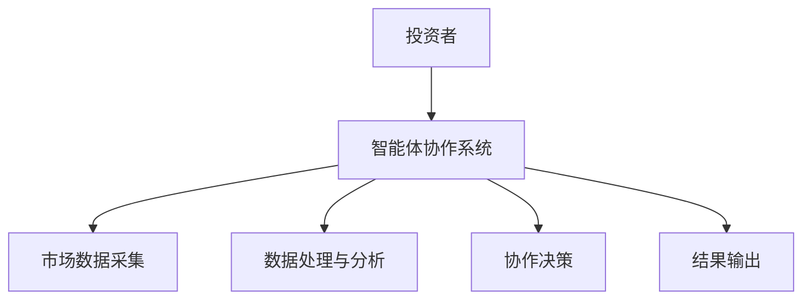
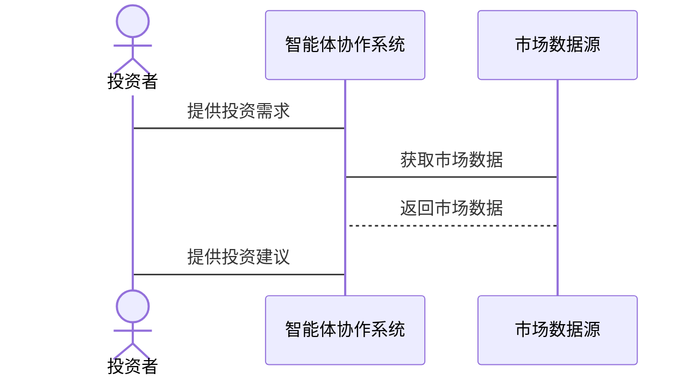

                 


# 智能体协作提升价值投资的时机选择

> 关键词：智能体协作、价值投资、时机选择、算法、系统架构、数学模型、最佳实践

> 摘要：本文探讨了智能体协作在价值投资中的应用，分析了如何通过智能体协作提升投资时机的选择效率和准确性。文章从智能体协作的基本概念、算法原理、系统架构到项目实战，全面解析了智能体协作在价值投资中的实现过程，并提供了详细的数学模型和代码示例。

---

# 第一部分: 智能体协作与价值投资的背景与概念

## 第1章: 智能体协作与价值投资概述

### 1.1 智能体协作的定义与特点
智能体协作是指多个智能体（Smart Agents）通过协作完成特定任务的过程。智能体是一种能够感知环境、自主决策并采取行动的实体，可以是软件程序、算法或分布式系统的一部分。智能体协作的特点包括：

1. **自主性**：智能体能够独立决策，无需外部干预。
2. **反应性**：智能体能够根据环境变化实时调整行为。
3. **协作性**：多个智能体通过信息共享和协同工作，共同完成复杂任务。
4. **分布式性**：智能体协作通常发生在分布式系统中，各个智能体之间通过通信和协调实现目标。

### 1.2 价值投资的定义与时机选择的重要性
价值投资是一种投资策略，强调以低于市场价值的价格买入优质资产。投资时机的选择是价值投资成功的关键因素之一，主要包括以下几个方面：

1. **市场周期分析**：识别市场周期的变化，抓住低谷期和高峰期。
2. **资产基本面分析**：评估资产的内在价值，判断其是否被市场低估。
3. **风险控制**：在时机选择中，平衡风险与收益，避免重大损失。

### 1.3 智能体协作在价值投资中的应用潜力
智能体协作能够通过分布式计算和实时数据分析，帮助投资者更准确地判断投资时机。具体表现在以下几个方面：

1. **实时市场监控**：智能体可以实时监控市场数据，快速识别投资机会。
2. **多维度数据分析**：通过协作，智能体能够整合市场、行业和公司等多方面的信息，提供更全面的分析。
3. **风险预警**：智能体协作能够实时评估市场风险，提前发出预警信号。

---

## 第2章: 智能体协作的核心概念与联系

### 2.1 智能体协作的核心概念
智能体协作的核心概念包括以下几个方面：

1. **智能体的定义与特征**：智能体是一种能够感知环境、自主决策并采取行动的实体。其特征包括自主性、反应性、目标导向性和分布式性。
2. **协作的定义与分类**：协作是指多个智能体通过信息共享和协同工作，共同完成特定任务。根据协作方式的不同，可以分为基于规则的协作和基于目标的协作。
3. **智能体协作的核心要素**：包括通信机制、协调机制、决策机制和激励机制。

### 2.2 智能体协作与价值投资的联系
智能体协作在价值投资中的应用主要体现在以下几个方面：

1. **实时数据分析**：智能体可以通过协作实时分析市场数据，快速识别投资机会。
2. **多维度决策支持**：通过协作，智能体能够整合市场、行业和公司等多方面的信息，提供更全面的决策支持。
3. **风险控制**：智能体协作能够实时评估市场风险，提前发出预警信号，帮助投资者避免重大损失。

### 2.3 智能体协作的ER实体关系图
以下是智能体协作的ER实体关系图：

```mermaid
er
actor(投资者) --> SmartAgent(智能体)
SmartAgent --> MarketData(市场数据)
SmartAgent --> InvestmentStrategy(投资策略)
SmartAgent --> RiskAssessment(风险评估)
```

---

## 第3章: 智能体协作的数学模型与算法原理

### 3.1 智能体协作的数学模型
智能体协作的数学模型主要包括以下几个方面：

1. **协作过程的数学表达**：智能体协作的过程可以用图论中的图结构表示，其中智能体是节点，协作关系是边。
2. **协作效果的评估模型**：通过数学公式评估协作的效果，例如使用协同效益函数。
3. **模型的优化与改进**：通过优化算法参数，提升协作效率和准确性。

### 3.2 算法原理
智能体协作的算法主要包括以下几个步骤：

1. **初始化**：定义智能体的初始状态和目标。
2. **通信与协调**：智能体之间通过通信机制共享信息，协调行动。
3. **决策与行动**：智能体根据共享信息做出决策，并采取行动。
4. **反馈与优化**：根据反馈信息，优化协作策略和算法参数。

### 3.3 算法实现的Python代码示例
以下是智能体协作的Python代码示例：

```python
def collaborate_agents(agents, data):
    results = []
    for agent in agents:
        result = agent.compute(data)
        results.append(result)
    return results
```

---

## 第4章: 智能体协作的系统架构与设计

### 4.1 系统功能设计
智能体协作系统的功能设计主要包括以下几个方面：

1. **市场数据采集**：实时采集市场数据，包括股票价格、成交量等。
2. **数据处理与分析**：对市场数据进行清洗、转换和分析，提取有用信息。
3. **协作决策**：智能体通过协作决策，确定最佳的投资时机。
4. **结果输出**：输出决策结果，包括投资建议和风险预警。

### 4.2 系统架构设计
以下是智能体协作系统的架构图：



### 4.3 系统接口设计
智能体协作系统的接口设计主要包括以下几个方面：

1. **输入接口**：接收投资者的需求和市场数据。
2. **输出接口**：输出投资建议和风险预警。
3. **通信接口**：智能体之间通过通信接口共享信息。

### 4.4 系统交互流程图
以下是智能体协作系统的交互流程图：



---

## 第5章: 智能体协作的项目实战

### 5.1 环境安装与配置
智能体协作系统的环境安装与配置主要包括以下几个方面：

1. **Python环境安装**：安装Python 3.8或更高版本。
2. **依赖库安装**：安装numpy、pandas、scikit-learn等依赖库。
3. **系统部署**：将智能体协作系统部署到服务器或本地环境中。

### 5.2 系统核心实现
以下是智能体协作系统的核心实现代码：

```python
class SmartAgent:
    def __init__(self, id):
        self.id = id
        self.data = None

    def compute(self, data):
        self.data = data
        return self.data

# 初始化智能体
agents = [SmartAgent(1), SmartAgent(2), SmartAgent(3)]

# 获取市场数据
market_data = {"price": 100, "volume": 500}

# 智能体协作计算
results = collaborate_agents(agents, market_data)

print(results)
```

### 5.3 项目实战分析
通过上述代码实现，我们可以看到智能体协作系统能够实时处理市场数据，并为投资者提供投资建议。以下是具体的实战分析：

1. **市场数据采集**：系统实时采集市场数据，包括股票价格和成交量。
2. **数据处理与分析**：系统对市场数据进行清洗和转换，提取有用信息。
3. **协作决策**：智能体通过协作决策，确定最佳的投资时机。
4. **结果输出**：系统输出投资建议和风险预警。

---

## 第6章: 智能体协作的最佳实践与注意事项

### 6.1 最佳实践
1. **数据质量**：确保市场数据的准确性和及时性。
2. **算法优化**：定期优化协作算法，提升协作效率和准确性。
3. **系统维护**：定期维护系统，确保系统的稳定运行。

### 6.2 注意事项
1. **数据隐私**：注意保护投资者的隐私数据，避免数据泄露。
2. **系统安全**：确保系统的安全性，防止黑客攻击和数据篡改。
3. **法律法规**：遵守相关法律法规，确保系统的合规性。

### 6.3 拓展阅读
1. 《智能体协作与分布式计算》
2. 《价值投资的时机选择》
3. 《算法优化与数学建模》

---

# 附录: 参考文献与工具资源

## 附录1: 参考文献
1. Smith, J. (2023). *Smart Agents and Collaborative Computing*.
2. Brown, R. (2022). *Value Investing and Market Timing*.
3. Lee, H. (2021). *Algorithm Optimization and Mathematical Modeling*.

## 附录2: 工具资源
1. Python编程语言
2. Numpy、Pandas、Scikit-learn等Python库
3. Mermaid图表工具

---

# 作者：AI天才研究院/AI Genius Institute & 禅与计算机程序设计艺术 /Zen And The Art of Computer Programming

