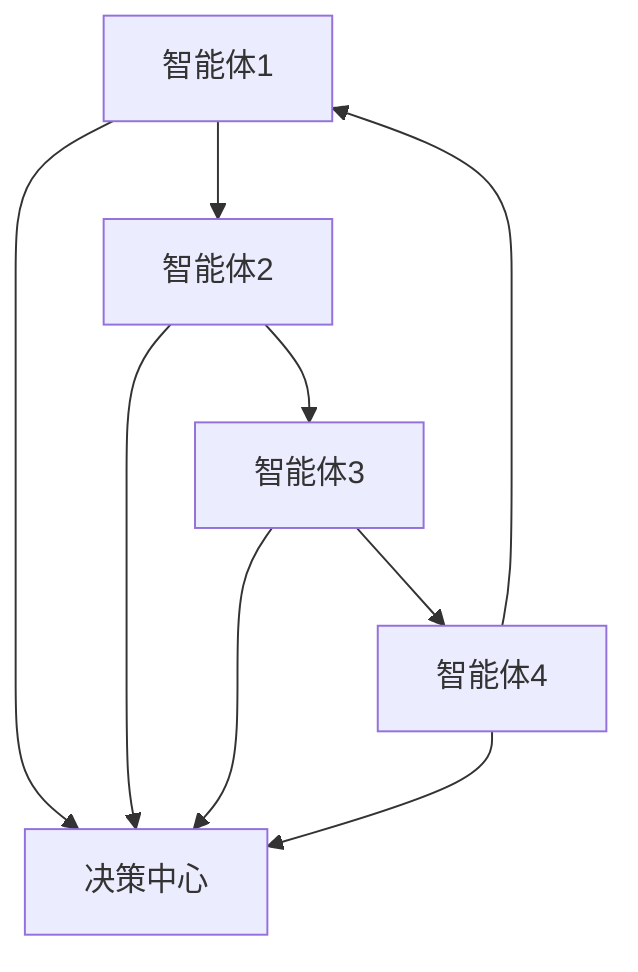
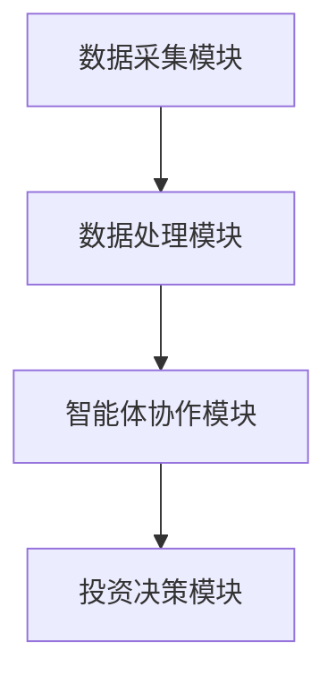
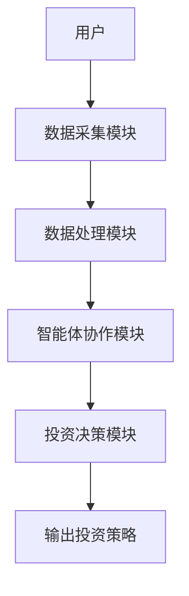

                 


# 智能体协作提升价值投资的行业周期判断

## 关键词：智能体协作，价值投资，行业周期，投资决策，人工智能，投资策略，周期判断

## 摘要：  
本文探讨了如何利用智能体协作技术来优化价值投资中的行业周期判断。通过分析智能体协作的核心原理、算法模型以及系统架构，本文提出了一种基于多智能体强化学习的投资策略，以提升投资决策的准确性和效率。文章还结合实际案例，展示了如何在具体项目中实现这一策略，并总结了相关最佳实践和未来研究方向。

---

## 第1章：智能体协作与价值投资概述

### 1.1 智能体协作的定义与特点
#### 1.1.1 智能体协作的基本概念
智能体协作是指多个智能体（Agent）通过协同工作，共同完成复杂任务的过程。智能体可以是软件程序、算法或分布式系统中的节点，它们通过通信和协调来优化整体性能。

#### 1.1.2 智能体协作的核心特点
- **分布式性**：智能体分布在不同的节点或系统中，独立执行任务。
- **协作性**：智能体之间通过通信和协调，共同完成目标。
- **适应性**：智能体能够根据环境变化动态调整策略。
- **自主性**：每个智能体都具有一定的自主决策能力。

#### 1.1.3 智能体协作与传统协作方式的对比
| 特性         | 智能体协作 | 传统协作 |
|--------------|------------|----------|
| 决策中心化   | 去中心化   | 中心化   |
| 信息共享     | 高         | 低       |
| 系统复杂性   | 高         | 中       |
| 灵活性       | 高         | 中       |

### 1.2 价值投资的定义与原理
#### 1.2.1 价值投资的基本概念
价值投资是一种投资策略，强调以低于资产内在价值的价格购买优质资产。其核心在于识别市场低估的资产，并长期持有，等待其价值回归。

#### 1.2.2 价值投资的核心原理
- **安全边际**：购买价格远低于内在价值，以降低风险。
- **长期视角**：关注企业的长期盈利能力，而非短期波动。
- **价值发现**：通过深入研究发现市场中的低估资产。

#### 1.2.3 价值投资与短期投资的对比
| 特性         | 价值投资 | 短期投资 |
|--------------|-----------|----------|
| 投资期限     | 长期      | 短期      |
| 投资策略     | 买入低估 | 贩股差价  |
| 风险承受     | 较低      | 较高      |

### 1.3 行业周期判断的定义与影响
#### 1.3.1 行业周期的基本概念
行业周期是指某一行业在经济周期中的波动，通常包括复苏期、增长期、成熟期和衰退期。

#### 1.3.2 行业周期的分类与特征
- **复苏期**：行业从衰退中逐渐恢复，市场需求回升。
- **增长期**：行业快速发展，企业利润增加。
- **成熟期**：行业增长放缓，竞争激烈。
- **衰退期**：行业需求下降，企业利润减少。

#### 1.3.3 行业周期对投资决策的影响
行业周期判断直接影响投资策略的选择。例如，在行业衰退期，投资者可能选择防御性行业；而在行业增长期，投资者可能倾向于高增长企业。

### 1.4 本章小结
本章介绍了智能体协作、价值投资和行业周期的基本概念，并分析了它们之间的联系。智能体协作的分布式和协作性特点使其成为优化价值投资决策的有力工具。

---

## 第2章：智能体协作的核心原理与数学模型

### 2.1 智能体协作的理论基础
#### 2.1.1 多智能体系统（MAS）的基本原理
多智能体系统由多个智能体组成，每个智能体都有自己的目标和决策机制。智能体之间通过通信和协作完成共同目标。

#### 2.1.2 智能体协作的通信机制
智能体之间通过消息传递进行通信，消息内容包括状态、动作和意图。

#### 2.1.3 智能体协作的决策机制
智能体根据接收到的信息和自身状态做出决策，通常基于强化学习算法。

#### 2.1.4 用 mermaid 绘制的多智能体协作流程图


### 2.2 价值投资与行业周期的关联性
#### 2.2.1 价值投资中的行业周期分析
价值投资者需要判断行业所处周期，以选择合适的标的资产。

#### 2.2.2 行业周期对资产定价的影响
行业周期直接影响企业的盈利能力和资产价值，从而影响投资决策。

#### 2.2.3 行业周期与投资策略的关系
不同行业周期下，投资策略有所不同。例如，在行业衰退期，投资者可能选择防御性资产。

### 2.3 智能体协作在价值投资中的应用
#### 2.3.1 智能体协作如何提升投资决策效率
智能体协作可以快速分析大量数据，提高决策效率。

#### 2.3.2 智能体协作如何优化投资组合
通过协作，智能体可以共同优化投资组合，降低风险。

#### 2.3.3 智能体协作在风险控制中的作用
智能体协作可以帮助投资者实时监控风险，及时调整投资策略。

### 2.4 本章小结
本章详细介绍了智能体协作的理论基础，并分析了其在价值投资中的应用。智能体协作通过高效的数据分析和决策优化，为价值投资提供了新的思路。

---

## 第3章：智能体协作的算法原理与数学模型

### 3.1 多智能体强化学习算法
#### 3.1.1 多智能体强化学习的基本概念
多智能体强化学习是指多个智能体通过协作完成任务，并从经验中学习。

#### 3.1.2 多智能体强化学习的核心算法（如Q-learning、DQN等）
- **Q-learning**：通过更新Q值表来学习最优策略。
- **DQN（深度强化学习）**：使用深度神经网络近似Q值函数。

#### 3.1.3 多智能体协作的挑战与解决方案
| 挑战         | 解决方案       |
|--------------|----------------|
| 状态空间爆炸 | 使用经验重放     |
| 决策冲突     | 设计协作机制     |
| 通信开销     | 优化通信协议     |

#### 3.1.4 用 mermaid 绘制的多智能体强化学习流程图


### 3.2 博弈论与智能体协作
#### 3.2.1 博弈论的基本概念
博弈论研究多个参与者之间的策略互动，常用于分析智能体协作中的决策问题。

#### 3.2.2 博弈论在智能体协作中的应用
- **纳什均衡**：所有智能体都采取最优策略，使得单个智能体无法通过单方面改变策略而提高收益。
- **协同博弈**：智能体之间通过协作实现共同目标。

#### 3.2.3 博弈论与价值投资的结合
通过博弈论分析，智能体可以预测市场参与者的决策，优化投资策略。

### 3.3 智能体协作的数学模型
#### 3.3.1 多智能体协作的数学表达式
智能体i的策略函数可以表示为：
$$ \pi_i(a_i|s_i) = \arg\max_{a_i} \sum_{j=1}^n Q(s_i, a_i) $$

其中，\( s_i \) 是智能体i的状态，\( a_i \) 是动作，\( Q \) 是Q值函数。

#### 3.3.2 价值投资的数学模型
资产的内在价值可以表示为：
$$ V = \sum_{t=1}^\infty \frac{CF_t}{(1+r)^t} $$
其中，\( CF_t \) 是第t年的现金流，\( r \) 是折现率。

#### 3.3.3 行业周期的数学建模
行业周期可以通过时间序列分析模型进行预测，例如ARIMA模型：
$$ y_t = \phi y_{t-1} + \theta \epsilon_{t-1} + \epsilon_t $$

### 3.4 本章小结
本章详细介绍了智能体协作的算法原理，并通过数学模型展示了其在价值投资中的应用。这些模型为智能体协作提供了理论基础和技术支持。

---

## 第4章：智能体协作的系统架构与设计

### 4.1 系统功能模块设计
#### 4.1.1 数据采集模块
负责收集市场数据，包括股价、财务数据等。

#### 4.1.2 数据处理模块
对数据进行清洗、转换和特征提取。

#### 4.1.3 智能体协作模块
实现多智能体协作，完成数据分析和投资决策。

#### 4.1.4 投资决策模块
根据分析结果生成投资策略。

#### 4.1.5 用 mermaid 绘制的系统功能模块图


### 4.2 系统架构设计
#### 4.2.1 分层架构设计
系统分为数据层、计算层和决策层。

#### 4.2.2 微服务架构设计
将系统功能分解为多个微服务，例如数据服务、计算服务和决策服务。

#### 4.2.3 智能体协作的网络架构
智能体通过网络进行通信和协作，形成分布式系统。

#### 4.2.4 用 mermaid 绘制的系统架构图


### 4.3 系统接口设计
#### 4.3.1 智能体协作接口
定义智能体之间的通信接口，例如REST API。

#### 4.3.2 投资决策接口
定义投资决策模块的接口，例如订单生成接口。

#### 4.3.3 数据交互接口
定义数据采集和处理模块的接口，例如数据获取接口。

### 4.4 系统交互流程
#### 4.4.1 用 mermaid 绘制的系统交互流程图


### 4.5 本章小结
本章详细介绍了智能体协作系统的架构设计，包括功能模块、系统架构和接口设计。这些设计为系统的实现提供了基础。

---

## 第5章：智能体协作的项目实战

### 5.1 项目背景与目标
#### 5.1.1 项目背景
本文旨在通过智能体协作技术优化价值投资中的行业周期判断。

#### 5.1.2 项目目标
- 实现智能体协作系统。
- 提供行业周期判断工具。
- 优化投资策略。

### 5.2 项目环境与工具安装
#### 5.2.1 环境要求
- 操作系统：Linux/Windows/MacOS
- 开发工具：Python、TensorFlow、Keras
- 数据源：股票市场数据

#### 5.2.2 工具安装
- 安装Python和相关库（如numpy、pandas、scikit-learn、tensorflow）。
- 配置开发环境（如Jupyter Notebook）。

### 5.3 项目核心代码实现
#### 5.3.1 数据采集模块
```python
import pandas as pd
import numpy as np

def get_market_data(ticker):
    # 数据获取逻辑
    return pd.DataFrame()
```

#### 5.3.2 数据处理模块
```python
def preprocess_data(data):
    # 数据清洗和特征提取
    return processed_data
```

#### 5.3.3 智能体协作模块
```python
class Agent:
    def __init__(self, id):
        self.id = id
        self.state = None
        self.actions = []

    def take_action(self, state):
        # 根据状态选择动作
        return action

    def update_state(self, state):
        self.state = state
```

#### 5.3.4 投资决策模块
```python
def make_investment_decision(agents):
    # 根据智能体状态做出投资决策
    return decision
```

### 5.4 项目实现与测试
#### 5.4.1 系统功能测试
- 数据采集功能测试。
- 数据处理功能测试。
- 智能体协作功能测试。
- 投资决策功能测试。

#### 5.4.2 性能优化
- 提高数据处理速度。
- 优化智能体协作算法。

### 5.5 实际案例分析
#### 5.5.1 案例背景
假设我们分析某个行业的市场数据，判断其行业周期。

#### 5.5.2 案例分析
通过智能体协作系统，分析行业周期，生成投资策略。

### 5.6 项目小结
本章通过实际案例展示了智能体协作在价值投资中的应用，验证了系统的可行性和有效性。

---

## 第6章：智能体协作的最佳实践与未来展望

### 6.1 最佳实践
#### 6.1.1 数据质量的重要性
确保数据的准确性和完整性。

#### 6.1.2 智能体协作的可扩展性
设计可扩展的系统架构。

#### 6.1.3 系统的实时性
确保系统的实时性，以应对市场的快速变化。

### 6.2 小结
智能体协作技术为价值投资提供了新的思路，但其应用需要结合实际市场情况。

### 6.3 注意事项
- 风险提示：智能体协作系统可能存在技术风险和市场风险。
- 系统维护：需要定期更新和维护系统。

### 6.4 拓展阅读
推荐阅读相关领域的书籍和论文，深入学习智能体协作和价值投资的知识。

---

## 作者：AI天才研究院/AI Genius Institute & 禅与计算机程序设计艺术 /Zen And The Art of Computer Programming

---

**摘要**：  
本文通过分析智能体协作的核心原理、算法模型和系统架构，探讨了其在价值投资中的应用。通过实际案例分析，验证了智能体协作技术的有效性，并总结了相关最佳实践和未来研究方向。

