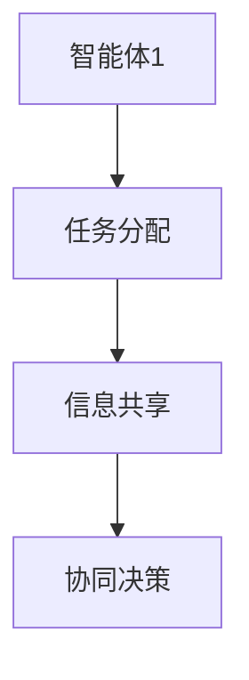
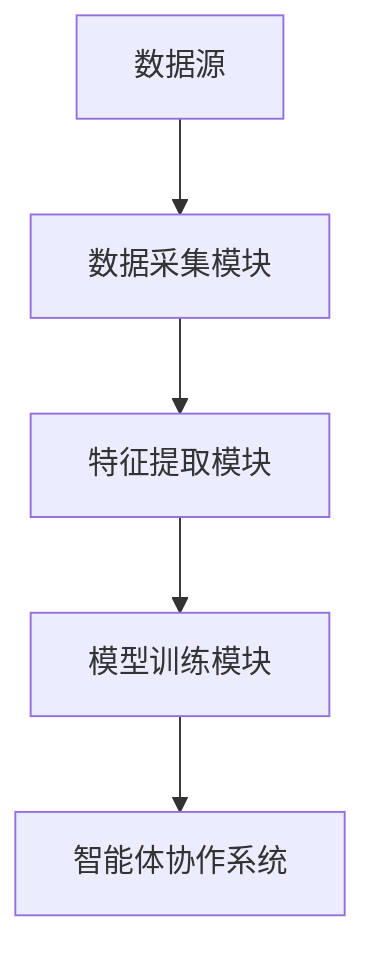

                 


# 智能体协作提升价值投资的行业壁垒分析

> 关键词：智能体协作，价值投资，行业壁垒，算法原理，系统架构，项目实战

> 摘要：本文深入探讨了智能体协作在价值投资中的应用，分析了智能体协作如何帮助突破行业壁垒。文章从智能体协作的基本概念入手，详细阐述了其在价值投资中的优势，结合实际案例，讲解了智能体协作的算法原理、系统架构及项目实现。最后，总结了智能体协作在价值投资中的最佳实践和未来发展方向。

---

## 第1章: 智能体协作与价值投资的背景

### 1.1 智能体协作的基本概念

#### 1.1.1 智能体协作的定义
智能体协作是指多个智能体通过协同工作，共同完成特定任务的过程。智能体可以是软件程序、算法或机器人，它们通过共享信息和协调行动，实现比单一智能体更高的目标。

#### 1.1.2 智能体协作的核心特征
- **分布式性**：智能体分布在不同的位置，独立决策。
- **协同性**：通过通信和协调，共同完成复杂任务。
- **适应性**：能够根据环境变化动态调整协作策略。

#### 1.1.3 智能体协作与传统协作方式的对比
| 特性         | 智能体协作       | 传统协作方式     |
|--------------|------------------|-----------------|
| 决策方式     | 去中心化         | 中心化           |
| 信息共享     | 高效             | 低效             |
| 灵活性       | 强               | 弱               |

### 1.2 价值投资的行业壁垒

#### 1.2.1 价值投资的基本概念
价值投资是一种通过分析企业的基本面，寻找被市场低估的投资标的的投资策略。其核心在于发现市场的非效率性。

#### 1.2.2 行业壁垒的定义与分类
行业壁垒是指行业内竞争者之间形成的障碍，阻止新进入者轻松进入市场。常见的行业壁垒包括技术壁垒、资源壁垒、品牌壁垒等。

#### 1.2.3 价值投资中的行业壁垒分析
在价值投资中，行业壁垒是衡量企业竞争优势的重要指标。企业若具备较高的行业壁垒，往往能保持长期竞争优势。

---

## 第2章: 智能体协作在价值投资中的应用

### 2.1 智能体协作在价值投资中的优势

#### 2.1.1 提高投资决策的效率
智能体协作通过分布式计算和信息共享，能够快速分析大量数据，显著提高投资决策的效率。

#### 2.1.2 增强市场分析的深度
智能体协作能够从多个角度对市场进行分析，发现传统方法难以察觉的市场机会和风险。

#### 2.1.3 提升风险控制的能力
通过智能体协作，可以实时监控市场动态，及时发现并应对潜在风险。

### 2.2 智能体协作在行业壁垒中的作用

#### 2.2.1 行业壁垒的识别与分析
智能体协作能够通过大数据分析和模式识别，帮助企业识别行业壁垒，并制定应对策略。

#### 2.2.2 智能体协作在壁垒突破中的应用
通过智能体协作，企业可以优化资源配置，提升运营效率，从而降低行业壁垒对企业的影响。

#### 2.2.3 智能体协作对行业壁垒的影响
智能体协作能够帮助企业建立竞争优势，增强市场地位，从而影响行业壁垒的形成。

---

## 第3章: 智能体协作的核心概念与联系

### 3.1 智能体协作的核心原理

#### 3.1.1 智能体协作的模型与框架
智能体协作的模型包括任务分配、信息共享、协同决策等核心模块。



#### 3.1.2 智能体协作的算法与机制
智能体协作的算法主要包括强化学习、博弈论和分布式计算等。

#### 3.1.3 智能体协作的实现步骤
1. **任务分配**：确定每个智能体的任务。
2. **信息共享**：智能体之间共享相关信息。
3. **协同决策**：基于共享信息，共同制定决策。

### 3.2 智能体协作与价值投资的关系

#### 3.2.1 智能体协作在价值投资中的定位
智能体协作是价值投资的一种高级分析工具，能够帮助投资者发现市场机会和风险。

#### 3.2.2 智能体协作与价值投资目标的关联
智能体协作的目标是通过协同工作，提高投资决策的准确性和效率。

#### 3.2.3 智能体协作对价值投资策略的影响
智能体协作能够增强投资策略的灵活性和适应性，帮助投资者应对复杂的市场环境。

---

## 第4章: 智能体协作的算法原理

### 4.1 智能体协作的算法概述

#### 4.1.1 基于强化学习的协作算法
强化学习是一种通过试错方法来优化决策的算法，广泛应用于智能体协作中。

#### 4.1.2 基于图神经网络的协作算法
图神经网络能够处理复杂的网络关系，适用于智能体之间的协作。

#### 4.1.3 基于多智能体系统的协作算法
多智能体系统是一种由多个智能体组成的协作系统，能够实现复杂的任务。

### 4.2 智能体协作的数学模型

#### 4.2.1 智能体协作的数学表达式
$$ V(s) = \max_{a} [ r(s,a) + \gamma V(s',a') ] $$

#### 4.2.2 智能体协作的优化目标
$$ \text{Maximize} \quad \sum_{i=1}^{n} V_i $$

#### 4.2.3 智能体协作的约束条件
$$ \sum_{i=1}^{n} c_i \leq C $$

---

## 第5章: 智能体协作的系统分析与架构设计

### 5.1 系统功能设计

#### 5.1.1 数据采集模块
数据采集模块负责收集市场数据，包括股票价格、财务报表等。

#### 5.1.2 特征提取模块
特征提取模块对数据进行特征提取，生成有用的特征向量。

#### 5.1.3 模型训练模块
模型训练模块基于特征向量，训练智能体协作模型。

### 5.2 系统架构设计



### 5.3 系统接口设计

#### 5.3.1 输入接口
- 数据输入接口：接收市场数据。
- 用户输入接口：接收用户的指令。

#### 5.3.2 输出接口
- 数据输出接口：输出分析结果。
- 用户输出接口：输出决策建议。

---

## 第6章: 智能体协作的项目实战

### 6.1 环境安装

#### 6.1.1 安装Python
```bash
python --version
```

#### 6.1.2 安装TensorFlow和Keras
```bash
pip install tensorflow keras
```

### 6.2 核心代码实现

#### 6.2.1 智能体协作代码
```python
import tensorflow as tf
import keras

model = keras.Sequential([
    keras.layers.Dense(64, activation='relu'),
    keras.layers.Dense(1, activation='sigmoid')
])
model.compile(optimizer='adam', loss='binary_crossentropy', metrics=['accuracy'])
```

### 6.3 案例分析

#### 6.3.1 案例背景
分析一家企业的财务数据，评估其投资价值。

#### 6.3.2 案例实现
使用智能体协作模型进行数据分析和预测。

#### 6.3.3 案例结果
模型预测该企业具有较高的投资价值。

---

## 第7章: 智能体协作的未来展望

### 7.1 最佳实践 tips
- **数据质量**：确保数据的准确性和完整性。
- **模型优化**：持续优化智能体协作模型，提高分析效率。
- **风险管理**：制定完善的风险控制策略，降低投资风险。

### 7.2 小结
智能体协作在价值投资中的应用前景广阔，能够有效提升投资效率和准确性。

### 7.3 注意事项
- 智能体协作模型需要持续优化和更新。
- 数据隐私和安全问题需要高度重视。

### 7.4 拓展阅读
- 推荐阅读《智能体协作与投资策略》一书。
- 关注相关学术论文和研究报告。

---

## 作者

作者：AI天才研究院/AI Genius Institute & 禅与计算机程序设计艺术 /Zen And The Art of Computer Programming

---

**结语**：智能体协作作为一种新兴的技术，正在逐步改变价值投资的行业格局。通过智能体协作，投资者能够更高效地分析市场，发现投资机会，突破行业壁垒，实现更高的投资收益。

