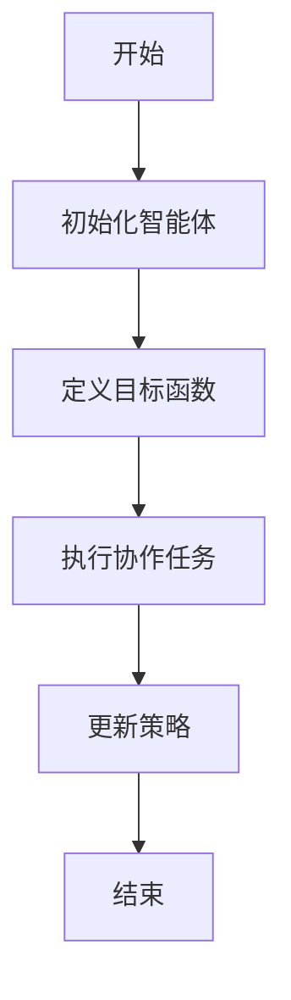
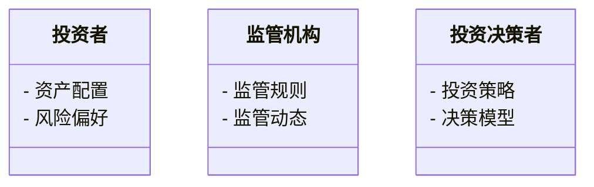
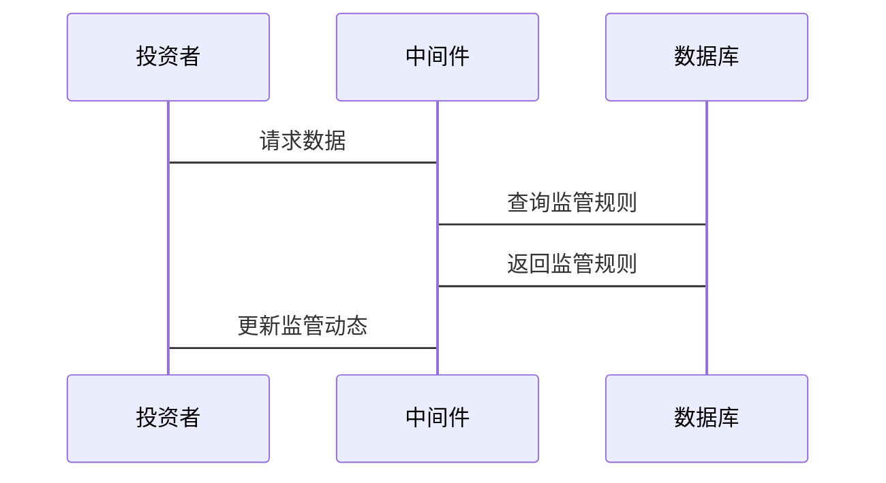

                 


# 智能体协作提升价值投资的跨境监管风险分析

> 关键词：智能体协作、价值投资、跨境监管、风险分析、多智能体系统

> 摘要：智能体协作在价值投资中的应用越来越广泛，尤其是在跨境监管风险分析方面。本文通过详细分析智能体协作的基本原理、算法实现、系统架构设计以及实际案例，探讨如何利用智能体协作技术提升跨境监管风险分析的效率和准确性。文章还结合实际案例，提出了智能体协作在价值投资中的最佳实践和未来研究方向。

---

## 第一部分：智能体协作与价值投资概述

### 第1章：智能体协作与价值投资的背景介绍

#### 1.1 智能体协作的定义与核心概念

##### 1.1.1 智能体协作的基本概念
智能体协作是指多个智能体（Agent）通过协同工作，共同完成一个复杂任务的过程。智能体可以是软件程序、算法或人工代理，它们通过信息共享、任务分配和协作决策来实现目标。

##### 1.1.2 价值投资的核心理念
价值投资是一种投资策略，强调以低于市场价买入具有内在价值的资产。其核心在于识别被市场低估的投资标的，并通过长期持有实现收益。

##### 1.1.3 跨境监管风险的定义与特征
跨境监管风险是指在跨国投资活动中，由于不同国家的法律法规、监管政策和市场环境差异，可能导致的投资风险。其特征包括复杂性、多样性和不确定性。

#### 1.2 智能体协作在价值投资中的作用

##### 1.2.1 智能体协作的优势与应用场景
智能体协作通过分布式计算和多智能体协同，能够高效处理海量数据，发现潜在投资机会，并优化投资组合。

##### 1.2.2 价值投资中的智能体协作模式
智能体协作可以应用于市场数据采集、风险评估、投资决策优化等多个环节，通过多智能体协同提高投资决策的准确性和效率。

##### 1.2.3 跨境监管风险分析的智能体协作框架
构建智能体协作框架，用于跨国投资中的监管风险识别、评估和应对，帮助投资者规避法律风险，确保合规性。

#### 1.3 智能体协作与价值投资的关系

##### 1.3.1 智能体协作在价值投资中的地位
智能体协作是价值投资的重要技术手段，通过智能算法和数据挖掘，帮助投资者发现潜在价值。

##### 1.3.2 智能体协作对跨境监管的影响
智能体协作能够实时监控跨国投资中的监管动态，帮助投资者快速响应政策变化，降低合规风险。

##### 1.3.3 智能体协作与传统投资方式的对比
相比传统投资方式，智能体协作具有高效性、精准性和智能化的特点，能够显著提升投资效率和风险控制能力。

---

## 第二部分：智能体协作的核心概念与联系

### 第2章：智能体协作的核心概念与联系

#### 2.1 智能体协作的原理与机制

##### 2.1.1 智能体协作的基本原理
智能体协作基于多智能体系统（MAS）理论，通过智能体之间的通信与协作，实现复杂任务的分布式计算。

##### 2.1.2 智能体协作的通信机制
智能体之间通过消息传递、状态共享等方式进行通信，确保信息同步和任务协调。

##### 2.1.3 智能体协作的决策机制
智能体根据共享信息和自身策略，做出协作决策，优化整体目标的实现。

#### 2.2 智能体协作与价值投资的联系

##### 2.2.1 价值投资中的智能体协作模型
构建多智能体协作模型，用于模拟投资行为、市场趋势和风险因素，帮助投资者制定科学决策。

##### 2.2.2 智能体协作在风险评估中的应用
通过智能体协作，实时监控市场波动和监管动态，评估投资风险，制定风险规避策略。

##### 2.2.3 智能体协作与监管合规的关系
智能体协作能够帮助投资者快速适应监管政策变化，确保投资行为的合规性，降低法律风险。

#### 2.3 智能体协作的ER实体关系图

```mermaid
er
actor(投资者) -->
role(投资决策者) -->
entity(投资标的)
actor(监管机构) -->
role(监管执行者) -->
entity(监管规则)
```

---

## 第三部分：智能体协作算法原理

### 第3章：智能体协作算法原理

#### 3.1 智能体协作算法概述

##### 3.1.1 多智能体协作的基本算法
多智能体协作算法包括分布式计算、强化学习和博弈论等方法，通过智能体之间的协作实现目标。

##### 3.1.2 基于强化学习的智能体协作
通过强化学习算法，智能体通过试错和奖励机制，优化协作策略，提高任务完成效率。

##### 3.1.3 基于分布式计算的智能体协作
利用分布式计算技术，智能体之间共享资源和信息，实现任务的并行处理和协作优化。

#### 3.2 智能体协作算法的数学模型

##### 3.2.1 多智能体协作的数学表达式
$$ Q(s, a) = r + \gamma \max_{a'} Q(s', a') $$

##### 3.2.2 基于强化学习的智能体协作模型
$$ V(s) = \max_a \min_{a'} Q(s, a, a') $$

#### 3.3 智能体协作算法的实现

##### 3.3.1 算法流程图



##### 3.3.2 Python实现示例

```python
def multi_agent_collaboration():
    agents = [Agent(i) for i in range(n)]
    while True:
        state = get_state()
        actions = [agent.act(state) for agent in agents]
        rewards = calculate_reward(actions)
        update_agents(rewards, actions)
```

---

## 第四部分：系统分析与架构设计

### 第4章：系统分析与架构设计

#### 4.1 问题场景与需求分析

##### 4.1.1 问题场景介绍
跨国投资中，投资者需要应对不同国家的监管政策和市场环境，智能体协作可以帮助投资者实时监控和分析监管动态，降低风险。

##### 4.1.2 系统需求分析
系统需要具备数据采集、风险评估、决策优化和实时监控等功能，满足投资者的跨境投资需求。

#### 4.2 系统架构设计

##### 4.2.1 领域模型类图



##### 4.2.2 系统架构图


##### 4.2.3 接口与交互设计



---

## 第五部分：项目实战

### 第5章：项目实战

#### 5.1 环境搭建与工具选择

##### 5.1.1 环境安装
安装Python、TensorFlow、NumPy等工具，搭建智能体协作开发环境。

##### 5.1.2 工具选择
选择适合的开发工具，如PyCharm、VS Code等，配置开发环境。

#### 5.2 核心代码实现

##### 5.2.1 智能体协作核心代码

```python
class Agent:
    def __init__(self, id):
        self.id = id
        self.strategy = 'collaborative'
    
    def act(self, state):
        if self.strategy == 'collaborative':
            return self collaboratively Decide(state)
        else:
            return self individually Decide(state)
```

##### 5.2.2 算法实现与优化
通过参数调整和算法优化，提高智能体协作的效率和准确性。

#### 5.3 案例分析与结果解读

##### 5.3.1 实际案例分析
通过具体案例，展示智能体协作在跨境监管风险分析中的应用效果。

##### 5.3.2 案例结果分析
分析案例结果，验证智能体协作的有效性，并提出改进建议。

---

## 第六部分：案例分析与风险应对策略

### 第6章：案例分析与风险应对策略

#### 6.1 案例分析

##### 6.1.1 案例背景
描述一个跨国投资案例，分析智能体协作在其中的应用。

##### 6.1.2 案例分析过程
详细分析智能体协作在案例中的具体实施步骤和效果。

#### 6.2 风险应对策略

##### 6.2.1 风险应对策略
提出应对跨境监管风险的具体策略和建议。

##### 6.2.2 最佳实践 tips
总结智能体协作在跨境监管风险分析中的最佳实践，供投资者参考。

---

## 第七部分：结论与展望

### 第7章：结论与展望

#### 7.1 研究总结
总结本文的主要研究成果，强调智能体协作在跨境监管风险分析中的重要性。

#### 7.2 未来研究方向
提出未来在智能体协作和监管风险分析领域的研究方向，如更复杂的协作算法和更广泛的应用场景。

---

## 作者

作者：AI天才研究院/AI Genius Institute & 禅与计算机程序设计艺术 /Zen And The Art of Computer Programming

---

**注：以上目录大纲为完整文章的结构，实际写作时需根据每章内容逐步展开，确保每章内容详细且逻辑清晰。**

