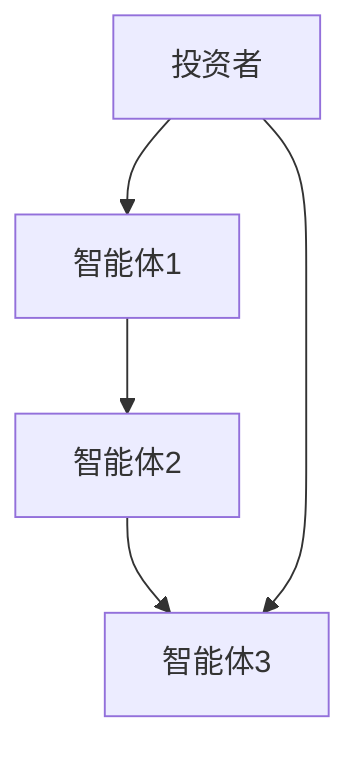
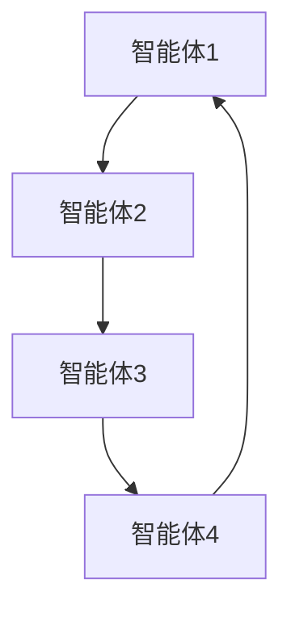
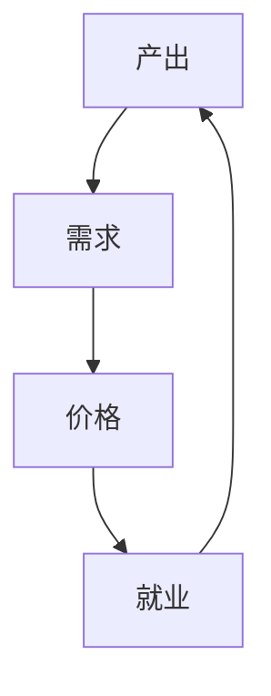
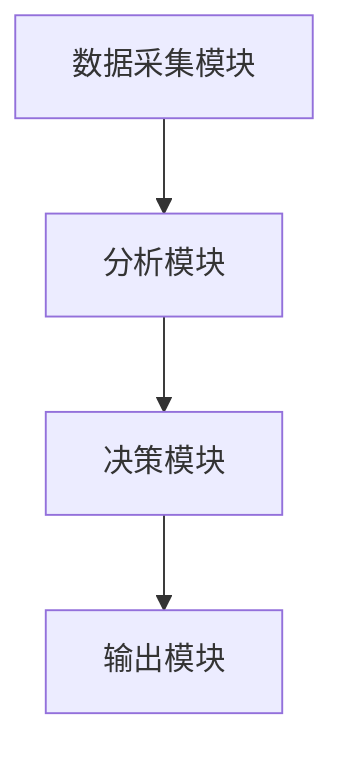

                 


# 智能体协作提高价值投资的全球宏观经济周期分析

## 关键词
智能体协作，价值投资，宏观经济周期，投资策略，系统架构

## 摘要
本文探讨了智能体协作在价值投资中的应用，特别是在分析和预测全球宏观经济周期方面。通过智能体协作机制，投资者能够更好地捕捉市场机会，优化资产配置，并提高投资决策的准确性。文章详细介绍了智能体协作的核心机制、宏观经济周期的分析框架、价值投资策略的设计以及系统的架构实现，最后通过实际案例展示了如何将这些理论应用于实践。

---

# 第一部分: 智能体协作与全球宏观经济周期分析

## 第1章: 背景介绍与核心概念

### 1.1 智能体协作的背景与意义
#### 1.1.1 智能体协作的定义与特点
智能体协作是指多个智能体（Agent）通过协作完成特定任务的过程。智能体可以是软件程序、算法或其他能够感知环境并采取行动的实体。智能体协作的特点包括：
- **自主性**：智能体能够独立决策。
- **协作性**：多个智能体通过通信和协作完成共同目标。
- **适应性**：智能体能够根据环境变化调整行为。

#### 1.1.2 全球宏观经济周期的基本概念
全球宏观经济周期是指经济从扩张到收缩再到扩张的周期性波动。典型的经济周期包括以下几个阶段：
1. **复苏阶段**：经济开始复苏，企业利润增长。
2. **繁荣阶段**：经济快速增长，市场活跃。
3. **衰退阶段**：经济活动放缓，企业利润下降。
4. **萧条阶段**：经济低迷，失业率上升。

#### 1.1.3 智能体协作在价值投资中的应用背景
传统价值投资依赖于人工分析和经验判断，难以应对复杂多变的全球经济环境。智能体协作通过分布式计算和数据挖掘，能够快速分析海量数据，发现潜在的投资机会。

### 1.2 问题背景与目标
#### 1.2.1 传统价值投资的局限性
传统价值投资依赖于分析师的主观判断，存在以下问题：
- 数据处理能力有限。
- 无法实时跟踪全球宏观经济指标。
- 难以捕捉复杂市场环境中的机会。

#### 1.2.2 宏观经济周期对投资决策的影响
宏观经济周期直接影响企业的盈利能力和资产价值。例如，在经济繁荣阶段，股票价格通常会上涨；在经济衰退阶段，债券等固定收益资产可能更受青睐。

#### 1.2.3 智能体协作的目标与边界
智能体协作的目标是通过分布式计算和数据挖掘，帮助投资者更好地理解宏观经济周期，并制定相应的投资策略。其边界包括：
- 不涉及具体的交易操作。
- 不直接管理投资组合，而是提供决策支持。

---

## 第2章: 智能体协作的核心机制

### 2.1 智能体协作模型
#### 2.1.1 协作模型的定义与分类
协作模型是智能体协作的基础，常见的协作模型包括：
- **分布式协作模型**：智能体之间通过分布式网络进行通信和协作。
- **集中式协作模型**：所有智能体通过中央节点进行协作。

#### 2.1.2 协作模型的实体关系图（Mermaid）


### 2.2 智能体协作的通信机制
#### 2.2.1 通信协议与数据交换
智能体之间的通信需要遵循特定的协议，例如：
- **HTTP协议**：用于Web服务之间的通信。
- **WebSocket协议**：用于实时通信。

#### 2.2.2 信息共享机制
信息共享是智能体协作的重要环节。常见的信息共享机制包括：
- **数据共享**：智能体之间共享实时数据。
- **知识共享**：智能体之间共享分析结果和经验。

### 2.3 协作决策算法
#### 2.3.1 基于多智能体的共识算法
共识算法是智能体协作的核心，常见的共识算法包括：
- **投票算法**：通过投票机制达成共识。
- **拜占庭算法**：用于分布式系统中的共识达成。

#### 2.3.2 协作决策的数学模型与公式
协作决策的数学模型可以通过以下公式表示：
$$ P(i) = \sum_{j=1}^{n} w_{ij} \cdot x_j $$
其中，\( P(i) \) 表示第 \( i \) 个智能体的决策概率，\( w_{ij} \) 表示第 \( i \) 个智能体对第 \( j \) 个智能体的权重，\( x_j \) 表示第 \( j \) 个智能体的决策变量。

#### 2.3.3 算法流程图（Mermaid）


---

## 第3章: 全球宏观经济周期分析

### 3.1 宏观经济周期的定义与特征
#### 3.1.1 宏观经济周期的指标体系
宏观经济周期的分析需要依赖多个指标，包括：
- **GDP增长率**：衡量经济的整体表现。
- **失业率**：衡量劳动力市场的状况。
- **通货膨胀率**：衡量物价水平的变化。

#### 3.1.2 经济周期的波动特征
经济周期的波动特征可以通过以下公式表示：
$$ \text{波动幅度} = \frac{\text{最高值} - \text{最低值}}{\text{平均值}} $$

### 3.2 宏观经济周期的预测模型
#### 3.2.1 基于时间序列的预测方法
时间序列预测方法是常用的宏观经济周期预测方法，包括：
- **ARIMA模型**：自回归积分滑动平均模型。
- **GARCH模型**：广义自回归条件异方差模型。

#### 3.2.2 系统动力学模型（Mermaid）


### 3.3 宏观经济周期的阶段划分
#### 3.3.1 经济周期的四个阶段
经济周期通常分为四个阶段：
1. **复苏阶段**：经济开始复苏。
2. **繁荣阶段**：经济快速增长。
3. **衰退阶段**：经济活动放缓。
4. **萧条阶段**：经济低迷。

#### 3.3.2 阶段划分的数学模型
阶段划分可以通过以下公式表示：
$$ S(t) = \begin{cases} 
1 & \text{复苏阶段} \\
2 & \text{繁荣阶段} \\
3 & \text{衰退阶段} \\
4 & \text{萧条阶段}
\end{cases} $$

---

## 第4章: 价值投资策略与智能体协作

### 4.1 价值投资的基本原理
#### 4.1.1 价值投资的核心理念
价值投资的核心理念是寻找被市场低估的资产，并在长期持有中获得收益。

#### 4.1.2 价值投资的量化模型
价值投资的量化模型可以通过以下公式表示：
$$ \text{内在价值} = \sum_{t=1}^{n} \frac{CF_t}{(1 + r)^t} $$
其中，\( CF_t \) 表示第 \( t \) 年的现金流，\( r \) 表示贴现率。

### 4.2 智能体协作在价值投资中的应用
#### 4.2.1 智能体协作的资产配置策略
智能体协作可以通过以下步骤实现资产配置：
1. **数据收集**：智能体从多个数据源收集宏观经济指标。
2. **分析与预测**：智能体通过协作分析宏观经济周期，并预测资产价格。
3. **决策制定**：智能体根据分析结果制定资产配置策略。

#### 4.2.2 投资组合优化的数学模型
投资组合优化的数学模型可以通过以下公式表示：
$$ max \mu(w) = w^T \mu $$
$$ s.t. \lambda(w^T \Sigma w) = \text{风险约束} $$

---

## 第5章: 系统架构与实现

### 5.1 系统架构设计
#### 5.1.1 系统功能设计
系统功能设计包括：
- **数据采集模块**：从多个数据源采集宏观经济指标。
- **分析模块**：通过智能体协作分析宏观经济周期。
- **决策模块**：根据分析结果制定投资策略。

#### 5.1.2 系统架构图（Mermaid）


### 5.2 系统接口设计
系统接口设计包括：
- **API接口**：用于数据采集模块与其他模块之间的通信。
- **用户接口**：用于用户查看分析结果和制定投资策略。

---

## 第6章: 项目实战与优化

### 6.1 项目实战
#### 6.1.1 环境搭建
项目实战需要以下环境：
- **编程语言**：Python
- **库**：Pandas、NumPy、Matplotlib

#### 6.1.2 数据收集与处理
数据收集与处理可以通过以下代码实现：
```python
import pandas as pd
import numpy as np

data = pd.read_csv('economic_data.csv')
data.head()
```

#### 6.1.3 模型实现与优化
模型实现与优化可以通过以下代码实现：
```python
from sklearn.linear_model import LinearRegression
model = LinearRegression()
model.fit(X, y)
```

### 6.2 优化与分析
#### 6.2.1 模型优化
模型优化可以通过调整参数和优化算法实现：
$$ \text{优化目标} = \sum_{i=1}^{n} (y_i - \hat{y}_i)^2 $$
其中，\( y_i \) 表示实际值，\( \hat{y}_i \) 表示预测值。

#### 6.2.2 案例分析
通过具体案例分析，验证智能体协作在价值投资中的有效性。

---

## 第7章: 结论与展望

### 7.1 结论
智能体协作在价值投资中的应用具有重要意义，能够帮助投资者更好地分析和预测宏观经济周期，优化资产配置。

### 7.2 展望
未来，智能体协作将在价值投资中发挥更大的作用，特别是在复杂多变的全球经济环境中。

---

## 作者：AI天才研究院/AI Genius Institute & 禅与计算机程序设计艺术 /Zen And The Art of Computer Programming

---

通过以上目录大纲，我们可以看到，智能体协作在价值投资中的应用是一个复杂但具有巨大潜力的领域。通过智能体协作，投资者能够更好地分析和预测宏观经济周期，制定更科学的投资策略，从而提高投资收益。

