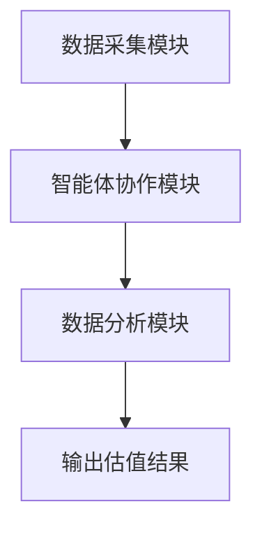
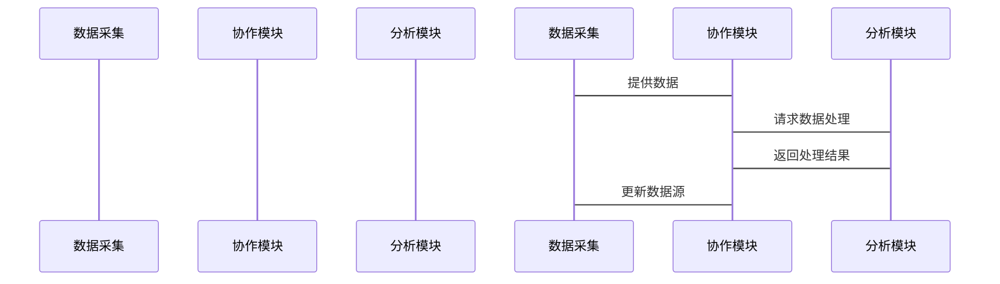

                 


```markdown
# 智能体协作提高价值投资的公司估值准确性

> 关键词：智能体协作，价值投资，公司估值，协作式强化学习，协同过滤，系统架构

> 摘要：本文探讨了智能体协作在提高价值投资公司估值准确性中的应用。通过分析智能体协作的机制、算法原理和系统架构，结合实际案例，展示了如何利用智能体协作优化公司估值，提升投资决策的准确性。

---

## 第一部分：智能体协作与价值投资的背景与概念

### 第1章：智能体协作的基本概念

#### 1.1 智能体协作的定义与特点
- 1.1.1 智能体协作的定义
- 1.1.2 智能体协作的核心特点
- 1.1.3 智能体协作与传统协作的区别

#### 1.2 价值投资的基本原理
- 1.2.1 价值投资的定义
- 1.2.2 价值投资的核心理念
- 1.2.3 价值投资与智能体协作的联系

### 第2章：公司估值的基本原理

#### 2.1 公司估值的定义与方法
- 2.1.1 公司估值的定义
- 2.1.2 常见的公司估值方法
- 2.1.3 不同估值方法的优缺点

#### 2.2 智能体协作在公司估值中的作用
- 2.2.1 提高估值准确性的潜力
- 2.2.2 智能体协作与传统估值方法的结合

---

## 第二部分：智能体协作的机制与算法

### 第3章：智能体协作的算法原理

#### 3.1 协作式强化学习
- 3.1.1 强化学习的基本原理
- 3.1.2 协作式强化学习的定义
- 3.1.3 协作式强化学习的数学模型

#### 3.2 协同过滤算法
- 3.2.1 协同过滤的基本原理
- 3.2.2 基于智能体协作的协同过滤算法
- 3.2.3 协同过滤的数学模型

### 第4章：智能体协作的数学模型与公式

#### 4.1 协作式强化学习的数学模型
- 4.1.1 状态空间的定义
- 4.1.2 动作空间的定义
- 4.1.3 奖励函数的设计

#### 4.2 协同过滤的数学模型
- 4.2.1 相似度计算公式
- 4.2.2 预测值的计算公式
- 4.2.3 模型优化的数学推导

---

## 第三部分：智能体协作的系统架构与实现

### 第5章：智能体协作系统的架构设计

#### 5.1 系统功能模块划分
- 5.1.1 数据采集模块
- 5.1.2 智能体协作模块
- 5.1.3 数据分析模块

#### 5.2 系统架构图


#### 5.3 系统接口设计
- 数据输入接口：接收公司财务数据、市场数据等
- 数据处理接口：对数据进行清洗、预处理
- 智能体协作接口：智能体之间协作计算最优估值

#### 5.4 系统交互流程图


---

## 第四部分：项目实战

### 第6章：智能体协作在价值投资中的应用案例

#### 6.1 案例分析：科技公司估值
- 数据来源：财务报表、市场动态、行业趋势
- 数据处理：清洗、特征提取
- 算法实现：协作式强化学习、协同过滤
- 实验结果：估值准确性对比分析

#### 6.2 环境配置
- 安装Python和必要的库（如NumPy、Pandas、Scikit-learn）
- 安装协作式强化学习框架（如Ray、Distributed）

#### 6.3 核心代码实现

##### 协作式强化学习实现
```python
import numpy as np

def reward_function(states, actions):
    # 简单的奖励函数，根据实际场景定义
    return np.sum(states * actions)

class CollaborativeAgent:
    def __init__(self, state_space):
        self.state_space = state_space
        self.reward_fn = reward_function

    def act(self, state):
        # 随机选择一个动作
        action = np.random.choice(self.state_space)
        return action

    def learn(self, state, action, reward):
        # 简单的学习策略，记录经验
        pass
```

##### 协同过滤实现
```python
from sklearn.metrics.pairwise import cosine_similarity

def collaborative_filtering(user_data):
    # 计算相似度矩阵
    similarity = cosine_similarity(user_data)
    return similarity
```

#### 6.4 实验结果与分析
- 实验结果展示：估值准确率对比
- 数据可视化：智能体协作前后的估值变化

---

## 第五部分：总结与展望

### 第7章：总结与展望

#### 7.1 全文总结
- 智能体协作在价值投资中的应用价值
- 提高公司估值准确性的潜力
- 系统架构与算法的优势

#### 7.2 未来研究方向
- 更复杂的智能体协作算法研究
- 多智能体协作在金融领域的更多应用探索
- 更高效的协作机制设计

---

作者：AI天才研究院/AI Genius Institute & 禅与计算机程序设计艺术 /Zen And The Art of Computer Programming
```

