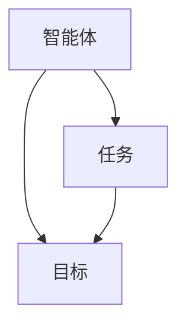
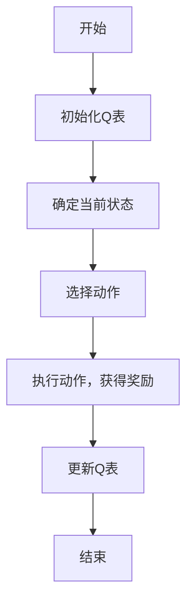
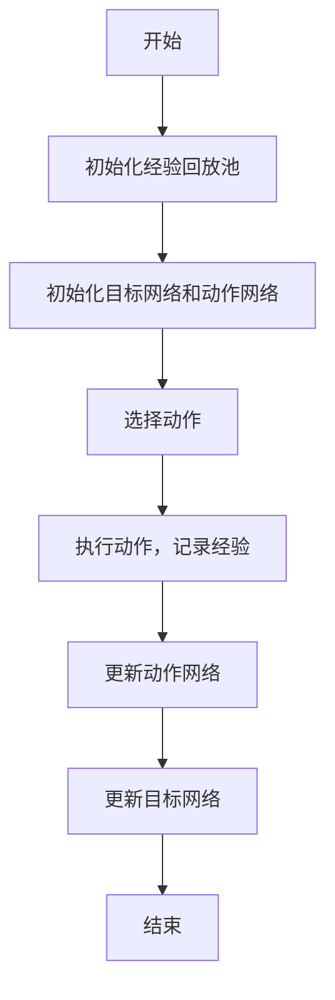
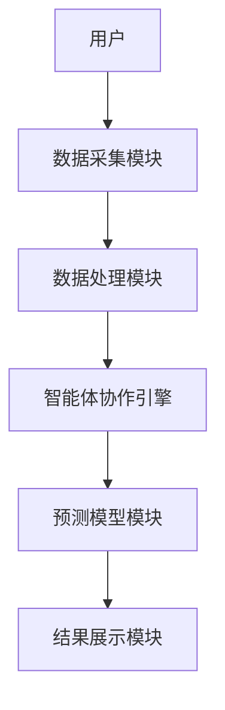

                 


# 智能体协作提高价值投资的行业整合预测

> 关键词：智能体协作，价值投资，行业整合，预测模型，多智能体系统，强化学习

> 摘要：本文探讨智能体协作在价值投资中的应用，特别是在行业整合预测中的潜力。通过分析智能体协作的核心概念、算法原理、系统架构，以及实际项目中的应用，揭示智能体协作如何帮助投资者提高预测准确性，优化投资决策。

---

## 第一部分: 智能体协作与价值投资概述

### 第1章: 智能体协作的背景与概念

#### 1.1 智能体协作的基本概念
智能体（Agent）是具有自主性、反应性、目标导向和社交能力的实体，能够感知环境并采取行动以实现目标。智能体协作是指多个智能体通过通信和协调，共同完成复杂任务的过程。

- **自主性**：智能体能够独立决策，无需外部干预。
- **反应性**：能够实时感知环境变化并做出反应。
- **目标导向**：所有行动都围绕实现特定目标展开。
- **社交能力**：通过通信和协商，与其他智能体协作。

智能体协作的核心在于通过个体间的高效协同，实现整体目标的最优解。例如，在价值投资中，多个智能体可以分别负责数据收集、市场分析、风险评估等任务，最终共同制定投资策略。

#### 1.2 价值投资与行业整合的背景
价值投资是一种通过分析企业的基本面，如财务状况、行业地位、管理团队等，寻找被市场低估的投资标的。随着市场竞争加剧，企业间的整合日益频繁，行业整合成为价值投资中的重要课题。

- **价值投资**：寻找具有长期增长潜力的企业，关注其内在价值而非短期市场波动。
- **行业整合**：通过并购、重组等方式，优化资源配置，提升行业竞争力。

智能体协作在行业整合中的应用，可以显著提高预测的准确性。例如，通过分析多个智能体提供的市场数据、企业财务指标和行业趋势，能够更精准地预测整合的可能性和时间点。

#### 1.3 智能体协作在价值投资中的应用前景
智能体协作的优势在于其分布式计算和协作能力，能够处理复杂多变的市场环境。通过智能体协作，投资者可以实时获取多维度的数据，快速做出决策，从而提高投资收益。

- **优势**：高效的数据处理能力、分布式计算、实时协作。
- **挑战**：通信延迟、数据隐私、协作效率。

通过智能体协作，投资者可以更好地应对市场变化，抓住行业整合的机会，实现长期稳定的收益。

### 第2章: 智能体协作的核心概念与联系

#### 2.1 多智能体系统的原理
多智能体系统（MAS）由多个智能体组成，通过协作完成复杂任务。智能体之间通过通信和协商，实现信息共享和任务分配。

- **组成**：包括多个智能体、通信机制、协作规则和任务分配模块。
- **通信机制**：通过消息传递、发布-订阅模型等方式实现智能体间的通信。
- **协作规则**：定义智能体如何协作，如任务分配、冲突解决等。

在价值投资中，多智能体系统可以分别负责数据收集、市场分析、风险评估等任务，最终共同制定投资策略。

#### 2.2 智能体协作的核心要素
智能体协作涉及多个核心要素，包括自主性、协作性、适应性和通信能力。

- **自主性**：智能体能够独立决策，无需外部干预。
- **协作性**：通过通信和协商，实现共同目标。
- **适应性**：能够根据环境变化调整策略。
- **通信能力**：通过高效通信，确保信息共享。

通过这些核心要素，智能体协作能够高效处理复杂任务，提升投资预测的准确性。

#### 2.3 智能体协作的ER实体关系图
以下是智能体协作的核心要素关系图：



图中，智能体通过任务与目标相关联，形成协作关系。任务是智能体协作的核心，目标是协作的最终结果。

---

## 第二部分: 智能体协作的算法原理

### 第3章: 强化学习算法

#### 3.1 强化学习的基本原理
强化学习（Reinforcement Learning, RL）是一种通过试错学习，智能体在环境中通过与环境交互，逐步优化策略，以最大化累计奖励的算法。

- **核心要素**：智能体、环境、动作、状态、奖励。
- **学习过程**：智能体根据当前状态选择动作，执行动作后获得奖励，并根据奖励调整策略。

例如，在价值投资中，智能体可以通过分析市场数据，选择买入或卖出的动作，以获得最大收益。

#### 3.2 Q-learning算法
Q-learning是一种基于值函数的强化学习算法，通过学习状态-动作值函数，选择最优动作。

- **算法步骤**：
  1. 初始化Q表。
  2. 确定当前状态。
  3. 选择动作（探索或利用）。
  4. 执行动作，获得奖励。
  5. 更新Q表。

以下是Q-learning算法的流程图：



#### 3.3 DQN算法
DQN（Deep Q-Network）是将深度神经网络应用于Q-learning的一种方法，通过经验回放和目标网络，提高学习效率。

- **经验回放**：存储历史经验，随机抽取样本，减少数据偏差。
- **目标网络**：通过更新目标网络，稳定学习过程。

DQN算法的流程图如下：



### 第4章: 多智能体协作算法

#### 4.1 多智能体强化学习
多智能体强化学习（Multi-Agent Reinforcement Learning, MARL）是强化学习在多智能体系统中的应用，通过多个智能体协作，实现共同目标。

- **挑战**：智能体之间的协调、通信和协作策略设计。
- **解决方法**：采用分布式强化学习，通过局部观察和局部奖励，实现协作。

#### 4.2 联合强化学习
联合强化学习（Joint Reinforcement Learning）是一种通过智能体协作，共同优化策略的方法。

- **优点**：智能体之间可以通过通信共享信息，提高学习效率。
- **挑战**：通信开销、同步问题。

#### 4.3 分散强化学习
分散强化学习（Decentralized Reinforcement Learning）是一种通过分布式计算，每个智能体独立学习，最终实现整体目标的方法。

- **优点**：计算效率高，扩展性强。
- **挑战**：协调困难，可能出现竞争。

---

## 第三部分: 智能体协作的系统架构设计

### 第5章: 系统功能模块设计

#### 5.1 数据采集模块
数据采集模块负责收集市场数据，如股票价格、财务报表、行业趋势等。

- **数据源**：股票交易所、财经网站、企业财报。
- **数据处理**：清洗、特征提取、数据标准化。

#### 5.2 智能体协作引擎
智能体协作引擎负责协调多个智能体的协作，实现任务分配和信息共享。

- **任务分配**：根据智能体的能力和当前任务需求，分配任务。
- **通信机制**：通过消息队列或发布-订阅模型，实现智能体间的通信。
- **协作规则**：定义智能体之间的协作方式，如任务优先级、冲突解决。

#### 5.3 预测模型模块
预测模型模块基于智能体协作的结果，生成行业整合的预测模型。

- **模型选择**：根据任务需求选择回归模型、分类模型或时间序列模型。
- **模型训练**：使用历史数据训练模型，优化参数。
- **模型评估**：通过回测和交叉验证，评估模型的准确性。

### 第6章: 系统架构设计

#### 6.1 系统架构图
以下是系统架构图：



图中，用户通过数据采集模块输入数据，经过数据处理模块清洗后，输入智能体协作引擎，生成协作结果，最终由预测模型模块生成预测结果，并通过结果展示模块呈现给用户。

#### 6.2 系统交互图
以下是系统交互图：


用户与系统交互的主要流程包括数据输入、数据处理、智能体协作、模型预测和结果展示。

---

## 第四部分: 智能体协作的项目实战

### 第7章: 项目实战

#### 7.1 环境安装
- 安装Python和相关库，如TensorFlow、Keras、OpenAI Gym。
- 安装Mermaid和Graphviz，用于生成图表。

#### 7.2 系统核心实现
以下是智能体协作引擎的Python实现示例：

```python
import numpy as np
import gym
import random

class Agent:
    def __init__(self, env):
        self.env = env
        self.q_table = np.zeros([env.observation_space.shape[0], env.action_space.n])
    
    def act(self, state):
        if random.random() < 0.1:
            return self.env.action_space.sample()
        else:
            return np.argmax(self.q_table[state])
    
    def learn(self, state, action, reward):
        self.q_table[state][action] += reward

# 初始化环境
env = gym.make('CartPole-v1')
agent = Agent(env)

# 训练过程
for episode in range(100):
    state = env.reset()
    for _ in range(1000):
        action = agent.act(state)
        next_state, reward, done, _ = env.step(action)
        agent.learn(state, action, reward)
        state = next_state
```

#### 7.3 代码解读与分析
- **Agent类**：定义智能体，初始化Q表，定义动作选择和学习方法。
- **训练过程**：通过多次训练，优化Q表，提高智能体的决策能力。

#### 7.4 实际案例分析
通过智能体协作引擎，分析某行业的整合趋势，生成预测报告。

---

## 第五部分: 最佳实践

### 第8章: 小结
智能体协作在价值投资中的应用，能够显著提高行业整合预测的准确性。通过多智能体系统的协作，投资者可以更好地应对市场变化，实现长期稳定的收益。

### 第9章: 注意事项
- **数据隐私**：确保数据采集和处理过程中的隐私保护。
- **通信延迟**：优化通信机制，减少延迟。
- **计算资源**：确保系统有足够的计算资源支持多智能体协作。

### 第10章: 拓展阅读
- 推荐阅读《Multi-Agent Systems》和《Reinforcement Learning》相关书籍，深入了解智能体协作和强化学习的理论和应用。

---

## 作者信息
作者：AI天才研究院/AI Genius Institute  
合著者：禅与计算机程序设计艺术/Zen And The Art of Computer Programming

