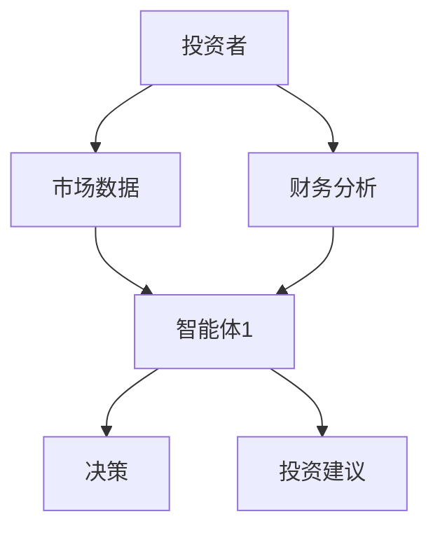
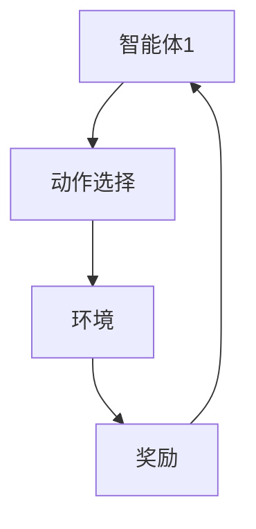
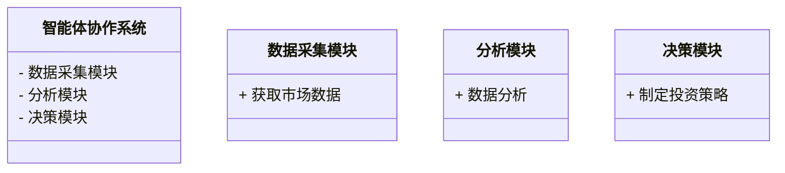
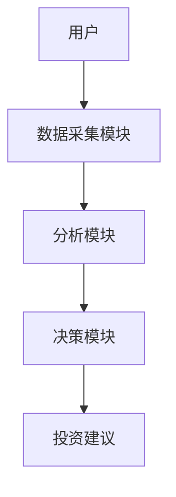
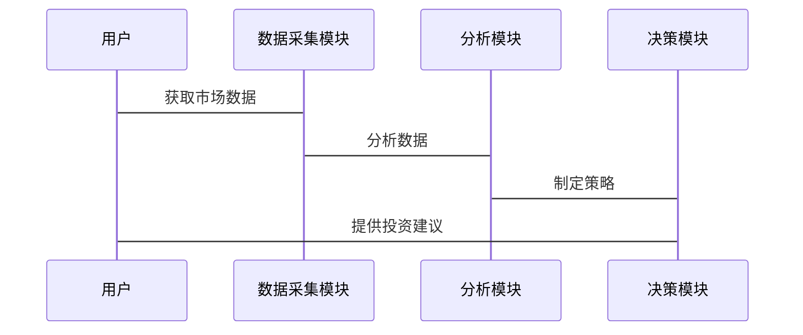

                 


# 智能体协作提高价值投资研究的深度和广度

## 关键词
- 智能体协作
- 价值投资
- 强化学习
- 多智能体系统
- 共识机制

## 摘要
智能体协作在价值投资中的应用，通过多智能体系统协同工作，利用强化学习和博弈论算法，提高了数据处理效率和决策准确性。文章从背景、核心概念、算法原理、系统架构、项目实战到案例分析，详细阐述了智能体协作在价值投资中的深度和广度，展示了其在现代金融分析中的潜力和实际应用。

---

## 第一部分: 智能体协作与价值投资概述

### 第1章: 智能体协作与价值投资的背景

#### 1.1 智能体协作的定义与特点
##### 1.1.1 智能体的基本概念
智能体（Agent）是能够感知环境并采取行动以实现目标的实体。智能体可以是软件程序、机器人或其他具备自主决策能力的系统。

##### 1.1.2 智能体协作的核心特征
- **自主性**：智能体能够自主决策。
- **反应性**：能够实时感知环境变化并做出反应。
- **协作性**：多个智能体协同完成复杂任务。
- **分布式**：任务分配和决策过程分散在多个智能体中。

##### 1.1.3 智能体协作与传统投资的区别
传统投资依赖人工分析，而智能体协作通过自动化和分布式计算提高效率和准确性。

#### 1.2 价值投资的基本原理
##### 1.2.1 价值投资的定义与历史发展
价值投资是通过分析企业基本面，寻找被市场低估的投资标的。它起源于20世纪，由本杰明·格雷厄姆等投资者推广。

##### 1.2.2 价值投资的核心理念与方法
- **基本面分析**：研究企业的财务状况、行业地位和竞争优势。
- **安全边际**：以低于内在价值的价格买入股票。
- **长期投资**：注重长期价值而非短期波动。

##### 1.2.3 智能体协作与价值投资的结合点
智能体协作可以用于数据处理、市场分析和投资决策，提高价值投资的效率和深度。

#### 1.3 问题背景与研究意义
##### 1.3.1 传统价值投资的局限性
- 数据量大，分析效率低。
- 人为因素可能导致决策偏差。
- 市场变化快，传统方法难以及时适应。

##### 1.3.2 智能体协作在价值投资中的应用潜力
- 提高数据分析效率。
- 实现多维度市场分析。
- 优化投资组合决策。

##### 1.3.3 研究目标与意义
目标是探索智能体协作如何提升价值投资的深度和广度，意义在于推动金融领域的技术进步和效率提升。

---

### 第2章: 智能体协作的核心概念与联系

#### 2.1 智能体协作的核心概念
##### 2.1.1 智能体协作的系统架构
- **感知层**：数据采集和环境感知。
- **决策层**：任务分配和策略制定。
- **执行层**：智能体协作执行任务。

##### 2.1.2 智能体协作的实体关系图


##### 2.1.3 智能体协作的核心要素
- 数据源：市场数据、财务报表等。
- 智能体：负责不同任务的协作单元。
- 协作机制：任务分配、信息共享和决策协调。

#### 2.2 智能体协作与价值投资的联系
##### 2.2.1 智能体协作在数据处理中的应用
智能体协作可以高效处理大量数据，提取关键信息。

##### 2.2.2 智能体协作在决策支持中的作用
通过多智能体协作，提供更全面的市场分析和投资建议。

##### 2.2.3 智能体协作在风险控制中的价值
智能体协作能够实时监控市场变化，及时调整投资策略。

#### 2.3 智能体协作的核心原理
##### 2.3.1 分布式任务分配机制
智能体协作通过分布式算法分配任务，确保高效执行。

##### 2.3.2 多智能体协作算法
使用强化学习和博弈论算法，实现智能体之间的高效协作。

##### 2.3.3 共识机制与协调策略
通过共识机制确保智能体之间信息一致，协调策略优化决策过程。

---

### 第3章: 智能体协作的算法原理

#### 3.1 基于强化学习的智能体协作
##### 3.1.1 强化学习的基本原理
强化学习通过智能体与环境互动，学习策略以最大化奖励。

##### 3.1.2 多智能体强化学习的挑战与解决方案
- **挑战**：智能体之间的协调和竞争。
- **解决方案**：设计分布式Q-learning算法，实现协作。

##### 3.1.3 基于Q-learning的协作算法


#### 3.2 基于博弈论的智能体协作
##### 3.2.1 博弈论的基本概念
博弈论研究理性决策者之间的策略互动。

##### 3.2.2 纳什均衡与智能体协作
纳什均衡是多个智能体协作稳定状态，确保每个智能体的策略最优。

##### 3.2.3 基于博弈论的协作策略设计
通过纳什均衡设计协作策略，确保智能体之间的协调。

#### 3.3 智能体协作的数学模型
##### 3.3.1 协作收益函数
收益函数表示智能体协作带来的收益。

##### 3.3.2 协作成本函数
成本函数表示协作过程中的成本。

##### 3.3.3 协作均衡点的数学推导
通过优化模型，找到协作的均衡点。

---

## 第四部分: 智能体协作的系统架构设计

### 第4章: 系统架构与功能设计

#### 4.1 系统功能设计
##### 4.1.1 领域模型设计


#### 4.2 系统架构设计
##### 4.2.1 系统架构图


#### 4.3 系统接口设计
##### 4.3.1 系统接口描述
智能体协作系统通过API接口与外部系统交互。

##### 4.3.2 接口设计文档
详细描述接口的输入、输出和功能。

#### 4.4 系统交互设计
##### 4.4.1 系统交互流程
用户请求数据，系统分析并生成投资建议。

##### 4.4.2 交互流程图


---

## 第五部分: 智能体协作的项目实战

### 第5章: 项目实战与案例分析

#### 5.1 环境安装与配置
##### 5.1.1 开发环境搭建
安装Python、TensorFlow等工具。

##### 5.1.2 数据源配置
配置市场数据接口，如Yahoo Finance。

#### 5.2 系统核心实现
##### 5.2.1 智能体协作算法实现
实现基于Q-learning的协作算法。

##### 5.2.2 项目源代码展示
```python
import numpy as np

class Agent:
    def __init__(self, state_space, action_space):
        self.state_space = state_space
        self.action_space = action_space
        self.Q = np.zeros((state_space, action_space))

    def act(self, state):
        return np.argmax(self.Q[state])

    def update(self, state, action, reward):
        self.Q[state][action] += reward

# 初始化智能体
agent = Agent(state_space=10, action_space=4)

# 定义环境
class Environment:
    def __init__(self):
        self.state = 0

    def get_state(self):
        return self.state

    def step(self, action):
        # 简单示例，实际应用中更复杂
        self.state = (self.state + 1) % 10
        return self.state, 1 if action == 3 else 0

# 训练智能体
env = Environment()
for episode in range(100):
    state = env.get_state()
    action = agent.act(state)
    next_state, reward = env.step(action)
    agent.update(state, action, reward)
```

##### 5.2.3 代码解读与分析
解释代码实现，说明智能体协作算法的应用。

#### 5.3 实际案例分析
##### 5.3.1 案例背景
分析某股票的历史数据，使用智能体协作系统进行投资决策。

##### 5.3.2 数据分析与处理
展示如何处理和分析市场数据。

##### 5.3.3 投资策略生成
智能体协作系统生成投资策略，并验证其有效性。

##### 5.3.4 实验结果与分析
展示实验结果，分析智能体协作系统的性能。

#### 5.4 项目小结
总结项目成果，讨论智能体协作在价值投资中的应用前景。

---

## 第六部分: 总结与展望

### 第6章: 总结与展望

#### 6.1 项目总结
智能体协作在价值投资中的应用显著提高了数据处理效率和决策准确性。

#### 6.2 案例分析总结
通过案例分析，验证了智能体协作系统的有效性和潜力。

#### 6.3 未来展望
未来将探索更复杂的协作机制，结合区块链等技术，进一步提升智能体协作的效率和安全性。

---

## 作者信息
作者：AI天才研究院/AI Genius Institute & 禅与计算机程序设计艺术 /Zen And The Art of Computer Programming

