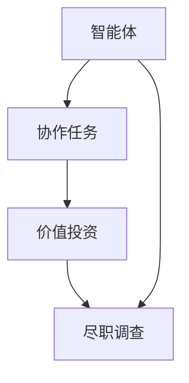
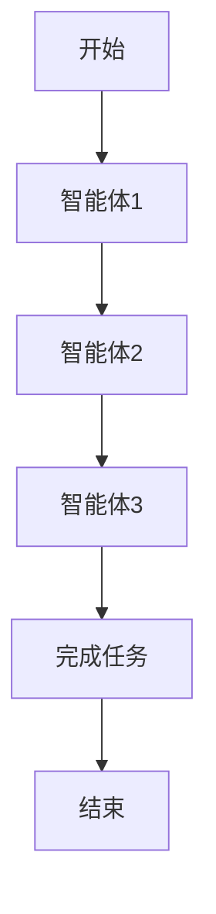
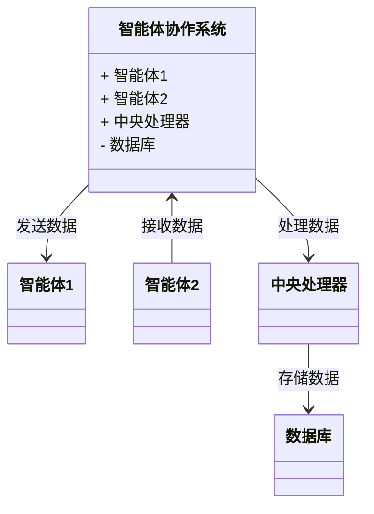
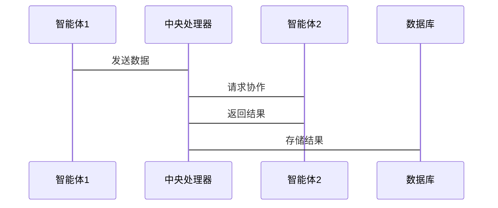

                 


# 智能体协作改进价值投资的尽职调查过程

## 关键词
- 智能体协作、价值投资、尽职调查、多智能体算法、系统架构设计

## 摘要
智能体协作在价值投资中的应用，特别是在尽职调查过程中的优化，通过多智能体算法和系统架构设计，显著提高了投资决策的准确性和效率。本文将从背景、核心概念、算法原理、系统设计、项目实战等方面，详细探讨智能体协作如何改进价值投资的尽职调查过程。

## 第1章 问题背景与问题描述

### 1.1 智能体协作的定义与特点
#### 1.1.1 智能体的基本概念
智能体（Agent）是一种能够感知环境、自主决策并采取行动的实体。在价值投资中，智能体可以是算法或系统，用于分析数据和做出投资决策。

#### 1.1.2 智能体协作的定义
智能体协作是指多个智能体通过共享信息、协同工作，共同完成复杂任务的过程。在尽职调查中，多个智能体可以分别负责不同的数据源和分析任务。

#### 1.1.3 智能体协作的核心特点
- 分布式：智能体独立运作，共享信息。
- 协作性：通过协作提高整体效率和准确性。
- 自适应性：智能体能够根据环境变化调整策略。

### 1.2 价值投资的定义与特点
#### 1.2.1 价值投资的基本概念
价值投资是一种投资策略，旨在以低于内在价值的价格购买优质资产。核心在于深入分析和评估资产的真实价值。

#### 1.2.2 价值投资的核心原则
- 长期投资：关注企业的长期价值。
- 安全边际：购买价格低于内在价值。
- 质量企业：选择财务健康、管理良好的企业。

#### 1.2.3 价值投资与智能体协作的联系
智能体协作可以提高尽职调查的效率和深度，帮助投资者更快、更准确地评估企业价值。

### 1.3 尽职调查的定义与流程
#### 1.3.1 尽职调查的基本概念
尽职调查是投资者在投资前对目标企业进行全面调查，评估其财务状况、经营风险和潜在问题。

#### 1.3.2 尽职调查的主要流程
1. 数据收集：收集企业的财务报表、市场数据等。
2. 数据分析：分析数据，识别风险和机会。
3. 报告撰写：撰写调查报告，提出投资建议。

#### 1.3.3 尽职调查在价值投资中的作用
- 提供决策支持：帮助投资者做出明智决策。
- 风险控制：识别潜在问题，降低投资风险。

### 1.4 问题解决与边界定义
#### 1.4.1 智能体协作如何改进尽职调查
通过分布式数据处理和协同分析，提高调查效率和准确性。

#### 1.4.2 问题的边界与外延
智能体协作主要用于尽职调查的分析阶段，不涉及最终的投资决策。

#### 1.4.3 核心概念的结构与组成
智能体协作、价值投资、尽职调查三者相互关联，共同构成改进的框架。

---

## 第2章 智能体协作与价值投资的核心概念

### 2.1 核心概念的原理
#### 2.1.1 智能体协作的原理
通过信息共享和协同决策，多个智能体共同完成复杂任务。

#### 2.1.2 价值投资的核心原理
通过深入分析企业内在价值，以合理价格投资优质资产。

#### 2.1.3 智能体协作在价值投资中的应用原理
利用智能体协作提高数据处理和分析效率，辅助投资者做出更优决策。

### 2.2 核心概念的属性特征对比
| 属性 | 智能体协作 | 价值投资 |
|------|------------|-----------|
| 目标 | 提高效率 | 寻找低估资产 |
| 方法 | 分布式计算 | 深度分析 |
| 输出 | 协作结果 | 投资决策 |

### 2.3 实体关系图（ER图）


---

## 第3章 智能体协作的算法原理

### 3.1 算法原理概述
#### 3.1.1 多智能体协作的基本原理
多个智能体通过通信和协调，共同完成任务。

#### 3.1.2 智能体协作的算法分类
- 分布式算法：如分布式一致性算法。
- 协作算法：如协作过滤算法。

#### 3.1.3 适用于价值投资的协作算法
选择适合金融数据分析的算法，如分布式协同过滤。

### 3.2 算法流程图


### 3.3 算法实现代码
```python
class Agent:
    def __init__(self, id):
        self.id = id
        self.data = {}

    def receive_data(self, data):
        self.data.update(data)
        return self.data

# 示例用法
agent1 = Agent(1)
agent2 = Agent(2)
agent3 = Agent(3)

data1 = {'revenue': 100000}
data2 = {'profit': 50000}

agent2.receive_data(data2)
final_data = agent3.receive_data(agent2.data)
```

### 3.4 算法的数学模型
$$ \text{收益} = \sum_{i=1}^{n} \text{智能体}_i \text{的贡献} $$

---

## 第4章 系统分析与架构设计

### 4.1 问题场景介绍
设计一个基于智能体协作的尽职调查系统，提高数据处理效率。

### 4.2 系统功能设计
- 数据采集：智能体收集企业数据。
- 数据分析：智能体协同分析数据。
- 结果输出：生成调查报告。

### 4.3 系统架构设计


### 4.4 系统交互设计


---

## 第5章 项目实战

### 5.1 环境安装
安装Python和必要的库，如pandas和numpy。

### 5.2 核心实现代码
```python
import pandas as pd
import numpy as np

class InvestmentAgent:
    def __init__(self, name):
        self.name = name
        self.data = pd.DataFrame()

    def collect_data(self, data):
        self.data = self.data.append(data)
        return self.data

    def analyze(self):
        return self.data.describe()

# 示例用法
agent = InvestmentAgent("StockAnalyzer")
data = {'price': [100, 105, 98, 110]}
agent.collect_data(data)
summary = agent.analyze()
print(summary)
```

### 5.3 案例分析
分析某企业的财务数据，生成调查报告，提出投资建议。

### 5.4 项目小结
通过项目实战，验证了智能体协作在尽职调查中的有效性。

---

## 第6章 总结与最佳实践

### 6.1 小结
智能体协作显著提高了尽职调查的效率和准确性，为价值投资提供了有力支持。

### 6.2 最佳实践 tips
- 合理选择协作算法，确保系统高效运行。
- 定期更新数据，保持分析结果的准确性。

### 6.3 注意事项
- 确保数据安全，防止信息泄露。
- 定期维护系统，及时修复漏洞。

### 6.4 拓展阅读
推荐相关书籍和文章，深入学习智能体协作和价值投资的知识。

---

## 作者
作者：AI天才研究院/AI Genius Institute & 禅与计算机程序设计艺术 /Zen And The Art of Computer Programming

