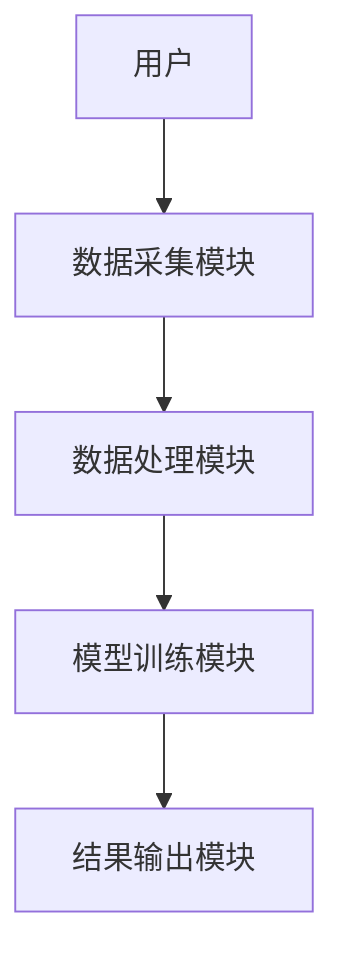

                 


# 智能体协作评估公司的创新文化：长期价值创造的源泉

> 关键词：智能体协作、创新文化、企业价值、长期价值、评估模型、算法实现、系统设计

> 摘要：智能体协作作为企业创新文化的核心驱动力，通过优化协作机制和创新文化评估模型，能够显著提升企业的长期价值创造能力。本文从智能体协作的基本概念出发，结合创新文化的特征，深入分析智能体协作评估模型的算法原理和系统设计，最后通过实际案例展示智能体协作在企业创新文化评估中的应用价值。

---

## 第一部分: 智能体协作与创新文化评估基础

### 第1章: 智能体协作的背景与概念

#### 1.1 智能体协作的基本概念

##### 1.1.1 智能体的定义与特征
智能体（Agent）是指具有感知环境、自主决策、执行任务能力的实体。智能体可以是软件程序、机器人或其他智能系统。其主要特征包括：
- **自主性**：能够自主决策，无需外部干预。
- **反应性**：能够感知环境并实时响应。
- **协作性**：能够与其他智能体或人类进行协作。

##### 1.1.2 协作的定义与分类
协作是指多个个体或系统为实现共同目标而协同工作的过程。根据协作主体的不同，可以分为：
- **人与人之间的协作**：如团队合作。
- **人与智能体之间的协作**：如人类与智能助手协同完成任务。
- **智能体与智能体之间的协作**：如多智能体系统协同完成复杂任务。

##### 1.1.3 智能体协作的核心要素
智能体协作的核心要素包括：
- **通信机制**：智能体之间如何交换信息。
- **协调机制**：如何分配任务和资源。
- **决策机制**：如何在协作中做出最优决策。

#### 1.2 创新文化的定义与特征

##### 1.2.1 创新文化的定义
创新文化是指企业在创新意识、创新行为和创新成果等方面的综合表现。它是一个组织支持和鼓励员工提出新想法、开发新技术、创造新产品的文化氛围。

##### 1.2.2 创新文化的特征
- **开放性**：鼓励员工提出新想法。
- **包容性**：接受失败，鼓励从失败中学习。
- **激励性**：通过奖励机制激励创新行为。
- **持续性**：创新文化是企业长期发展的核心竞争力。

##### 1.2.3 创新文化与企业绩效的关系
创新文化与企业绩效密切相关。创新文化强的企业通常具有更强的市场竞争力、更高的员工满意度和更高的利润率。创新文化能够激发员工的创造力，推动企业在技术、产品和服务上的持续改进。

#### 1.3 智能体协作与创新文化的关联

##### 1.3.1 智能体协作如何促进创新
智能体协作通过优化资源分配、提高决策效率和促进知识共享，能够显著提升企业的创新能力。例如，智能体可以协助员工快速找到创新灵感、评估创新方案的可行性。

##### 1.3.2 创新文化对企业长期价值的影响
创新文化是企业长期价值的源泉。它能够帮助企业应对市场变化、适应新兴技术和客户需求，从而在竞争中占据优势。

##### 1.3.3 智能体协作在创新文化评估中的作用
智能体协作可以通过数据分析、信息整合和知识挖掘，为企业创新文化的评估提供科学依据。例如，智能体可以分析员工的创新行为、创新成果和创新氛围，从而帮助企业识别创新文化中的优势和不足。

---

### 第2章: 智能体协作评估模型的核心概念

#### 2.1 智能体协作评估模型的原理

##### 2.1.1 模型的基本原理
智能体协作评估模型通过分析智能体的协作行为、协作效果和协作结果，对企业创新文化进行量化评估。模型的核心在于将智能体协作与企业创新文化的关键指标相结合。

##### 2.1.2 模型的输入与输出
- **输入**：智能体协作数据、企业创新文化指标。
- **输出**：企业创新文化评估结果、协作优化建议。

##### 2.1.3 模型的评估标准
模型的评估标准包括：
- **准确性**：评估结果与实际创新文化的吻合程度。
- **可解释性**：模型的输出结果是否易于理解和应用。
- **可扩展性**：模型是否适用于不同规模和类型的企业。

#### 2.2 创新文化评估的核心要素

##### 2.2.1 创新文化评估的维度
- **创新意识**：员工是否具有创新思维。
- **创新行为**：员工是否积极参与创新活动。
- **创新成果**：企业的创新产出，如新产品、新技术等。

##### 2.2.2 创新文化评估的指标
- **创新投入**：企业的研发投入比例。
- **创新产出**：新产品的数量和市场表现。
- **创新氛围**：员工对创新文化的感知和态度。

##### 2.2.3 创新文化评估的权重分配
创新文化评估的权重分配需要根据企业的实际情况进行调整。例如，技术创新型企业的创新投入权重可能更高，而服务型企业可能更关注创新氛围。

#### 2.3 智能体协作与创新文化评估的关系

##### 2.3.1 智能体协作在创新文化评估中的角色
智能体协作是创新文化评估的重要工具。通过智能体协作，企业可以实时监测创新文化的变化，评估创新文化的健康状况。

##### 2.3.2 创新文化评估对智能体协作的反馈作用
创新文化评估的结果可以为智能体协作提供反馈，优化协作机制。例如，如果评估发现员工创新氛围不足，智能体可以调整协作策略，增加员工参与创新活动的机会。

##### 2.3.3 智能体协作与创新文化评估的动态平衡
智能体协作与创新文化评估是一个动态平衡的过程。企业需要根据评估结果不断优化协作机制，同时通过协作机制的优化提升创新文化的水平。

---

## 第二部分: 智能体协作评估模型的算法原理

### 第3章: 智能体协作评估的算法原理

#### 3.1 智能体协作评估的算法框架

##### 3.1.1 算法的整体框架
智能体协作评估算法的整体框架包括数据采集、数据处理、模型训练和结果输出四个阶段。

##### 3.1.2 算法的输入处理
算法的输入包括智能体协作数据和企业创新文化指标。输入数据需要进行清洗、标准化和特征提取。

##### 3.1.3 算法的输出结果
算法的输出结果包括企业创新文化评估得分、协作优化建议和创新文化发展趋势预测。

#### 3.2 创新文化评估的数学模型

##### 3.2.1 创新文化评估的线性回归模型
线性回归模型用于预测企业创新文化评估得分。模型公式如下：

$$ y = \beta_0 + \beta_1x_1 + \beta_2x_2 + \dots + \beta_nx_n + \epsilon $$

其中，$y$ 是创新文化评估得分，$x_i$ 是创新文化评估指标，$\beta_i$ 是回归系数，$\epsilon$ 是误差项。

##### 3.2.2 创新文化评估的协同过滤算法
协同过滤算法用于推荐创新文化优化策略。算法步骤如下：
1. 收集企业创新文化数据。
2. 计算企业之间的相似度。
3. 根据相似度推荐优化策略。

##### 3.2.3 创新文化评估的聚类分析方法
聚类分析方法用于将企业分为不同的创新文化类型。常用的聚类算法包括K-means和层次聚类。

#### 3.3 算法实现的Python代码

##### 3.3.1 环境安装与配置
需要安装以下Python库：
- **pandas**：数据处理
- **numpy**：数值计算
- **scikit-learn**：机器学习算法
- **matplotlib**：数据可视化

##### 3.3.2 算法实现的代码示例

```python
import pandas as pd
import numpy as np
from sklearn.linear_model import LinearRegression
from sklearn.metrics import mean_squared_error

# 数据加载
data = pd.read_csv('innovation_culture.csv')

# 数据预处理
X = data[['创新意识', '创新行为', '创新成果']]
y = data['创新文化评估得分']

# 模型训练
model = LinearRegression()
model.fit(X, y)

# 模型预测
y_pred = model.predict(X)

# 模型评估
mse = mean_squared_error(y, y_pred)
print(f"均方误差：{mse}")
print(f"回归系数：{model.coef_}")
print(f"截距：{model.intercept_}")
```

##### 3.3.3 代码的功能解读与分析
上述代码实现了创新文化评估的线性回归模型。通过训练数据，模型可以预测企业的创新文化评估得分。回归系数和截距可以帮助企业理解各创新文化指标对评估得分的影响程度。

---

## 第三部分: 智能体协作评估系统的架构设计

### 第4章: 智能体协作评估系统的架构设计

#### 4.1 系统架构的整体设计

##### 4.1.1 系统架构的模块划分
智能体协作评估系统主要包括以下几个模块：
- **数据采集模块**：负责采集企业创新文化数据。
- **数据处理模块**：对数据进行清洗和预处理。
- **模型训练模块**：训练创新文化评估模型。
- **结果输出模块**：输出评估结果和优化建议。

##### 4.1.2 系统架构的层次结构
系统架构的层次结构包括数据层、业务逻辑层和用户界面层。

##### 4.1.3 系统架构的交互流程
1. 用户输入企业创新文化数据。
2. 数据采集模块将数据传输到数据处理模块。
3. 数据处理模块对数据进行清洗和预处理。
4. 模型训练模块训练创新文化评估模型。
5. 结果输出模块将评估结果和优化建议展示给用户。

#### 4.2 系统功能的详细设计

##### 4.2.1 数据采集模块的功能设计
数据采集模块需要支持多种数据来源，包括企业内部数据和外部数据。

##### 4.2.2 数据处理模块的功能设计
数据处理模块需要实现数据清洗、数据转换和特征提取功能。

##### 4.2.3 模型训练模块的功能设计
模型训练模块需要支持多种机器学习算法，包括线性回归、协同过滤和聚类分析。

##### 4.2.4 结果输出模块的功能设计
结果输出模块需要将评估结果以可视化的方式展示给用户。

#### 4.3 系统设计的mermaid流程图



---

## 第四部分: 项目实战与案例分析

### 第5章: 项目实战与案例分析

#### 5.1 项目实战

##### 5.1.1 环境安装与配置
需要安装以下Python库：
- **pandas**：数据处理
- **numpy**：数值计算
- **scikit-learn**：机器学习算法
- **matplotlib**：数据可视化

##### 5.1.2 核心代码实现
以下代码实现智能体协作评估模型：

```python
import pandas as pd
import numpy as np
from sklearn.linear_model import LinearRegression
from sklearn.metrics import mean_squared_error

# 数据加载
data = pd.read_csv('innovation_culture.csv')

# 数据预处理
X = data[['创新意识', '创新行为', '创新成果']]
y = data['创新文化评估得分']

# 模型训练
model = LinearRegression()
model.fit(X, y)

# 模型预测
y_pred = model.predict(X)

# 模型评估
mse = mean_squared_error(y, y_pred)
print(f"均方误差：{mse}")
print(f"回归系数：{model.coef_}")
print(f"截距：{model.intercept_}")
```

##### 5.1.3 代码的功能解读与分析
上述代码实现了创新文化评估的线性回归模型。通过训练数据，模型可以预测企业的创新文化评估得分。回归系数和截距可以帮助企业理解各创新文化指标对评估得分的影响程度。

#### 5.2 案例分析

##### 5.2.1 案例背景
某高科技企业希望评估其创新文化，并优化协作机制以提升创新能力。

##### 5.2.2 数据分析
通过数据分析，发现该企业的创新投入较高，但创新氛围较弱。

##### 5.2.3 模型应用
应用智能体协作评估模型，得出该企业的创新文化评估得分为75分，协作优化建议包括加强员工创新氛围和优化协作机制。

##### 5.2.4 结果解读
模型结果表明，该企业需要进一步提升创新氛围，以提高创新文化评估得分。

---

## 第五部分: 总结与展望

### 第6章: 总结与展望

#### 6.1 最佳实践 tips
- 定期评估创新文化，优化协作机制。
- 鼓励员工参与创新活动，提升创新氛围。
- 利用智能体协作技术，提高创新文化评估的科学性和准确性。

#### 6.2 小结
智能体协作是企业创新文化评估的重要工具。通过智能体协作评估模型，企业可以量化创新文化，优化协作机制，提升长期价值创造能力。

#### 6.3 注意事项
- 数据隐私和安全问题需要高度重视。
- 模型的准确性和可解释性需要结合企业实际情况进行调整。
- 智能体协作与人类协作需要有机结合，避免过度依赖技术。

#### 6.4 拓展阅读
推荐阅读《人工智能与企业创新》、《协作智能：未来企业的核心竞争力》等书籍，深入了解智能体协作与创新文化的关系。

---

## 作者信息

作者：AI天才研究院/AI Genius Institute & 禅与计算机程序设计艺术 /Zen And The Art of Computer Programming

---

以上是《智能体协作评估公司的创新文化：长期价值创造的源泉》的完整目录和内容框架。通过这一系列的思考和分析，我们可以看到，智能体协作不仅是技术创新的核心驱动力，更是企业创新文化评估和优化的关键工具。希望本文能够为企业的创新文化建设提供有价值的参考和指导。

