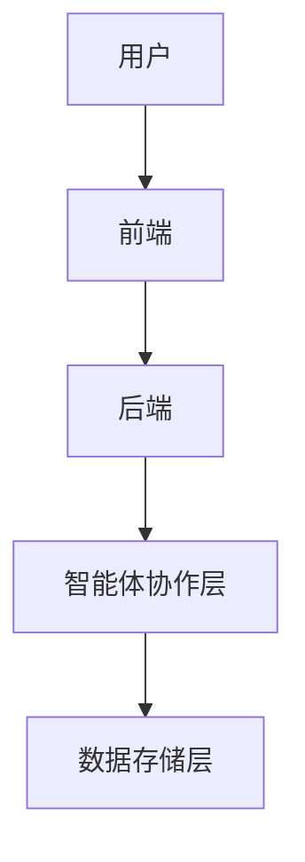
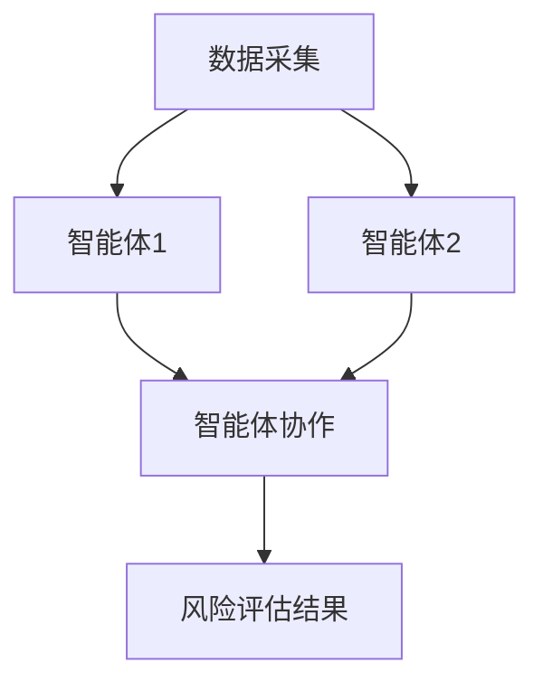
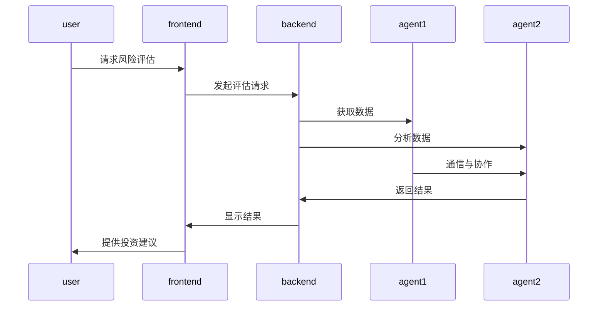

                 


# 《智能体协作评估公司的地缘政治风险：全球价值投资必备》

---

## 关键词：
- 智能体协作
- 地缘政治风险
- 全球价值投资
- 人工智能
- 风险评估
- 分布式计算

---

## 摘要：
随着全球化的深入发展，地缘政治风险对企业投资决策的影响日益显著。智能体协作作为一种新兴的分布式计算范式，能够通过多智能体的协同工作，高效地评估和预测地缘政治风险，为全球价值投资提供有力支持。本文从智能体协作的基本概念出发，结合地缘政治风险评估的核心要素，详细阐述了智能体协作在风险评估中的算法实现、系统架构设计以及实际应用场景。通过案例分析和代码实现，本文为读者提供了从理论到实践的完整指南，帮助投资者在复杂的地缘政治环境中做出更明智的投资决策。

---

## 第一部分: 智能体协作与地缘政治风险评估基础

### 第1章: 智能体协作与地缘政治风险概述

#### 1.1 智能体协作的基本概念
- 1.1.1 什么是智能体  
- 1.1.2 智能体协作的定义  
- 1.1.3 地缘政治风险的定义与构成  

#### 1.2 智能体协作在地缘政治风险评估中的作用  
- 1.2.1 地缘政治风险评估的复杂性  
- 1.2.2 智能体协作的优势  
- 1.2.3 全球价值投资中的应用前景  

#### 1.3 地缘政治风险评估的核心要素  
- 1.3.1 政治稳定性  
- 1.3.2 经济状况  
- 1.3.3 社会因素  
- 1.3.4 国际关系  

---

### 第2章: 地缘政治风险评估的智能体协作机制

#### 2.1 智能体协作的基本原理  
- 2.1.1 分布式计算  
- 2.1.2 通信协议  
- 2.1.3 协作规则  

#### 2.2 智能体协作中的信息处理  
- 2.2.1 数据收集与整合  
- 2.2.2 信息分析与决策  
- 2.2.3 结果输出与反馈  

#### 2.3 智能体协作的实现框架  
- 2.3.1 分层架构  
- 2.3.2 模块化设计  
- 2.3.3 网络通信协议  

---

## 第二部分: 地缘政治风险评估的核心算法

### 第3章: 风险评估模型的构建

#### 3.1 数据预处理  
- 3.1.1 数据清洗  
- 3.1.2 数据标准化  
- 3.1.3 数据增强  

#### 3.2 风险评估模型的选择  
- 3.2.1 机器学习模型  
- 3.2.2 深度学习模型  
- 3.2.3 时间序列模型  

#### 3.3 模型训练与优化  
- 3.3.1 参数调整  
- 3.3.2 模型验证  
- 3.3.3 模型部署  

---

### 第4章: 基于智能体协作的风险评估算法

#### 4.1 分布式机器学习  
- 4.1.1 分布式计算的原理  
- 4.1.2 分布式模型训练的流程  
- 4.1.3 分布式模型的应用  

#### 4.2 联合学习  
- 4.2.1 联合学习的定义  
- 4.2.2 联合学习的实现步骤  
- 4.2.3 联合学习的优势  

#### 4.3 跨智能体优化  
- 4.3.1 跨智能体优化的原理  
- 4.3.2 跨智能体优化的实现方法  
- 4.3.3 跨智能体优化的实际应用  

---

### 第5章: 算法实现的数学模型

#### 5.1 分布式计算的数学表达  
- $$ y = f(x_1, x_2, \dots, x_n) $$  
- $$ f(x_i) \text{ 在每个智能体上独立计算} $$  
- $$ y = \text{ aggregator}(f(x_1), f(x_2), \dots, f(x_n)) $$  

#### 5.2 联合学习的公式推导  
- $$ \theta_{t+1} = \theta_t + \eta \cdot \nabla L(\theta_t) $$  
- $$ L(\theta) = \frac{1}{n} \sum_{i=1}^{n} L_i(\theta) $$  

#### 5.3 跨智能体优化的数学模型  
- $$ \text{Minimize} \quad \sum_{i=1}^{n} f_i(x) $$  
- $$ \text{Subject to} \quad x_i \text{ 在智能体 } i \text{ 上} $$  

---

## 第三部分: 系统架构与设计

### 第6章: 系统架构设计

#### 6.1 问题场景介绍  
- 地缘政治风险评估的系统需求  
- 多智能体协作的系统目标  
- 系统的可用性、可靠性和安全性  

#### 6.2 系统功能设计  
- 6.2.1 数据采集模块  
- 6.2.2 智能体协作模块  
- 6.2.3 风险评估模块  

#### 6.3 系统架构设计  
- 6.3.1 分层架构图（Mermaid）  

- 6.3.2 模块化设计图（Mermaid）  


#### 6.4 系统接口设计  
- 6.4.1 API接口定义  
- 6.4.2 接口调用流程  
- 6.4.3 接口安全性设计  

#### 6.5 系统交互设计  
- 6.5.1 用户与系统的交互流程（Mermaid）  


---

## 第四部分: 项目实战与总结

### 第7章: 项目实战

#### 7.1 环境安装  
- 安装Python  
- 安装必要的库（如TensorFlow、Keras、Flask）  

#### 7.2 核心代码实现  
```python
def distributed_learning(data, num_agents):
    agents = [Agent(i) for i in range(num_agents)]
    for agent in agents:
        agent_data = data.split(num_agents)
        agent.train(agent_data)
    results = [agent.predict() for agent in agents]
    aggregated_result = aggregator(results)
    return aggregated_result

class Agent:
    def __init__(self, id):
        self.id = id
        self.model = build_model()
    
    def train(self, data):
        self.model.train(data)
    
    def predict(self):
        return self.model.predict()
```

#### 7.3 代码解读与分析  
- 代码功能模块的详细解读  
- 系统实现的关键点分析  
- 系统性能的优化建议  

#### 7.4 实际案例分析  
- 某地区的地缘政治风险评估案例  
- 系统输出的结果分析  
- 投资建议的生成过程  

#### 7.5 项目小结  
- 项目实施的成果  
- 系统的优缺点  
- 可能的改进方向  

---

### 第8章: 总结与展望

#### 8.1 最佳实践 Tips  
- 智能体协作的实施注意事项  
- 数据安全与隐私保护的建议  
- 系统维护与优化的技巧  

#### 8.2 小结  
- 本文的主要内容回顾  
- 智能体协作在地缘政治风险评估中的价值  
- 全球价值投资中的应用前景  

#### 8.3 注意事项  
- 数据来源的可靠性  
- 算法的可解释性  
- 系统的可扩展性  

#### 8.4 拓展阅读  
- 推荐的相关书籍与论文  
- 其他智能体协作的应用场景  
- 地缘政治风险评估的最新研究方向  

---

## 作者：AI天才研究院 & 禅与计算机程序设计艺术

