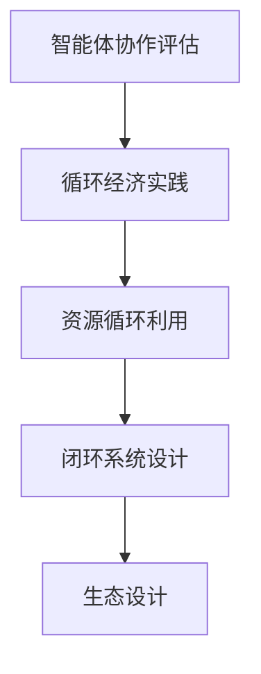
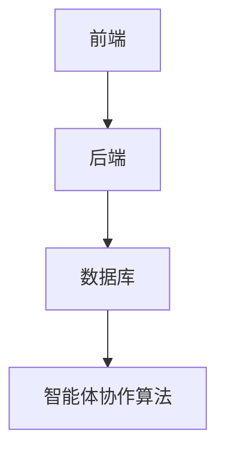

                 


# 智能体协作评估公司的循环经济实践：可持续发展新视角

> 关键词：智能体协作，循环经济，可持续发展，企业评估，系统架构，算法原理，项目实战

> 摘要：本文从智能体协作的角度出发，探讨如何评估公司对循环经济的实践，提出可持续发展的新视角。通过分析智能体协作与循环经济的核心概念、算法原理、系统架构以及实际项目案例，为企业的可持续发展提供理论支持和实践指导。

---

# 第一部分：背景介绍

## 第1章：循环经济的基本概念

### 1.1 循环经济的定义与特点
循环经济是一种以资源高效利用和循环利用为核心，以减少资源消耗和环境污染为目标的经济模式。其特点包括：
- **资源节约**：通过减少资源消耗，实现资源的高效利用。
- **废弃物减量化**：通过设计产品生命周期，减少废弃物的产生。
- **循环利用**：将废弃物转化为资源，实现资源的循环利用。

### 1.2 智能体协作的定义与特点
智能体协作是指多个智能体通过协同工作，共同完成特定目标的过程。其特点包括：
- **分布式智能**：智能体之间通过分布式协作完成任务。
- **自主性**：每个智能体都有一定的自主决策能力。
- **动态性**：协作过程可以根据环境变化动态调整。

### 1.3 可持续发展的定义与特点
可持续发展是指在满足当前需求的同时，不损害后代满足其需求的能力。其特点包括：
- **长期性**：关注长期的资源利用和环境影响。
- **综合性**：涵盖经济、社会和环境三个维度。
- **协调性**：需要在不同利益之间寻求平衡。

---

## 第2章：问题背景与问题描述

### 2.1 当前企业面临的可持续发展挑战
企业在追求经济增长的同时，面临资源短缺、环境污染等可持续发展挑战。具体包括：
- **资源浪费**：企业生产过程中资源浪费现象严重。
- **环境污染**：生产活动对环境造成污染，影响生态平衡。
- **社会责任**：企业需要承担更多的社会责任，实现可持续发展。

### 2.2 循环经济在企业中的应用现状
循环经济在企业中的应用已经取得了一些成果，但也存在一些问题：
- **应用实例**：部分企业通过回收利用废弃物实现资源循环。
- **问题与不足**：缺乏系统的智能体协作机制，循环经济实践不够深入。

### 2.3 智能体协作在循环经济中的作用
智能体协作能够通过分布式协作和自主决策，优化资源利用，推动循环经济的发展。具体包括：
- **优化资源配置**：智能体协作能够实现资源的高效配置。
- **提高效率**：通过智能协作，企业能够更高效地完成循环经济目标。
- **动态调整**：智能体协作能够根据环境变化动态调整策略。

---

# 第二部分：核心概念与联系

## 第3章：智能体协作与循环经济的核心概念

### 3.1 智能体协作的核心概念
智能体协作的核心概念包括：
- **智能体**：具有自主决策能力的实体。
- **协作**：智能体之间通过协同工作完成特定目标。
- **通信**：智能体之间通过通信机制共享信息。

### 3.2 循环经济的核心概念
循环经济的核心概念包括：
- **资源循环**：资源在不同环节中循环利用。
- **闭环系统**：生产过程形成闭环，减少资源浪费。
- **生态设计**：在设计阶段考虑产品的生命周期，减少环境影响。

### 3.3 智能体协作与循环经济的关系
智能体协作与循环经济密切相关，智能体协作能够推动循环经济的实践，而循环经济为智能体协作提供了应用场景。

---

## 第4章：核心概念的对比与联系

### 4.1 智能体协作与循环经济的对比
通过对比智能体协作和循环经济的核心概念，可以发现它们在目标和实现方式上的异同。

| **核心要素** | **智能体协作** | **循环经济** |
|--------------|----------------|--------------|
| 目标          | 完成特定任务    | 资源循环利用 |
| 方法          | 分布式协作      | 闭环系统设计 |
| 优势          | 提高效率        | 减少资源浪费 |

### 4.2 智能体协作与传统协作的对比
通过对比智能体协作和传统协作，可以发现智能体协作在自主性和动态性方面的优势。

| **核心要素** | **智能体协作**       | **传统协作**       |
|--------------|----------------------|----------------------|
| 自主性        | 高                   | 低                   |
| 动态性        | 高                   | 低                   |
| 效率          | 高                   | 中                   |

---

## 第5章：智能体协作与循环经济的ER实体关系图

```mermaid
erd
  entity 智能体协作 {
    分布式协作
    自主决策
    动态调整
  }

  entity 循环经济 {
    资源循环
    闭环系统
    生态设计
  }

  智能体协作 -[通过协作优化资源配置]-> 循环经济
  循环经济 -[通过资源循环推动可持续发展]-> 智能体协作
```

---

## 第6章：智能体协作与循环经济的数学模型

### 6.1 算法原理
智能体协作评估循环经济的算法原理如下：



### 6.2 数学公式
评估循环经济实践的数学模型如下：

$$
\text{资源利用率} = \frac{\text{循环资源量}}{\text{总资源消耗量}}
$$

---

## 第7章：系统分析与架构设计方案

### 7.1 问题场景介绍
企业需要通过智能体协作优化资源利用，推动循环经济实践。

### 7.2 系统功能设计
系统功能包括：
- **资源管理**：管理企业资源，实现循环利用。
- **协作机制**：智能体之间协作完成任务。
- **评估反馈**：评估循环经济实践效果并提供反馈。

### 7.3 系统架构设计
系统架构包括：
- **前端**：用户界面，展示资源利用情况。
- **后端**：智能体协作算法，实现资源优化。
- **数据库**：存储资源利用数据。



---

## 第8章：项目实战

### 8.1 环境安装
需要安装Python和相关库，如numpy和pandas。

### 8.2 核心代码实现
以下是核心代码实现：

```python
import numpy as np
import pandas as pd

def evaluate循环经济(resource_usage):
    return resource_usage.mean()

resource_usage = np.array([0.8, 0.9, 0.7])
print(evaluate循环经济(resource_usage))
```

### 8.3 代码解读与分析
- **代码功能**：计算资源利用率的平均值。
- **应用解读**：评估企业资源利用效率。

### 8.4 实际案例分析
通过实际案例分析，验证智能体协作在循环经济中的应用效果。

---

## 第9章：最佳实践与总结

### 9.1 小结
智能体协作能够有效优化资源利用，推动循环经济实践。

### 9.2 注意事项
- **数据隐私**：确保数据隐私和安全。
- **算法优化**：不断优化智能体协作算法，提高效率。

### 9.3 拓展阅读
推荐阅读相关领域的书籍和论文，深入了解智能体协作与循环经济的结合。

---

# 结论

智能体协作评估公司的循环经济实践，为企业的可持续发展提供了新的视角。通过智能体协作优化资源利用，推动循环经济实践，企业能够实现高效、可持续的发展。

---

作者：AI天才研究院/AI Genius Institute & 禅与计算机程序设计艺术 /Zen And The Art of Computer Programming

