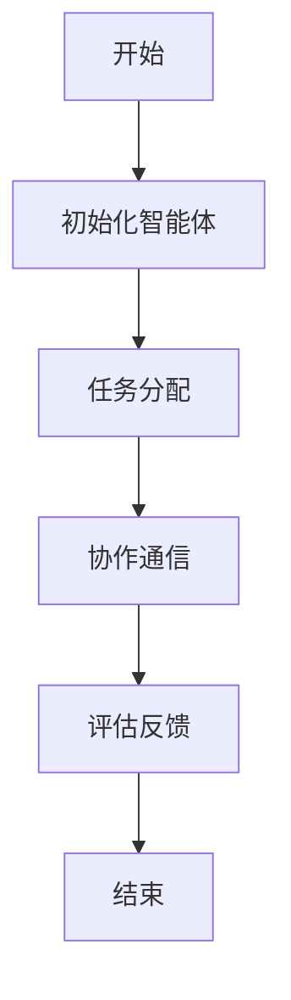
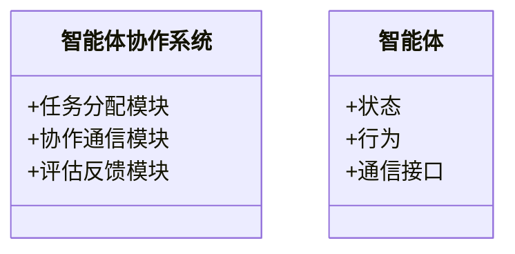
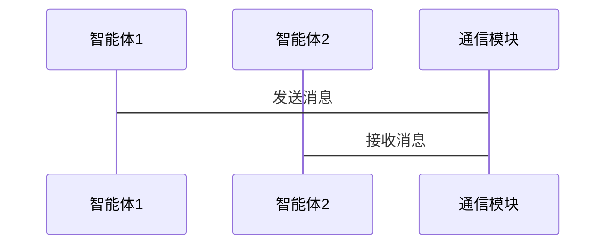

                 


# 智能体协作评估公司的研发效率：科技公司价值评估

---

## 关键词  
智能体协作，研发效率，科技公司，价值评估，分布式算法，协作学习，系统架构  

---

## 摘要  
智能体协作是评估科技公司研发效率的重要手段。本文从智能体协作的核心原理出发，结合算法实现、系统架构设计和实际案例分析，详细探讨了如何通过智能体协作评估研发效率，并为企业价值评估提供科学依据。文章内容包括背景介绍、核心概念、算法原理、系统架构设计、项目实战、最佳实践等部分，旨在为科技公司提供高效的评估方法和实践指导。

---

## 第一部分: 智能体协作评估公司的研发效率

---

### 第1章: 背景介绍与核心概念

#### 1.1 问题背景与描述  
在科技公司中，研发效率是衡量企业竞争力的核心指标之一。然而，传统的研发效率评估方法往往依赖人工统计和单点分析，难以全面反映团队协作的真实情况。随着人工智能技术的快速发展，智能体协作逐渐成为评估研发效率的重要手段。  

#### 1.2 智能体协作的核心问题  
智能体协作是指多个智能体通过分布式计算和协同学习，共同完成任务的过程。在研发效率评估中，智能体协作的核心问题包括：  
1. **任务分配与资源优化**：如何高效分配任务，降低资源浪费。  
2. **协作通信与信息共享**：如何实现智能体之间的高效通信和信息共享。  
3. **评估反馈与优化改进**：如何通过反馈机制优化协作过程，提升效率。  

#### 1.3 核心概念与结构  
- **智能体协作的定义**：智能体协作是指多个智能体通过分布式计算和协同学习，共同完成任务的过程。  
- **研发效率评估的指标体系**：包括任务完成度、资源消耗、协作效率、反馈响应时间等指标。  
- **智能体协作的核心要素**：任务分配模块、协作通信模块、评估反馈模块。  

---

### 第2章: 智能体协作的核心原理

#### 2.1 分布式算法的实现  
智能体协作依赖于分布式算法的实现。分布式算法的核心思想是将任务分解为多个子任务，由多个智能体协同完成。以下是分布式算法的实现步骤：  
1. **任务分解**：将整体任务分解为多个子任务。  
2. **任务分配**：根据智能体的能力和资源分配子任务。  
3. **子任务执行**：智能体独立完成分配的子任务。  
4. **结果汇总**：将子任务结果汇总，形成最终结果。  

#### 2.2 协作学习的数学模型  
协作学习的数学模型可以表示为：  
$$ \text{协作学习} = \sum_{i=1}^{n} w_i x_i $$  
其中，$w_i$ 是智能体 $i$ 的权重，$x_i$ 是智能体 $i$ 的输出。  

#### 2.3 智能体协作的系统架构  
智能体协作的系统架构包括以下三个模块：  
1. **任务分配模块**：负责将任务分配给不同的智能体。  
2. **协作通信模块**：负责智能体之间的通信和信息共享。  
3. **评估反馈模块**：负责评估协作效率并提供反馈。  

---

### 第3章: 智能体协作的算法实现

#### 3.1 环境安装与配置  
要实现智能体协作，首先需要安装以下环境：  
- Python 3.8 或更高版本  
- NumPy 和 Pandas 库  
- Mermaid 和 LaTeX 插件  

#### 3.2 核心代码实现  
以下是智能体协作的核心代码实现：  

```python
class Agent:
    def __init__(self, id):
        self.id = id
        self.state = None
        self.communication_channel = None

    def communicate(self, message):
        self.communication_channel.receive(message)

    def update_state(self):
        self.state = self.communication_channel.get_state()

def collaborate_agents(agents):
    for agent in agents:
        agent.communicate("Start Collaboration")
        agent.update_state()
    return agents
```

#### 3.3 算法流程图  
以下是协作学习的流程图：  



---

### 第4章: 系统分析与架构设计

#### 4.1 系统功能设计  
系统功能设计包括以下部分：  
1. **任务分配模块**：负责将任务分配给不同的智能体。  
2. **协作通信模块**：负责智能体之间的通信和信息共享。  
3. **评估反馈模块**：负责评估协作效率并提供反馈。  

#### 4.2 系统架构设计  
以下是系统架构设计的类图：  



#### 4.3 系统接口设计  
以下是系统接口设计的序列图：  



---

### 第5章: 项目实战

#### 5.1 实际案例分析  
以下是一个实际案例分析：  
某科技公司希望评估其研发团队的协作效率。通过智能体协作技术，该公司将研发任务分解为多个子任务，并分配给不同的智能体完成。通过协作通信模块，智能体之间实现了高效的信息共享。最终，评估反馈模块提供了协作效率的详细报告。  

#### 5.2 代码实现与解读  
以下是代码实现的详细解读：  

```python
def collaborate_agents(agents):
    for agent in agents:
        agent.communicate("Start Collaboration")
        agent.update_state()
    return agents
```

---

### 第6章: 最佳实践与总结

#### 6.1 最佳实践  
1. **任务分配**：任务分配应基于智能体的能力和资源。  
2. **通信机制**：通信机制应确保信息的高效共享。  
3. **反馈优化**：评估反馈应用于优化协作过程。  

#### 6.2 小结  
本文详细探讨了智能体协作在评估科技公司研发效率中的应用。通过算法实现、系统架构设计和实际案例分析，本文为科技公司提供了一种高效的评估方法。

---

## 注意事项  
- 本文中的代码示例仅供参考，实际应用需根据具体需求进行调整。  
- 智能体协作的实现需要结合具体业务场景，确保算法的有效性和可扩展性。  

---

## 拓展阅读  
1. 《分布式系统：原理与实现》  
2. 《协同学习：理论与实践》  
3. 《系统架构设计：优雅的复杂性》  

---

## 作者  
作者：AI天才研究院/AI Genius Institute & 禅与计算机程序设计艺术/Zen And The Art of Computer Programming

