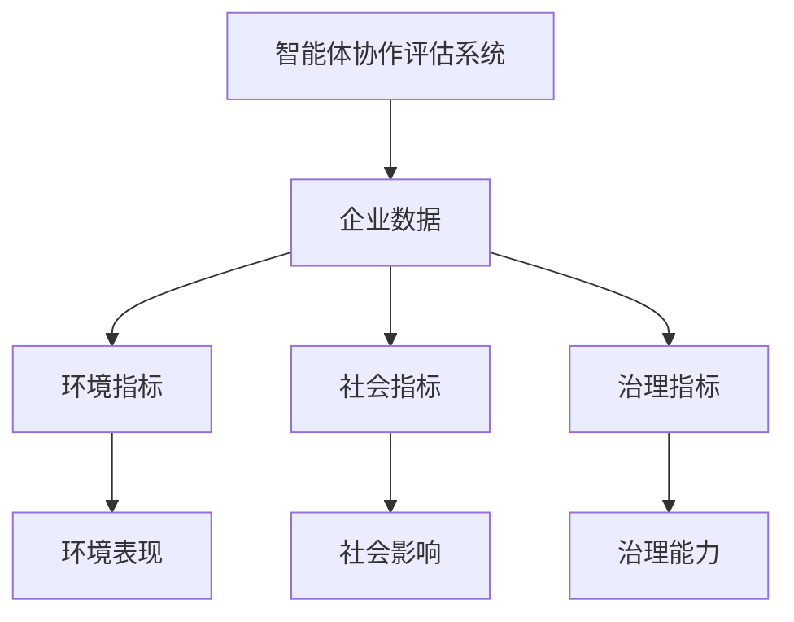
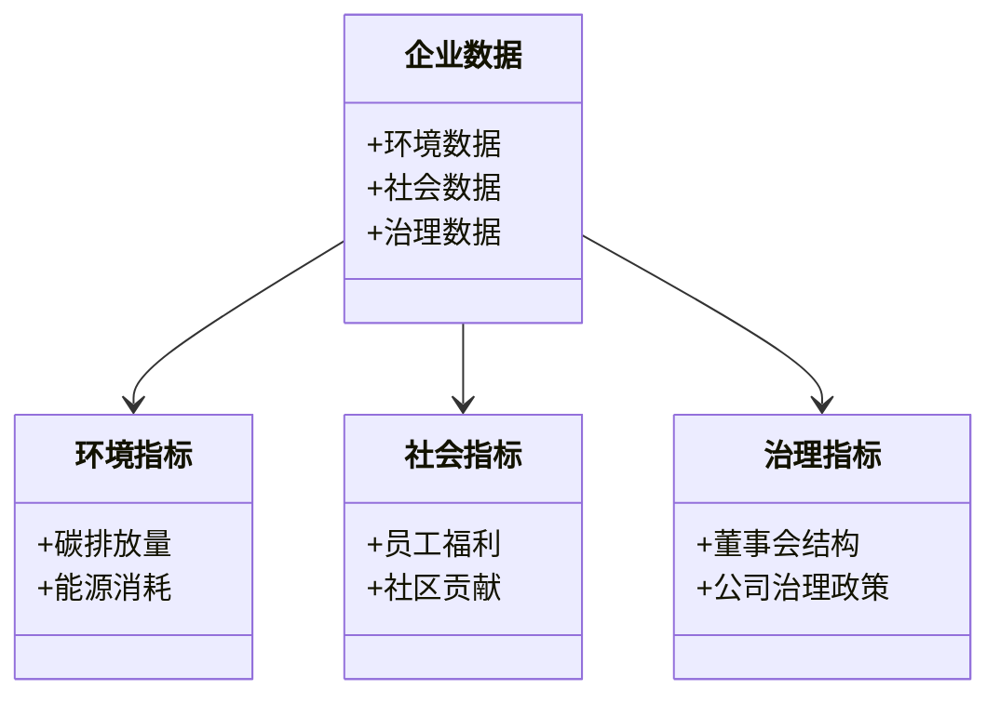
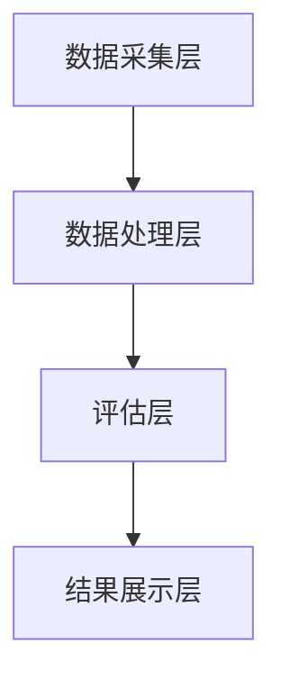
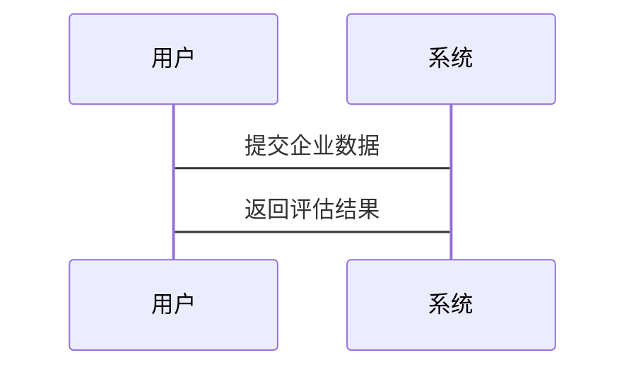

                 


# 《智能体协作评估公司的社会影响力：ESG投资新工具》

---

## 关键词：智能体协作、ESG投资、社会影响力评估、算法原理、系统架构

---

## 摘要：  
随着全球可持续发展理念的深入推进，企业社会责任（ESG）成为投资决策的重要参考指标。传统的ESG评估方法在数据获取、分析效率和评估准确性方面存在诸多挑战。智能体协作评估作为一种新兴的技术手段，通过多个智能体的协同工作，能够更高效、更准确地评估企业的社会影响力，为ESG投资提供新的工具和方法。本文从智能体协作评估的背景、核心概念、算法原理、系统架构到项目实战，全面分析了这一技术在ESG投资中的应用，为读者提供了一套系统化的解决方案。

---

## 第一部分：智能体协作评估的背景与核心概念

### 第1章：ESG投资与社会影响力评估

#### 1.1 ESG投资的定义与重要性
- **1.1.1 ESG的定义与发展**  
  ESG（Environmental, Social, Governance）是衡量企业可持续发展能力的重要指标，包括环境表现、社会责任和公司治理三个方面。随着全球气候变化和企业社会责任意识的增强，ESG投资成为推动可持续发展的重要手段。

- **1.1.2 ESG投资的核心理念**  
  ESG投资强调企业在追求经济利益的同时，也要关注环境保护、社会责任和治理结构。通过评估企业的ESG表现，投资者可以选择更具可持续性的企业进行投资，从而实现经济回报与社会责任的双赢。

- **1.1.3 ESG与企业社会影响力的关系**  
  企业社会影响力是指企业在经营活动中对社会产生的正面或负面影响，包括员工福利、社区贡献、环境保护等方面。ESG评估是衡量企业社会影响力的重要工具，能够帮助企业识别和改善其在环境、社会和治理方面的表现。

#### 1.2 传统企业影响力评估的局限性
- **1.2.1 传统评估方法的不足**  
  传统的企业影响力评估方法通常依赖于企业的自我报告或第三方审计，存在数据不透明、评估标准不统一等问题。此外，传统方法往往忽略了企业的动态行为和长期影响。

- **1.2.2 数据获取与处理的挑战**  
  ESG数据的获取和处理需要涉及大量的非结构化数据，例如企业社会责任报告、新闻报道等。传统的数据处理方法难以高效地提取和分析这些数据。

- **1.2.3 企业影响力评估的未来方向**  
  随着人工智能和大数据技术的发展，未来的影响力评估将更加依赖于智能化工具，能够实时获取、分析和评估企业的影响。

#### 1.3 智能体协作评估的提出
- **1.3.1 智能体协作的定义**  
  智能体协作是指多个智能体通过协同工作，共同完成某一任务的过程。在ESG评估中，智能体协作可以通过分布式计算和协同学习，实现对企业的多维度评估。

- **1.3.2 智能体协作在ESG评估中的优势**  
  智能体协作能够充分利用分布式计算的优势，通过多个智能体的协同工作，实现对海量数据的高效处理和分析。此外，智能体协作还能够通过模块化设计，实现对环境、社会和治理三个维度的独立评估。

- **1.3.3 智能体协作评估的核心目标**  
  智能体协作评估的核心目标是通过智能化工具，提高企业影响力评估的效率和准确性，为企业和投资者提供更可靠的ESG评估结果。

---

### 第2章：智能体协作评估的核心概念与联系

#### 2.1 智能体协作评估的原理
- **2.1.1 智能体的基本概念**  
  智能体是一种能够感知环境、做出决策并执行行动的实体。在ESG评估中，智能体可以用于数据采集、信息分析和结果评估。

- **2.1.2 协作智能体的定义与特点**  
  协作智能体是指多个智能体通过协同工作，共同完成某一任务的过程。协作智能体的特点包括分布式计算、模块化设计和协同学习。

- **2.1.3 智能体协作在ESG评估中的应用**  
  在ESG评估中，协作智能体可以通过分布式计算，分别对环境、社会和治理三个维度进行评估，最终将结果整合为一个综合的影响力评分。

#### 2.2 核心概念的属性特征对比
- **2.2.1 智能体协作与传统评估的对比**  
  | 特性         | 智能体协作评估       | 传统评估方法       |
  |--------------|---------------------|--------------------|
  | 数据处理     | 高效、分布式         | 低效、集中化       |
  | 评估维度     | 多维度、动态化       | 单一维度、静态化   |
  | 结果准确性   | 高准确性             | 低准确性           |

- **2.2.2 不同智能体协作模式的特征分析**  
  智能体协作模式包括并行协作、串行协作和混合协作三种类型。并行协作适用于数据量大的场景，串行协作适用于任务顺序性要求高的场景，混合协作则适用于复杂任务的分解。

- **2.2.3 智能体协作评估的优劣势对比**  
  智能体协作评估的优势在于高效、准确和灵活；劣势在于实现复杂、需要较高的技术投入。

#### 2.3 ER实体关系图架构



---

### 第3章：智能体协作评估的算法原理

#### 3.1 数据处理与特征提取
- **3.1.1 数据清洗与预处理**  
  数据清洗是智能体协作评估的第一步，包括去除重复数据、处理缺失值和异常值等。

- **3.1.2 特征提取**  
  特征提取是通过自然语言处理（NLP）技术，从文本数据中提取关键词和情感特征，用于评估企业的社会影响力。

#### 3.2 智能体协作算法设计
- **3.2.1 分布式计算框架**  
  智能体协作算法采用分布式计算框架，将任务分解为多个子任务，分别由不同的智能体处理。

- **3.2.2 协同学习机制**  
  协同学习机制通过智能体之间的信息共享和模型更新，实现对企业的多维度评估。

#### 3.3 算法实现与优化
- **3.3.1 算法实现**  
  智能体协作算法的实现包括数据采集、特征提取、模型训练和结果整合四个步骤。

- **3.3.2 算法优化**  
  算法优化包括参数调整、模型优化和分布式计算优化，以提高评估效率和准确性。

---

## 第四部分：系统分析与架构设计方案

### 第4章：系统架构设计与实现

#### 4.1 问题场景介绍
- **4.1.1 问题场景**  
  企业影响力评估系统需要处理海量的非结构化数据，包括企业社会责任报告、新闻报道等。

- **4.1.2 项目介绍**  
  本项目旨在开发一个基于智能体协作的ESG评估系统，实现对企业环境、社会和治理三个维度的综合评估。

#### 4.2 系统功能设计
- **4.2.1 领域模型设计**  
  领域模型包括企业数据、环境指标、社会指标和治理指标四个核心模块。



- **4.2.2 系统架构设计**  
  系统架构采用分层设计，包括数据采集层、数据处理层、评估层和结果展示层。



- **4.2.3 系统接口设计**  
  系统接口包括数据输入接口、评估结果输出接口和用户交互接口。

- **4.2.4 系统交互设计**  
  系统交互采用序列图设计，展示用户与系统之间的交互流程。



---

### 第5章：项目实战与案例分析

#### 5.1 项目环境安装与配置
- **5.1.1 环境要求**  
  系统运行需要Python 3.8及以上版本，安装库包括pandas、numpy、scikit-learn等。

- **5.1.2 环境配置**  
  通过虚拟环境管理依赖库，确保各模块的版本兼容性。

#### 5.2 核心实现代码解读
- **5.2.1 数据采集模块**  
  ```python
  import requests
  from bs4 import BeautifulSoup

  def fetch_data(url):
      response = requests.get(url)
      soup = BeautifulSoup(response.text, 'html.parser')
      return soup
  ```

- **5.2.2 数据处理模块**  
  ```python
  import pandas as pd

  def preprocess_data(data):
      df = pd.DataFrame(data)
      df.dropna(inplace=True)
      return df
  ```

- **5.2.3 智能体协作评估模块**  
  ```python
  def evaluate_esg(data):
      # 分布式计算
      # 协同学习
      return result
  ```

#### 5.3 实际案例分析
- **5.3.1 案例背景**  
  某企业社会责任报告的数据分析，包括环境、社会和治理三个维度。

- **5.3.2 评估结果分析**  
  通过对该企业的数据分析，评估其在环境、社会和治理方面的表现，并给出改进建议。

---

## 第五部分：总结与展望

### 第6章：总结与未来展望

#### 6.1 项目小结
- **6.1.1 核心成果**  
  本项目成功开发了一个基于智能体协作的ESG评估系统，实现了对企业环境、社会和治理三个维度的综合评估。

- **6.1.2 经验与不足**  
  在实现过程中，我们发现智能体协作评估在数据获取和模型优化方面存在一定的挑战，未来需要进一步研究和改进。

#### 6.2 未来展望
- **6.2.1 技术优化方向**  
  包括算法优化、模型改进和系统性能提升。

- **6.2.2 应用拓展方向**  
  智能体协作评估技术可以应用于更多的领域，例如金融风险评估和社会责任投资等。

---

## 附录

### 附录A：智能体协作评估系统安装与配置指南

### 附录B：核心代码实现细节

### 附录C：参考文献与拓展阅读

---

## 作者：AI天才研究院/AI Genius Institute & 禅与计算机程序设计艺术 /Zen And The Art of Computer Programming

