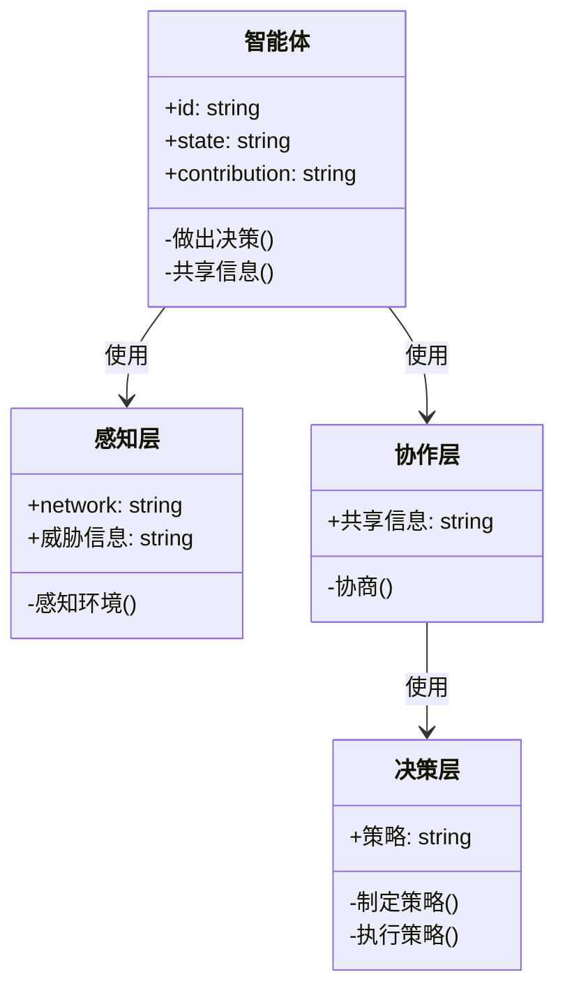

                 


# 智能体协作评估公司的网络安全风险：数字时代的新考量

> **关键词**：智能体协作、网络安全风险、数字时代、多智能体系统、风险管理、人工智能、分布式计算

> **摘要**：  
> 随着数字化转型的加速，网络安全风险的复杂性和动态性日益增加，传统的网络安全评估方法已难以应对新兴挑战。本文提出了一种基于智能体协作的网络安全风险评估方法，结合多智能体系统的优势，通过智能体间的协作与信息共享，实现对网络安全风险的实时监测、分析和预测。本文详细探讨了智能体协作的核心机制、算法原理、系统架构设计以及实际应用场景，为数字时代的企业网络安全管理提供了新的思路和解决方案。

---

# 第一部分：背景与概述

## 第1章：智能体协作与网络安全风险评估的背景

### 1.1 智能体协作的基本概念

#### 1.1.1 智能体的定义与特征

智能体（Agent）是一种能够感知环境、自主决策并采取行动的实体。智能体可以是软件程序、机器人或其他具备自主性、反应性和社会性的实体。智能体的关键特征包括：

- **自主性**：智能体能够在没有外部干预的情况下自主决策。
- **反应性**：智能体能够根据环境的变化调整其行为。
- **社会性**：智能体能够与其他智能体或人类进行交互和协作。

#### 1.1.2 智能体协作的必要性

在网络安全领域，单个智能体的能力有限，难以应对复杂的网络攻击和威胁。通过多个智能体的协作，可以实现以下目标：

- **分布式计算**：智能体可以分工合作，共同完成复杂的任务。
- **信息共享**：智能体之间可以共享信息，提升整体的感知能力和决策能力。
- **容错性**：通过协作，可以避免单点故障，提升系统的鲁棒性。

### 1.2 网络安全风险评估的现状

#### 1.2.1 网络安全风险的传统评估方法

传统的网络安全风险评估方法主要包括以下几种：

- **基于漏洞的评估方法**：通过扫描网络设备和系统，识别潜在的漏洞。
- **基于威胁的评估方法**：通过分析可能的威胁，评估其对系统的潜在影响。
- **基于概率的评估方法**：通过概率论计算风险的发生概率和影响程度。

#### 1.2.2 数字时代的新挑战

随着数字化转型的深入，网络安全风险呈现出以下特点：

- **复杂性**：网络攻击手段多样，涉及多个维度。
- **动态性**：网络安全威胁不断演变，传统的静态评估方法难以应对。
- **分布式性**：现代网络系统通常由多个分布式组件构成，单点评估难以覆盖全局。

#### 1.2.3 智能体协作在网络安全中的应用前景

智能体协作能够有效应对数字时代的网络安全挑战。通过智能体之间的协作，可以实现以下目标：

- **实时监测**：智能体可以实时感知网络环境的变化，快速响应潜在威胁。
- **信息共享**：智能体之间可以共享威胁情报，提升整体的安全防护能力。
- **协同决策**：通过协作，智能体可以共同制定最优的安全策略。

### 1.3 本章小结

本章介绍了智能体协作的基本概念和网络安全风险评估的现状，指出了智能体协作在网络安全中的应用前景。通过智能体协作，可以有效应对数字时代的网络安全挑战，提升企业的安全防护能力。

---

# 第二部分：智能体协作的核心机制与网络安全评估框架

## 第2章：智能体协作的核心机制

### 2.1 智能体协作的基本原理

#### 2.1.1 智能体的通信机制

智能体之间的通信是协作的基础。智能体可以通过以下方式实现通信：

- **消息传递**：智能体之间通过消息传递共享信息。
- **服务调用**：智能体可以通过调用其他智能体的服务来完成任务。
- **协议协商**：智能体之间可以通过协议协商来实现高效的通信。

#### 2.1.2 智能体的决策机制

智能体的决策机制是协作的关键。智能体可以根据以下因素做出决策：

- **环境感知**：智能体感知到的环境信息。
- **任务目标**：智能体的任务目标和优先级。
- **协作需求**：智能体与其他智能体的协作需求。

### 2.2 多智能体协作的挑战

#### 2.2.1 智能体之间的信任建立

智能体之间的信任建立是协作的前提。智能体可以通过以下方式建立信任：

- **身份验证**：通过身份验证确保智能体的身份可信。
- **行为验证**：通过验证智能体的行为来评估其可靠性。
- **信誉评估**：通过评估智能体的信誉来决定是否信任其信息或行为。

#### 2.2.2 智能体协作中的冲突解决

智能体协作中可能会出现冲突，例如资源竞争或任务分配冲突。智能体可以通过以下方式解决冲突：

- **协商机制**：通过协商机制达成一致。
- **仲裁机制**：通过仲裁机制解决无法协商的冲突。
- **容错机制**：通过容错机制减少冲突对整体协作的影响。

### 2.3 智能体协作的数学模型与公式

#### 2.3.1 协作关系的图论模型

智能体协作可以表示为一个图论模型，其中智能体是节点，协作关系是边。可以通过以下公式表示：

$$
G = (V, E)
$$

其中，\( V \) 表示智能体集合，\( E \) 表示协作关系。

#### 2.3.2 协作效果的优化公式

智能体协作的效果可以通过以下公式优化：

$$
\text{协作效果} = \sum_{i=1}^{n} \text{智能体}_i \text{的贡献}
$$

---

## 第3章：网络安全风险评估的框架

### 3.1 网络安全风险的传统评估方法

#### 3.1.1 基于漏洞的评估方法

基于漏洞的评估方法通过扫描网络设备和系统，识别潜在的漏洞。其主要步骤如下：

1. 扫描网络设备和系统，识别潜在的漏洞。
2. 根据漏洞的严重性进行风险评估。

#### 3.1.2 基于威胁的评估方法

基于威胁的评估方法通过分析可能的威胁，评估其对系统的潜在影响。其主要步骤如下：

1. 分析可能的网络攻击和威胁。
2. 评估威胁对系统的潜在影响。

### 3.2 基于智能体协作的网络安全评估框架

#### 3.2.1 框架的设计目标

基于智能体协作的网络安全评估框架的设计目标是：

- 实时监测网络环境，快速响应潜在威胁。
- 通过智能体协作，实现信息共享和协同决策。
- 提供个性化的安全策略，适应不同企业的需求。

#### 3.2.2 框架的核心组件

基于智能体协作的网络安全评估框架的核心组件包括：

- **智能体感知层**：负责感知网络环境的变化。
- **智能体协作层**：负责智能体之间的协作与信息共享。
- **决策与执行层**：负责制定和执行安全策略。

---

## 第4章：智能体协作的算法与系统架构

### 4.1 算法的基本原理

#### 4.1.1 智能体协作的初始化阶段

智能体协作的初始化阶段包括以下步骤：

1. 初始化智能体的参数和状态。
2. 建立智能体之间的通信机制。

#### 4.1.2 智能体协作的执行阶段

智能体协作的执行阶段包括以下步骤：

1. 智能体感知环境，获取相关信息。
2. 智能体之间通过通信机制共享信息。
3. 智能体根据共享信息做出决策。
4. 智能体执行决策，完成任务。

### 4.2 算法的实现步骤

#### 4.2.1 通信协议的设计

智能体之间的通信协议需要满足以下要求：

- 支持智能体之间的消息传递。
- 支持智能体的服务调用。
- 支持智能体之间的协议协商。

#### 4.2.2 决策机制的实现

智能体的决策机制需要根据以下因素做出决策：

- 环境感知信息。
- 任务目标和优先级。
- 协作需求。

### 4.3 算法的数学模型与公式

#### 4.3.1 协作效果的优化公式

智能体协作的效果可以通过以下公式优化：

$$
\text{协作效果} = \sum_{i=1}^{n} \text{智能体}_i \text{的贡献}
$$

---

## 第5章：系统架构与接口设计

### 5.1 系统架构设计

#### 5.1.1 系统功能模块划分

基于智能体协作的网络安全评估系统的功能模块包括：

- **智能体感知层**：负责感知网络环境的变化。
- **智能体协作层**：负责智能体之间的协作与信息共享。
- **决策与执行层**：负责制定和执行安全策略。

#### 5.1.2 系统架构的类图

系统架构的类图如下：



---

## 第6章：项目实战与案例分析

### 6.1 环境安装与配置

#### 6.1.1 系统环境要求

- 操作系统：Linux/Windows/MacOS
- 网络环境：局域网或互联网
- 开发工具：Python/Java/JavaScript
- 依赖库：需要安装相关的依赖库，如scipy、numpy等。

#### 6.1.2 系统核心实现源代码

以下是一个简单的智能体协作实现的Python代码示例：

```python
class Agent:
    def __init__(self, id):
        self.id = id
        self.state = "idle"
        self.contribution = 0

    def make_decision(self, environment):
        # 根据环境做出决策
        pass

    def share_info(self, other_agent):
        # 与其他智能体共享信息
        pass

# 初始化智能体
agents = [Agent("agent1"), Agent("agent2"), Agent("agent3")]

# 初始化环境
environment = "normal"

# 智能体协作
for agent in agents:
    agent.make_decision(environment)
    agent.share_info(agents[0])
```

---

## 第7章：总结与展望

### 7.1 本章总结

本文详细探讨了智能体协作在网络安全风险评估中的应用，提出了基于智能体协作的网络安全评估框架，并通过实际案例分析验证了其有效性。智能体协作能够有效应对数字时代的网络安全挑战，提升企业的安全防护能力。

### 7.2 未来研究方向

未来的研究方向包括：

- **多智能体协作的安全性**：研究如何提高智能体协作的安全性，防止恶意攻击。
- **动态环境下的协作优化**：研究如何在动态环境中优化智能体协作的效果。
- **智能化与自动化**：研究如何进一步提升智能体协作的智能化和自动化水平。

---

# 附录

### 附录A：参考文献

1. 禅与计算机程序设计艺术
2. AI天才研究院

### 附录B：工具推荐

- **Python**：用于智能体协作的实现。
- **Mermaid**：用于系统架构图的绘制。
- **Latex**：用于数学公式的排版。

---

**作者**：AI天才研究院/AI Genius Institute & 禅与计算机程序设计艺术/Zen And The Art of Computer Programming

