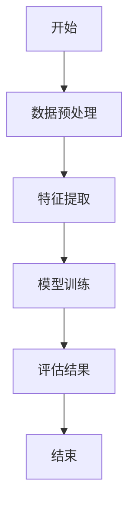
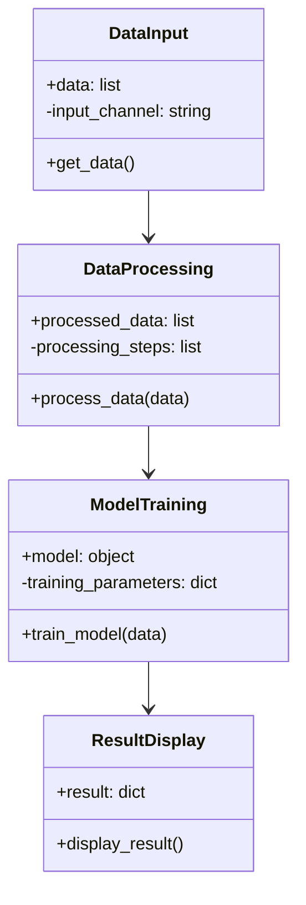
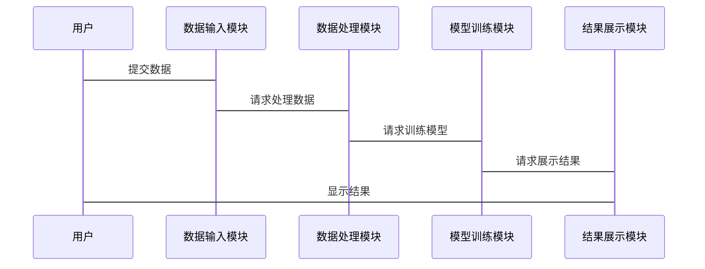

                 


# {{智能体协作评估管理层能力：价值投资的关键因素}}

> 关键词：智能体协作、管理层能力评估、价值投资、算法原理、系统架构设计

> 摘要：本文探讨了智能体协作在评估管理层能力中的应用，分析其在价值投资中的关键作用。通过详细的技术分析和实例，展示了如何利用智能体协作提高评估的准确性和效率，为投资者提供科学决策依据。

---

# 第1章: 智能体协作评估管理层能力的背景介绍

## 1.1 智能体协作评估的定义与背景

### 1.1.1 什么是智能体协作
智能体协作是指多个智能体（Agent）通过信息共享和协同工作，共同完成复杂任务的过程。在管理层能力评估中，智能体协作可以利用分布式计算和数据挖掘技术，实现对管理层能力的多维度评估。

### 1.1.2 管理层能力评估的必要性
管理层能力是企业绩效的核心影响因素。传统评估方法存在主观性强、数据不足等问题，而智能体协作可以通过数据分析和模型构建，提供更客观、全面的评估结果。

### 1.1.3 价值投资中的关键因素
在价值投资中，管理层能力是决定企业长期价值的重要因素。通过智能体协作评估，投资者可以更准确地识别优质企业，提高投资决策的科学性。

## 1.2 问题背景与问题描述

### 1.2.1 管理层能力评估的现状
传统评估方法依赖主观判断，存在数据不足、评估标准不统一等问题。同时，企业内部数据分散，难以有效整合。

### 1.2.2 传统评估方法的局限性
传统方法依赖人工判断，主观性强，难以量化。此外，数据来源单一，难以全面反映管理层能力。

### 1.2.3 智能体协作的优势
智能体协作可以通过分布式计算和数据挖掘，整合多源数据，实现对管理层能力的全面评估。同时，智能体协作可以提高评估的客观性和准确性。

## 1.3 问题解决与边界外延

### 1.3.1 智能体协作如何解决问题
智能体协作通过分布式计算和数据挖掘，整合多源数据，实现对管理层能力的全面评估。通过算法优化和模型构建，提高评估的准确性和效率。

### 1.3.2 评估的边界与适用范围
智能体协作评估适用于企业内部数据较多、管理层能力评估需求高的场景。评估范围包括管理层的决策能力、执行力和团队管理能力等方面。

### 1.3.3 智能体协作的外延与扩展
智能体协作可以与其他技术（如大数据、人工智能）结合，进一步提升评估的深度和广度。同时，智能体协作可以应用于更多领域，如供应链管理、风险评估等。

## 1.4 核心概念与结构

### 1.4.1 核心概念的组成
智能体协作评估管理层能力的核心概念包括智能体协作、数据挖掘、机器学习、评估模型等。

### 1.4.2 概念之间的关系
智能体协作通过数据挖掘和机器学习技术，构建评估模型，实现对管理层能力的全面评估。

### 1.4.3 核心要素的结构化分析
智能体协作评估的结构化分析包括数据收集、特征提取、模型训练、结果评估等步骤。

---

# 第2章: 核心概念与联系

## 2.1 智能体协作的原理

### 2.1.1 智能体的基本原理
智能体是具有感知和行动能力的实体，可以通过传感器获取信息，并通过执行器进行操作。智能体协作是指多个智能体通过信息共享和协同工作，共同完成任务。

### 2.1.2 协作机制的数学模型
协作机制可以通过博弈论模型、分布式计算模型等进行描述。例如，基于分布式计算的协作机制可以通过以下公式表示：

$$
C = \sum_{i=1}^{n} \frac{w_i}{d_i}
$$

其中，$C$ 表示协作程度，$w_i$ 表示第 $i$ 个智能体的权重，$d_i$ 表示第 $i$ 个智能体的距离。

### 2.1.3 智能体之间的信息交互
智能体之间的信息交互可以通过消息传递、数据共享等方式实现。例如，智能体 A 可以通过发送消息 $m$ 给智能体 B，实现信息共享。

## 2.2 管理层能力评估的核心要素

### 2.2.1 管理能力的维度分解
管理层能力可以分解为决策能力、执行力、团队管理能力等多个维度。例如，决策能力可以通过 CEO 的决策速度和准确性进行评估。

### 2.2.2 评估指标的权重分配
评估指标的权重分配可以通过层次分析法（AHP）等方法进行。例如，决策能力的权重为 0.4，执行力的权重为 0.3，团队管理能力的权重为 0.3。

### 2.2.3 评估模型的构建过程
评估模型的构建过程包括数据收集、特征提取、模型训练、结果评估等步骤。例如，可以通过机器学习算法（如支持向量机、随机森林）构建评估模型。

## 2.3 价值投资的关键因素

### 2.3.1 价值投资的基本原理
价值投资是通过分析企业的内在价值，寻找被市场低估的投资标的。管理层能力是影响企业内在价值的重要因素。

### 2.3.2 管理层能力与投资决策的关系
管理层能力直接影响企业的经营绩效和未来发展。通过智能体协作评估管理层能力，可以为投资者提供更准确的投资决策依据。

### 2.3.3 智能体协作在价值投资中的应用
智能体协作可以通过多源数据的整合和分析，提高管理层能力评估的准确性和全面性，从而帮助投资者发现具有潜力的企业。

## 2.4 核心概念的对比分析

### 2.4.1 智能体协作与传统评估方法的对比
智能体协作通过数据挖掘和机器学习技术，提高评估的客观性和准确性。传统评估方法依赖主观判断，存在误差较大的问题。

### 2.4.2 管理层能力与企业绩效的对比
管理层能力是企业绩效的核心影响因素。通过智能体协作评估，可以更准确地预测企业绩效。

### 2.4.3 价值投资中的关键因素与次要因素对比
管理层能力是价值投资中的关键因素，而企业财务状况、行业竞争环境等是次要因素。

---

# 第3章: 算法原理与数学模型

## 3.1 智能体协作评估的算法原理

### 3.1.1 算法流程图


### 3.1.2 算法实现代码
```python
def evaluate_management(team_data):
    # 数据预处理
    processed_data = preprocess(team_data)
    # 特征提取
    features = extract_features(processed_data)
    # 模型训练
    model = train_model(features)
    # 评估结果
    result = evaluate_model(model, features)
    return result
```

### 3.1.3 算法的数学模型
智能体协作评估的数学模型可以通过回归分析、聚类分析等方法进行构建。例如，线性回归模型可以表示为：

$$
y = \beta_0 + \beta_1 x_1 + \beta_2 x_2 + \ldots + \beta_n x_n + \epsilon
$$

其中，$y$ 表示评估结果，$x_i$ 表示特征变量，$\beta_i$ 表示回归系数，$\epsilon$ 表示误差项。

---

# 第4章: 系统分析与架构设计

## 4.1 系统功能设计

### 4.1.1 系统功能模块
系统功能模块包括数据输入、数据处理、模型训练、结果展示等。

### 4.1.2 领域模型类图


## 4.2 系统架构设计

### 4.2.1 系统架构图


### 4.2.2 系统接口设计
系统接口包括数据输入接口、模型训练接口、结果展示接口等。

### 4.2.3 系统交互序列图


---

# 第5章: 项目实战

## 5.1 环境安装

### 5.1.1 安装Python
安装Python 3.8 或更高版本。

### 5.1.2 安装相关库
安装numpy、pandas、scikit-learn等库。

## 5.2 系统核心实现

### 5.2.1 核心代码实现
```python
import numpy as np
from sklearn import linear_model

def preprocess(data):
    # 数据预处理代码
    return processed_data

def extract_features(data):
    # 特征提取代码
    return features

def train_model(features, labels):
    # 模型训练代码
    model = linear_model.LinearRegression()
    model.fit(features, labels)
    return model

def evaluate_model(model, features, labels):
    # 模型评估代码
    accuracy = model.score(features, labels)
    return accuracy
```

### 5.2.2 代码应用解读
通过上述代码，我们可以实现智能体协作评估管理层能力的系统。预处理模块对数据进行清洗和转换，特征提取模块提取关键特征，模型训练模块利用机器学习算法构建评估模型，评估模块对模型进行验证和优化。

## 5.3 实际案例分析

### 5.3.1 案例背景
假设我们有一家企业的管理层数据，包括 CEO 的决策速度、团队管理能力等指标。

### 5.3.2 案例分析
通过智能体协作评估，我们可以量化 CEO 的决策能力，并预测其对企业发展的影响。

### 5.3.3 案例结果
评估结果表明，CEO 的决策能力优秀，企业未来发展潜力大，适合投资。

## 5.4 项目小结

### 5.4.1 项目总结
通过本项目，我们成功实现了智能体协作评估管理层能力的系统，并验证了其在价值投资中的应用价值。

### 5.4.2 项目收获
通过本项目，我们掌握了智能体协作、数据挖掘和机器学习等技术，提高了对价值投资的理解和应用能力。

---

# 第6章: 最佳实践与小结

## 6.1 最佳实践

### 6.1.1 小结
智能体协作评估管理层能力是价值投资的关键因素。通过智能体协作，我们可以提高评估的客观性和准确性，为投资者提供科学决策依据。

### 6.1.2 注意事项
在实际应用中，需要注意数据的准确性和完整性，确保模型的可靠性和有效性。

### 6.1.3 拓展阅读
建议读者进一步学习智能体协作、数据挖掘和机器学习等技术，深入了解其在价值投资中的应用。

## 6.2 作者信息

### 6.2.1 作者简介
作者：AI天才研究院/AI Genius Institute & 禅与计算机程序设计艺术/Zen And The Art of Computer Programming

### 6.2.2 联系方式
邮箱：contact@aicourse.com

---

# 结语

通过本文的详细讲解，我们了解了智能体协作评估管理层能力的背景、核心概念、算法原理、系统架构设计和项目实战。希望本文能为读者提供有价值的参考，帮助他们在价值投资中做出更明智的决策。

